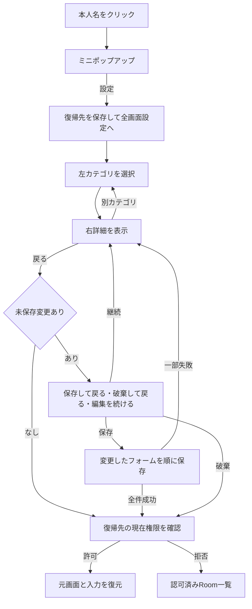
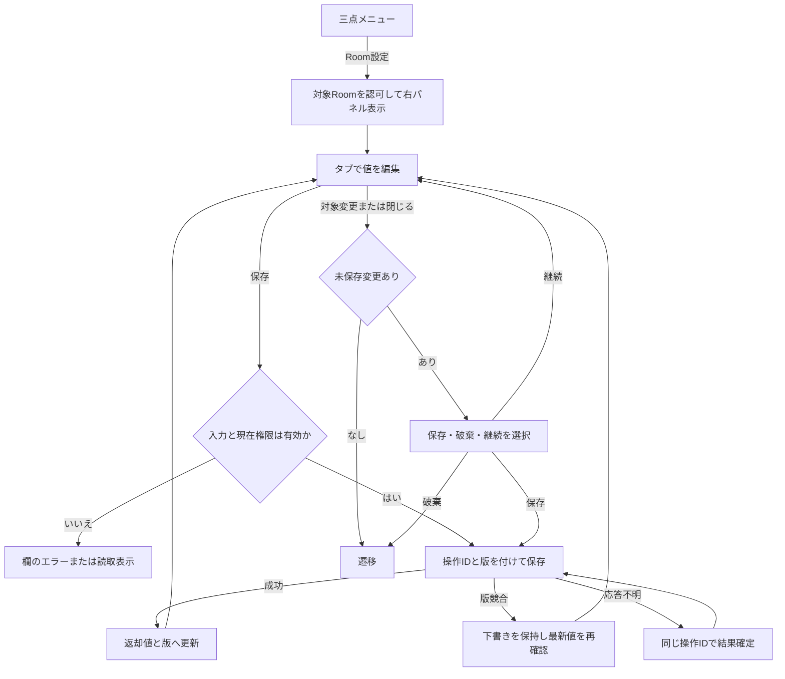
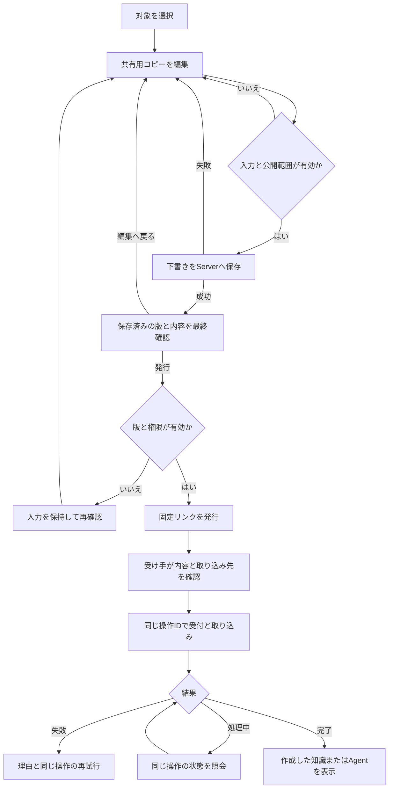

# Native App 製品設計

- 状態: 目標設計。2026-09-17にNative UI改善・記憶管理・共有スプリントの画面設計を第11〜15章へ追加・詳細化した。追加画面・操作は実装前の設計であり、実装・実機確認の到達点はreportsで管理する
- 対象: React、Electron、Workspace / Roomナビゲーション、既定Agentとの仕事、専門Agent、仕事のコメント、Agent DM、任意Organization管理、Knowledge/Skill管理、検索・設定、Room管理、承認/入力待ち、自動化管理、成果物・Surface、証拠確認、再接続
- 正本: [PRODUCT.md](../../PRODUCT.md)、[ARCHITECTURE.md](../../ARCHITECTURE.md)
- 関連設計: [Organization](organization.md)、[RoomとAgentの共同作業](room-agent-work.md)、[Agent Backend](agent-backends.md)、[Artifact・Surface](artifact-surface.md)
- 今回の要件と詳細: [要件定義書](../requirements/native-ui-room-agent-sharing-requirements.md)、[文脈・通知・共有の基本設計](workspace-context.md)、[データ設計](workspace-context-data.md)、[API・処理設計](workspace-context-api.md)
- 実装計画: [Phase 3・4・6統合プラン](../../plans/room-agent-collaboration-plan-phase3-4-6.md)、[Phase 5残作業・7プラン](../../plans/native-artifact-surface-plan-phase5-7.md)、[Workspace-first・Organization再設計マスタープラン](../../plans/workspace-first-organization-realignment-master-plan.md)

## 1. 目的

Native Appは、Samuraiの完成体験を実際に操作・確認するためのChat-first clientである。利用者はWorkspaceとRoomを選び、既定Agentへ依頼し、必要に応じて専門Agentや他の人と同じ仕事を進める。実行証拠と再利用されたKnowledgeを確認・修正できる。

最初に一人でAgentへ仕事を依頼でき、その仕事へ他の人が参加できる体験を基本とする。中央の会話はAgentへの指示と結果、人間同士の相談は仕事ごとのコメント欄で扱う。

Organizationはこの基本体験の前提ではない。複数Workspaceをまとめて管理する必要がある利用者だけが、同一Server内で任意のOrganizationを作成・利用する。

完成体験は次の一本である。

~~~text
Workspace switcherを開く
  → 登録済みのServerを横断してWorkspaceを作成または選ぶ
  → 選択したWorkspaceに対応するServer接続を裏で解決・再認可する
  → Roomを選ぶ
  → 実Agentに依頼する
  → Activity・実ファイル・実行証拠を確認する
  → 学習を確認・修正する
  → 次の依頼で再利用を確認する
  → 再起動後に同じWorkspaceを開く
~~~

Organizationを使う場合は、この体験を壊さず、Workspaceのグループ表示と管理操作だけを追加する。

## 2. 設計の範囲

この文書は画面構成、利用者の操作、表示状態を定義する。仕事のデータ・制御権限・委譲・停止は[RoomとAgentの共同作業設計](room-agent-work.md)、エンジン接続は[Agent Backend設計](agent-backends.md)、成果物の版・保存・操作画面の境界は[Artifact・Surface設計](artifact-surface.md)を参照する。

Workspace-firstと任意Organizationの境界を維持しながら、既定Agentとの仕事、専門Agent、コメント、DMを同じNative Appへ組み込む。現在のコードとの差分・実装順序・検証の到達点は実装計画とreportsで管理する。

Phase 5の目標は、今の製品設計に必要な操作がReact Appで完結することである。旧Vueの全機能一致やSession中心の画面構成は求めない。基本の仕事に加え、知識・手順の管理、Roomと人間の権限管理、検索、必要な設定、実行確認、自動化の基本管理を必要時に開く。Phase 7は、このAppへ成果物の表示・直接編集・操作画面を組み込む。

ReactとElectronを製品のClient構成とする。Vueは製品の予備画面として保持せず、利用可能な共通処理を抽出して整理する。削除の順番・依存一覧・完了証拠は実装計画で管理し、画面の整理を保存データの削除や保存形式統合と結び付けない。

## 3. 体験の原則

- Workspace-first: WorkspaceはOrganizationなしで作成、招待、Room、Chat、証拠確認、export / restoreまで完結する。
- Chat-first: 見た目の独自性より、迷わず依頼・確認・修正できることを優先する。
- 依頼の窓口: Roomには既定Agentを一つ置き、通常の送信をそのAgentへの依頼にする。
- 人間の介入: 仕事全体と個々の担当を確認し、権限に応じて停止・追加指示・担当変更できる。
- 相談と指示: コメントだけではAgentを動かさず、人間の明示操作で仕事へ反映する。
- Serverは配置先: ServerはWorkspaceを配置する接続先であり、利用者向けの主な切替単位にしない。
- Workspace switcher: 登録済みの全Serverにある認可済みWorkspaceを一つの一覧にまとめ、Workspaceを利用者向けの切替単位にする。
- Workspace target: 少なくともServer connectionとworkspace IDの組で識別し、workspace ID単独で接続先を決めない。
- Organizationは任意: Organizationが存在しない場合も通常画面を表示する。Organizationの所属だけでcontentを表示しない。
- Sessionを隠す: Session、run ID、queue、内部recoveryは利用者に管理させない。
- 事実を示す: 学習や再利用は、Serverが返すActivity / Knowledge referenceで確認する。
- 実機優先: 実Agent、実PostgreSQL、実ファイル、再起動を通らなければ完了にしない。

## 4. 情報構造と画面

~~~mermaid
flowchart LR
  SW[Workspace switcher<br/>registered Servers] --> T[Workspace target<br/>connection + workspace]
  T --> A[対象Serverで再認可]
  A --> W[Workspace navigator]
  W --> R[Room navigator]
  R --> CH[既定Agentとの仕事]
  CH --> E[Evidence inspector]
  CH --> C[仕事のコメント]
  CH --> P[専門Agentの担当と制御]
  CH --> AS[成果物と必要な操作画面]
  W --> B[Agent一覧]
  B --> DM[Agent DM]
  S[Server<br/>配置先] -.-> T
  O[Optional Organization management<br/>same Server only] -.-> W
~~~

| 画面・部品 | 利用者がすること | 表示しないもの |
| --- | --- | --- |
| Workspace switcher | 登録済みの全ServerにあるWorkspaceを横断して選択する | Serverを先に選ぶ二段階導線、非許可Workspaceのcontent |
| Workspace navigator | 選択したWorkspaceを開く・作成する | workspace ID単独の接続先、非許可Workspaceのcontent |
| Server connection settings | HostedまたはSelf-hostの接続を追加・復旧する | Server内部の資格情報 |
| Room navigator / 作成 | 許可済みRoomを選択し、既存または新規Agentを既定にしてRoomを作る | Session、内部run |
| Agent一覧・選択 | 専門性、Backend、利用可否を見て作成・編集・選択する | 資格情報の本文 |
| Chat surface | 依頼、仕事への追加指示、stream確認、添付、結果確認 | Session管理、無関係なAgent間連絡 |
| 仕事の担当・制御 | 担当作業、全体停止、個別停止、指示変更、担当変更を確認・操作する | 停止要求を停止完了に見せる表示 |
| 仕事のコメント | 人間同士で相談し、選んだ内容をAgentへ反映する | 投稿による自動実行 |
| Agent DM | 選んだAgentとの個人的な依頼と継続 | 他人のDM、共有Roomへの自動公開 |
| Evidence inspector | Activity、実行証拠、実ファイル、再利用Knowledgeを確認する | 許可外Workspaceの情報 |
| Knowledge / Skill | 内容、保存先、根拠、履歴を確認し、許可された編集・保管・状態変更を行う | 自動で統合された別資源、未許可Roomの内容 |
| Room管理 | 子Room作成、移動、参加・解除・role変更と影響確認 | Account IDだけで与えられる権限、DMの公開化 |
| Workspace検索 | 選択中Workspace内の閲覧可能なRoom・会話・知識を探して開く | Session管理、全Server横断検索、許可外の抜粋 |
| 通知 | 選択中Workspaceの完了・失敗・承認待ち・入力待ち・招待を確認する | 他Workspaceの仕事通知本文の混在、閲覧による自動承認 |
| 確認待ち | 仕事の操作内容・対象・期限を確認し、許可された応答を行う | 旧Runへの承認転用、全許可設定 |
| 自動化 / 基本設定 | 既存jobの予定・履歴・停止/再開、言語・学習基本状態・接続設定 | 新規scheduler、学習最適化の詳細editor |
| 成果物・Surfaceパネル | 文書・表・画像・PDF・HTMLの確認、文章・表データの編集、入力保存、Agentへの修正依頼 | Office互換編集、画像・PDFの手動編集、生成画面へのApp権限の受渡し |
| Organization management | Organization、Member、招待、Workspace追加・解除を管理する | contentの自動閲覧、課金、Compute、SSO |

### 4.1 Sidebar

1. Workspace switcherをSidebar上部に固定し、登録済みの全Serverにある認可済みWorkspaceを一つの一覧から開けるようにする。他Workspaceの未読はこの入口と切り替え一覧のバッジで示す。
2. 選択したWorkspaceのServer名は補助的なconnection contextとして表示できるが、Serverを主導線の切替単位にしない。
3. Workspace選択時は対応するServer接続を裏で解決し、Membershipを再認可してからWorkspaceを表示する。
4. Organizationに所属しないWorkspaceも同じ一覧から開ける。Organizationを利用している場合だけ、所属WorkspaceをOrganization名でグループ化して表示できる。
5. 選択したWorkspaceの下に、許可済みRoomだけを表示する。Organization MemberでもWorkspace Membershipがなければ、Room、Message、Activity、Knowledgeを表示しない。
6. archive Workspaceにはread-only表示を出す。
7. SessionはSidebar、deep link、URL、管理画面に出さない。
8. Agent一覧と、自分が開けるAgent DMへの導線を設ける。RoomとDMの公開範囲を判別できるようにする。
9. Workspace switcherの下に検索・通知を置く。Roomの展開・折りたたみはRoom選択から独立させる。本人メニューは左下に置き、本人設定を開く入口とする。

### 4.2 Workspace作成とOrganization利用

- 新しいWorkspaceは、作成時に選んだServerへ独立Workspaceとして作成する。作成後の主操作はServer名ではなくWorkspace名による切替とする。
- 利用者は明示的にOrganizationを選び、その中にWorkspaceを作成できる。
- 既存WorkspaceをOrganizationへ追加・解除する操作は、Organization管理画面から行う。
- Organizationを一つも持たない利用者には、Workspace作成画面を表示する。Organization作成を要求しない。

### 4.3 Workspace switcherと再認可

- Workspace switcherは、登録済みの各Serverから取得した認可済みWorkspaceを一つに統合して表示する。
- 内部のWorkspace targetは少なくとも`connection_id + workspace_id`で識別する。同じworkspace IDが別Serverに存在しても、別のWorkspaceとして扱う。
- 一覧のlocal情報は表示候補にすぎない。選択時には対象Serverへ接続し、Workspace Membershipと必要なRoom権限を再認可してから表示する。
- Workspace切替では、Server接続、realtime購読、選択状態、最後に開いたRoom候補を一つの切替処理として更新する。再認可に失敗した候補は破棄し、安全なWorkspace選択へ戻す。
- 一つのServerがofflineでも、ほかのServer上のWorkspaceまで利用不能扱いにしない。

### 4.4 中央Chat

Roomのヘッダーに既定Agentを示す。通常の入力から送信すると新しい仕事を作り、Agentの応答と結果を中央に表示する。`@`は専門Agentを明示指名するときに使う。

- 仕事ごとに依頼者、担当、状態を示し、結果の近くに「いいね」「この仕事に返信」「コメント」を置く。
- 「この仕事に返信」を押すと、入力欄に対象の仕事を表示する。返信先を解除すれば新しい仕事を依頼できる。
- 専門Agentの作業は仕事の下で折り畳んで示す。担当名、何をしているか、待っている理由、結果を確認できる。
- 仕事全体の停止と、特定の担当作業の停止を区別する。操作後はServerが返した停止確認の状態を表示する。
- 指示変更は受付と反映を分けて表示し、反映待ち・失敗の担当を確認できる。
- 依頼者とRoom Owner / Adminに制御操作を出す。他のメンバーはコメントで提案し、自分の新しい仕事を依頼できる。
- 通信・Agent failureは、原因、送信済みか、retryできるかを区別して表示する。reconnect / replayで同じ依頼や結果を重複させない。
- 添付は依頼・追加指示・コメントの入力位置から追加できる。アップロード中・失敗・Agentが参照できない形式を区別する。

主画面に汎用のフローチャート編集やAgent同士の全会話を要求しない。必要な委譲と介入を、仕事の担当一覧と操作で行えるようにする。

### 4.5 Evidence inspector

各Agent実行の近くから、必要なときだけ開く。最低限表示するものは次である。

- ActivityとPublic Eventの識別子・時刻・状態
- 実行で作成・参照した実ファイル
- 人間が確認・修正するKnowledgeの識別子と状態
- 次の実行で再利用されたKnowledgeの識別子と選択根拠

モデル出力の文章だけで、学習された、再利用されたとは扱わない。Serverが返したActivity / Knowledge referenceとPostgreSQLの記録をE2Eで照合できる形にする。

### 4.6 人間のコメント

仕事の「コメント」から専用欄を開く。コメント入力は中央の依頼入力と分け、「投稿してもAgentには指示されない」と判別できる表示にする。狭い画面では同じ機能をdrawerまたは専用表示へ移す。

コメントを選択して「Agentに反映」を押すと、反映先の仕事、選択した本文・添付を表示する。制御権限のある人が送信すると、その内容を追加指示として保存する。元コメントに反映済みの参照を付けるが、その後の編集は自動で再反映しない。

コメント、専門Agentの詳細、Evidenceは必要時に開く。同時に全てを常設して、中央の依頼と結果を狭くしない。

### 4.7 Agent一覧・Room作成・Agent DM

- Agent一覧では、名前、専門性、使用するBackend、利用可否を表示し、作成・編集・「会話する」へ進める。Roomで指名する選択肢は、そのRoomで実行できるAgentに絞る。
- BackendはSamurai Native / Codex / Claude Codeから選べる。NativeではGemini・OpenAI・AnthropicなどのproviderとAPIキー設定、Codex / Claude Codeでは本人の公式ログインによるサブスク利用を基本にAPIキー利用も選べる導線を設ける。資格情報の本文をAgentプロフィールや会話へ保存しない。
- Room作成では名前と既定Agentを選ぶ。「新しく作る」ではAgent設定を同じ流れで入力し、Room作成と合わせて確定する。
- Room設定から専門Agentを追加・解除し、閲覧・編集・実行の権限を管理する。既定Agentの変更もここで行い、管理権限のない人には選択結果と利用可否を表示する。
- 既定Agentがない既存Roomでは履歴を開き、実行前に設定する導線を出す。Agent一覧の先頭を暗黙に既定にしない。
- Agent DMは同じ仕事の操作を使い、本人とAgentの非公開の会話として表示する。「Roomへ共有」は選んだ結果と資料だけを共有する操作にする。
- Roomのメンバー追加は既存の認可と招待を通す。仕事へのリンクだけでアクセスを与えない。

### 4.8 成果物と必要な操作画面

Phase 5残作業・7では、仕事の結果から成果物カードを開き、Chat横のパネルに内容を表示する。狭い画面では同じ内容を広い専用表示へ切り替える。Roomの成果物一覧と元の仕事から、保存済みの結果を再び開けるようにする。

- 文書・表・画像・PDF・HTMLを表示し、実ファイルをダウンロードできる。
- 文章・表データは人が直接編集・保存でき、履歴確認と以前の版からの復元ができる。
- 「Agentに修正を依頼」で対象の成果物・版・必要な選択箇所を既存の仕事の入力へ渡す。既存仕事の制御権限がない場合は、許可された別の依頼として扱う。
- 画像・PDFの手動編集、Word・Excel互換編集は今回含めない。
- Surfaceは必要なときに開き、表示・絞り込み・フォーム入力・データ保存を扱う。保存先はWorkspace Coreで管理する。
- 保存中・未保存・競合・失敗を区別し、編集中の内容や表示をAgentの更新で奪わない。

成果物の履歴、入力先データ、iframeの隔離、権限と再送の詳細は[Artifact・Surface設計](artifact-surface.md)に従う。

### 4.9 将来の実行画面

仕事または担当作業から、実行先の画面を開ける配置上の余地を残す。Computer Useのライブ表示、操作引継ぎ、VMの作成は今回の画面へダミー機能として入れない。対応する実行先が実装された時点で、その能力に応じて表示する。

### 4.10 Knowledge・Skillの確認と基本管理

- Roomの補助メニューと仕事の根拠から開き、同じChatへ戻れる。Room知識は当該Room、Agent固有の知識はAgent詳細から管理する。Workspace専用メモリーの保存先と管理画面は設けない。
- 一覧、本文、資源種別、根拠、変更履歴を確認する。Knowledgeの作成・編集・保管/復元・AI更新固定、Skillの本文編集・有効状態変更を既存の権限と資源の版で行う。
- Roomに属する旧Memory、Knowledge Wiki、Completion resourceを一つの保存形式へ変換しない。種別とIDを維持し、Roomの旧Memoryは閲覧・保管を基本にする。対応する編集操作のない資源は読取表示と理由を示す。Workspace専用の旧Memoryは今回の廃止対象とし、この保管対象に含めない。
- 読み取った版で保存し、競合時は先行変更と利用者の下書きを保持する。AI更新固定と人の編集権限を混同しない。
- 「仕事で使う」は認可された資源refを入力へ添える。Workspace Knowledgeへの昇格は廃止する。Room知識共有とAgent共有は第11章の選択・確認・取り込みを通す。
- 学習の生成・評価・Skill最適化を管理画面の追加と同時に再設計しない。詳細な学習体験はPhase 8で扱う。

### 4.11 Room構造と人間メンバー

子Room作成、Room移動、人間メンバーの参加・解除・role変更はRoom設定から行う。Agentの閲覧・編集・実行権限とは別の操作として示す。

移動先やメンバー変更の影響を確認してから実行し、確定時にもServerで現在の権限と版を検査する。親Roomへの参加条件、最後のOwner保護、非許可Roomの名前の非表示を守る。移動や権限変更後はナビゲーションと開いている内容を再認可する。Agent DMは本人とAgentの非公開の範囲を維持し、人間メンバー追加で通常Roomへ変えない。

### 4.12 検索と基本設定

検索は現在のWorkspaceを範囲として、閲覧可能なRoom名・会話・Room知識を探す。検索結果の本文・抜粋にも認可を適用する。内部Session参照はServer側でRoom/仕事へ解決し、利用者へSessionの選択を要求しない。対応する仕事がない旧履歴は、認可されたRoom内の読取表示へ案内する。成果物専用検索と独立したRoom内検索欄は今回追加しない。

本人設定はプロフィール、回答言語・個人指示、テーマ、既存接続設定への入口を扱う。Room設定は参加者・既定Agent・Room知識・学習の有効状態を扱う。学習のWorkspace標準/Room上書きは設定の継承であり、Workspace専用メモリーではない。保存先を明示し、別Account・Serverへ設定を混ぜない。学習Engine/model/予算の詳細編集はPhase 8で扱う。接続不能・認証切れは既存の復旧/公式認証導線へ案内し、資格情報の本文を再表示しない。

### 4.13 仕事の確認待ちと証拠

仕事や担当の近くに確認待ちを示し、必要時に操作の対象・影響・期限・許可された応答を開く。Activity、実行状態、参照したKnowledge、変更した資源は同じ仕事から確認できる。

Coreの承認要求とBackendの入力要求を区別し、要求ID・Run・担当・対象版に対応する応答だけを送る。受付と実行完了を別に表示し、再接続後はServerから未解決要求を読み直す。取消・停止・期限切れ・処理済み・権限失効後の応答を新しい実行へ転用しない。Surfaceもこの確認UIを共有し、iframeのメッセージや`confirmed`値だけで承認を完了させない。

復元はArtifactのrevision等、対象資源に定義されたDomain操作を通す。利用できる保存先も復旧契約もない汎用の「元に戻す」ボタンは置かない。構造化した承認/入力の橋渡しができないBackendは利用不能を示し、全許可や自動応答で代替しない。

### 4.14 自動化と補助画面の共通動作

Roomの既存自動化の予定、有効状態、最近の実行結果を必要時に開き、管理権限に従って停止/再開できる。予約を止める操作と実行中の仕事を止める操作は区別し、実行中の停止は仕事の制御へつなぐ。新しいschedulerや汎用job editorはこの画面の前提にしない。

補助画面を閉じると元のRoom/仕事へ戻る。未保存入力を保護し、Agentの更新で編集中の画面を奪わない。長い一覧、keyboard、IME、狭い画面でも主要操作に到達でき、失敗・読取専用・再試行の理由を示す。設定・確認・成果物を一つの巨大な画面や状態管理に集中させない。

## 5. 起動、選択、再認可

~~~mermaid
sequenceDiagram
  participant D as Native App
  participant L as Local secure preference
  participant C as Server connection registry
  participant S as Selected Workspace Server

  D->>L: 前回のWorkspace target / Room候補を読む
  D->>C: 登録済みServerを横断してWorkspace一覧を要求
  C-->>D: Workspace target（connection + workspace）一覧
  D->>S: 対象Serverへ接続しWorkspace Membership / Room権限を再認可
  alt 権限がある
    S-->>D: ナビゲーションとChatを表示
  else 権限がない / 削除済み
    S-->>D: denyまたは空状態
    D->>L: 無効な候補を破棄
    D-->>D: 安全なWorkspace選択画面を表示
  end
~~~

- local preferenceは、Accountに紐づく最後に選んだWorkspace target（connection + workspace）とRoomの候補である。認可情報やServer側の正本ではない。
- Desktop credentialはsecure storageを参照する。Workspace / Room選択をcredentialに埋め込まない。
- Network reconnect、Server restart、Workspace Membership revoke、Workspace archive / deleteの後は、対象Serverを再照会し、Workspace switcherも更新する。
- Organizationの追加・解除・削除後も、Workspaceを再照会し、Workspaceが独立して開けることを確認する。
- Server間移転後は、移転先Workspaceを再認可してswitcherへ反映する。移転元は切替完了後にarchiveとして扱い、別の明示削除まで自動で消さない。

## 6. Organization管理

Organization管理は、Organizationを明示的に作成または利用している場合だけ開ける専用画面とdialogで行う。通常のWorkspace利用画面やSidebarへ細かな管理操作を詰め込まない。

| 操作 | UIの要件 |
| --- | --- |
| Organization作成・編集 | nameは必須、icon / descriptionは任意。自動生成しない。 |
| Member管理 | Owner / Adminの可否に応じて一覧、role、removeを表示する。 |
| Organization招待 | Organization roleを選べる。Workspace grantなしではcontentを与えない。 |
| Workspace追加 | 対象Workspace、既存Memberの最小Organization Member追加、影響を確認して実行する。 |
| Workspace解除 | データが残ること、独立Workspaceになることを明示する。 |
| OrganizationからWorkspace作成 | 通常のWorkspaceとして作られ、後から解除できることを示す。 |
| Organization削除 | 所属Workspaceを独立状態へ戻す一覧と影響を確認する。 |

Organization Owner / AdminがWorkspace contentを開ける導線は出さない。Workspace Membershipの変更操作は、対象Workspaceと変更内容を明示する。

Organizationの管理画面は同一Server内の関連付けを扱う。全Server横断のWorkspace switcher、Workspace targetの再認可、別ServerへのWorkspace移転はNative AppとWorkspaceの接続・移植機能であり、Organizationを横断管理する機能ではない。

## 7. ClientとServerの境界

~~~mermaid
flowchart LR
  R[React UI] --> BR[Browser bridge / Electron preload]
  BR --> API[Workspace Server HTTP / Domain API]
  API --> OP[Query / Domain Operation]
  OP --> DB[(PostgreSQL RLS)]
  OP --> RT[Agent runtime]
  RT --> EV[Activity / Event / Knowledge]
~~~

- React UIは表示、入力、local preferenceだけを担当する。
- Browser bridge / Electron preloadはcredentialと環境差を安全に吸収し、DBまたはunrestricted server secretをrendererに渡さない。
- Workspace操作はWorkspace-firstのAPIを使う。Organizationの有無でChat、Room、EvidenceのAPIを分けない。Workspace targetはServer connectionを伴って解決し、workspace ID単独で参照しない。
- Organization APIは任意の管理操作を扱い、Workspaceの通常操作を包む必須経路にしない。
- Event historyとrealtime notificationを組み合わせ、切断後はServerの履歴から状態を復元する。
- 全てのmutationにoperation IDとidempotencyを持たせ、retryが二重実行にならないようにする。
- Roomと仕事の参照で通常操作を完結させる。Sessionの選択・新規作成・外部Session IDの受渡しをReactの送信前提にしない。
- 通常の公開catalogと生成ClientもRoom / 仕事の契約を使う。旧Session入力の互換入口は非推奨として分け、通常UIや新規Clientの契約へ含めない。互換入口も同じ認可・仕事の制御を通す。
- コメント、指示、制御は別の型・操作として扱い、本文中の`@`や画面表示だけで実行可否を決めない。
- Knowledge/Skill、検索、Room管理、設定、自動化も共通公開Query/Domain Operationへ接続する。不足する公開契約は既存サービスへ接続し、旧Vue用APIを新UIの恒久経路にしない。
- 旧Clientの削除はCoreや外部Clientが利用するAPIの削除を意味しない。現在の利用元・公開契約を確認した単位で共有処理を保持する。

## 8. 状態と失敗表示

| 状態 | UIの振る舞い |
| --- | --- |
| 初回起動 | Accountと登録済みServerを確認し、全Server横断のWorkspace一覧を読み込む |
| Server未接続 | 接続作成を表示し、Organization作成を要求しない |
| Workspaceなし | 独立Workspace作成を表示する |
| Organizationなし | 通常状態。Workspace利用を妨げない |
| Workspace accessなし | contentを表示せず、安全なWorkspace選択へ戻す |
| archived Workspace | read-only bannerを表示し、Chat composerと書込み操作を無効にする |
| 一部Server offline | そのServerのWorkspaceだけ状態を示し、ほかのServerのWorkspaceは利用可能にする |
| network disconnect | 送信中 / 未送信を区別し、勝手に成功表示しない |
| Agent failure | 実行失敗をMessage成功と混同せず、retry可能性とevidenceを表示する |
| 既定Agentなし・実行不能 | 履歴を残し、既定Agentの設定または接続復旧へ案内する |
| 停止要求中 | 対象の仕事と担当を示し、確認を待つ |
| 停止未確認 | 未確認の担当と理由を表示し、仕事全体を停止済みにしない |
| 指示の反映待ち | 受け付けた指示と未反映の担当を示す |
| 別の人が指示を変更した | 最新の版を取得し、入力を保存したまま再確認できるようにする |
| 書込み競合 | 待機理由と先行する作業を示し、同じ成果物を上書きしない |
| DMから共有 | 共有先と対象の結果・資料を示し、元DM全体を公開しない |
| Organization解除・削除 | Workspace一覧を再取得し、独立Workspaceを選び直せるようにする |
| Server / App restart | local candidateを使うが、Server再認可後にだけ画面を復元する |
| 管理画面の保存競合 | 現在版と下書きを保持し、再読込・再確認へ案内する |
| Room移動・権限変更 | 古い影響確認を無条件に使わず、確定時の再検査と表示更新を行う |
| 承認・入力の期限切れ/停止 | 応答を無効にし、新しい要求へ転用しない |
| 検索中のWorkspace切替 | 遅延した結果・抜粋を新しいWorkspaceへ表示しない |
| 自動化の停止 | 予約停止の結果を表示し、実行中の仕事の状態を別に示す |

## 9. 実機確認

macOS Electron Native App、実PostgreSQL、実Agent、実Workspace file storageを使う。HostedとSelf-hostの両方で、少なくとも二つのAccountにより次を確認する。

Phase 3・4・6では、実装担当はSamurai Nativeと利用者が以前共有したGemini APIキーの無料枠で実機検証する。Codex / Claude Codeは利用者が実機検証し、実装担当は実CLIを起動しない。製品のprovider選択をGeminiへ限定せず、確認結果はBackend・provider・認証方式ごとに区別する。

1. OrganizationなしでWorkspaceを作成し、Workspace直接招待、Room選択、Chat、Activity、実ファイル、Knowledge確認を行う。
2. 人間がKnowledgeを確認・修正し、次の実行で再利用されたreferenceを確認する。
3. Server、PostgreSQL、Native Appを再起動し、認可とデータが残ることを確認する。
4. Organizationを作成し、二つのWorkspaceを追加・作成する。
5. Organization AdminがWorkspace Membershipを管理できる一方、contentを読めないことを確認する。
6. WorkspaceをOrganizationから解除し、Room、履歴、ファイル、Agent設定を保ったまま独立して利用できることを確認する。
7. Organizationを削除し、所属していた全Workspaceが独立して残ることを確認する。
8. 複数ServerのWorkspaceを一つのWorkspace switcherから選択し、対象Serverの自動接続・再認可、Workspace targetの衝突回避、Server単位のoffline分離を確認する。
9. Workspaceを別Serverへ移転した後、移転先を再認可して開き、移転元がarchiveとして残ることを確認する。
10. 既存 / 新規Agentを選んだRoom作成、通常の依頼、仕事への返信、専門Agentの明示指名と自動委譲を行う。
11. 別Accountが仕事へコメントしてもAgentが動かず、権限のある人の「Agentに反映」でだけ指示が変わることを確認する。
12. 仕事全体・個別担当の停止、指示変更、担当変更を実Agentで行い、残った子作業・未確認の停止・書込み競合を正しく表示する。
13. 同じAgentを別Room・別AccountのDMで使い、履歴が混ざらず、選択した結果だけを共有できることを確認する。
14. Knowledge/Skillの基本管理、Room移動・人間の権限管理、検索、設定、自動化の停止/再開、確認待ちへの応答をReactから実Serverへ通す。旧データの参照・版競合・期限切れ・再接続も照合する。
15. Vueを整理した最終bundleで通常利用・再起動・補助画面への到達を確認し、利用者による操作確認の結果を技術検証と分けて記録する。

実際に実行した環境、手順、画面、DB、ファイル、未検証範囲はreports配下へ記録する。画面mock、HTTP mock、単体testだけでは実機確認の代わりにならない。

これは製品全体の検証条件である。各変更で実行する確認は実装計画の影響範囲に従い、既存の重い確認を変更のたびに全て繰り返さない。

## 10. 将来の完成形と対象外

実Agent接続と複数Agentの共同作業はPhase 3・4・6の現在の対象である。接続方式はAgent Backend設計に従う。

Phase 5は基本の仕事と管理・確認・設定のReact完結と旧Vue整理、Phase 7はArtifact / Surfaceの表示・編集・入力保存を対象とする。後続で扱うのは、学習・評価の高度化、外部Client向け接続の拡充、Computer Use、Computeと配布である。実使用に基づくUI調整は継続する。

現段階では、決済、課金、SSO、SCIM、SMTP、詳細な利用量、複雑な企業監査、専用Compute、Compute共有、複数Server横断Organization、署名・Installer・自動更新を実装しない。

これらを後から追加しても、OrganizationなしでWorkspaceが成立すること、Organization Membershipがcontent accessを広げないこと、Serverが製品上の必須階層ではないことを維持する。

## 11. Native UI改善スプリントの画面詳細

この章は今回追加・変更する画面の仕様である。第4章の入口を具体化し、他Phaseの未実装機能を今回の対象に加えない。データ項目の保存制約と処理順序は[データ設計](workspace-context-data.md)と[API・処理設計](workspace-context-api.md)を参照する。

### 11.1 共通配置

既存の外側テーマ背景、透明Sidebar、内側の角丸Chatウィンドウを維持する。基本配置は次のとおり。

```text
┌ 左ナビゲーション ──┬ Roomヘッダー ─────────────────────┐
│ Workspace名 ▾ ●    │ ナビ開閉 / Room名 / 参加者 / 既定Agent / ⋯ / パネル開閉 │
│ 検索               ├─────────────────────┬──────────────┤
│ 通知（未読件数）   │                     │ 右パネル     │
│                    │     会話・作業      │ 成果物／設定 │
│ ▾ Room A           │                     │              │
│     子Room         │                     │              │
│ ▸ Room B           ├─────────────────────┤              │
│ DM                 │     依頼入力        │              │
│ Agent一覧          │                     │              │
│                    │                     │              │
│ 本人メニュー       │                     │              │
└────────────────────┴─────────────────────┴──────────────┘
```

SidebarではRoom一覧部分だけをスクロールさせ、Workspace、検索、通知、本人メニューを同じ位置に保つ。狭幅では既存のDrawer方式を使う。ヘッダーの参加者・既定Agentは省略表示でも詳細入口を残す。右パネルは四角を縦に分けたアイコンと開閉状態で表し、アクセシブル名を「右パネルを開く／閉じる」にする。サイドナビ開閉とは別の操作にする。

### 11.2 画面一覧と入口

| ID | 画面 | 入口・表示方式 | 主な操作 |
| --- | --- | --- | --- |
| UI-01 | Workspace切り替え | 上部Workspace名のpopover | Workspace選択、未読の確認 |
| UI-02 | Workspace検索 | 左ナビからdialog | 入力、種別絞り込み、結果選択 |
| UI-03 | 通知 | 左ナビから中央領域を一覧へ切り替え | 未読絞り込み、既読、対象へ移動 |
| UI-04 | 本人設定 | 左下本人メニューの「設定」から全画面へ遷移 | 左にカテゴリ、右に詳細。第12章 |
| UI-05 | Room設定 | Roomヘッダーの三点メニューの「Room設定」から右側パネル | 基本、参加者、Agent、知識、学習、共有。第13章 |
| UI-06 | Room知識一覧・詳細 | UI-05の知識タブ、Roomメニューの知識 | 一覧、本文・根拠、編集、共有選択 |
| UI-07 | Agent詳細 | Agent名・アイコン、Agent一覧 | 基本情報、Skill、知識・記憶、共有 |
| UI-08 | 共有編集・確認 | Room知識／Agent詳細の共有 | 対象選択、共有用編集、公開範囲、最終確認 |
| UI-09 | 共有管理 | UI-05／UI-07の共有タブ | リンクコピー、停止、再共有 |
| UI-10 | 共有リンク閲覧 | ブラウザーの共有URL | 公開内容確認、限定共有の本人確認、取り込み |
| UI-11 | 取り込み確認・結果 | UI-10からNative App／接続済みBrowser Client | 取り込み先選択、内容確認、実行、結果へ移動 |

検索・共有確認などのdialogには見出しと閉じる操作を置き、Tabの移動を内部へ閉じ込め、閉じた後は元の操作へfocusを戻す。本人設定はdialogではなくアプリ内容領域を使う専用ページとする。Room設定は通常幅では非モーダルの右パネルとする。未保存入力と復帰は第12・13章に従う。

### 11.3 Workspace・Room・ヘッダー

- UI-01はWorkspace名、必要時だけ同名判別用Server名、未読件数、接続状態を表示する。現在のWorkspaceに選択印を付ける。他Workspaceに未読があれば閉じた切り替えボタンにも点を出す。
- 未取得・接続失敗は「未確認」と表示し、未読0件の表示を使わない。クリック後は再認可してRoom一覧を更新する。未読バッジをクリックした場合は対象Workspaceの通知一覧を開く。
- Room行は親子の字下げと開閉ボタンを持つ。開閉ボタンの操作でRoomを選択しない。開閉状態は`account + connection + workspace + room`単位で端末へ保存する。
- RoomとDMは別見出しにする。非許可Roomの親名・件数を階層補完に使わない。通常RoomのAgentが1体でもDM欄へ移動しない。
- ヘッダーの参加者を開くと人とAgentを区別した一覧を表示する。オンライン人数と参加者人数を混同しない。Room参加・権限の変更操作はRoom管理者だけに表示する。
- 既定Agentは名前・アイコン・利用状態を表示する。名前からUI-07へ、変更はUI-05へ進む。未設定・無効の場合も履歴と設定入口を表示する。
- Roomメニューは「Room設定」「知識」「知識を共有」「共有管理」を持つ。共有操作は管理者のみ。成果物機能は既存パネルをそのまま利用する。

### 11.4 検索と通知

UI-02の見出しにWorkspace名、入力欄に検索語、絞り込みに「すべて／Room／会話／知識」を置く。結果は種別、題名、Room名、抜粋、日時を表示する。Enterで選択結果を開き、Escで閉じる。検索中、0件、失敗、追加読込みを区別する。検索を閉じても同じWorkspace内では検索語を保持し、再表示時に結果を再取得する。Workspaceが変わったら検索語と結果を破棄する。

UI-03の見出しは「通知 — Workspace名」。通知には種別、対象名、概要、日時、未読印、対応状態を表示する。既定は全件表示で「未読のみ」へ切り替えられる。一覧を開くだけでは既読にしない。通知のクリックで既読と対象への移動を行い、承認・入力・招待受諾は対象画面で別に実行する。

未参加Workspaceからの本人宛て招待は同画面内の「招待」枠に分離し、対象Workspace名と招待内容を表示する。参加後は通常のWorkspace対象として解決し、同じ招待を二重表示しない。通知0件の場合も招待枠は独立して取得する。参加Workspaceが0件でも通知への入口と招待枠を表示し、Workspace選択を招待確認の前提にしない。

### 11.5 本人・Room・Agentの設定項目

| 画面・タブ | 項目 | 保存・表示ルール |
| --- | --- | --- |
| 本人設定／プロフィール | 表示名、本人の識別情報 | 名前を編集。内部の秘密鍵は表示しない |
| 本人設定／回答設定 | 回答言語、個人指示 | Account別のClient設定。本人の実行へ適用し、Room共通設定へ保存しない |
| 本人設定／外観 | 既存3テーマ | 端末内へ即時保存。入力やeditorを再作成しない |
| 本人設定／接続 | 登録済み接続、認証状態 | 既存の追加・復旧導線へ接続。新しい資格情報表示機能を作らない |
| Room設定／基本 | Room名、種別、階層 | 現在の値を表示し、管理者だけが保存できる |
| Room設定／参加者 | 人、Agent、各権限 | 既存の参加・権限操作を使う。今回の参加者表示を新しい招待方式に置換しない |
| Room設定／知識 | 題名、本文、状態、固定、根拠、版 | 一覧と詳細を同じ設定内で表示。編集は現在の権限と版に従う |
| Room設定／学習 | 既定値を使う／このRoomで有効／無効、現在の実効値 | 既存の学習設定を利用。モデル・予算等の新しい高度設定は追加しない |
| Agent詳細／基本 | 名前、専門性、指示、Backendと利用可否 | 既存のAgent編集権限に従う |
| Agent詳細／Skill・知識 | 題名、本文、状態、版 | 手動で追加・編集する。Agentの利用先Roomでも参照される情報であることを説明する |

本人の回答設定には「この端末の同じAccountで使用」と表示し、同期未実装のものを全端末同期済みと説明しない。Workspace設定ボタンは、操作可能な既存設定がある場合に切り替えメニューから開く。専用メモリーのための設定画面を作らない。

### 11.6 共有編集と最終確認

UI-08は以下の3段階で構成する。

1. **対象選択**：Roomでは同Roomの知識だけを一覧にし、複数選択する。Agentでは基本構成と、含めるSkill・Agent知識を選ぶ。会話履歴や参加Roomの知識を候補に出さない。
2. **内容・公開範囲の編集**：共有用コピーの題名・本文、Agentの名前・役割・指示を編集する。「限定共有／公開リンク」を選び、限定共有では受信Accountを指定する。元データの編集とは別であることを表示する。下書き保存時の除外参照を確認できる。
3. **最終確認**：公開される本文とファイル一覧、公開範囲、指定相手、取り込み後は独立コピーとなることを表示する。「共有リンクを発行」で確定する。停止しても取得済みコピーを回収できないことを同画面で説明する。

公開範囲は新規作成時に限定共有を初期選択し、相手未指定では発行できない。公開リンクを選ぶと、リンクを持つ人はログインなしで閲覧できることを表示する。これは確認画面の選択であり、別の管理者承認工程を追加しない。

共有用編集で非公開の根拠リンクが除かれた場合は、その場所と除去理由を表示する。公開確認画面と実際の発行内容は同じmanifestから描画する。発行中は同じ操作の重複クリックを抑制する。

UI-09は共有タイトル、公開範囲、限定相手、発行日時、有効／停止を一覧にする。有効行に「リンクをコピー」「共有を停止」、各行に「内容を元に再共有」を置く。発行後の内容変更は新しい下書きを作る。停止済みリンクの再有効化は行わない。

### 11.7 リンク閲覧と取り込み

UI-10は共有タイトル、Room知識／Agentの種別、共有された内容、取り込み操作を表示する。元Workspace名・Room名・発行者の個人情報は自動表示しない。公開リンクはログイン前に内容を表示し、限定リンクはログインして相手照合が完了するまで内容を表示しない。

取り込みでは既存のClient接続・ログインへ遷移し、共有元URLを保持する。UI-11では共有種別に応じて以下を表示する。

| 種別 | 取り込み先 | 完了後 |
| --- | --- | --- |
| Room知識 | 登録済み接続のWorkspaceと、本人が管理する既存Room | 作成した知識一覧を開く |
| Agent | 本人がAgentを作成できるWorkspace | 新Agent詳細を開く。受け手側の実行接続が不足する場合だけ設定へ案内する |

取り込み先候補は認可付きQueryから取得し、自由入力したRoom IDをそのまま採用しない。候補がなければ必要な権限を表示し、元Roomへの参加や新しいRoomの自動作成で回避しない。

取り込み内容、件数、取り込み先を一つの確認画面に表示する。実行後は処理中／完了／失敗を区別し、同じ操作を再照会できるようにする。新Agentの取り込み完了とBackend接続完了を別の状態として表示する。

### 11.8 状態表示と確認基準

| 状態 | 表示 |
| --- | --- |
| 共有元の管理権限なし | 閲覧可能な内容だけを表示し、発行・停止ボタンを出さない |
| 限定共有の対象外 | 「この共有を表示できません」。元Room名等を示さない |
| 共有停止 | 停止済み表示。新規取り込みを無効化 |
| 保存・確認版の競合 | 入力を残し、現在版と再確認への操作を示す |
| 他Workspaceの通知取得失敗 | 未確認表示。未読0件と断定しない |
| 取り込み受付済みで応答不明 | 同じ操作の結果を再取得。別のコピーを自動作成しない |
| 新Agentの接続未設定 | 「取り込み完了・接続設定が必要」。Agent実行を成功扱いしない |

UI-01〜11をキーボード、既存3テーマ、通常幅と狭幅で確認する。特にWorkspace切り替え中の検索・通知・共有応答、未保存入力、権限取消、匿名／限定リンクを実Clientで検証する。参照する受入条件は要件定義書A-01〜A-09である。

## 12. UI-04 本人設定の詳細

### 12.1 配置・遷移

左下の本人名を押すと既存のミニポップアップを開く。メニューの先頭に歯車アイコン付き「設定」を置く。Workspace切り替えとテーマ選択はこのポップアップに置かない。「設定」を押すとポップアップを閉じ、OSのタイトルバーを除いたアプリ内容領域全体を本人設定に切り替える。Room設定・Workspace管理を混在させない。

```text
┌ 設定 ─────────────────────────────────────────── 戻る ┐
│ プロフィール  │ プロフィール                           │
│ 回答設定      │ 表示名 [                               ]│
│ 外観          │ Account ID（読み取り専用） [コピー]     │
│ 接続          │ 接続先への反映状況                      │
│               │                          取消  保存     │
└───────────────┴────────────────────────────────────────┘
```

左カテゴリは上記順序で幅240px、右は残り幅を使い本文最大880px・左右余白24pxとする。ヘッダーとカテゴリは固定し、右詳細だけスクロールする。内容領域が720px未満の場合は左カテゴリを上部の選択欄へ置き換える。同じ項目・保存動作を維持する。初回表示はプロフィール、同じAccountで再び開く場合は最後のカテゴリを復元する。

設定表示中も仕事・stream・接続を管理する親状態は保持する。元のWorkspace target、Room、中央画面、スクロール、入力・返信対象、右パネル種別・成果物編集を`returnContext`に退避する。戻る時は現在の認可を確認して復元する。権限を失ったRoomは復元せず、認可済みRoom一覧と「元のRoomを開けません」を表示する。



### 12.2 項目定義

文字数・型の正本は[API設計 第9章](workspace-context-api.md#9-共通の項目型と応答形式)。ここで「保存」は各フォーム下部の保存ボタン、「即時」は変更時の保存を意味する。

| 項目ID | 表示名・部品 | 初期値・入力条件 | 更新・反映 |
| --- | --- | --- | --- |
| U-P01 | 表示名／1行入力 | 現在の名前。前後空白除去後1〜200文字、必須 | 保存。端末に保存後、登録済みServerへ反映。接続別に反映済／未反映を表示 |
| U-P02 | Account ID／読み取り専用＋コピー | 現在の公開Account ID | 編集不可。コピー成功／失敗を通知。秘密鍵を扱わない |
| U-A01 | 回答言語／選択 | 保存値。未指定は「既定値を使う」。選択肢は既存対応locale集合＋未指定 | U-A02と一緒に保存。次に送る依頼から適用 |
| U-A02 | 個人指示／複数行入力 | 保存値、未設定は空。0〜20,000文字。改行を保持 | 保存。空は個人指示なし。進行中の仕事へ後付けしない |
| U-T01 | テーマ／3枚の選択カード | 既存値、不正・未設定はdark | 即時。dark＝ダーク、light＝ライト、special＝特別版。見た目だけを更新 |
| U-C01 | 登録済み接続／一覧 | 接続名、認証状態、到達状態 | 既存の追加・再認証・復旧画面へ進む。設定ページから認証情報本文を表示しない |

プロフィールと回答設定は独立した保存単位である。変更なし・入力不正・保存中は保存ボタンを無効にする。入力不正は対象欄の直下に理由を表示し、最初の不正欄へfocusを移す。取消は当該フォームを最後の保存値へ戻す。カテゴリ変更では下書きを破棄しない。

名前は全接続へ反映する本人の表示名、回答設定は「この端末の同じAccountで使用」、テーマは「この端末で使用」とそれぞれ説明する。接続一覧・APIキー・管理者向けWorkspace設定を個人指示と同じ保存要求へ混ぜない。

### 12.3 保存と失敗

1. フォームの入力を検査し、Accountとローカル設定版を照合する。
2. プロフィール／回答設定はデータ設計の本人設定レコードを1回で置換する。ローカル保存失敗なら保存済み表示を出さず、入力を維持する。
3. 表示名だけは端末保存後にServerへ反映する。失敗した接続を「未反映」と表示し、再接続時に最新の保存名を再送する。成功済み接続を巻き戻さない。通常の保存を承認待ちにしない。
4. 回答設定の保存成功後に送る依頼へ新しい設定版を付ける。実行済み・実行中の依頼は保存済みスナップショットのままとする。
5. テーマは表示を即時変更する。保存不可なら「この起動中のみ適用」と表示し、チャットを再生成しない。

他ウィンドウが同じAccountの設定を更新した場合、変更のないフォームだけ最新値を取り込む。編集中なら競合表示を出し、自動上書きせず「最新値を読み直す」で下書きを破棄するか、最新値を確認してから再保存する。ログアウト・Account切り替えでは対象Accountの下書きと復帰先を消去する。

## 13. UI-05・06 Room管理パネルの詳細

### 13.1 三点メニューと右パネル

ヘッダーの三点メニューは「Room設定」「知識」「知識を共有」「共有管理」の順とする。Room設定／知識はRoom閲覧可能な利用者へ、共有操作はRoom管理者へ表示する。画面で非表示でもCoreの認可を省略しない。

「Room設定」で右パネルを開き、上部にRoom名、「成果物／Room設定」の切り替え、閉じるボタンを置く。その下は「基本／参加者／Agent／知識／学習／共有」のタブと本文に分ける。「知識」からは知識タブへ直接進む。「共有管理」は共有タブへ進む。

```text
┌ 会話・仕事（維持） ──────────┬ 成果物 | Room設定   × ┐
│                             │ 対象：開いているRoom   │
│                             │ 基本 参加者 Agent …    │
│                             │ Room名 [            ] │
│                             │                      │
│ 依頼入力                    │             取消 保存 │
└─────────────────────────────┴──────────────────────┘
```

右パネルは通常幅で幅`clamp(360px,38vw,520px)`とし、チャットとの間に固定境界を置く。内容領域960px未満では右端Drawer（幅`min(100vw,520px)`）に切り替え、背景操作を止める。タブは横スクロール可能とし、見切れた項目へキーボードでも移れる。本文だけをスクロールし、対象Room名とタブを残す。

パネル状態は`closed / artifact / room_settings`の一つである。同じ場所に二重表示しない。成果物とRoom設定の切り替えではそれぞれの下書き・表示位置を保持し、切り替えだけで保存・破棄しない。パネルの開閉アイコンは現在の内容を閉じ、再び開くと同じRoomで最後に開いた内容を復元する。設定を一度も開いていないRoomでは成果物を初期内容とする。

### 13.2 各タブの項目・操作

| 項目ID | タブ・項目 | 部品・取得元 | 変更・許可条件 |
| --- | --- | --- | --- |
| R-B01 | 基本／Room名 | 1行入力。1〜200文字、必須。`room.view` | 管理者が保存。`room.patch`へ現在版と名前だけを送る |
| R-B02 | 基本／Room種別 | 通常Room／自分用DM、読み取り専用 | Agent人数を種別へ変換しない。DM公開化操作を出さない |
| R-B03 | 基本／構造 | 現在見える親、子Room作成、移動 | 管理者だけ操作。既存の移動前確認を使い、影響確認を省略しない |
| R-M01 | 参加者／人の一覧 | 表示名、role、状態。`room.member.list` | 管理者は既存の追加・role変更・解除へ。DMでは他の人を追加しない |
| R-G01 | Agent／参加Agent一覧 | 名前、閲覧・編集・実行権限、利用状態 | 管理者は既存の参加／解除・権限変更。権限変更は行単位で保存 |
| R-G02 | Agent／既定Agent | 単一選択。現値が初期値 | 管理者だけ保存。実行権限・有効状態を満たす参加Agentから1体選ぶ |
| R-K01 | 知識／一覧 | 題名、状態、固定、更新日時。既定は非アーカイブ、30件ずつ | 選択でR-K02。共有選択は管理者だけ。空なら説明と権限に応じた作成ボタン |
| R-K02 | 知識／詳細 | 題名、本文、分類、版、根拠、固定状態 | 本文編集・保管・固定は既存の資源操作権限。共有権限とは分ける |
| R-L01 | 学習／有効状態 | 「既定値／有効／無効」の単一選択、現在の実効値 | 管理者が保存。継承元の設定はこの画面で変更しない |
| R-S01 | 共有／管理一覧 | 題名、公開範囲、指定相手、発行日時、状態 | 管理者だけ。コピー・内容確認・停止・再共有はUI-09 |

現在の既定Agentが利用不能でもその名前と理由を表示し、自動で別Agentへ置き換えない。既定Agentの変更は次の依頼に適用する。新しく追加したAgentを自動で既定にしない。

知識本文の編集は既存Completion入力（題名1〜200文字、本文1〜8×1024×1024文字、分類必須）を使う。本文の改行を保持し、保存時に版を送る。人の保存理由は「Room設定から編集」を初期値とし編集可能、必須・4,000文字以内とする。AI固定はAI更新の禁止であり、人の編集権限を変えない。根拠は読み取り専用で、リンク先にも通常認可を適用する。

### 13.3 変更・閉じる・対象切り替え

- 同じRoomのタブ切り替え、成果物との切り替えは下書きを保持する。保存対象は表示中フォームだけであり、別タブの変更を同時に送らない。
- 閉じる、別Room／Workspaceへ移動、本人設定へ移動するとき、Room設定に未保存変更があれば「保存して移動／破棄して移動／編集を続ける」を表示する。複数フォームの保存は基本→参加者→Agent→知識→学習の順とし、失敗時点で移動を止める。成功済み操作は再送しない。同じRoomを参照する別フォームの基準版は成功応答の版へ進めるが、未保存の入力値は保持する。
- 仕事・成果物の未保存状態は既存の下書き管理へ渡して同じ移動を一度だけ確認する。入れ子の確認dialogを連続表示しない。
- 保存中の同じフォームは再送不可。通信結果が不明なら同じ操作IDで結果を確定させてから再編集を許可する。保存成功後は返された版を基準にする。
- Room閲覧権限を失ったらパネルと当該Roomの本文キャッシュを閉じて消去する。閲覧権限は残り管理権限だけ失ったら読取表示に戻し、未保存入力は送信しない。「権限が変更されました」を表示する。



遷移前保存の成功時だけ保留中の遷移Kを再開する。通常保存の成功は画面を移動しない。権限取消と保存が同時の場合はCoreの確定時認可を最終判断とし、UIの表示状態を根拠に更新しない。

## 14. UI-01〜03・07〜11の操作仕様

### 14.1 Workspace切り替え・Room階層・ヘッダー

| 操作ID | 操作・開始条件 | 処理と表示 | 失敗・終了 |
| --- | --- | --- | --- |
| NAV-01 | Workspace名を押す | 登録済み接続ごとの一覧。現在地にチェック、未読数、未確認表示 | 一部接続の失敗は該当行に再読込。他のWorkspaceは選択可能 |
| NAV-02 | 別Workspace行を選ぶ | 未保存入力を処理→対象Serverで再認可→対象切り替え→Room一覧取得 | 再認可に失敗したら元の対象を維持。成功後の一覧失敗は新Workspaceの再試行画面 |
| NAV-03 | Roomの開閉矢印 | 当該Roomの展開値だけ反転。Roomを選択しない | 葉Roomに開閉ボタンを出さない。選択中Roomを含む親を閉じても会話は維持 |
| NAV-04 | Room名を選ぶ | 未保存入力を処理して選択。Server＋Workspace＋Room＋画面世代を更新 | 権限なしは内容を表示せず一覧を更新 |
| HDR-01 | 参加者アイコン | 人／Agentの実参加一覧をpopover表示。管理へは該当タブを開く | 取得失敗時は架空人数を出さず再読込 |
| HDR-02 | 既定Agent名 | UI-07へ。管理者向け変更ボタンはR-G02へ | 利用不能も名前・理由・復旧入口を維持 |

階層は認可済みRoomだけから構築する。読めない親を持つRoomはトップレベルに置き、非公開の親名・階層段数を補完しない。兄弟は既存の明示順序があればその順、なければ名前・IDの順とする。初期は展開。新しいRoomを選ぶ際は、閲覧可能な祖先だけを展開する。Room階層の整合性は既存Coreで守り、Clientで権限を増やさない。

### 14.2 検索

| 項目ID | 部品・条件 | 動作 |
| --- | --- | --- |
| S-01 | 検索入力、1〜512文字 | 空は案内表示。確定入力300ms後に検索。IME中は送信しない |
| S-02 | すべて／Room／会話／知識、初期すべて | 種別変更でcursorと結果をリセットし同じ検索語を実行 |
| S-03 | 結果行 | 種別、題名、Room名、200文字以内の抜粋、日時。上下キーで移動、Enterで開く |
| S-04 | さらに表示 | next_cursorがある場合だけ表示。取得中は二重実行不可 |
| S-05 | 閉じる／Esc | 同じWorkspaceの検索語をメモリー内に保持。結果を再表示する前に再取得 |

結果0件は成功応答の空配列だけで判断する。失敗時は入力を維持し「再試行」を表示する。Workspace／Account変更時は結果とcursorを消去する。検索結果を開くと通常の詳細取得で再認可し、会話なら該当メッセージ位置、知識なら対象RoomのR-K02へ移動する。削除・権限取消は「この項目を開けません」と表示して再検索する。

### 14.3 通知

| 項目ID | 部品・条件 | 動作 |
| --- | --- | --- |
| N-01 | 未読のみcheckbox、初期false | 現在Workspaceの一覧を再取得。読み込み失敗を0件にしない |
| N-02 | 通知行 | 種別、対象名、短い説明、日時、未読印、対応状態 |
| N-03 | 既読にする | 本人の対象通知だけを保存。成功後に行と概要件数を更新 |
| N-04 | 本人宛て招待枠 | 未参加Workspaceの招待を仕事通知と別に取得。対象Workspaceがなくても表示 |
| N-05 | さらに表示／再試行 | 一覧末尾に表示。概要の一部接続失敗は他の結果を消さない |

行クリックは対象取得と既読保存を行う。既読保存だけが失敗しても対象への移動は妨げず、未読印を残して同じ操作を再試行する。承認／入力／招待の業務操作は移動先だけで行う。既知でないkindは「通知」としてServerの安全な表示文を表示し、理解できないtargetには操作ボタンを出さない。他の通知は継続表示する。

通知一覧からRoomへ戻るボタンを置き、直前のRoom・入力を復元する。Room権限取消イベントや再接続時には一覧・件数を再取得する。対応済みの承認等は履歴に残り、「未読のみ」と未読件数からは除かれる。

### 14.4 Agent詳細・知識

UI-07は中央領域の詳細ページとし、上部にAgent名、戻る、管理者向け共有ボタン、下部に「基本／Skill／知識・記憶／共有」を置く。戻ると呼び出し元とRoom入力を復元する。第13章と同じ未保存入力保護を使う。

| 項目ID | 部品 | 条件・保存単位 |
| --- | --- | --- |
| G-01 | 名前・専門性・指示 | 1〜200／1〜500／1〜20,000文字、必須。3項目を`agent.patch`で版付き保存 |
| G-02 | Backend・利用状態 | 現値を表示し既存の設定へ。共有から接続資格情報を復元しない |
| G-03 | Skill／知識一覧 | 各30件、分類・状態・版・題名。選択で本文。新規・編集はAgent管理権限 |
| G-04 | 資源編集 | Completion入力と同じ条件。帰属Agentは変更不可。Agent用は`ai_managed=false` |
| G-05 | 共有管理 | UI-09と同じ。本人の個人設定と参加Roomの知識を含めない |

「このAgentの利用先Roomで参照される情報です」を知識編集に表示する。読み取り権限のないAgentは詳細自体を表示しない。管理権限のない閲覧者には保存・共有ボタンを出さない。

### 14.5 共有編集・発行・取り込み

| 項目ID | 部品・初期値 | 必須条件／イベント |
| --- | --- | --- |
| SH-01 | 資源選択checkbox、初期未選択 | RoomはKnowledge1件以上。Agentは基本構成必須、Skill／知識は0件でも可 |
| SH-02 | 共有題名／本文編集 | 題名1〜200文字。entryごとの入力条件はAPI設計のManifest。元データは変更しない |
| SH-03 | 公開範囲radio、初期restricted | publicを明示選択するまで匿名閲覧を許可しない |
| SH-04 | 受信Account選択 | restrictedのみ表示・1人以上・重複除去。表示名とAccount IDを併記 |
| SH-05 | 次へ／戻る／下書き保存 | 次へでServer保存と検査。保存された版・ハッシュから最終確認を描画 |
| SH-06 | 共有リンクを発行 | dirtyなし、保存済み、入力条件成立時だけ有効。処理中の二重押下を止める |
| SH-07 | 発行完了 | URLコピー、閉じる、共有管理へ。URLのコピー失敗と発行失敗を混同しない |
| SH-08 | 共有停止 | 対象題名・公開範囲とコピーが残る説明を確認して停止。停止成功後に一覧更新 |
| IM-01 | 取り込み先Workspace・Room | Workspaceを変えたらRoom選択を解除。Room共有は既存管理Room選択必須 |
| IM-02 | 内容確認・取り込む | 確認したハッシュと選択先を固定し1回だけ受付。元Roomへの参加は要求しない |
| IM-03 | 処理中／結果 | statusを照会。待機、要再認証、失敗、完了を区別。閉じても取り込みは取消しない |

共有dialogを閉じる場合、保存済み下書きは残す。未保存編集は「下書きを保存して閉じる／破棄して閉じる／編集を続ける」。共有管理に本人の未発行下書きも別枠で表示し、再開・破棄できる。別管理者の下書き本文は表示しない。



## 15. 画面状態と受入観点

画面データの共通状態は`idle/loading/ready/empty/error`、編集状態は`clean/dirty/saving/conflict`とする。`empty`は成功した空応答だけに使う。状態遷移と保存単位は上記各画面に従い、画面世代が一致しない応答で状態を変更しない。

| 確認ID | 操作 | 期待する結果 |
| --- | --- | --- |
| V-UI01 | 本人メニュー→設定→カテゴリ変更→戻る | 全画面と左右構成、入力・元Room・右パネルの復元 |
| V-UI02 | 本人設定の未保存移動、保存失敗、別ウィンドウ更新 | 破棄前の選択、入力保持、競合の明示。別Accountへ混入しない |
| V-UI03 | 三点メニュー→Room設定→成果物→Room設定 | 同じ右パネルで切り替わり、それぞれの下書きが残る |
| V-UI04 | Room変更、権限取消、版競合 | 対象が混ざらず、無断上書きや非公開本文の残留がない |
| V-UI05 | 検索・通知中のWorkspace切り替え、一部Server失敗 | 旧結果を採用せず、未確認と0件が分かれる |
| V-UI06 | Room／Agentの限定・公開共有と再送 | 選んだ内容だけ発行し、入力ミス・競合・結果不明を区別する |
| V-UI07 | 取り込み中に画面を閉じて再表示 | 同じ操作を追跡し、独立コピーが一組だけ作成される |

いずれも実装後の検証条件である。本書作成で実Clientの合格を宣言しない。
