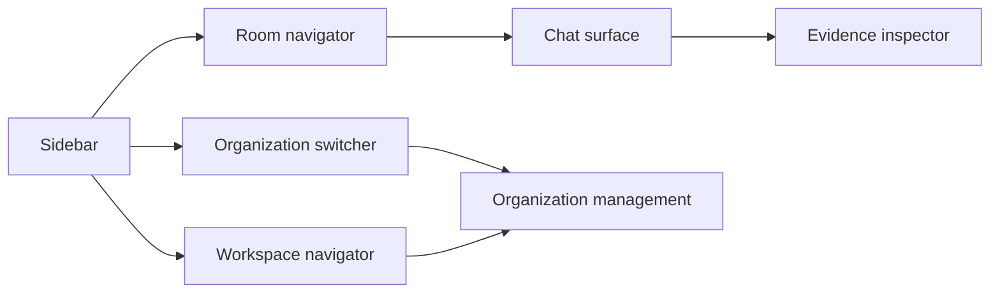
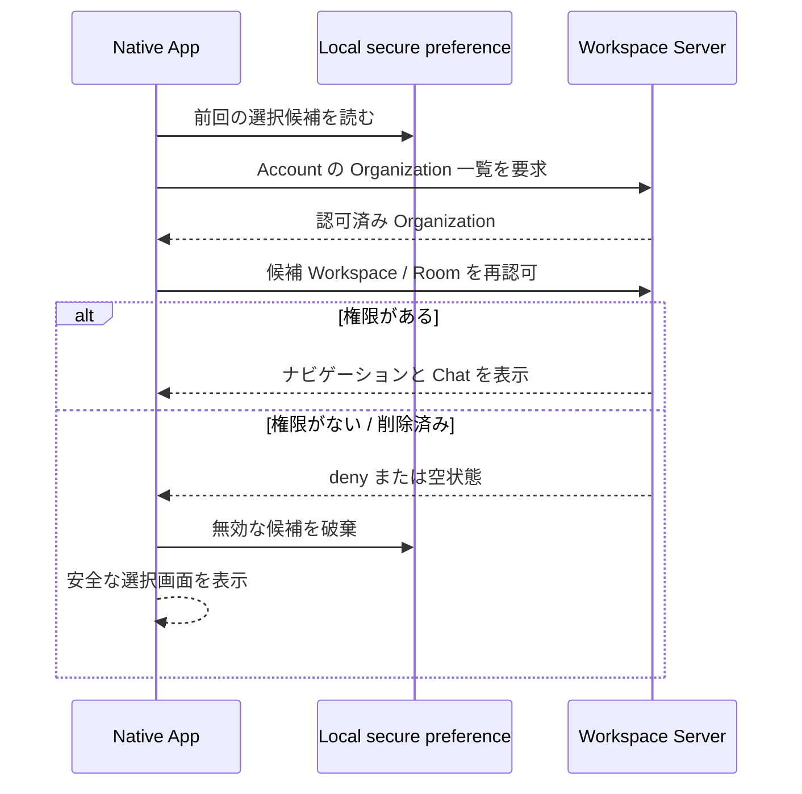
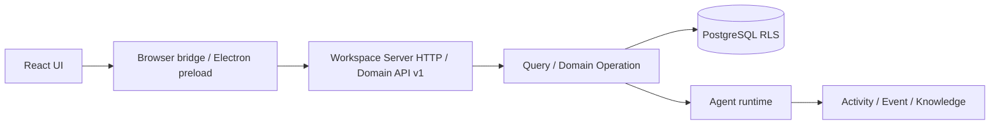

# Native App 製品設計

- 状態: Phase 2 実装前の合意済み設計
- 対象: React 移行、Electron、Organization / Workspace / Room ナビゲーション、Chat、証拠確認、再接続
- 正本: [PRODUCT.md](../../PRODUCT.md)、[ARCHITECTURE.md](../../ARCHITECTURE.md)
- 実装計画: [Native App・Organization 製品化マスタープラン](../../plans/native-app-productization-master-plan.md)
- 関連設計: [Organization 製品設計](organization.md)

## 1. 目的

Native App は、Samurai の完成体験を実際に操作・確認するための Chat-first client である。利用者は Organization、Workspace、Room を選び、Agent に依頼し、実行証拠と再利用された Knowledge を確認・修正する。

Phase 2 の目的は豪華な UI ではない。次の一本を Hosted と Self-host の実環境で安全に通すことである。

```text
Organization を選ぶ
  → Workspace / Room を選ぶ
  → 実 Agent に依頼する
  → Activity・実ファイル・実行証拠を確認する
  → 学習を確認・修正する
  → 次の依頼で再利用を確認する
  → 再起動後に同じ状態を開く
```

## 2. 現在との差分

現行 Web UI は Vue 3 で、`AppWorkspace.vue` を中心に多くの Workspace 画面を持つ。Sidebar は Session を表示し、Desktop の connection registry は `serverUrl + workspaceId + accountId` を一つの接続として保存している。

Phase 2 では `apps/web` の production entry を React に移し、Desktop connection は `serverUrl + accountId + credentialRef` を接続の本体とする。Organization、Workspace、Room の選択は Server の認可済み API から取得し、local preference は選択候補としてだけ使う。

この文書は目標設計であり、React UI や Organization API が現時点で実装済みであることを意味しない。

## 3. 体験の原則

- Familiar な Chat-first UI を使う。見た目の独自性より、迷わず作業できることを優先する。
- Sidebar は常に `Organization → Workspace → Room` を表す。
- Session、run ID、queue、内部 recovery は利用者に管理させない。
- Organization と Workspace の切替は、権限のある情報だけを短時間で表示する。
- 実行証拠と Knowledge 再利用は、必要なときに見られる最小の inspector で確認する。Activity 管理画面を最初から作り込まない。
- 設定画面を増やさない。Organization 管理と接続管理に必要な設定だけを表示する。
- UI が先に完成したように見えても、実 Agent、実 PostgreSQL、実ファイル、再起動を通らなければ完了にしない。

## 4. 情報構造と画面



| 画面・部品 | 利用者がすること | 表示しないもの |
| --- | --- | --- |
| Organization switcher | Organization を切替、作成、参加後の選択 | 別 Organization の protected content |
| Workspace navigator | Workspace を選択、作成、archive 状態を見る | 非許可 Workspace の Room、Message、Activity |
| Room navigator | 許可済み Room を選択する | Session、内部 run |
| Chat surface | Message 送信、stream 確認、stop、retry、添付 | Agent runtime の内部管理 UI |
| Evidence inspector | Message の Activity、実行証拠、実ファイル、再利用 Knowledge を確認する | Organization 横断の Knowledge 検索 |
| Organization management | Member、招待、role、Workspace grant、移動、archive / restore / delete を操作する | 決済、SSO、SMTP、複雑な監査 |

### 4.1 Sidebar

1. 一番上に現在の Organization と切替メニューを置く。
2. 次に Workspace 一覧を置く。アクセス可能な Workspace は通常表示し、Organization Member だが access がない Workspace は名前と lock 状態だけを表示する。
3. 選択された Workspace の下に、許可済み Room だけを表示する。
4. archive Workspace は明確な read-only 表示を出す。
5. Session は Sidebar、deep link、URL、管理画面に出さない。

### 4.2 中央 Chat

Chat surface は Room の既定 Agent と会話する場所である。Phase 2 では Agent 選択 UI や複数 Agent 編成 UI は作らない。

- Message を送信し、stream を表示する。
- 送信中は stop を実行できる。
- 通信・Agent failure は、原因、送信済みか、retry できるかを区別して表示する。
- reconnect / replay 後に同じ Message を重複表示・重複送信しない。
- 添付と既存 Artifact は必要時に開く / ダウンロードできればよい。専用管理画面は Phase 2 の対象外である。

### 4.3 Evidence inspector

各 Agent 実行の近くから、必要な時だけ開く。最低限表示するものは次である。

- Activity と Public Event の識別子・時刻・状態
- 実行で作成・参照した実ファイル
- 人間が確認・修正する Knowledge の識別子と状態
- 次の実行で再利用された Knowledge の識別子と選択根拠

モデル出力の文章だけで「学習された」「再利用された」と扱わない。Server が返した Activity / Knowledge reference と PostgreSQL の記録を E2E で照合できる形にする。

## 5. 起動、選択、再認可



- local preference は `serverUrl + accountId` に紐づく、最後に選んだ Organization / Workspace / Room の候補である。認可情報や Server 側の正本ではない。
- Desktop credential は secure storage を参照する。Organization / Workspace 選択を credential に埋め込まない。
- Network reconnect、Server restart、role revoke、Workspace archive / delete、Organization delete の後も、必ず Server を再照会する。
- Organization がゼロなら、Organization create だけを行える空状態にする。
- Organization Member だが access できる Workspace がゼロなら、Workspace 名と access 不足を示し、Chat を開かない。

## 6. Organization 管理

Organization 管理は専用画面と必要な dialog で行う。小さな操作を Sidebar に詰め込まない。

| 操作 | UI の要件 |
| --- | --- |
| Organization 作成・編集 | name は必須、icon / description は任意。slug を要求しない。 |
| Member 管理 | Owner / Admin の可否に応じて一覧、role、remove を表示する。最後の Owner を変えられない理由を明示する。 |
| 直接招待 | 既存 Account、Organization role、任意の Workspace grant を選ぶ。 |
| token 招待 | token を一度だけ表示し、リンクコピーと QR を提供する。revoke、再発行、期限延長を表示する。 |
| Workspace access | Member に Workspace / Room grant を与える。Organization Membership だけでは content を見せない。 |
| Workspace move | source / target Owner のみ。preview、Member 追加、確認、成功 / rollback を表示する。 |
| archive / restore / delete | read-only 影響、delete 前の Workspace 移動 / 削除要件を明示する。 |

Admin が Owner を変更したり Organization を削除したりできるような UI は出さない。Organization Owner / Admin が Workspace content を開ける導線も出さない。

## 7. Client と Server の境界



- React UI は表示・入力・local preference だけを担当する。
- Browser bridge / Electron preload は credential と環境差を安全に吸収し、DB または unrestricted server secret を renderer に渡さない。
- HTTP route は request validation と identity を確認し、Domain Operation を呼ぶ。UI 専用の DB mutation endpoint を増やさない。
- Event history と realtime notification を組み合わせ、切断後は Server の履歴から状態を復元する。
- すべての mutation に operation ID と idempotency を持たせ、retry が二重実行にならないようにする。

### 7.1 Desktop connection の移行

現行の `WorkspaceConnection` は一つの Workspace を接続の本体にしている。Phase 2 の接続本体は Server と Account である。

- 既存の `workspaceId` は、migration 時の最後に開く候補としてだけ引き継ぐ。
- 同一 Server・同一 Account の重複接続は統合する。
- Organization / Workspace / Room の選択は Server から再取得し、古い local ID を信用しない。
- credentialRef は引き続き keychain / Electron safe storage の参照だけを保存する。

## 8. 状態と失敗表示

| 状態 | UI の振る舞い |
| --- | --- |
| 初回起動 | Account と Server を確認し、Organization 一覧を読み込む。 |
| Organization なし | 作成画面だけを表示する。 |
| Workspace access なし | 名前と access 不足を表示し、Room / content を空にする。 |
| archived Workspace | read-only banner を表示し、Chat composer と書込み操作を無効にする。 |
| network disconnect | 送信中 / 未送信を区別し、勝手に成功表示しない。reconnect 後に replay する。 |
| Agent failure | 実行失敗を Message 成功と混同せず、retry 可能性と evidence を表示する。 |
| permission revoke | protected content を消し、安全な Organization / Workspace 選択へ戻す。 |
| invitation revoke / expiry | Membership が作られていないことを示し、再発行を案内する。 |
| Server / App restart | local candidate を使うが、Server 再認可後にだけ画面を復元する。 |

## 9. React 移行の方針

- `apps/web` は React を production entry とする。Vue と React を恒久的に二重運用しない。
- 旧 Vue surface の全機能をそのまま再現しない。backend、データ、API contract を保持し、Phase 2 の完成体験に必要な画面から React へ移す。
- React E2E が通るまで旧 source は参照可能にしてよいが、production entry に残さない。
- Chat、Organization / Workspace / Room 選択、管理、evidence、失敗状態を component の責務として分ける。巨大な単一 Workspace component を新しく作らない。
- Phase 2 は CSS / component system の完成を目標にしない。dogfooding 後に頻出画面だけを整える。

## 10. アクセシビリティと安全性

- すべての form は label、validation message、keyboard 操作を持つ。
- dialog は focus を閉じ込め、破壊的操作には対象と影響を表示する。
- loading、empty、error、streaming、read-only 状態を色だけに依存せず示す。
- アクセスできない Workspace の content を preload、検索候補、tooltip、error payload に入れない。
- invite token、credential、Session 内部 ID を通常 UI・log・screenshot 証拠に露出しない。

## 11. Phase 2 の実機確認

macOS Electron Native App、実 PostgreSQL、実 Agent、実 Workspace file storage を使う。Hosted と Self-host の両方で、少なくとも二つの Account により次を確認する。

1. Organization の自動作成、作成、参加、切替を行う。
2. Workspace / Room を選び、access の無い Workspace は名前だけ見えることを確認する。
3. Chat から実 Agent を実行し、Activity、実ファイル、Event を確認する。
4. 人間が Knowledge を確認・修正し、次の実行で再利用された reference を確認する。
5. Workspace move、archive / restore、Workspace export / restore を実行する。
6. ネットワーク切断、Agent failure、permission revoke、invite revoke、App / Server / PostgreSQL restart を確認する。

実際に実行した環境、手順、画面、DB、ファイル、未検証範囲は `reports/phase2-organization-native-e2e.md` に残す。画面 mock、HTTP mock、単体 test だけでは実機確認の代わりにならない。

## 12. 将来の完成形と対象外

Phase 2 後に扱うのは、実使用に基づく UI 磨き込み、ACP 実 Agent、複数 Agent、Artifact / Surface UI、学習・評価の高度化、MCP / 外部 Client、Compute と配布である。

Phase 2 では、決済、SSO、SCIM、SMTP、詳細な利用量、複雑な企業監査、署名・Installer・自動更新は実装しない。これらを理由に、Chat-first の主画面や Organization / Workspace / Room の境界を複雑化しない。
