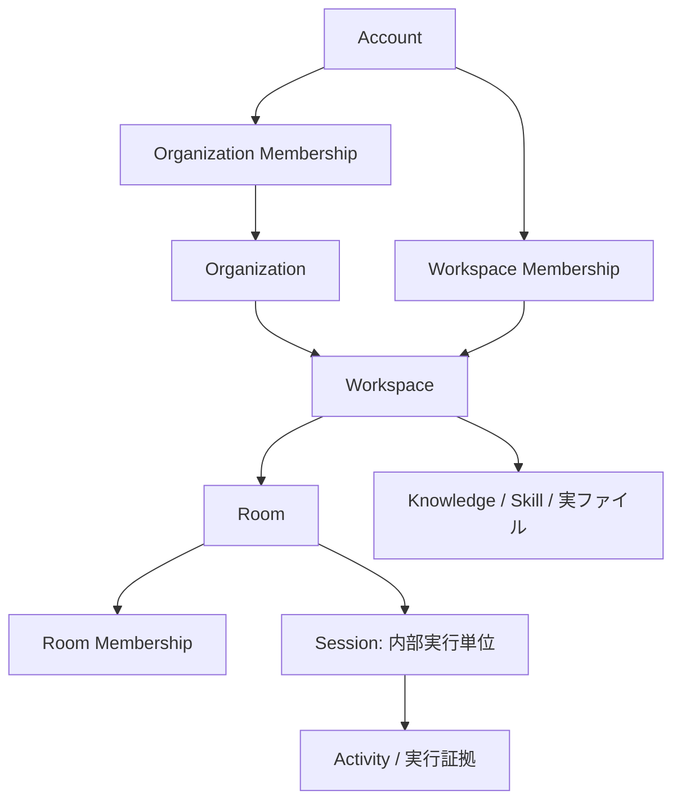
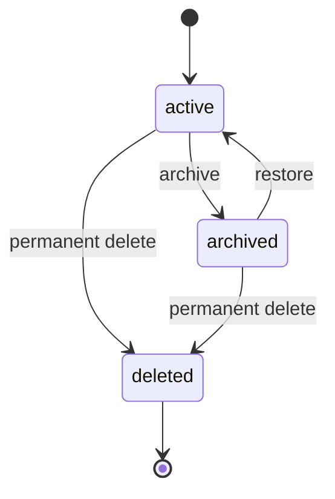
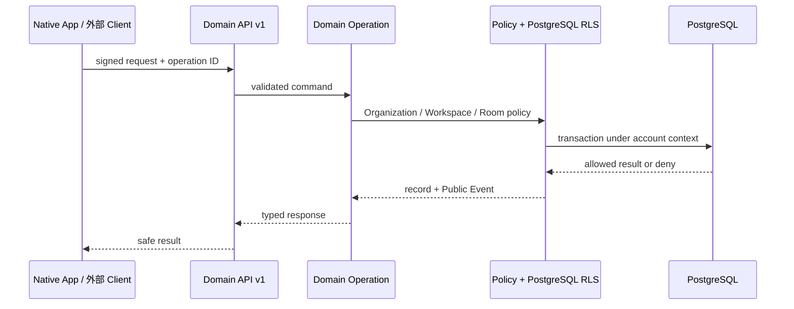

# Organization 製品設計

- 状態: Phase 2 実装前の合意済み設計
- 対象: Organization、Membership、招待、Workspace 所属、権限、移行、export / restore
- 正本: [PRODUCT.md](../../PRODUCT.md)、[ARCHITECTURE.md](../../ARCHITECTURE.md)
- 実装計画: [Native App・Organization 製品化マスタープラン](../../plans/native-app-productization-master-plan.md)
- 関連設計: [Native App 製品設計](native-app.md)

## 1. 目的

Organization は、メンバーと Workspace を管理する最上位の利用単位である。Samurai の利用者は複数の Organization に参加できるが、Organization に参加しただけで Workspace や Room の中身を読めてはならない。

この設計は、次を同時に満たす。

- 誰がどの Organization と Workspace に参加しているかを明確にする。
- 実行結果、Activity、Knowledge、実ファイルを Workspace の所有物として残す。
- Owner / Admin に組織管理を任せても、会話や実行証拠を自動で公開しない。
- Hosted と Self-host で同じ Organization 体験と認可規則を使う。
- 既存データを失わず移行し、利用者が export / restore できる。

## 2. 現在との差分

現行の PostgreSQL には `workspaces`、`workspace_members`、Room、Workspace 招待、`workspace_events.organization_id` がある。一方、Organization、Organization Membership、Organization Invitation の実体と Domain Operation はまだない。

現行の Self-host は `SAMURAI_SELF_HOST_WORKSPACE_ID` により一つの Workspace に固定されている。Phase 2 ではこの固定を外し、一つの Samurai Server と PostgreSQL の中に複数の Organization・Workspace を置く。

この文書は目標設計であり、上記の差分が実装済みであることを意味しない。

## 3. 用語と関係

| 用語 | 意味 |
| --- | --- |
| Account | 人または認証された利用主体。複数 Organization に参加できる。 |
| Organization | Member と Workspace を管理する単位。Personal 用の別種は作らない。 |
| Organization Membership | Account が Organization に参加する記録と Organization role。 |
| Workspace | Room、Agent、Knowledge、Activity、実ファイルを所有する単位。必ず一つの Organization に属する。 |
| Workspace Membership | Workspace の内容を扱うための参加記録。Organization Membership とは別である。 |
| Room Membership | Room が更に限定する会話・作業の権限。 |
| Invitation | Organization 参加を許可する直接招待またはワンタイム token。 |

Session は Room の継続実行・復旧を支える内部単位であり、Organization の権限対象にも Native App のナビゲーション対象にもならない。

## 4. 製品ルール

### 4.1 Account と Organization

- Account 作成時、通常の Organization を必ず一つ自動生成する。表示名を基にした変更可能な初期名を使い、`Personal Organization` という種別や特別な認可規則は作らない。
- Account は複数 Organization に参加できる。
- Account が最後の Organization を削除または退出しても、Organization を自動再作成しない。Native App は Organization 作成画面を表示する。
- Organization の最低限の入力は名前であり、icon と description は任意である。公開 URL 用 slug は持たず、内部 ID だけで識別する。

### 4.2 Workspace 所属

- Workspace は必ず一つの active Organization に属する。Organization の無い Workspace は DB に残せない。
- Organization Membership は Workspace の存在と名前を表示するための前提であり、内容を読む権限ではない。
- Workspace Membership と Room Membership が Message、Activity、Knowledge、添付、Artifact、Agent 実行の可否を決める。
- Organization Member だが Workspace Membership がない人には、Workspace の名前と「アクセス権限がありません」だけを返す。Room 名、Message、Activity、Knowledge、添付、Artifact は返さない。

### 4.3 役割

| Organization role | 許可する操作 | 許可しない操作 |
| --- | --- | --- |
| Owner | 全 Organization 操作、Owner 管理、Organization 削除、Organization 間 Workspace 移動 | Workspace / Room 内容の自動閲覧・自動書込み |
| Admin | Member / Guest の招待・削除・役割変更、Organization 情報編集、Workspace 作成・名前変更・archive、Workspace Member 割当 | Owner の変更、Organization 削除、Organization 間 Workspace 移動、自分の昇格、内容の自動閲覧 |
| Member | Organization と許可済み Workspace の一覧を見る | Organization 管理、内容の自動閲覧 |
| Guest | 最小権限で Organization に参加する | Organization 管理、内容の自動閲覧 |

- Owner は複数人にできる。最後の Owner は退出、削除、降格できない。
- Member / Guest の削除は現在のアクセスだけを止める。過去の Message、Activity、Event の actor 情報は残す。
- 既存の Workspace / Room role を Organization role に変換したり、Organization role で上書きしたりしない。

### 4.4 Workspace ライフサイクル

- `active`: 読取り、書込み、Chat、Agent 実行、学習、export ができる。
- `archived`: 閲覧、export、restore だけができる。Chat、Agent 実行、file write、学習を拒否する。
- `deleted`: 利用者 UI と通常 API から取り除く。履歴上の actor 参照を壊さないため、必要最小限の tombstone を保持する。
- Organization は Workspace が一つでも残っている間は削除できない。利用者は先に移動または明示削除する。

## 5. 招待

### 5.1 種類

| 種類 | 対象 | 利用方法 |
| --- | --- | --- |
| 直接招待 | 既存 Account | Owner / Admin が Account と role、必要なら初期 Workspace grant を指定する。 |
| token 招待 | 未登録 Account を含む | 一度だけ表示するリンクまたは QR を渡す。受諾者は Account 作成後に参加する。 |

メール配送は使わない。Self-host 運用者に SMTP、ドメイン、通知設定を要求しない。将来のメール送信は、同じ Invitation を配送する任意 Adapter として追加できるが、認可の本体にしない。

### 5.2 token の扱い

- raw token は生成時の dialog に一度だけ表示する。DB、Event payload、通常ログには保存しない。
- DB には token hash、issuer、Organization role、対象 Account（任意）、有効期限、revoke / accept 状態、初期 Workspace grant を保存する。
- 有効期限は 30 日。Owner / Admin は revoke、再発行、期限延長を行える。
- 同一 token の同時受諾、同一 Account の再受諾、失敗後の再送は idempotent に扱う。期限切れ・revoke 後は Membership を作らない。
- Organization 加入と Workspace grant は別の記録にする。初期 grant がない受諾者は、Organization に参加しても Workspace 内容は見えない。

## 6. 論理データモデル

物理カラム名は実装時の migration で固定するが、次の責務は必須とする。

| 記録 | 必須の責務 |
| --- | --- |
| `organizations` | opaque ID、name、optional icon / description、作成者、作成・更新・削除時刻。slug、Personal 種別、課金状態は持たない。 |
| `organization_members` | Organization、Account、role、active / removed 状態、加入・削除時刻、変更 actor。active 組合せを一意にする。 |
| `organization_invitations` | Organization、token hash、target Account（任意）、role、有効期限、issuer、revoke / accept 状態。 |
| `organization_invitation_workspace_grants` | 招待が初期付与する Workspace と Workspace role。招待本体から分ける。 |
| `workspaces.organization_id` | 必須外部キー。Workspace の現所属を表す。 |
| `workspace_events.organization_id` | その Event が発生した時点の Organization scope。移動 Event は source / target も payload に持つ。 |

すべての ID は opaque ID とし、UI や認可でメールアドレス、表示名、slug を主キーに使わない。

## 7. 認可と操作境界

- Client、Electron bridge、HTTP route は DB を直接変更しない。変更は Domain Operation だけを通す。
- mutation は caller、operation ID、idempotency key、Organization、対象 Workspace / Room、Public Event を追跡できる。
- Service の policy check と PostgreSQL RLS の両方で拒否する。HTTP の 403 だけを認可の証明にしない。
- `workspace_events.organization_id` は移行後の全 Workspace Event に入れる。caller が省略しても Store が Workspace の現所属を解決して補完し、矛盾する値は拒否する。
- Organization Owner / Admin のみで Workspace / Room の内容を読める RLS 条件を作らない。

### 7.1 Query と Domain Operation

必要な Query は、Organization list / view、Member list、Invitation list、Organization 内 Workspace list、Workspace move preview である。

必要な Domain Operation は、Organization create / patch / delete、Member invite / accept / role change / remove / leave、Invitation revoke / reissue / expiry extend、Workspace create / archive / restore / delete / membership grant、Workspace move commit、Workspace bundle restore である。

URL はこの操作契約を運ぶ薄い入口に留める。UI の都合で Store の mutation を公開しない。

## 8. Workspace の Organization 間移動

### 8.1 実行条件

- 実行者は source / target 両方の Organization Owner である。
- target Organization は active である。
- Workspace は active または archive の明確なルールに従う。Phase 2 では active Workspace の移動を標準とし、archive 中は先に restore または別途明示操作を求める。
- preflight が返す revision / operation ID と対象の現在 version が一致している。

### 8.2 手順

1. Client は move preview を取得する。
2. preview は対象 Workspace、既存 Member、移動先に不足する Organization Membership、影響するアクセス、失敗条件を返す。
3. Owner が不足 Member を target Organization の Guest として追加することを明示確認する。
4. Domain Operation は operation ledger を確保し、source Organization ID、target Organization ID、Workspace ID の順で lock する。
5. 一つの PostgreSQL transaction で Organization 所属、必要な Guest Membership、Workspace move Event を確定する。
6. Room、Agent、Activity、Knowledge、Artifact、実ファイル、既存 Workspace / Room role は同じ Workspace ID のまま残す。

失敗時は所属、Membership、Event、file batch に部分的な変更を残さない。後続の file recovery は Workspace ID 単位で実行するため、Organization 移動でファイルをコピー・移動しない。

## 9. Export と Restore

### Phase 2

- Workspace export / restore を実装する。
- 新しい Workspace bundle revision は source Organization reference と schema revision を manifest に持つ。
- restore は target Organization を明示指定し、target Organization の Owner / Admin 権限を確認する。
- import した Workspace と Event scope は target Organization に結び直し、source reference は import provenance として残す。
- raw token、他 Organization の Membership、認可外の内容は bundle に含めない。
- 旧 bundle も import できるが、target Organization を必須にする。

### 将来の完成形

Organization 全体 export は、Organization 設定、Member の扱い、複数 Workspace の順序、権限を明示した manifest を持つ。Phase 2 では実装せず、Workspace export の互換性を壊さない設計だけを確保する。

## 10. Self-host と Hosted

| 領域 | Hosted | Self-host |
| --- | --- | --- |
| Organization / Workspace model | 一つの Server 内に複数置く | 一つの Server 内に複数置く |
| schema、Operation、RLS、API | 共通 | 共通 |
| 差分 | 配備、DB 運用、接続先 | 配備、DB 運用、初回 bootstrap、接続先 |

Self-host の `SAMURAI_SELF_HOST_WORKSPACE_ID` は、既存環境の初回 migration / bootstrap 用の互換入力に限る。一 Workspace の request routing、recovery、bundle import、file service を固定する設定ではなくす。

起動時 recovery と file batch recovery は active Workspace を tenant ごとに安全に列挙する。system recovery が client に他 Workspace の内容を返すことはない。

## 11. 既存データ移行

| 対象 | 移行規則 |
| --- | --- |
| 既存 Account | Organization がなければ通常 Organization を一つ作る。 |
| 既存 Workspace | `owner_id` を解決し、その Owner の Organization に所属させる。owner 不明なら推測せず migration を停止する。 |
| 既存 Workspace Member | 既存の Workspace / Room role は維持し、Organization Membership を最小権限で追加する。Workspace owner は対象 Organization の Owner とする。 |
| 既存 Workspace Invitation | 対象 Workspace の Organization に結び直し、受諾時に Organization Membership と grant を安全に作る。 |
| 既存 Workspace Event | 所属 Workspace の移行後 Organization を backfill する。 |
| 既存 Self-host 設定 | 指定 Workspace を初回対応付けにだけ使用し、固定制約を外す。 |

migration は PostgreSQL transaction 内で実行し、upgrade fixture、途中失敗、rollback、再実行を実 DB で確認する。owner、Account、Member の参照が壊れたデータを勝手に補正してはならない。

## 12. 失敗時の扱い

| 事象 | 扱い |
| --- | --- |
| 最後の Owner を削除・降格・退出する | transaction を拒否する。 |
| Admin が Owner 操作や Organization 削除を行う | 403 / typed policy error を返し、DB を変更しない。 |
| invite token が期限切れ・revoke 済み | Membership / grant を作らず、再発行を案内する。 |
| Organization 削除時に Workspace が残る | 操作を拒否し、移動または削除対象を返す。 |
| Workspace move の競合・失敗 | preflight を失効させ、transaction rollback する。 |
| archive 中の Chat / Agent / file write | 明確な read-only error を返す。 |
| 権限 revoke 後の古い Client | 次の Query / Event replay で deny し、Client は protected content を破棄する。 |

## 13. 検証

設計の完了は、以下を Hosted と Self-host の実 PostgreSQL で確認して判断する。

- 二つ以上の Account で Owner / Admin / Member / Guest の allow / deny を確認する。
- Organization Admin が Workspace Message / Activity を読めないことを API と直接 SQL の両方で確認する。
- token 招待の発行、受諾、重複受諾、期限切れ、revoke を確認する。
- Workspace move の preview、Guest 補完、rollback、履歴・ファイル保持を確認する。
- archive、restore、permanent delete、Organization deletion の制約を確認する。
- export / restore が source reference と target Organization scope を正しく扱うことを確認する。
- Server、PostgreSQL、Native App 再起動後にも認可とデータ保持が正しいことを確認する。

## 14. 対象外

Phase 2 では、決済、SSO、SCIM、メール配送、複雑な企業監査、Organization 横断 Federation、専用 Compute、詳細な利用量管理を実装しない。これらが必要になっても、Organization / Workspace / Room の認可境界を緩める理由にはしない。
