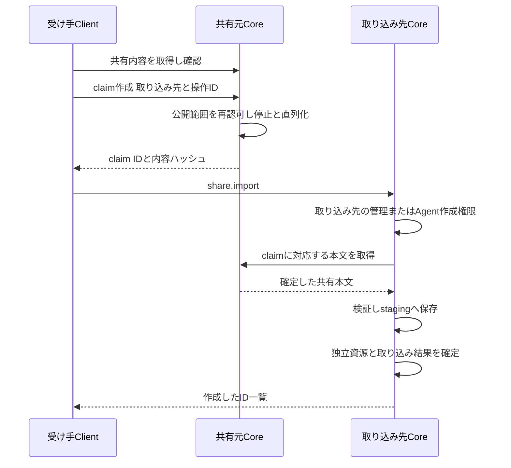
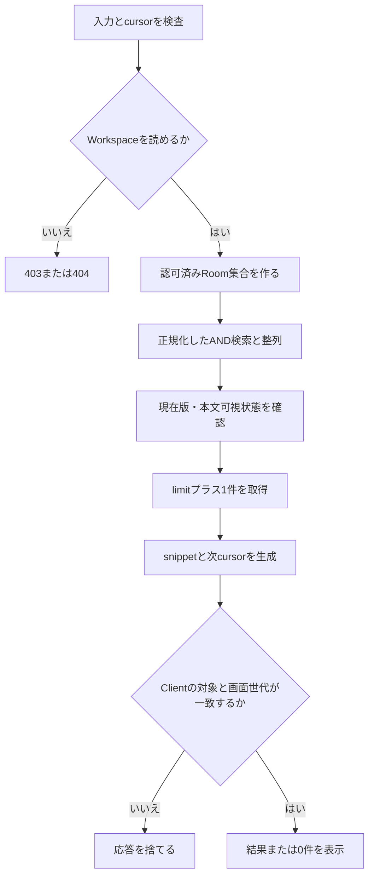
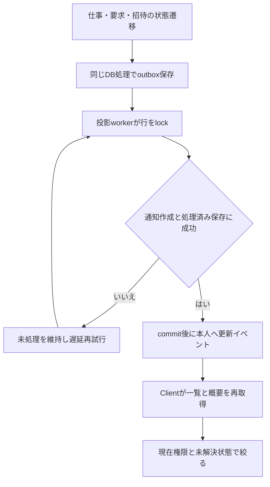
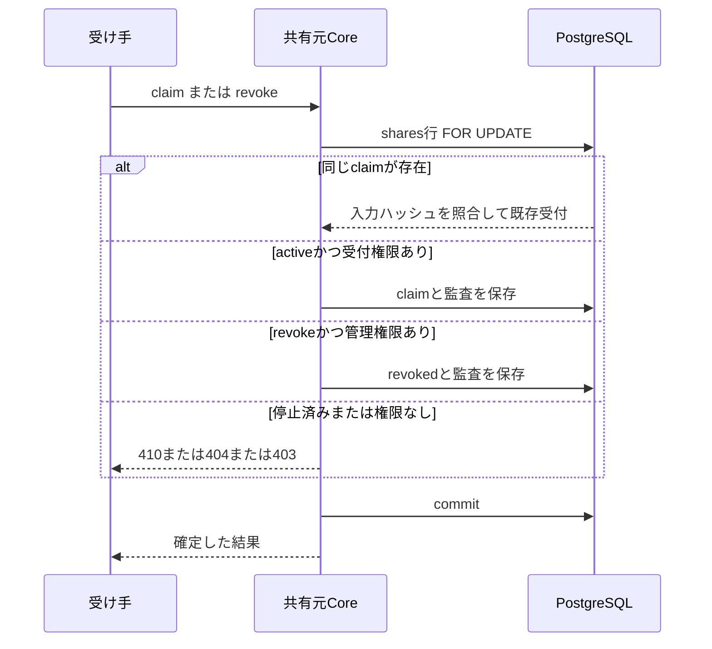
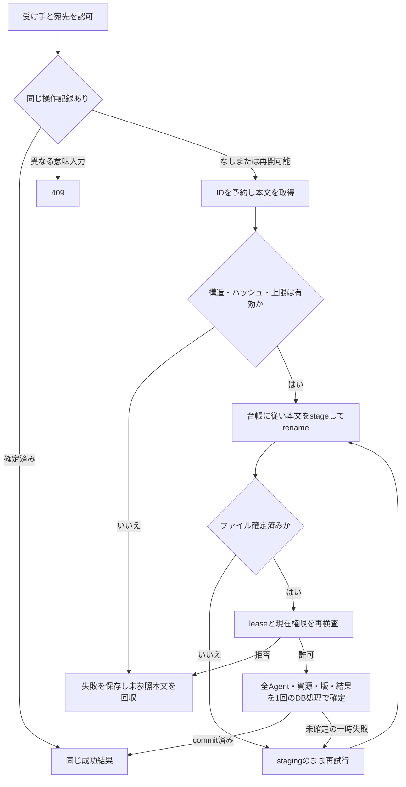

# Workspaceの文脈・通知・共有 API・処理詳細設計

- 状態：2026-09-17の実装前設計。新規契約は未実装であり、現行APIと区別して記す。
- 要件：[Native UI改善・記憶管理・共有](../requirements/native-ui-room-agent-sharing-requirements.md)。
- 境界：[基本設計](workspace-context.md)。保存：[データ設計](workspace-context-data.md)。画面：[Native App](native-app.md)第11〜15章。

## 1. APIの共通契約

既存の`POST /api/v1/workspaces/:workspaceId/domain/queries/:queryId`、`POST /api/v1/workspaces/:workspaceId/domain/operations/:operationId`へ新しい契約を登録する。Account対象には既存の`/api/v1/domain/queries/:queryId`と`/api/v1/domain/operations/:operationId`を使う。契約名、入出力スキーマ、公開可否を[Domain API](../../packages/domain-api/src/index.ts)へ登録し、[HTTP adapter](../../apps/server/src/workspace-server/domain-api-v1.ts)からCoreの処理へ接続する。

現行のAccount認証付き入口はOrganization系の契約だけを振り分けている。今回のAccount契約を扱う分岐とCore処理を追加し、Organization参加・Workspace参加を本人宛て招待の取得条件にしない。URLが存在することを、新規契約が実装済みである根拠にしない。

ここでURL末尾のoperationIdは`share.publish`等の操作種別を表す。再送用の操作IDは別の値であり、既存の`x-samurai-operation-id`ヘッダーを使う。Clientが生成した一つのIDを、結果不明の通信再試行で再利用する。変更操作は必須、Queryは不要とする。

- 認証、request envelope、成功応答の`result`／`replayed`等は既存v1の形式を維持する。
- WorkspaceはURL、操作者は認証結果から決める。本文のWorkspace ID・Account IDで上書きしない。
- 入力はstrict schemaとし、未知のキーと共有禁止の設定を拒否する。
- 版を持つRoom・Agent・資源・下書きの編集は`expected_version`を用い、同時更新は409。確認済みの値を黙って最新値へ置換しない。
- ページは既定30件、最大100件。`next_cursor`は検索条件、対象、Account、最後の整列キーを結び付けた不透明な値にする。
- 未認証は401、認証済みの操作権限不足は403、存在を隠す対象は404、状態・版の競合は409、入力不正は400、到達不能は503。共有停止は公開内容を返さず410とする。

## 2. 既存契約の利用・拡張

| 契約 | 扱い |
| --- | --- |
| `room.list`、`room.view`、`room.member.list` | 継続利用。UIで階層と実参加者を表示する |
| `room.default_agent.set`、`room.agent.permission.set` | 継続利用。既定は1体、変更は次の依頼へ適用 |
| `agent.list/view/create/patch/backend.bind` | 継続利用。取り込み処理はCore内の同じ作成・認可規則を使う |
| `completion.resource.list/view/body/create/update/archive/fix` | Agentスコープを追加。`scope_kind=agent`では`agent_id`必須、`room_id`禁止。Workspace Knowledgeを拒否 |
| `completion.knowledge.search` | Room向け既存参照を維持し、Workspace Knowledgeの自動合流を除去。Runtimeの担当Agent知識は第12章の認可済みContext経路で追加 |
| `learning.settings.view/patch` | Roomの有効状態とWorkspace既定値を利用。inherit_enabledを追加し、他のRoom学習設定を保持。自動学習の資源帰属はRoom固定 |
| `settings.view/patch` | Workspace設定として継続。本人の言語・個人指示をここへ書かない |
| 既存の承認・入力応答、招待受諾 | 継続利用。通知はこれらへの入口であり、通知の既読操作で代用しない |

## 3. 検索と通知の新規契約

表の入出力は既存envelopeの`input`／`result`内を表す。

| 契約・種別 | 入力 | 出力 |
| --- | --- | --- |
| `workspace.search` Query | `q`、`types: room/conversation/knowledge[]`、任意`room_id`、`limit`、`cursor` | `items[{type,id,room_id,title,snippet,updated_at,target}]`、`next_cursor` |
| `notification.list` Query | `unread_only`、`limit`、`cursor` | `items[{id,kind,created_at,read_at,title,summary,target,action_state}]`、`next_cursor` |
| `notification.summary` Query | なし | 選択Workspaceの`unread_count`、`as_of` |
| `notification.mark_read` Operation | `notification_ids[]` | 処理したIDと`read_at`。すでに既読の場合は同じ状態を返す |
| `account.workspace_notification_summaries` Account Query | 同じServer上の`workspace_ids[]`（1〜100件ずつ） | 現在参加している対象ごとの`workspace_id,unread_count,as_of`。無権限対象は返さない |
| `account.invitation_notifications` Account Query | `limit`、`cursor` | 本人宛て招待だけの通知、`next_cursor` |
| `account.invitation_notification_read` Account Operation | `notification_ids[]` | 本人宛て招待通知の既読結果。招待は受諾しない |

`target`は任意URLではなく、`room`、`work`、`knowledge`、`interaction_request`、`invitation`の型付き参照とする。Clientはこれを通常の認可付き画面遷移へ解決する。

### 3.1 検索の処理順

1. Workspace Membershipと読み取り可能状態を確認する。`q`はtrim後1〜512文字、空入力では検索を実行しない。
2. 現在のRoom権限から対象Room集合を作る。指定された`room_id`は集合内にあることを確認する。DMには本人用の認可を適用する。
3. データ設計の正規化・AND一致でRoom名、会話投影、Room Knowledge投影を検索する。件数や抜粋を認可前に作らない。
4. 題名の完全一致、題名の部分一致、本文一致の順で並べ、その中で更新日時降順、種別、IDを用いて順序を固定する。会話は元の依頼・応答を指すIDに正規化して重複を除く。
5. ページ内の対象について現在の版と権限を確認し、抜粋を最大200文字で返す。本文の全文や内部Session IDを返さない。
6. 結果選択時も通常の詳細Queryで再認可する。検索結果をアクセス権の証明に使わない。

画面は入力確定から300ms後に検索する。IME変換中は発火させない。入力変更やWorkspace切り替えで要求を中断し、応答世代を更新する。ページを全件取得してから表示する実装にしない。

### 3.2 通知の生成・配信

| 保存済みの発生条件 | 通知種別 | 受信者 | 移動先 |
| --- | --- | --- | --- |
| 仕事がcompletedへ遷移 | `work_completed` | 仕事の依頼者 | 元の仕事 |
| 仕事がfailedへ遷移 | `work_failed` | 仕事の依頼者 | 元の仕事と失敗状態 |
| 未解決の承認要求を作成 | `approval_required` | 要求に記録された承認対象者 | 対象要求 |
| 未解決の入力要求を作成 | `input_required` | 要求に記録された入力対象者 | 対象要求 |
| 本人宛ての招待を作成 | `invitation` | 指定された招待相手 | 招待内容 |

個々の担当作業の終了ではなく、仕事全体の終端状態から完了／失敗を作る。再実行の別の終端遷移は別通知とし、同じ遷移の再配信だけを重複除去する。承認者・入力対象者が集合の場合は、既存要求で指定された各Accountへ生成し、Room全員へ拡大しない。特定相手を指定しない招待リンクの発行だけでは、通知の受信者を推測しない。

Coreの状態保存と同時にoutboxへ記録し、投影処理が`account_notifications`へ一意キー付きで保存する。新規保存後に現在も閲覧可能な本人宛て`notification.changed`を配信する。Eventの接続・再取得は第10章に従う。Eventには通知ID・Workspace IDだけを載せ、一覧はQueryで再取得する。通知だけを状態の正本にしない。

選択WorkspaceではEvent購読と復帰時Queryを使う。他WorkspaceはServerごとに概要Queryをまとめ、フォアグラウンド中30秒間隔と切り替え一覧を開く時点に取得する。現在のServer選択を変更せず、対象接続を指定して読み取る。失敗したServerの件数はunknownにし、他Serverの結果を破棄しない。

既読は通知をクリックするか、明示の既読操作で保存する。一覧を開いただけで全件既読にしない。対象の認可が失われた通知は一覧・件数へ含めない。解決済みの承認・入力・招待は「対応済み」と表示し、再応答ボタンを出さない。

## 4. 共有元の新規契約

| 契約 | 入力 | 出力・条件 |
| --- | --- | --- |
| `share.draft.create` | `source_kind,source_id,resource_refs[{id,version}]`、または`base_share_id` | `draft_id,version,manifest,content_hash,removed_references`。元内容または管理可能な発行済みコピーから新しい下書きを作成 |
| `share.draft.update` | `draft_id,expected_version,manifest,visibility,recipient_account_ids[]` | 更新版、確認用manifest、`content_hash`。許可項目以外を拒否 |
| `share.draft.view` Query | `draft_id` | 現在版、確認用manifest、公開範囲、相手。作成者のみ |
| `share.draft.discard` | `draft_id,expected_version` | 破棄結果。作成者のみ、activeには実行不可 |
| `share.publish` | `draft_id,expected_version,expected_content_hash` | `share_id,url,content_hash,published_at` |
| `share.list` Query | `source_kind,source_id,limit,cursor` | 管理可能な対象の共有履歴。URL・公開範囲・相手・状態・日時 |
| `share.view` Query | `share_id` | 現在の共有元管理者に管理用manifest・公開範囲・相手・版・状態を返す。停止済みも管理者は確認可能 |
| `share.revoke` | `share_id,expected_version` | 停止状態・停止日時。現在の共有元管理権限を必須にする |

下書きも共有元の管理権限を毎回確認する。公開前のコピーにアクセスできるのは作成者だけとし、権限を失った作成者は発行できない。受信者選択は既存のメンバー候補またはAccount ID入力を用い、表示名だけで相手を確定しない。未登録メールアドレスへの招待機能を追加しない。

`base_share_id`による再共有では、現在の共有元管理権限を確認して固定コピーを複製する。元の個別資源の更新・削除によって内容を差し替えない。元Room／Agent自体が削除済みの場合は新しい下書きを作成できない。新規下書きの公開範囲は限定共有・相手未指定へ戻し、再度確認して発行する。既存リンクの状態は変更しない。

### 4.1 確認・発行

1. 共有元のRoom管理権限またはAgent編集権限、選択資源の帰属と版を確認する。
2. 選択した資源の本文を読み、公開用allowlistでmanifestを生成する。元の内部参照・会話・認証フィールドをコピーしない。
3. Clientは共有用コピーを編集し、`draft.update`で保存する。Serverが再検査し、正規化した内容とハッシュを返す。
4. 最終確認画面はServerが返した内容を表示する。Client未保存の編集があれば発行ボタンを無効にする。
5. `publish`は下書きの版・内容ハッシュ、現在の管理権限、限定受信者を再検査する。元資源がその後更新されていても、確認済みコピーを自動差し替えしない。元Room／Agentへの現在の管理権限が失われた場合は拒否する。固定コピー作成後の個別資源の更新・削除は第11.1節に従う。
6. データ設計第5章のファイル確定後にactiveとpublic_locatorを保存する。成功応答にだけURLを返し、再送では同じURLを返す。発行が不明なら同じ操作IDで再照会し、別リンクを増やさない。

### 4.2 共有リンク用HTTP

以下は新設する共有専用入口である。Workspaceの会話・ファイルAPIを匿名公開しない。

| HTTP | 処理 |
| --- | --- |
| `GET /s/:locator` | 共有閲覧画面。限定共有の場合は本文を埋め込まず、本人確認へ案内 |
| `GET /api/v1/shares/:locator` | activeかつ公開条件を満たす場合だけmanifestを返す。限定共有はAccount認証必須 |
| `POST /api/v1/shares/:locator/claims` | 取り込み受付。受信者認証必須。取り込み先origin・Workspace ID・操作ID・確認済みハッシュを受け取る |
| `POST /api/v1/shares/:locator/claims/:claimId/content` | 取り込み先から、受信者の署名付き委任と受付情報を提示して本文を取得する。操作・受信者・宛先・ハッシュを照合 |

共有の応答は`Cache-Control: no-store`、`Referrer-Policy: no-referrer`を付ける。公開ページはnoindexとし、公開カタログや検索索引へ登録しない。noindexをアクセス制御の代わりにしない。

ブラウザーの限定共有では既存の本人認証を使い、ログイン済みであるだけでは許可しない。Account公開鍵からIDを確認し、共有物の受信者と一致させる。クロスServerでも同じ本人識別を使い、共有元Roomへの参加を要求しない。

## 5. 取り込みの新規契約と処理

`share.import`を取り込み先WorkspaceのOperationとして新設する。入力は`source_origin,locator,claim_id,content_hash,target_room_id?`と、受信者の署名付き委任。Room知識共有の場合だけ`target_room_id`必須とする。出力は`import_id,kind,created_resource_ids,created_agent_id?,status`。HTTP dispatcherにこの操作の非同期受付を追加し、保存確定前は202と`status=staging`を返す。再送時の200も完了を意味しない。確定後だけ成功を表示する。`share.import.status` Queryは入力`operation_id`を受け、操作者本人と取り込み先の現在権限を確認して同じ結果形式を返す。



1. Clientは取り込み先を選択し、同じ操作IDを共有元と取り込み先に使う。本人の署名は共有元origin、共有ID、claim、取り込み先origin・Workspace、操作ID、内容ハッシュ、有効期限を束縛する。HTTPの署名済み本文から別の宛先を作らない。
2. 共有元は共有行をロックし、activeと受信者を確認してclaimを確定する。停止と同時の場合はロック確定順を採用する。停止前に確定した同じclaimの再試行は許可し、停止後の新しいclaimは拒否する。
3. 取り込み先は最初に現在のRoom管理権限／Agent作成権限を検査する。検査前に外部への取得処理を始めない。
4. 取り込み先は共有元から本文を取得し、manifestの型、許可項目、パス、サイズ、内容ハッシュを検査する。共有元のJSONをDB入力として直接適用しない。
5. 新しい資源IDを採番する。Room共有は指定RoomのKnowledgeのみ、Agent共有は新AgentとAgentスコープのKnowledge／Skillを作る。既存の同名資源を上書きしない。
6. AgentのBackendは共有元から引き継がず、受け手側の通常のAgent作成で使う既定Backendを適用する。既存の`backend_id`必須制約を維持する。接続・認証が不足する場合は利用不可の状態を表示して設定へ案内し、利用可能な接続がある場合は再設定を要求しない。元のRoom権限は付与せず、取り込み処理から実行やRoom参加を開始しない。
7. 取り込み知識は`creation_source=import`、`ai_managed=false`とし、受け手が確認した版を利用可能な初期版とする。外部の学習根拠・確定履歴・AI評価済みという状態は継承しない。
8. 本文stagingと資源作成を取り込み操作へ関連付け、本文確定後に公開する。成功直前にも対象の書き込み権限を再検査する。通常資源は最終DB確定まで作成しない。失敗時の回収・再試行条件は第11章に従う。

外部取得はHTTPSを標準とし、共有用パスだけへ接続する。一般利用者の入力でloopback、link-local、メタデータサービス、非公開ネットワークへServer側HTTP要求を送らない。Self-hostの内部接続は運用側が設定した接続先allowlistに限る。DNS解決先とリダイレクト先も検査し、認証情報を別originへ転送しない。Clientのconnection IDはServer側の接続許可に使わない。

受信者は通常のAccount署名で共有元を認証する。取り込み委任はその操作の本文取得だけを許可する発行後5分間の署名であり、受信者の秘密鍵や通常のログイントークンを取り込み先へ渡さない。期限切れの再試行では同じclaimについて本人が新たな委任を発行する。

## 6. 設定・文脈・旧機能の処理

本人の個人指示はClientでAccount別に保存する。依頼送信時に、認証済みの依頼者と同じAccountの署名付き設定スナップショットを付ける。Coreは検証した本文だけを実行文脈へ保存する。テーマ変更は既存の端末内設定を使い、React subtreeを作り直さない。プロフィール名のServer登録更新は既存の署名付き`POST /api/account/register`と`registerAccount`の同一Account更新処理を使う。登録済み接続ごとに更新し、失敗した接続は再接続時に再送する。端末への保存とServerへの反映状況を分けて表示し、個人指示を公開プロフィールへ載せない。

Roomの学習設定は既存Query／Operationで表示・変更する。「Workspaceの既定値を使う／Roomで有効／Roomで無効」の設定階層を維持し、有効状態だけを継承するinherit_enabledを追加して、Workspaceメモリー廃止と学習設定の廃止を混同しない。Roomへの自動学習はRoom資源のみを書き込める内部Contextに制限する。

Agentの知識は既存Completion操作をAgentスコープへ拡張して扱う。Agent詳細の手動編集と共有取り込みからだけ作成し、Roomでの学習をAgent資源へ自動転記しない。実行には対象Roomの確定知識と担当Agentの確定知識を、それぞれの出所付きで渡す。

Workspace Knowledgeの作成・昇格・move／copyは、公開APIとCoreの両方で`workspace_memory_removed`として拒否する。旧URLを非表示にするだけで終わらせない。削除対象と復元処理はデータ設計第10章に従う。

## 7. エラーと画面への返却

| code | 条件 | 利用者への表示・回復 |
| --- | --- | --- |
| `permission_denied` | 現在の管理・作成権限なし | 操作不可。別の取り込み先を選べる場合は選択へ戻る |
| `share_unavailable` | locator不正、限定共有の相手でない | 「この共有を表示できません」。元Room等の存在を説明しない |
| `share_revoked` | 停止後の閲覧・新規受付 | 「この共有は停止されています」 |
| `share_version_conflict` | 確認したdraft版と現在版が異なる | 下書きを保持して再読込・再確認 |
| `share_content_mismatch` | 確認済みハッシュと取得内容が異なる | 取り込みを止め、内容の再確認へ戻す |
| `share_import_pending` | 受付済みで保存確定前 | 処理中。新しい操作IDを発行せずstatusを照会 |
| `source_unreachable` | 共有元へ接続できない | 再試行。取り込み成功を表示しない |
| `backend_setup_required` | 新Agentの実行接続が未設定 | Agent自体の取り込み完了を表示し、接続設定へ案内 |
| `workspace_memory_removed` | 廃止したスコープを要求 | 「Workspace共通メモリーは利用できません」。自動移管しない |

## 8. 検証と要件対応

| 要件 | 必要な検証 |
| --- | --- |
| F-SEARCH、N-01・04・08 | 多Room・DM・異なる権限で結果／抜粋を確認。検索途中の切り替え、権限取消、ページ継続、IME入力を実Clientで確認 |
| F-NOTIFY、N-05 | 5種の状態遷移、再接続、既読、対応済み、未参加招待、複数Server概要の一部失敗を確認 |
| F-SHARE、N-02・03 | 改ざん入力、限定相手以外、匿名公開、版競合、停止とclaimの並行実行、再送を実Core・DBで確認 |
| F-ROOM-SHARE | 知識のみの固定コピー、非管理者拒否、既存Roomへの取り込み、元履歴の非公開を確認 |
| F-AGENT-SHARE | 選択Skill・知識、認証とRoom権限の非継承、独立ID、接続設定後の実行を確認 |
| F-REMOVE、O | 旧API、旧bundle、検索・Context、廃止データ除去から共通知識が復活しないことを確認 |

本書作成ではソースと契約の静的確認を行った。新規契約の実装、実Server・DB・Client・別Server間の実行検証は未実施であり、実装完了の証拠として扱わない。

## 9. 共通の項目型と応答形式

### 9.1 型・上限・省略

以下は今回追加する契約の型定義である。既存APIを再利用する箇所は既存の[公開schema](../../packages/domain-api/src/index.ts)を正本とし、互換性のない上限変更を行わない。

| 型名 | 定義 |
| --- | --- |
| Id | trim後1〜512文字の文字列。生成する資源IDは既存のID生成・検査関数を使う |
| Version | 正のsafe integer。初回ローカル設定・初回学習overrideのexpected_versionだけ0可 |
| Timestamp | UTCのISO 8601文字列 |
| Hash | 小文字16進64桁のSHA-256 |
| Title | trim後1〜200文字 |
| TextBody | 1〜8×1024×1024文字。改行を保持。空白だけは不可 |
| PageInput | limit：整数1〜100、省略30。cursor：省略可、最大4,096文字。null不可 |
| Page(T) | items：T配列、next_cursor：文字列またはnull。全件数を返さない |
| Origin | HTTPS origin、パス・query・fragment・資格情報禁止。運用allowlistの内部接続だけ例外 |
| Locator | base64url43文字。共有元IDではない |

文字数は既存Zod stringと同じJavaScript文字列長。配列のId重複はClientで除去し、Coreでも重複入力を拒否する。省略可と明記した項目以外は必須。更新入力の省略は「変更なし」、nullは明記した項目だけ許可する。Id・enum以外の自由文に一律のtrimやUnicode変換を行わない。

新規共有の技術上限は確定Manifest32MiB（UTF-8バイト数）、entries1,000件、指定受信者1,000人。各Skillのsupport_filesは既存と同じ99件、各content_base64は8×1024×1024文字以内。JSON要求は既存36MiB制限内とする。超過は413と上限項目を返し、黙って切り捨てない。これらは実装共通定数にし、Client・Core・取得側検査で同じ値を使う。

### 9.2 新規型

```typescript
type ShareKind = 'room_knowledge' | 'agent';
type Visibility = 'restricted' | 'public';
type ResourceEntry = {
  entry_id: Id; kind: 'knowledge' | 'skill'; title: Title; content: TextBody;
  knowledge_kind?: 'fact' | 'decision' | 'explanation' | 'experience_rule';
  files?: { path: string; encoding: 'utf8' | 'base64'; content: string;
             byte_size: number; sha256: Hash }[];
};
type Manifest = {
  format_version: 1; kind: ShareKind; title: Title; entries: ResourceEntry[];
  agent?: { name: Title; role: string; instructions: string };
};
type Draft = {
  draft_id: Id; version: Version; manifest: Manifest; content_hash: Hash;
  visibility: Visibility; recipient_account_ids: Id[];
  removed_references: { entry_id: Id; location: string; reason: string }[];
};
type Target =
  | { kind: 'room'; room_id: Id }
  | { kind: 'work'; room_id: Id; work_id: Id; message_id?: Id }
  | { kind: 'knowledge'; room_id: Id; resource_id: Id }
  | { kind: 'interaction_request'; room_id: Id; request_id: Id }
  | { kind: 'invitation'; invitation_id: Id };
type Notification = {
  id: Id; kind: string; created_at: Timestamp; read_at: Timestamp | null;
  title: string; summary: string; target: Target | null;
  action_state: 'not_required' | 'pending' | 'resolved';
};
type ImportResult = {
  import_id: Id; kind: ShareKind; status: 'staging' | 'committed' | 'failed';
  phase: 'fetch' | 'files' | 'commit' | 'done' | 'cleanup';
  retryable: boolean; failure_code: string | null;
  created_resource_ids: Id[]; created_agent_id: Id | null;
  committed_at: Timestamp | null;
};
```

Knowledgeはknowledge_kind必須、files禁止。Skillはknowledge_kind禁止、files省略時は空。files.pathは1〜1,024文字の相対パスで、既存のSkill support path検査を使う。Agentのroleはtrim後1〜500文字、instructionsはtrim後1〜20,000文字。Room共有はagent禁止かつKnowledge1件以上。Agent共有はagent必須、entries空可。未知のキーをすべて拒否する。removed_referencesは共有元管理画面だけへ返し、公開Manifestには入れない。

### 9.3 契約別の省略・返却条件

| 契約 | 確定する入力条件 | result型・追加条件 |
| --- | --- | --- |
| workspace.search | q：trim後1〜512文字。types：省略時3種すべて、指定時1〜3種。room_id省略可。PageInput | Page(SearchItem)。SearchItemはtype、id、room_id、title、snippet、updated_at、Target。snippet200文字以内 |
| notification.list | unread_only：省略false。PageInput | Page(Notification)。現在Workspace対象のみ |
| notification.summary | 空object | unread_count：0以上整数、as_of：Timestamp |
| notification.mark_read | notification_ids：1〜100 Id | updated_ids：Id[]、already_read_ids：Id[]、read_at：Timestamp |
| account.workspace_notification_summaries | workspace_ids：1〜100 Id | items：workspace_id／unread_count／as_of配列。1Server内で未参加IDは結果に含めない |
| account.invitation_notifications | PageInput | Page(Notification)。未参加WorkspaceまたはAccount直接の招待だけ |
| account.invitation_notification_read | notification_ids：1〜100 Id | mark_readと同じ。仕事通知IDは拒否 |
| share.draft.create | resource_refs方式とbase_share_id方式は排他。前者はsource_kind、source_id、resource_refs必須、resource_refs各id／version。後者はbase_share_idのみ | Draft。初期restricted、recipient空。entry_idは元IDと無関係な連番を発行 |
| share.draft.update | draft_id、expected_version、Manifest、visibility、recipient_account_ids | Draft。kind、entry_id集合、各entry.kindは変更不可。対象追加・削除は選択段階から新draftを作る |
| share.draft.view | draft_id | Draft。作成者かつ現在の管理者だけ |
| share.draft.discard | draft_id、expected_version | draft_id、discarded:true。破棄再送は同じ成功。別の操作でactiveは409 |
| share.publish | draft_id、expected_version、expected_content_hash | share_id、version、url、content_hash、published_at |
| share.list | source_kind、source_id、PageInput | Page(ShareSummary)。発行済みと本人のdraftのみ。ShareSummaryはshare_id、version、title、status、visibility、recipient_account_ids、url（draftはnull）、created_at、published_at（未発行はnull）、revoked_at（未停止はnull） |
| share.view | share_id | ShareSummary＋manifest＋content_hash。draftは作成者限定 |
| share.revoke | share_id、expected_version | share_id、version、status:revoked、revoked_at。すでに停止なら同じ状態を返す |
| share.import | source_origin、locator、claim_id、content_hash、delegation、Room時target_room_id | ImportResult。created系とcommitted_atは確定前に空／null |
| share.import.status | operation_id | ImportResult。存在しない／別人の操作は404 |

通知IDの一部に別人・別WorkspaceのIDが混じる更新は全件拒否し、部分既読にしない。自分の通知でも現在のRoom閲覧権限がないものは更新対象にしない。何のIDが第三者のものかは返さない。

### 9.4 Envelopeとエラー

既存v1のwire形式は`value`ではなく`result`である。HTTP入口で操作定義のschemaを使って入出力の両方を検査する。

```json
{"context":{},"input":{"q":"議事録","types":["knowledge"],"limit":30}}
```

```json
{"api_version":"1","request_id":"request_example","result":{"items":[],"next_cursor":null},"replayed":false}
```

```json
{"error":{"code":"share_version_conflict","request_id":"request_example","details":{"latest_version":4}}}
```

Query成功200。同期作成201、再送成功200。share.import初回stagingは202、再送は200でもstatusを必ず評価する。既存Completionが返す422等はその契約のまま扱う。新規契約は入力400／未認証401／権限403／非存在・秘匿404／状態競合409／停止410／上限413／一時障害503。限定共有の相手確認を停止状態の返却より先に行い、対象外の相手には停止の有無も返さない。

エラーdetailsはfield_errors（項目名とcode）、latest_version、retryable、上限値など許可した項目だけとする。入力本文・受信者一覧・内部パス・locator・署名を入れない。Clientはcodeから第7章の日本語表示へ変換し、未知codeは「処理できませんでした」とrequest_idを表示する。

## 10. 検索・通知の処理詳細

### 10.1 P-SEARCH：検索・ページ継続

正規化関数は`NFKC → Unicode lowercase → Unicode空白で分割 → 空語除去 → 同じ語の重複除去`とする。保存する原文を変換せず、題名・本文の検索用値へ同じ処理を使う。すべての語が題名または本文に含まれる場合に一致とする。LIKEの`%`、`_`、escape文字をエスケープし、SQL bind parameterで渡す。

候補の整列キーは`(rank ASC,updated_at DESC,type_order ASC,id ASC)`。rank=0は正規化した全文検索語と題名が一致、rank=1は全語が題名に含まれる、残りrank=2。type_orderはroom=0、conversation=1、knowledge=2。会話はRoom仕事のメッセージIDを正本とし、同じメッセージのSession投影は重複計上しない。仕事に対応しない旧履歴だけ旧会話ID＋Roomを使う。

cursorはformat_version、Server origin、Account、Workspace、検索条件ハッシュ、最初の検索時刻as_of、最終キーをServer署名付きbase64urlにする。有効期間15分。別条件・別人・署名不正・期限切れは`search_cursor_invalid`（400）。Clientはcursorを破棄して先頭から再検索する。更新時刻がas_ofより新しい行は継続ページに追加せず、先頭再検索で取得する。各ページで認可をやり直すため、取り消された結果は消え得る。

limit+1件の認可済み結果を読み、追加1件があればnext_cursorを返す。snippetは最初の一致語を含む位置から前方40文字を含め最大200文字、本文が短ければ全文。HTMLとして返さずplain textにする。Room結果はRoom名を表示し、非公開の親情報で補足しない。



### 10.2 P-NOTIFY：発生・投影・表示

通知の起点は第3.2節の保存済み状態遷移とし、Clientの画面表示やstreamの一時的な文言から生成しない。各状態保存処理にoutbox writerを組み込み、仕事の版・要求ID・招待版を重複キーにする。失敗・完了のどちらか一つだけを同じ終端遷移から作る。通知対象者が0人ならoutboxを作らない。

投影workerの処理順は「未処理行lock→各受信者へ通知INSERT ON CONFLICT DO NOTHING→outbox処理済み→commit→本人向け通知更新イベント」である。配送に失敗してもDBを巻き戻さない。Clientは接続時・再接続時・画面復帰時にQueryし直す。承認・入力・招待の対応済み遷移ではaction=invalidateのoutboxを同時保存し、新しい通知行を作らず既存通知の表示更新だけを配信する。既読保存後も同じ本人へ更新を配信する。Room／Membership変更の既存イベントでは影響する一覧・件数を再取得する。

Account向けの新設`GET /api/v1/account/notification-events`を認証付きstreamとして用意する。イベントは`notification.changed {notification_id,workspace_id|null}`、本文なし。接続認証は既存のAccount署名検証を使い、新設するfetch-streamへ接続し、URLにトークンを付けない。Room必須の既存workspace_eventsへ招待を押し込まない。stream自体は永続履歴の代わりにせず、切断区間は通知Queryから復元する。



一覧と未読件数はデータ設計第7章の同じ条件式を使う。Serverごとの概要要求は100 Workspaceずつ分割し、失敗したServerだけunknownにする。未参加Workspace招待はAccount Query、参加後はそのWorkspaceの通知Queryに一度だけ現れる。Organization直接の本人宛て招待はAccount枠に残す。招待の許可が元処理で取消された場合は対応済み表示にし、受諾操作は元の招待APIで拒否する。

既読の変更は対象通知行をロックし、本人・Workspace・元対象の認可を検査後、read_atがNULLの行だけnow()を設定する。再送で既読日時を更新し直さない。現在の通知を読んだあとも、別の状態遷移から生まれた通知は独立した未読として扱う。

## 11. 共有の分岐・排他・復旧

### 11.1 P-PUBLISH：下書き保存と発行

1. 操作主体とsourceを解決し、基本設計の権限表で検査する。Room共有は選択資源すべてが同RoomのKnowledge、Agent共有は同AgentのKnowledge／Skillであることを検査する。
2. 指定版の内容から内部参照を除いたManifestを作る。元IDをentry_idへ使わない。元の資源版は管理用source_versionsにだけ保持する。
3. draft.updateでは構造・本文・公開範囲を再検査し、ファイル台帳を作成して新しいrevisionの本文を確定する。shares行をlockしてexpected_versionを照合し、本文ポインタを更新する。版競合なら新本文は未参照回収対象にし、現在のdraftを変更しない。
4. publishは同じshares行をlockし、draft、expected_version、content_hash、現在の管理権限、受信者条件を検査する。すでに同じ操作で発行済みなら同じ結果を返す。別操作による発行済みなら409。
5. 元Room／Agentの削除や現在の管理権限取消は拒否する。すでに作成した固定コピーについては元の個別資源の更新・削除を理由に内容を差し替えない。共有禁止フィールド・内部参照は確認済みコピーに対して再検査する。
6. 本文ファイルのハッシュと存在を確認し、active、revision+1、locator、published_at、操作結果、監査を同じトランザクションで保存する。本文へのネットワーク通信をこのlock中に行わない。

既知の非公開参照は、元のresource／Activity等を指す構造化refと製品内部URL・ファイルURIで判定する。除去箇所を共有元の確認画面へ返す。外部httpsリンクは文字列として残せるが、画像の自動読込み・HTML・script・Skill実行を行わない。任意の自由文から秘密を完全検出したという表示はしない。

### 11.2 P-CLAIM／P-REVOKE：受付と停止



上図の条件は操作種別ごとに評価する。claim要求でrevoke分岐へ入ることはない。同じclaimの再取得は本人・宛先・操作ID・入力ハッシュ一致を必須とする。停止後でも停止前に受付済みの操作だけは再開できる。revokeは管理権限確認後、すでに停止なら同じ停止日時を返す。

### 11.3 P-IMPORT：受け手側の一括確定

意味入力はsource origin、locator、claim ID、内容ハッシュ、kind、宛先Workspace／Room、操作主体。署名の期限更新だけは意味入力の変更に含めない。import_idはoperation_idと同じ値とする。kindはtarget_room_idがあればroom_knowledge、なければagentとして予約し、取得Manifestのkindと一致しなければ拒否する。committedのretryableはfalse、failure_codeはnullとする。



入力本文の検証に成功した後、entryごとの新しいIDをimportsに固定する。Room共有は対象RoomへKnowledgeだけ、Agent共有は新Agent・Agent帰属資源だけを準備する。取り込み中のAgentを通常一覧に先行INSERTしない。

ファイルは準備台帳に記録した新規パスだけへ書く。すべての本文が確定した後、現在の宛先権限・leaseを確認し、共有Coreのtransaction対応作成処理で全資源／版／必要なAgent／対応表／imports結果を同一DBトランザクションへ入れる。creation_source=import、ai_managed=false、lifecycle=active、初期確定版=1とする。人が内容を確認して取り込んだ証拠を残し、元のAI評価や根拠を継承しない。

ロック順は既存のWorkspace／Room認可・Membership規約→importsの操作行→作成対象をID昇順→ファイル台帳とする。ネットワーク取得はトランザクション外。確定直前に認可を再検査し、途中の権限取消と競合した場合に取消後の新規確定を許可しない。別Server間の分散トランザクションは使わず、共有元の不変claimと取り込み先の一意操作で整合性を保つ。

### 11.4 状態・復旧表

| 状態・原因 | 保存状態 | 再開・回収 |
| --- | --- | --- |
| 同じ入力の重複要求 | 状態を変えない | 同じ処理中／結果を返す。別workerを起動しない |
| 本文取得前の接続失敗 | staging、phase=fetch、retryable=true | 生きている委任の間は2・5・15秒後に再試行。以後は明示再試行 |
| 委任期限切れ／取得前の再起動 | staging、fetch、authorization_refresh_required | Clientが同じ操作へ新しい短期委任を付けて再送。秘密鍵や恒久tokenをServerに保存しない |
| ダウンロード検証成功 | staging、phase=files | 検証済み本文を保存し、外部通信なしでworkerが続行できる |
| rename中の一時IO失敗／再起動 | staging、files、retryable=true | 台帳とハッシュを照合して同じパスから再開 |
| DB確定前の一時失敗 | staging、commit、retryable=true | 既存ファイルを再検証して同じIDでDB確定を再試行 |
| ハッシュ不一致／禁止項目／path不正 | failed、cleanup、retryable=false | 通常資源0件。未参照本文を回収し、修正された共有は別の明示取り込み |
| 宛先権限取消／宛先削除 | failed、cleanup、retryable=false | 確定しない。権限・宛先変更後の取り込みは新しい操作 |
| DBcommit成功・応答喪失 | committed、done | statusまたは同じ操作の再送で成功結果を返す |
| 回収途中のIO失敗 | failed、cleanup | 失敗表示を維持し、回収workerが未参照ファイルだけを再試行 |

Clientの状態照会は2秒間隔、30秒以降は5秒間隔。バックグラウンドでは停止し、復帰時に再取得する。画面を閉じてもServerの確定処理は取消さない。未完了操作IDをClientのAccount＋Server＋Workspace別に保持し、共有リンクを再び開いたら同じ操作の状態を照会する。任意の過去の完了済み共有を二度目に取り込む場合は、利用者の新しい明示操作として別IDを発行する。

## 12. 設定・実行文脈・既存実装への接続

### 12.1 P-PREFERENCES：本人設定

保存処理は`load(account_id) → validate → readwrite transactionでrevision照合 → revision+1で保存 → UIへ確定値を返す`。競合は`personal_settings_conflict`、保存失敗は`personal_settings_storage_failed`。表示名のServer反映はこの後の別処理で、失敗しても保存済みの個人指示を巻き戻さない。ログイン済みAccount以外の保存を受け付けない。

新規にPublicRequestContextへ任意の`personal_preferences`を追加する。型は`{schema_version:1,revision:Version,display_name:Title,output_locale:既存locale|null,instructions:0〜20,000文字}`。Room依頼・返信・新しい実行指示など、利用者が実行を開始する操作だけに許可し、検索・共有・通知要求では拒否する。このobjectを含めて既存Account署名を検証する。Serverは認証主体の設定として保存し、object内に別account_idを指定させない。

Client設定がまだない場合はこの項目を省略し、既存既定動作を維持する。保存したスナップショットはRunの非公開入力に関連付け、UIの公開会話・共有Manifestには複写しない。自動化の作成・更新時は所有者の同じスナップショットを保存し、再試行は保存済み版を使う。Account変更・設定保存だけで既存自動化の設定を黙って更新しない。

### 12.2 P-ROOM-SETTINGS：Roomのフォーム保存

| フォーム | 既存契約と送る値 | 確定条件 |
| --- | --- | --- |
| Room名 | room.patch：id（Room ID）、name、expected_version | 現在manage、Roomが有効、名前検査、版一致 |
| 既定Agent | room.default_agent.set：context.room_id、input.agent_id、input.expected_version | 対象Agentが現在有効かつ同Roomで実行可能。既存runは更新しない |
| 人の参加・role・解除 | 既存Room administrationの確認／確定経路 | 対象と影響・版を再照合。Room管理やDMの既存制約を維持 |
| Agentの参加・権限 | room.agent.permission.set／room.agent.remove | 現在manage。既定Agentとの整合性を既存Coreで検査 |
| Knowledge | completion.resource.create/update/archive/fix | scope=room、当該Room、資源権限、版。固定・保管は専用操作 |
| 学習有効／無効 | learning.settings.patch：scope_kind=room、room_id、enabled、expected_version | 他の設定項目を送らず、enabled_inherits_workspace=falseへ |
| 学習の既定値 | learning.settings.patchを拡張：inherit_enabled=true、scope_kind=room、room_id、expected_version | enabledと同時指定不可。flagだけを変更し、model／上限等を保持 |

学習のQuery出力へ`enabled_inherits_workspace`をRoom設定の補助情報として追加する。初期表示はRoom行なし／flag=trueなら既定値、それ以外はRoom.enabledによる有効／無効。現在の実効enabledと継承元を同時に表示する。初回overrideの期待版は0、既存行は返された版。versionが変わったら409とし、実効値の差を無断適用しない。

### 12.3 P-CONTEXT：Room・Agent・本人を実行へ渡す

1. Room仕事と担当割当からWorkspace、Room、実行Agent、依頼者を解決する。Client指定のAgent IDをそのまま知識検索条件に使わない。
2. 現在のRoom閲覧・実行権限、AgentのRoom実行権限と有効状態を共通Coreで確認する。失効なら起動しない。
3. 同Roomの既存確定知識検索と、担当Agentスコープの確定知識／Skill検索を同じCompletion選択規則で行う。Workspace Knowledge検索を呼ばない。fixedやarchived、未確定版の扱いは既存の通常Context選択に合わせる。
4. Agentスコープ参照を既存Context資源refへ追加し、各refにscope・資源ID・版・内容ハッシュを保持する。既存の総Context上限・順位付けを共通に適用し、二つの検索結果へ別々に上限を割り当てて総量を倍増させない。
5. 管理policy、Agentの人格・指示、依頼者のスナップショット、現在の依頼、出所付き資源を各既存入力欄へ組み立てる。知識本文に書かれた命令でCoreの権限を変えない。言語だけは現在依頼の明示指定→本人設定→既存Workspace既定値で決める。
6. Native／外部Backendへ同じ認可済み参照を渡し、Agentが別Roomに移ったら新RoomのContextを構築する。前Roomの履歴や個人設定をAgentの永続知識へ転記しない。

今回、学習の評価・推論アルゴリズムそのものを新設しない。変更は保存先と参照範囲、設定の入口、共有である。

### 12.4 接続する既存箇所と追加責務

下表の既存ファイルは読取確認済み。追加名は実装予定の責務名であり、存在を示さない。共通Coreの新サービスはWorkspace Context（検索）、Notification、Shareの3責務に分け、HTTP handlerへ業務判断を持たせない。

| 既存の接続先 | 今回の差分 |
| --- | --- |
| [NativeApp](../../apps/web/src/native-app/NativeApp.tsx)、[NativeProfileMenu](../../apps/web/src/native-app/NativeProfileMenu.tsx) | 全画面settings状態、復帰先、右パネル種別を追加。Chatの親状態は保持 |
| [RoomNavigator](../../apps/web/src/components/RoomNavigator.tsx)、[target guard](../../apps/web/src/native-app/native-workspace-target.ts) | 展開状態、Workspace変更前後の対象確認。新しい応答にも画面世代を適用 |
| [Room administration](../../apps/web/src/native-app/use-native-room-administration.ts) | 既存の参加・移動確認をRoom設定パネルから呼ぶ。別の権限判定を新設しない |
| [Knowledge tools](../../apps/web/src/native-app/use-native-knowledge-tools.ts) | Room知識管理を維持。Workspace検索は別Queryへ。Agent scope入力を追加 |
| [browser bridge](../../apps/web/src/lib/workspace-browser-bridge.ts) | 新Query／Operationの型付き接続。他Workspace概要は対象接続を明示しactive targetを変更しない |
| [Domain API](../../packages/domain-api/src/index.ts)、[HTTP adapter](../../apps/server/src/workspace-server/domain-api-v1.ts) | schema、契約登録、scope別dispatch、result検査。Account分岐はOrganization参加不要 |
| [Store](../../packages/workspace-server/src/workspace-server-store.ts) | 既存Room／Agent／監査・冪等性を再利用。取り込み一括確定から同じtransaction内の作成関数を呼べるよう整理 |
| [Completion service](../../packages/workspace-server/src/workspace-completion-service.ts)・[files](../../packages/workspace-server/src/workspace-completion-files.ts) | Agent scope、共有取り込みのtransaction対応writer、確定版・本文検査を共通化 |
| [Learning service](../../packages/workspace-server/src/workspace-learning.ts) | enabledだけの継承flagと共通resolver。Room固定の学習書き込み |
| [schema](../../packages/workspace-server/src/schema.ts)・[bundle](../../packages/workspace-server/src/workspace-completion-bundle-v4.ts) | データ設計のDDL／RLS／復元revisionを一体で追加 |
| [Desktop main](../../apps/desktop/src/main.ts) | 既存samurai protocolへshare入口を追加。受信だけでインポートを実行しない |

## 13. 共有リンク・外部Serverの接続契約

### 13.1 入口と本人認証

共有画面は`/s/:locator`。公開はその場で本文を表示し、限定は「ログインして確認」または「アプリで開く」を表示する。アプリ遷移は新規`samurai://share?source=<URLエンコードした共有URL>`。NativeはHTTPS originと`/s/<locator>`以外の任意パス・追加query・fragment・資格情報を拒否する。既存Browser Clientは同じ共有URLを受け取る入口からUI-11を表示する。移動だけでclaimや取り込みを開始しない。

本人認証は[auth.ts](../../packages/workspace-server/src/auth.ts)のAccount IDと公開鍵の対応・署名形式を利用する。共有元に未登録のAccountにも対応するため、共有専用HTTPに`x-samurai-public-key`（base64 DER SPKI）を追加し、既存の署名ヘッダーとともに検証する。既存の登録鍵があれば一致を要求する。共有専用の一時本人確認からWorkspace Membershipを作らず、一般APIへのログイン状態を偽造しない。公開鍵は公開情報であり、秘密鍵を共有ページへ入力・転送しない。

GET manifest成功は`{share_id,content_hash,manifest}`。限定では相手照合後だけ返す。受信者一覧、source ID、source_versions、内部ファイルパスは返さない。content取得は確定バイト列を`application/json; charset=utf-8`で返し、`X-Samurai-Content-SHA256`を添える。受け手はヘッダーを信用するだけでなく自分でハッシュ計算する。

### 13.2 受付と短期委任

claim入力は`target_origin:Origin,target_workspace_id:Id,operation_id:Id,content_hash:Hash`。受信者は検証済み署名から解決する。成功201／同じ受付200のresultは`claim_id,share_id,recipient_account_id,target_origin,target_workspace_id,operation_id,content_hash,created_at`。

委任payloadは`version=1,source_origin,share_id,claim_id,recipient_account_id,target_origin,target_workspace_id,operation_id,content_hash,issued_at,expires_at`。expires_atはissued_atから5分以内。既存canonicalJsonと同じ正規化を使い、`samurai-share-import-v1`という用途識別子とpayloadを同じAccount鍵で署名する。delegationはpayload、public_key、signatureを持つ。通常の署名付きHTTP要求と用途を混同しない。

content endpointは署名の有効期限、Account IDと鍵、claimの全結合項目、確定本文ハッシュを照合する。共有停止前に確定したclaimなら同じ操作への転送を許可する。受け手側は外側のログインAccountとdelegation.recipient_account_idも一致させる。委任は取得要求の間だけメモリーに持ち、再起動後はClientによる再署名を要求する。

### 13.3 取得・公開の制限

共有元と取り込み先は固定originで通信し、redirectは追従しない。接続10秒・応答全体60秒を初期timeoutとする。DNS解決後と接続先IPの両方を検査し、非公開宛先は運用allowlistにあるoriginだけ許可する。Self-host用allowlistは利用者入力から追加できない。共有元が不通でも、すでに取り込んだ独立コピーは通常利用できる。

共有ページはno-store、no-referrer、noindex、CSPで外部script／画像自動読込み禁止。許可したMarkdownだけ描画し、HTMLは無効。外部リンクを新しく開く場合はnoopener／noreferrer。共有URL・委任・認証・本文をアクセスログや監査detailsへ保存しない。監査には操作主体、共有ID／取り込み操作ID、ハッシュ、公開区分、時刻、結果を残す。

## 14. 詳細処理の確認条件

| 確認ID | ケース | 確定する期待結果 |
| --- | --- | --- |
| V-P01 | 正規化・複数語・種別・cursor改ざん・ページ中の権限取消 | 定義した順序、再認可、400で再検索。権限外snippetなし |
| V-P02 | 同一通知遷移再送・投影失敗・stream切断 | 一度だけ保存し、Queryで復元。既読と承認が独立 |
| V-P03 | draft編集競合・公開切り替え・元資源更新 | 確認版だけ発行。競合は409、未確認内容を混入しない |
| V-P04 | claimとrevokeを両順序で同時実行 | lock確定順に従い、停止後の新受付だけを拒否 |
| V-P05 | 取り込み各段階で停止・再送・権限取消 | 第11.4節の状態と復旧結果。部分資源を公開しない |
| V-P06 | 別Server・同じWorkspace ID・偽署名・別宛先委任 | originとAccountを含めて拒否。正しい本人は元Room参加不要 |
| V-P07 | 設定保存後の新規依頼・既存run再試行 | 新規だけ新しい本人設定、再試行は元スナップショット |
| V-P08 | Workspace Knowledgeへの旧create／promote／restore | Coreで拒否し、検索・実行にも復活しない |

各確認は要件の受入条件と基本設計第10章の対応表に結び付ける。実行結果は実装時のreportsへ記録し、設計書の記載だけを合格証拠にしない。
