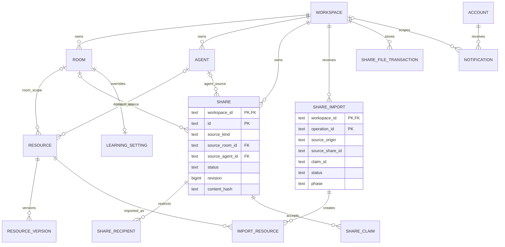

# Workspaceの文脈・通知・共有 データ詳細設計

- 状態：2026-09-17の実装前設計。既存構造の利用と、今回追加する列・テーブルを区別する。
- 要件：[要件定義書](../requirements/native-ui-room-agent-sharing-requirements.md)第6・8章。
- 責務・権限：[基本設計](workspace-context.md)。項目型・更新順：[API・処理設計](workspace-context-api.md)。画面：[Native App](native-app.md)第11〜15章。

## 1. 保存責務と記法

既存の[PostgreSQL schema](../../packages/workspace-server/src/schema.ts)と[Completion本文保存](../../packages/workspace-server/src/workspace-completion-files.ts)を利用する。Workspace／Room／Agent本体、資源本文と版、監査を重複したモデルに保存しない。

以下の表は物理列の定義である。`?`が付く列だけNULL可、それ以外はNOT NULL。IDはtext、時刻はtimestamptz、版はbigint（1以上）、ハッシュはtext（小文字16進64桁）、サイズはbigint（0以上）とする。既定値のない列はCoreが必ず指定する。JSONはAPI設計第9章のstrict型で検査し、DBにも必要な型・配列・状態のCHECKを置く。表のPK／FKは複合キーを省略せず扱う。

同じWorkspaceに属する参照は常に`workspace_id`を含む。外部Serverへの参照はorigin＋共有ID＋内容ハッシュで識別し、ローカルDBへのFKにしない。Clientからストレージパス・操作主体・作成時刻を指定させない。

## 2. ER図



Room／Agentの資源帰属と共有元は排他的であり、両方に属さない。Agentの参加Roomの資源をAgentスコープへ自動変更しない。SHARE_IMPORTの外部共有元はFKではない。SOURCEと派生コピーの継続同期関係も作らない。

## 3. 既存構造の拡張

### 3.1 Completion資源・本文・版

| 構造 | 変更 | 制約 |
| --- | --- | --- |
| `workspace_completion_resources.scope_kind` | agentを追加 | room／agent／workspace |
| 同`agent_id?` | text列を追加 | FK `(workspace_id,agent_id)`→`workspace_agents(workspace_id,id)`、ON DELETE RESTRICT |
| `workspace_completion_file_batches` | 同じagent_idとscope制約を追加 | Agent資源でも既存の本文確定判定を使う |
| `workspace_completion_search_projection` | agent_idと資源帰属を反映 | 人向けWorkspace検索はroomだけ。Runtimeは認可した担当Agentを明示指定 |
| Completion型・公開型・bundle資源型 | Agent帰属を追加 | `scope.kind=agent`の公開出力は`agentId`。操作入力は`agent_id` |

```sql
CHECK (
  (scope_kind = 'room' AND room_id IS NOT NULL AND agent_id IS NULL)
  OR (scope_kind = 'agent' AND room_id IS NULL AND agent_id IS NOT NULL)
  OR (scope_kind = 'workspace' AND room_id IS NULL AND agent_id IS NULL)
);
CHECK (NOT (scope_kind = 'workspace' AND resource_kind = 'knowledge'));
CHECK (scope_kind <> 'agent' OR
  (resource_kind IN ('knowledge','skill') AND NOT ai_managed));
```

上記resource_kind／ai_managedのCHECKは資源本体に置く。本文batchには帰属CHECKだけを置く。既存scopeのCHECKを置き換え、旧制約と二重適用しない。Agent用索引は`(workspace_id,agent_id,resource_kind,lifecycle_state,updated_at DESC,id)`。版・根拠・固定・保管の既存構造を維持する。

Agent本文の正本パスは既存の資源パス生成にAgent帰属を追加して生成する。IDから生成するパスは`agents/<agent-id>/knowledge/`または`agents/<agent-id>/skills/`の配下とし、版ファイルは既存`.versions`のルールを使う。パス許可・symlink拒否・export対象ルートにも同じ追加を行う。public APIへ内部パスを返さない。

### 3.2 Room学習の有効状態だけを継承する

現行`learning.settings.patch`の`remove_override`はRoom設定全体を削除する。R-L01の「既定値」でモデル・予算等まで消さないため、`workspace_learning_settings`へ`enabled_inherits_workspace boolean NOT NULL DEFAULT false`を追加する。Workspace行ではfalse固定とする。

実効enabledは`Room行があり継承flag=falseならRoom.enabled、それ以外はWorkspace.enabled、Workspace行もなければtrue`。Room行がない場合も同じ継承表示とする。`inherit_enabled=true`はflagだけをtrueにし、既存engine/model/上限/使用量を維持する。enabledを指定して保存するとflag=false。既存の全設定解除APIは残すが、この画面からは呼ばない。既存行はflag=falseのままで挙動を維持し、実効値を解決する全経路で共通resolverを使う。

## 4. 共有元のテーブル（追加）

### 4.1 `workspace_shares`

| 列 | 型・既定値 | 内容 |
| --- | --- | --- |
| workspace_id, id | text | PK(workspace_id,id)、Workspace FK |
| source_kind | text | room_knowledge／agent |
| source_room_id?, source_agent_id? | text | 対応するRoom／AgentへWorkspace付きFK、ON DELETE RESTRICT |
| created_by | text | accounts FK。下書き作成者 |
| title | text | trim後1〜200文字、一覧用の共有題名 |
| status | text、draft | draft／active／revoked |
| visibility | text、restricted | restricted／public |
| revision | bigint、1 | 下書き更新・発行・停止で1増加 |
| source_versions | jsonb、[] | 管理用の資源ID・版。共有本文には含めない |
| manifest_path?, content_hash?, byte_size? | text／hash／size | 保存済み共有用コピー。初回保存完了後は必須 |
| public_locator? | text、NULL | 発行時生成。32 random bytesをbase64urlにした43文字、全体UNIQUE |
| created_at, updated_at | 時刻、now() | 作成・更新 |
| published_at?, revoked_at? | 時刻、NULL | 対応する状態で必須 |

source_kindとsource FKは排他CHECK。draftはlocator／published_at／revoked_atがNULL、activeは本文情報／locator／published_at必須、revokedはそれらに加えてrevoked_at必須。発行後のtitle、manifest、visibility、受信者、sourceは不変。許可する遷移はdraft→active→revokedだけで、再共有は別IDを作る。

索引は`(workspace_id,source_kind,source_room_id,source_agent_id,created_at DESC,id)`、本人下書きは`(workspace_id,created_by,updated_at DESC,id) WHERE status='draft'`。Room／Agentの論理削除とリンク停止を同一操作で行う。物理削除は参照が残ればRESTRICTとし、別の保管整理処理で共有記録を先に除去する。本スプリントで物理削除UIを追加しない。

### 4.2 `workspace_share_recipients`

列は`workspace_id text, share_id text, recipient_account_id text`。PKはこの3列、FK(workspace_id,share_id)→workspace_shares、ON DELETE CASCADE。recipientは公開鍵から導くAccount ID。外部受信者のローカルaccounts登録を前提にしないためAccount FKは張らない。

draftのrestrictedは受信者0人でも保存できる。発行後のrestrictedは1人以上、publicは0人とし、Coreと遅延制約トリガーで守る。発行後の受信者変更をDB更新関数でも拒否する。

### 4.3 `workspace_share_claims`

| 列 | 型 | 内容 |
| --- | --- | --- |
| workspace_id, id | text | PK(workspace_id,id)、id全体UNIQUE |
| share_id | text | FK(workspace_id,share_id)→shares、ON DELETE RESTRICT |
| recipient_account_id | text | 署名検証した受け手。外部Account可 |
| target_origin, target_workspace_id | text | 正規化した宛先。target_originにパス・資格情報なし |
| operation_id | text | 受け手が開始した同じ論理操作 |
| request_hash, content_hash | hash | 受付入力の指紋と確定本文 |
| created_at | 時刻、now() | 受付確定日時 |

UNIQUE(workspace_id,share_id,recipient_account_id,target_origin,target_workspace_id,operation_id)。発行済み本文ハッシュとの一致を確認して作成する。受付と停止は同じshares行のFOR UPDATEで直列化。受付行は不変で、同じ入力の再送には同じidを返し、異なる入力は409。停止前受付の同じ操作だけを再開でき、新しい取り込みの権利へ転用できない。

## 5. 共有本文とファイル確定

Manifestの全項目はAPI設計第9章の型を正本とする。形式はUTF-8 JSON、format_version=1。元の内部ID・会話・認証・根拠参照をフィールドとして転送しない。既知の内部参照を共有用コピーから除去し、編集で再挿入された禁止参照は保存を拒否する。自由文の事実や機密性を機械的に保証するものではなく、利用者が最終確認する本文として扱う。

共有用本文は`shares/<share-id>/<revision>.json`。保存した確定バイト列からSHA-256を計算し、取得時に再整形しない。下書きの古い版は最新ポインタ・発行済みコピーから参照されなくなったものだけ回収する。本文の添付ファイルはManifest内にbase64またはUTF-8で保持し、外部任意URLから補完取得しない。

### 5.1 `workspace_share_file_transactions`

| 列 | 型・既定値 | 内容 |
| --- | --- | --- |
| workspace_id, id | text | PK(workspace_id,id)、Workspace FK |
| owner_kind, owner_id | text | draft／import、および共有ID／取り込み操作ID |
| actor_account_id | text | ローカルaccounts FK |
| status | text、prepared | prepared／renamed／committed／cleanup_pending／cleaned |
| entries | jsonb | 配列。各項目はstaged_path、final_path、sha256、byte_size。Server生成 |
| created_at, updated_at | 時刻、now() | 作成・最終更新 |
| last_error_code? | text | 内部診断code。本文・資格情報なし |

索引は`(status,updated_at,workspace_id,id)`。ownerは対応する下書きまたは取り込み記録に関連付け、一般Clientから直接操作不可。JSON項目の型・相対パス・重複なしをCoreで検査する。既存Completionのstage／finalize／recover／symlink検査を再利用し、共有専用パスと複数資源を扱えるよう拡張する。

公開する順序は **準備台帳を保存→本文stage→ファイルrename→通常データと結果をDBで確定**。準備中の資源本体やAgentを通常テーブルに先行作成しない。取り込みの全資源を最終DBトランザクションで一括作成する。既存Completionの版・file_batch行は、確定済み本文とともに同トランザクションで登録する。各資源を別々の通常create APIで作成して部分成功にしない。

rename後・DB確定前に停止しても、台帳から同じパス・ハッシュを再検証して続行する。既存ファイルに別ハッシュがあれば上書きせず失敗。破棄対象はこの台帳が所有し、通常資源・共有物から未参照のパスだけ。DB確定済みなら成功を再返却し、そのファイルを回収しない。

## 6. 取り込み先のテーブル（追加）

### 6.1 `workspace_share_imports`

| 列 | 型・既定値 | 内容 |
| --- | --- | --- |
| workspace_id, operation_id | text | PK(workspace_id,operation_id)、Workspace FK |
| recipient_account_id | text | ローカルaccounts FK。操作開始者 |
| kind | text | room_knowledge／agent |
| source_origin, source_share_id, source_locator, claim_id | text | 外部参照。通常の結果・ログにlocatorを返さない |
| request_hash, content_hash | hash | 宛先等の意味入力と確認済み本文。再署名した委任のバイト列をrequest_hashに含めない |
| target_room_id? | text | Room共有で必須。FK(workspace_id,target_room_id)→rooms、RESTRICT |
| reserved_agent_id? | text | Agent共有だけで必須。確定までAgent行は作らず、最終確定時に作るID |
| reserved_resource_ids | jsonb | entry ID→受け手側resource IDの固定対応。途中再試行で採番し直さない |
| manifest_path? | text | 検証済みの取得内容の内部保存先 |
| status | text、staging | staging／committed／failed |
| phase | text、fetch | fetch／files／commit／done／cleanup |
| retryable | boolean、true | 同じ意味入力で再実行可能か |
| failure_code? | text | 一時停止・失敗のcode |
| lease_token?, lease_until? | text／時刻 | worker実行権。両方NULLまたは両方あり |
| result? | jsonb | committedのみ。kind、created_agent_id?、created_resource_ids、committed_at |
| created_at, updated_at | 時刻、now() | 作成・更新 |
| committed_at? | 時刻 | committedのみ必須 |

CHECKはkindとtarget_room_id／reserved_agent_idの排他、committed⇔phase=doneかつresult・committed_atあり、failed⇒failure_codeあり。索引は`(status,phase,updated_at)`と`(workspace_id,recipient_account_id,created_at DESC,operation_id)`。元Room等の外部FKは持たない。

workerはDB時刻で30秒のleaseを取得し、10秒ごとに延長する。同時処理は同じlease_tokenを確認して排除する。lease切れの再取得は可能だが、ファイル操作を始める直前とDB確定前に所有権を再確認する。ネットワーク取得中はDBトランザクションを保持しない。失敗の分類と再試行はAPI設計第11章に従う。

### 6.2 `workspace_share_import_resources`

列は`workspace_id text, operation_id text, entry_id text, resource_id text`。PK(workspace_id,operation_id,entry_id)、UNIQUE(workspace_id,resource_id)。FK(workspace_id,operation_id)→imports、FK(workspace_id,resource_id)→Completion resources、いずれもON DELETE RESTRICT。最終確定時にだけ作成する。Agent自身はimports.resultとreserved_agent_idから追跡する。

通常資源を後で保管しても取り込み記録は残す。物理削除では対応行を先に除去し、監査とimports.resultの作成時IDは履歴として残す。取り込み済みコピーへの読み取りに共有元との再通信を必要としない。

## 7. 通知のテーブル（追加）

### 7.1 `account_notifications`

| 列 | 型・既定値 | 内容 |
| --- | --- | --- |
| id | text | PK。Server内一意 |
| recipient_account_id | text | accounts FK。本人宛て |
| workspace_id?, room_id? | text | Workspace FK、Roomがある場合はWorkspace付きFK、RESTRICT |
| kind | text | work_completed／work_failed／approval_required／input_required／invitation |
| source_kind, source_id | text | 仕事・要求・招待の識別 |
| source_revision | bigint | 元の保存済み状態遷移の版 |
| created_at | 時刻、now() | 発生日時 |
| read_at? | 時刻、NULL | 本人が既読にした日時 |

仕事・承認・入力の通知はworkspace_idとroom_id必須。招待だけはRoomなし／Workspaceなしを許可する。重複除去は、WorkspaceありならUNIQUE(recipient_account_id,workspace_id,source_kind,source_id,source_revision,kind)、なしならworkspace列を除いたUNIQUEをそれぞれ部分索引で作る。NULLを含むUNIQUEの挙動に重複除去を依存させない。

一覧索引は`(recipient_account_id,workspace_id,created_at DESC,id DESC)`、未読部分索引は同列でread_at IS NULL。題名・本文を複製せず、元データを現在の認可で読み、表示文を生成する。元データが削除済み／読めない場合は一覧・件数から除外する。

未読判定は`read_at IS NULL AND 現在閲覧可能 AND（要対応種別なら未解決）`。対応済み承認・入力・招待は履歴表示できるが件数に含めない。Room所属を与えることで招待を読めるようにする実装を禁止する。

### 7.2 `account_notification_outbox`

列は`id text PK, workspace_id? text, room_id? text, source_kind text, source_id text, source_revision bigint, kind text, action text DEFAULT 'create', recipient_account_ids jsonb, created_at timestamptz DEFAULT now(), processed_at? timestamptz, attempts integer DEFAULT 0, next_attempt_at timestamptz DEFAULT now(), last_error_code? text`。actionはcreate／invalidateの列挙値、attemptsは0以上、recipient_account_idsは空でない重複なしの文字列配列。

元の状態保存と同じDBトランザクションで作る。通知本文は持たず、受信者はCoreが状態遷移時点の要求から決定する。解決・取消ではaction=invalidateとし、source_kind／source_idに対応する既存通知だけを更新通知の対象にする。索引は`(next_attempt_at,id) WHERE processed_at IS NULL`。workerはFOR UPDATE SKIP LOCKEDで1行取得し、受信者別通知の作成とprocessed_at更新を同じトランザクションで行う。createの再送は通知の一意制約で無害にする。invalidateは通知行を増やさず、processed_atだけを確定してから表示更新イベントを送る。

失敗時はロールバック後にattemptsを増やし、次回を`min(300秒,2^min(attempts,9)秒)`後にする。失敗を処理済みにせず、運用ログにoutbox IDとcodeを残す。再起動後も未処理行から継続する。通知行作成後のリアルタイム配送は補助であり、Queryで必ず復元できる。

## 8. 読み書き権限と保持期間

| 対象 | SELECT | 変更 |
| --- | --- | --- |
| Room資源・本文・版 | 現在のRoom readと資源の可視状態 | 既存資源編集権限。共有発行・取り込みはRoom manage |
| Agent資源・本文・版 | 同Workspaceの既存Agentプロフィール閲覧条件 | 既存Agent編集権限。Runtimeは担当Agentと対象Roomの実行権限も必要 |
| shares draft | 作成者かつ現在の共有元管理権限 | 同じ条件。公開認証経路から不可 |
| shares active／revokedの管理用データ | 現在の共有元管理権限 | 発行後は停止だけ。管理者でも公開内容の上書き不可 |
| 公開用共有本文 | 専用Core取得処理がactiveと公開範囲を検査 | 一般Clientに書き込み権限なし |
| recipients／claims | 共有管理処理、本人の受付に限定した取得処理 | Coreの専用操作のみ |
| imports | 操作開始者かつ現在の取り込み先権限 | Core／workerだけ。同じ操作の再試行でも本人と宛先を照合 |
| notifications | recipientが現在Accountと一致 | 本人のread_at更新だけ。kind/source/recipientの変更不可 |
| outbox／file transactions | 内部処理専用 | 内部処理専用 |

Core・RLS・DB更新関数のすべてに同じ境界を適用する。共有匿名閲覧は通常DB roleのSELECTを広げず、限定した取得関数へ渡す。資格情報は通常の署名検証を経て主体へ変換し、任意account_idをDB contextへ設定しない。認可変更と確定の競合は既存Membership／Roomロック規約と同一トランザクションで再検査する。

有効・停止済み共有と取り込み監査は自動失効・自動削除しない。draftの明示破棄は関連受信者と未参照本文を回収する。通知履歴は元データが有効な間保持し、本スプリントで期間一括削除UIは作らない。Workspaceの物理削除時は子の管理記録→本文→Workspaceの順で既存削除処理へ組み込む。

## 9. 本人設定・検索投影

本人設定はClientのIndexedDB `samurai-account-preferences-v1`、object store `preferences`へaccount_idを主キーとして保存する。項目は`schema_version=1, revision（1以上）, display_name, output_locale（既存対応値またはnull）, instructions（空可）, updated_at`。未知のschema_version／不正JSONは上書きせずエラーを表示する。未作成の場合だけ、現在の登録名・output_locale=null・instructions空・revision=0を初期値にする。

保存は同一データベースのreadwrite transaction内で現在revisionを読み、期待revisionと一致したときだけレコード全体を置換する。同一originの別タブ／ウィンドウの書き込みもこのtransactionで直列化する。変更通知は再読込の契機であり認可や競合判定の正本にしない。回答設定のClient間同期は新設しない。テーマは既存`samurai.native-app.theme.v1`とdark／light／specialを維持する。認証情報をどちらにも保存しない。

検索は既存Room名・会話記録・Completion検索投影を使用する。読み取りQuery内で認可済みRoom集合と結合してから一致・順位・抜粋を生成する。新たな外部検索エンジンを導入しない。正規化、重複除去、cursorの条件はAPI設計第10章で定義する。Knowledgeは公開可能な現在版の投影だけを使い、未確定の共有取り込みや旧Workspace Knowledgeを混ぜない。

投影更新は通常書き込みの既存更新経路を使う。本文版と投影版が一致しない行は結果へ出さず、既存のCompletion再索引処理へ渡す。「古い抜粋を返して後で直す」動作にしない。Agent索引は通常Workspace検索から除外する。

## 10. 廃止・復旧・export / restore

廃止対象はWorkspace Knowledgeと旧Workspaceメモリー、その専用索引・根拠・版・本文。Room資源、Skill、policy、個人設定を対象にしない。検証用データの引き継ぎ、救済用Room、利用者による移行工程を設けない。

削除は対象IDを固定→参照検査→索引・リンク・根拠→版ポインタ→版・本体の順に同一DBトランザクションで行う。本文削除は対象ID由来かつ残存資源から未参照のパスだけを、再実行可能な削除台帳に記録して行う。既存の全DB初期化を呼ばない。実装時は[Completion migration](../../packages/workspace-server/src/workspace-completion-migration.ts)とschemaの旧保存経路を照合して対象表を確定し、そのSQL条件をmigration自体のテストで固定する。

bundleは既存v4の次のschema revisionとして、Agent資源・新規共有テーブル・本文を追加する。追加revisionを解釈できない旧restoreは取り込みを始めず拒否する。現行Room／Agentの通常データは従来どおり維持する。旧Workspace Memoryを含むbundleは対象を示して拒否し、自動変換しない。

共有元のactiveは復元時にrevokedへ変換し、停止日時を復元日時にする。既存revokedは維持、draftは未発行のまま維持する。public_locatorは再公開せず、管理者が新しい下書きから再発行する。claimsは監査記録として保持するが復元先での本文転送には使わない。importsのcommittedは通常コピーとして復元、未完了importsとfile transactionsは処理中として持ち越さず、exportを処理確定まで待機／再試行にする。

本人宛て通知とoutboxはAccountのServer上の記録でありWorkspace bundleへ移さない。復元操作で過去の完了通知を再発行しない。新しい仕事・要求の遷移から通知を再開する。export時の未完了確認・restore後の索引再構築を、既存[Completion bundle](../../packages/workspace-server/src/workspace-completion-bundle-v4.ts)と整合性検査へ接続する。

## 11. データ検証条件

| 確認ID | 入力・障害 | 期待する結果 |
| --- | --- | --- |
| V-D01 | 矛盾したscope／Agent policy／Agent自動学習 | CHECKとCoreが拒否し資源を作らない |
| V-D02 | 他Room資源、他人通知、限定相手以外の共有取得 | 認可拒否。本文・件数・根拠から情報が漏れない |
| V-D03 | 同じclaim／importを並行再送 | 一意キーとロックにより同じ結果だけが残る |
| V-D04 | rename途中／rename直後／DB確定直後で停止 | 台帳から再開。未確定資源は見えず、成功済み本文は削除しない |
| V-D05 | Room学習を継承へ変更 | 有効状態だけが継承され、model／予算／使用量が保持される |
| V-D06 | Workspace Knowledge除去と再実行 | 対象だけ除去し、Room・Skill・policyのIDと本文は不変 |
| V-D07 | 新bundleの復元、旧Memory入りbundle | 独立資源の復元・共有リンク停止、旧Memory入力の拒否 |

以上は実装後に実PostgreSQLと本文ストレージで行う条件であり、本書作成では実DB検証を実施していない。
