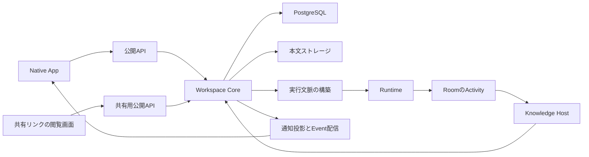
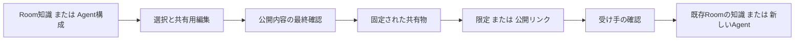
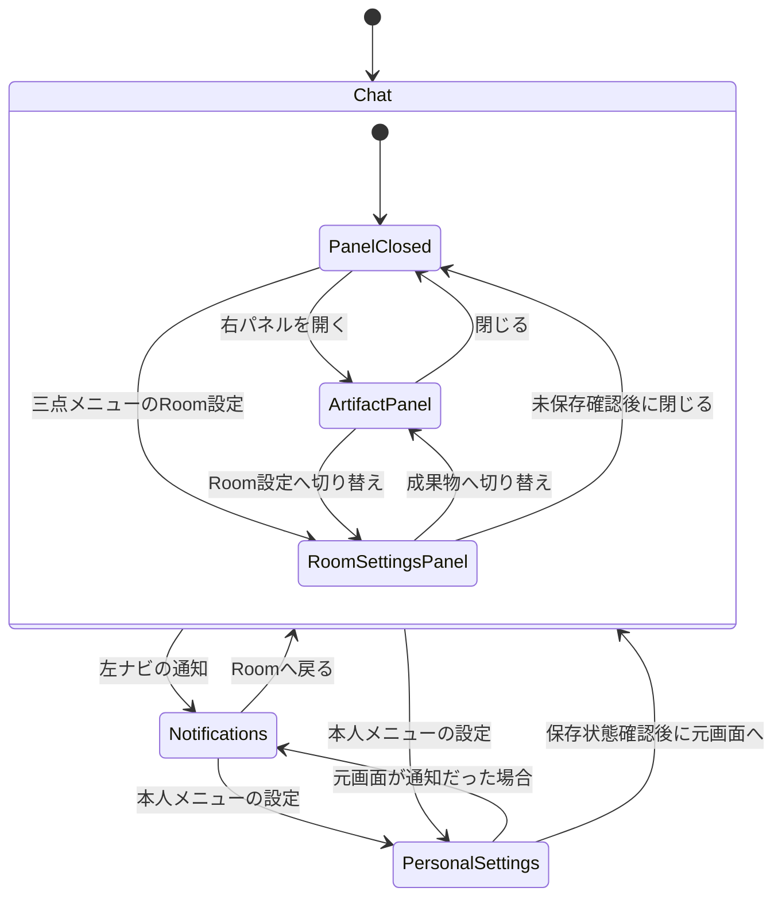

# Workspaceの文脈・通知・共有 基本設計

- 状態：2026-09-17の合意を具体化した実装前の設計。以下の追加構造・契約は未実装。
- 対象：[今回の要件定義書](../requirements/native-ui-room-agent-sharing-requirements.md)の全体構造、責務、認可、文脈の境界。
- 正本：[PRODUCT.md](../../PRODUCT.md)、[ARCHITECTURE.md](../../ARCHITECTURE.md)。
- 画面：[Native App](native-app.md)第11〜15章。保存：[データ設計](workspace-context-data.md)。操作：[API・処理設計](workspace-context-api.md)。

## 1. 設計書の役割と対象

この文書は「どの単位が何を所有し、誰が操作し、どの処理が責任を持つか」を決める。画面項目、物理項目、API入出力は上記の文書だけで定義する。同じ情報のコピーを複数文書へ置かず、要件IDと設計上の識別子で対応付ける。

既存の仕事・DM・既定Agentのルールは[RoomとAgentの共同作業](room-agent-work.md)を利用する。既定Agentは1体を維持する。Roomの参加Agent数をRoom／DMの種別判定に使わない。

## 2. 現行実装と変更点

2026-09-17のソース確認による一覧であり、実DB・実Clientの動作証拠ではない。

| 領域 | 確認した現行実装 | 今回の設計 |
| --- | --- | --- |
| UI | [NativeApp](../../apps/web/src/native-app/NativeApp.tsx)、[本人メニュー](../../apps/web/src/native-app/NativeProfileMenu.tsx)に既存の外枠・テーマ・Workspace選択がある | 外枠を維持し、切り替えを上部、テーマを本人設定へ移す |
| Room階層 | [RoomNavigator](../../apps/web/src/components/RoomNavigator.tsx)が親子関係を描画する | 選択と独立した展開状態を追加する |
| 検索 | [Knowledge tools](../../apps/web/src/native-app/use-native-knowledge-tools.ts)は選択Roomを必須として会話・Knowledge検索を呼ぶ | Workspace検索Queryを設け、Server側で複数Roomを認可して検索する |
| 記憶 | [Completion型](../../packages/workspace-server/src/workspace-completion-types.ts)はWorkspace／Roomスコープを持つ | KnowledgeのWorkspaceスコープを廃止し、Agentスコープを追加する |
| 公開契約 | [Domain API](../../packages/domain-api/src/index.ts)にQuery／Operationと入出力スキーマ、[HTTP接続](../../apps/server/src/workspace-server/domain-api-v1.ts)にv1の共通入口がある | 同じ契約登録・認可経路に検索、通知、共有を追加する |
| Account | [auth.ts](../../packages/workspace-server/src/auth.ts)は公開鍵からAccount IDを導出する | 限定共有の受信者照合にも同じ本人識別を使う |

## 3. 構成と責務

| 責務 | 担当すること |
| --- | --- |
| Client | 対象選択、表示、入力、確認、下書き保護。認可判定の正本を持たない |
| Core | 現在の権限、共有範囲、資源帰属、版、重複操作、状態遷移を検査する |
| Completion | 知識・Skillの本文、版、参照、固定、アーカイブを既存の保存契約で管理する |
| 共有処理 | 確認用コピー作成、共有物の発行・停止、取り込み受付、独立資源の作成を担う |
| 通知処理 | 保存済みの仕事・確認要求・招待から本人宛て通知を生成し、既読を保存する |
| Runtime | 認可済みの文脈を使って実行する。共有物の閲覧や取り込みでは起動しない |
| Knowledge Host | 対象RoomのActivityから同Roomの知識を生成する。Agent・本人・Workspaceを学習の保存先にしない |

## 4. 知識と設定の帰属

| 帰属先 | 内容 | 更新・参照ルール |
| --- | --- | --- |
| Room | 同Roomの知識、自動学習結果、Roomの作業設定 | 既存のRoom権限で確認・編集する。通常参照は既存の確定版選択を維持する |
| Agent | 手動設定した知識、選択したSkill、人格・指示 | Agent編集権限者が管理する。Agentを使える利用者に対して再利用可能な専門知識として扱う |
| 本人 | 名前、回答言語、個人指示 | 本人だけが編集する。Room共通設定へ転記せず、依頼した本人の実行に適用する |
| Workspace | 所有、メンバー、接続、既存policy、学習の既定値 | 共通知識庫を持たない。policyやSkillなど既存の別種別を廃止対象へ含めない |

Agentの知識を、本人だけに秘密の情報を保存する場所として扱わない。人がAgent詳細を閲覧できる場合はそのAgent知識も閲覧でき、Runtimeは対象RoomでそのAgentを実行できるときだけ利用できる。Workspace所属だけで非公開Roomの知識をAgentへ付け替える権限は生じない。

実行文脈は、Coreの権限・policyを先に適用し、対象Roomの確定知識、実行Agentの確定知識・Skill、依頼者の個人指示、現在の依頼をそれぞれ出所付きで組み立てる。知識本文を権限の付与や設定変更の命令として扱わない。出力言語は依頼内の明示指定を優先し、指定がなければ本人設定、既存のWorkspace既定値の順に解決する。管理policyに反する操作は、いずれの指示からも許可しない。

## 5. 検索・通知の境界

検索は現在選択中のWorkspace内で行う。Room名、会話、Room知識を対象にし、Agent知識の横断検索や全Server横断検索を追加しない。対象Roomの認可を検索・抜粋・件数計算より先に適用する。

通知一覧も現在のWorkspace内に限定する。上部のWorkspace切り替えボタンは、他Workspaceに未読がある場合に印を表示し、切り替え一覧の各Workspaceに件数を示す。別Workspaceの通知本文は取得・混在させず、概要件数だけを取得する。クリック後は通常の再認可を経て対象Workspaceの通知一覧を開く。

未参加Workspaceへの本人宛て招待は、通知画面の独立した「招待」枠に表示する。これはWorkspace横断の仕事通知一覧ではなく、Account宛て招待の入口である。

通知は依頼完了／失敗、承認待ち、入力待ち、招待の5種類とする。未読件数は、現在も閲覧可能な未読通知の件数であり、全メッセージ数やBuzzのメンション件数をそのまま転用しない。取得失敗・未取得は0件と区別する。

## 6. 共有のモデル

### 6.1 共有元とコピー

共有物は元データとは別の固定コピーである。共有用の編集、共有後の元データ変更、取り込み後の編集を相互に同期しない。共有対象は確認画面の許可項目だけとし、履歴、根拠資料、権限、認証情報、元の内部パスを収集して追加しない。

Room管理者がRoom知識を共有する。Agent編集・管理権限者がAgent構成と選択したSkill・Agent知識を共有する。限定共有の指定相手には共有物だけを読む権限を与え、元RoomやWorkspaceのMembershipを作成しない。

公開リンクは未ログインでも共有物を閲覧できる。限定リンクは署名等の既存の本人確認とAccount IDの照合を必須とする。いずれも取り込み先ではログインと作成・管理権限が必要である。

### 6.2 状態と停止

| 状態 | 閲覧 | 新しい取り込み受付 | 管理者操作 |
| --- | --- | --- | --- |
| draft | 作成者の確認画面だけ | 不可 | 編集、確認、発行、破棄 |
| active | 公開範囲に従う | 可 | リンク確認、停止 |
| revoked | 不可 | 不可 | 停止済みであることを確認 |

発行後の本文・公開範囲・受信者は固定する。変更する場合は共有用コピーから再確認して新しいリンクを発行し、旧リンクの停止を独立して行う。自動期限は設けず、停止まで有効とする。元の知識の更新・削除は発行済みコピーを変更しない。共有元RoomまたはAgent自体を削除する操作では、その対象の有効リンクを同じ操作で停止する。取り込み済みコピーは削除しない。

取り込み受付と停止は共有元で直列化する。停止が先なら受付を拒否し、受付が先ならその操作の確定を許可する。停止前に受け付けた処理や取得済み内容を遠隔回収する保証はしない。取り込み済みコピーは停止後も残る。

## 7. 非機能・失敗時の共通方針

- 認可はHTTP入口、Core、DB制約／RLSの責務に分ける。匿名共有閲覧用の処理から通常のRoom検索へ到達させない。
- 変更は操作IDと要求内容のハッシュで再送を識別する。同じIDで内容が異なる場合は競合として拒否する。
- DBと本文ファイルの確定には既存のstaging・復旧方式を拡張して使う。本文確定前の共有物や取り込み資源を検索・実行に公開しない。
- 非同期応答はAccount、Server接続、Workspace、対象ID、画面世代で照合する。切り替え後の旧応答を捨てる。
- 設計上のページ件数・ポーリング間隔は動作方式の定数であり、合意していない性能SLAを意味しない。
- 共有、認可、再送、停止競合、他Workspaceの通知件数、旧メモリーの除去を重点検証する。検証項目は各詳細設計と要件定義書の受入条件に対応付ける。

## 8. 要件との対応と参考

| 要件群 | 設計の正本 |
| --- | --- |
| F-NAV、F-HEADER、F-SETTINGS | Native App第11〜15章 |
| F-SEARCH、F-NOTIFY | 本書第5章、API設計の検索・通知処理 |
| F-MEMORY、F-REMOVE | 本書第4章、データ設計の資源スコープと廃止対象 |
| F-SHARE、F-ROOM-SHARE、F-AGENT-SHARE | 本書第6章、データ設計の共有物、API設計の共有処理 |
| N、E、O | 本書第7章と各詳細設計の認可・復元・失敗処理 |

参考記事の[基本設計と詳細設計の分担](https://products.sint.co.jp/blog/write)、[画面・データ・権限・インターフェースの定義](https://www.dcr.co.jp/column/how-to-write/)を、既存文書を更新しながら具体化する構成に適用した。記事が4ファイルを要求しているわけではない。

通知の体験はBuzzの[コミュニティ別未読取得](https://github.com/block/buzz/blob/b36600fc440615e2565f94bffc800e0495180f6b/desktop/src/features/communities/useCommunityUnread.ts)と[切り替えバッジ](https://github.com/block/buzz/blob/b36600fc440615e2565f94bffc800e0495180f6b/desktop/src/features/sidebar/ui/CommunityRail.tsx)を参考にした。これは公開ソースの確認であり、Buzzの実機確認ではない。Samuraiの通知対象・権限は本書と要件定義書に従う。

## 9. 操作主体・権限と画面境界

### 9.1 認可の判定表

判定は現在有効なMembership・対象の状態・Workspace書き込み可能状態を使う。キャッシュされたrole表示だけで許可しない。下表の既存条件は[schema](../../packages/workspace-server/src/schema.ts)と[Store](../../packages/workspace-server/src/workspace-server-store.ts)の同じ判定を呼ぶ。

| 操作 | 必要条件 | 拒否時 |
| --- | --- | --- |
| 本人設定を編集 | 現在のログインAccountと保存先Account一致 | 別Accountの値を読まず保存しない |
| Workspaceを開く／検索する | そのServerで現在のWorkspace参加とRoom read | 対象外Roomを結果・親名・件数へ含めない |
| Room設定を読む | `samurai_can_room(workspace,room,'read')` | 内容を表示しない |
| Room名・参加・既定Agent・学習を変更 | `samurai_can_room(...,'manage')`とWorkspace writable | 読取表示または403。既存DM制約を維持 |
| Room資源を編集 | 既存Completionの人向け編集条件＋対象Roomの権限 | 共有できる権限と混同しない |
| Room知識を共有／取り込む | 共有元／取り込み先のRoom manageをそれぞれ独立判定 | 別Roomの管理権限で代用しない |
| Agentプロフィール／資源を読む | 同Workspaceの既存guest以上の参加とAgentの存在 | Workspaceが違うAgent IDで迂回しない |
| Agent作成・編集・共有 | 現行Agent管理と同じWorkspace admin条件、writable | 所有AgentやRoom管理という独自条件を加えない |
| Agent知識を実行に使う | 依頼者のRoom実行権限＋担当Agentの同Room実行許可 | Agentの知識閲覧だけでは実行を許可しない |
| draftを読む・編集・破棄 | 作成者本人かつ現在の共有元管理権限 | 他の管理者へ未発行本文を公開しない |
| 発行済み共有を管理・停止 | 現在の共有元管理権限 | 作成者だっただけでは停止を許可しない |
| 公開リンクを読む | active＋public | 元Roomへの閲覧権限を付与しない |
| 限定リンクを読む | active＋署名済みAccountが受信者集合に含まれる | 転送したリンクだけでは許可しない |
| 通知を読む・既読にする | 受信者本人。仕事通知は元Room readも必要 | 本人宛て招待にはWorkspace参加を要求しない |

Agent管理条件は現行実装の確認結果であり、新しい独自roleを導入する提案ではない。将来Agent管理権限を細分化するときも、この操作表とCoreを同時に変更する。

### 9.2 表示領域の責務

本人設定は全画面で左カテゴリ・右詳細、Room設定はチャット右側の専用パネルとする。右側は成果物とRoom設定のどちらか一つを表示する。本人設定へ移動してもRoom仕事・streamを停止しない。画面を隠すことと、状態や未保存入力を破棄することを分ける。

図のPanelClosed→ArtifactPanelは初回の場合。再表示は最後のパネル種別を復元する。本人設定からの復帰先はreturnContextに記録した一つで、利用者に二つの戻り先を選ばせない。画面遷移・カテゴリ・タブ切り替えの保存規則はNative App第12・13章を正本にする。

### 9.3 処理の責任と確定点

| 処理ID | 主担当 | 完了が確定する場所 |
| --- | --- | --- |
| P-PREFERENCES | Client Account設定ストア | 版照合付きローカルtransaction。Serverへの名前反映は別状態 |
| P-ROOM-SETTINGS | 既存Room／Completion／Learning Core | 認可・版を検査したDB commit |
| P-SEARCH | Context Query | 認可済み集合の検索結果。結果を開く時にも再認可 |
| P-NOTIFY | 状態遷移元Core＋通知投影 | 状態とoutboxのcommit、本人別通知のcommit。配信の到達とは分ける |
| P-PUBLISH | Share Core | 本文確定後のactive＋操作結果のDB commit |
| P-CLAIM／P-REVOKE | 共有元Share Core | 同じ共有行のlockとcommit順 |
| P-IMPORT | 取り込み先Share Core＋共通資源writer | 全資源・Agent・結果を一つのDB transactionでcommit |
| P-CONTEXT | 既存の実行文脈構築 | 認可したRoom・担当Agent・本人設定版を実行へ固定 |

UIの成功表示はこの確定点に合わせる。202受付、ファイルの一部保存、リンクのコピー成功を業務処理全体の成功と扱わない。

## 10. 要件・画面・処理・確認の対応

ここでの確認IDは実装後のテスト・実Client確認に付ける識別子であり、実施済みの結果ではない。範囲表記は両端を含む。画面の正本はNative App、処理はAPI設計、保存はデータ設計の各節である。

| 要件ID | 画面・処理の正本 | 確認IDと判定 |
| --- | --- | --- |
| F-NAV-01、F-NAV-04 | UI-01、NAV-01・02、対象guard | V-UI05。別Serverの同じWorkspace IDを混同しない |
| F-NAV-02、F-NAV-03 | NAV-03・04、階層生成規則 | A-01。開閉で選択が変わらず、非公開親と他人DMが見えない |
| F-SEARCH-01〜04 | UI-02、S-01〜05、P-SEARCH | V-P01・V-UI05。対象、整列、認可、cursor、応答世代 |
| F-NOTIFY-01〜03 | UI-03、N-01〜03、P-NOTIFY | V-P02。既読の永続化、5種別、対象への移動、承認との分離 |
| F-NOTIFY-04〜06 | N-04・05、Account通知Query | V-UI05・V-P02。未参加招待、未知kind、一部接続失敗、他Workspace概要 |
| F-HEADER-01 | HDR-01、R-M01・R-G01 | A-04。実際の人・Agent参加情報 |
| F-HEADER-02、F-HEADER-03 | HDR-02、R-G02、P-ROOM-SETTINGS | A-04。既定1体、次の依頼に適用、無効時の復旧 |
| F-HEADER-04 | 第13.1節、パネル状態図 | V-UI03。三点メニュー、左右開閉、成果物の保持 |
| F-SETTINGS-01 | UI-04、第12章、P-PREFERENCES | V-UI01・02・V-P07。全画面・項目・保存・復帰 |
| F-SETTINGS-02 | U-T01、既存テーマキー | V-UI01。3テーマ・即時反映・入力保持 |
| F-SETTINGS-03 | UI-05、第13章、P-ROOM-SETTINGS | V-UI03・04・V-D05。現在Roomと設定の継承 |
| F-MEMORY-01 | UI-06、R-K01・02、Completion操作 | V-UI04。本文・根拠・版・編集権限 |
| F-MEMORY-02 | UI-07、G-03・04、Agent資源 | V-D01・02。Agent帰属と手動更新 |
| F-MEMORY-03、F-MEMORY-04 | P-CONTEXT、データ第3・9章 | V-P07・A-11。Room学習と本人設定の分離 |
| F-REMOVE-01〜03 | API第6章、データ第10章 | V-D06・07・V-P08。旧入力・参照・復元の拒否と対象外保持 |
| F-SHARE-01〜03 | UI-08・10、SH-01〜06、P-PUBLISH | V-P03・06。選択内容、相手、禁止項目の非公開 |
| F-SHARE-04、F-SHARE-05 | UI-11、IM-01〜03、P-IMPORT | V-P05。明示取り込み・独立コピー・元権限非継承 |
| F-SHARE-06 | UI-09、SH-08、P-REVOKE | V-P04。停止と受付の順序、取り込み済みコピー保持 |
| F-SHARE-07 | P-PUBLISH・P-IMPORTの状態表 | V-D03・04・V-P05。二重作成・部分成功なし |
| F-ROOM-SHARE-01〜03 | Room manage、Manifest room_knowledge、既存Room指定 | V-UI06・V-D02・A-06。知識だけ・管理者だけ |
| F-AGENT-SHARE-01〜04 | Agent管理権限、Manifest agent、Agent一括作成 | V-UI06・V-P06・A-07。選択構成と受け手側接続 |
| N-01、N-02 | 第9.1節、データ第8章、共有HTTP | V-D02・V-P06。直接APIでも拒否し、禁止本文がない |
| N-03 | ファイル台帳、操作ID、版、最終transaction | V-D03・04・V-P03〜05 |
| N-04、N-05 | 対象guard、通知Queryとoutbox | V-UI05・V-P02 |
| N-06、N-07 | Native App第11〜15章 | V-UI01〜06。キーボード、3テーマ、幅変更、未保存保護 |
| N-08、N-09 | Page型、画面状態、エラー契約 | V-P01・V-UI05・07 |
| N-10、N-11 | API契約登録、Core分担、監査 | V-P02・06。未知種別と機密を含まない操作記録 |
| N-12 | 既存依頼・DM・成果物・bundleの回帰 | A-11・V-D07 |
| E-01〜03 | API第12.4・13章、P-IMPORT | V-P06。共通Core・Browser・別Server |
| E-04、E-05 | Account署名、招待の元API、Backend境界 | V-P02・06・07 |
| E-06、E-07 | outbox、ファイル台帳、既存保存基盤 | V-P02・V-D04 |
| O-01〜03 | データ第10章、廃止scopeのCore判定 | V-D06・07・V-P08 |
| O-04、O-05 | 全画面／パネル遷移と共通契約 | V-UI01〜07・A-11。既存資産保持、ダミーなし |

業務目的B-01〜06は、要件定義書の対応する業務フローと上記機能群で検証する。A-01〜11はそれぞれ上表または各詳細設計の確認IDに対応する。要件を減らして表の空欄を埋めることはしない。

## 11. 文書の粒度と変更判断

参考記事にある画面レイアウト・項目・イベント・処理・データ・権限の観点を本スプリントへ適用した。各画面の表示方式と保存単位は画面設計、型・認可・分岐・失敗はAPI設計、列・制約・保持・復旧はデータ設計を正本にする。同じ条件を複数文書へ再定義せず、IDと節参照で結び付ける。

実装者が決めてよいのは、既存規約に沿うローカル変数名、内部関数の分割、同じ結果を返す最適化など。公開範囲、画面遷移、保存単位、エラー時の動作、権限、コピーの意味は本書群に従う。利用者の判断が必要な変更と、既存コードへの接続方法の調整を区別する。後者は設計と差分を照合して解決し、利用者への個別質問へ戻さない。

今回の範囲にない予算・納期・OS／ブラウザー一覧・帳票、学習エンジンの再設計、Workspace記憶の引き継ぎは追加しない。実装開始前の設計書として、現行実装との未接続を実装済みとは表現しない。
