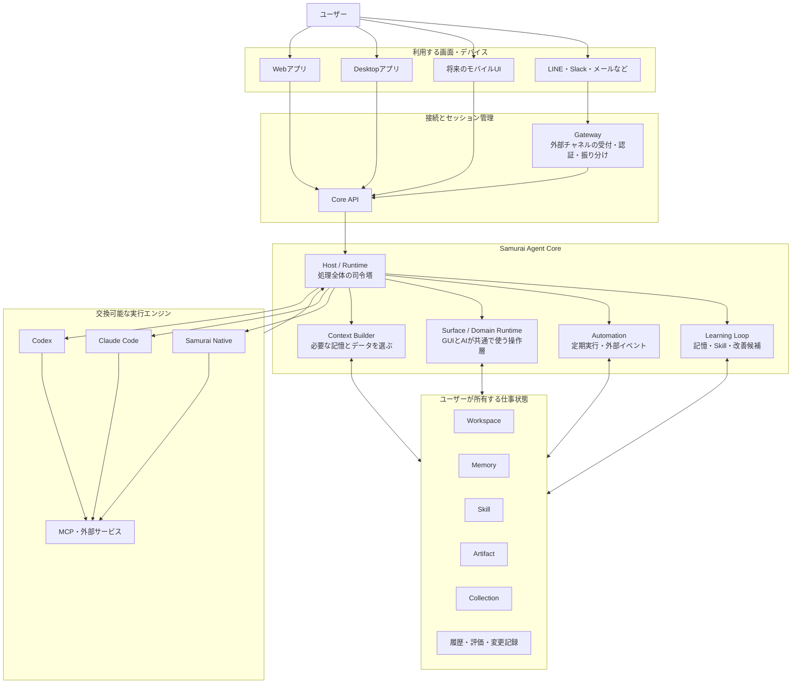
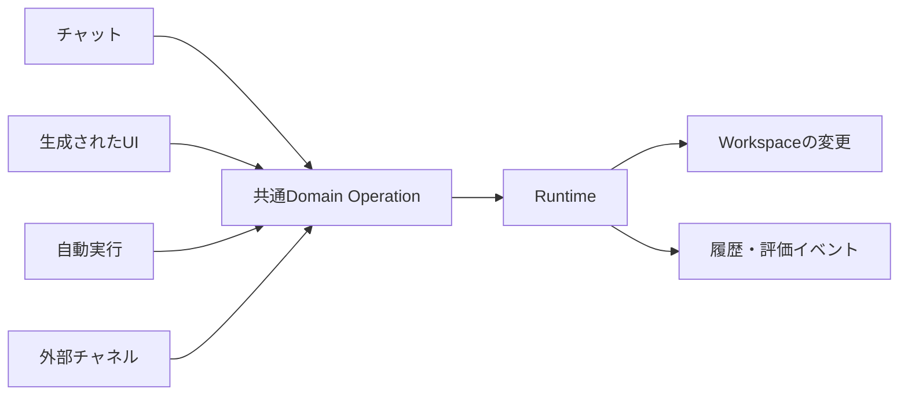
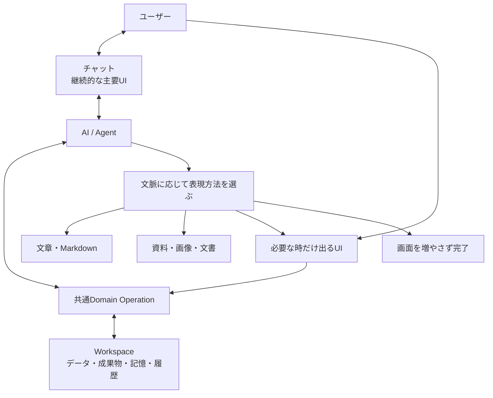
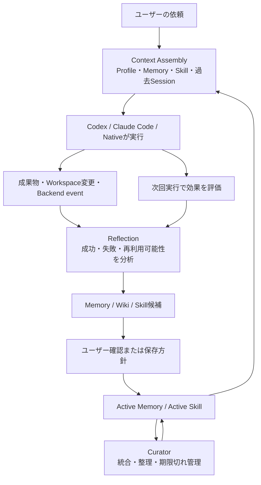

# Samurai Agent コアアーキテクチャ・Generative UI・学習ループ セッション記録

作成日: 2026-07-10

対象: 本セッションの実質3回分の対話

位置づけ: 現状整理、設計思想の確認、次のコア実装に向けた論点整理

---

## 0. この文書について

この文書は、本セッションで行った以下の3つの対話を、後から設計判断に利用できる形へ再構成したものである。

1. 現在の実装状況と、次に完成させたい学習ループについての確認
2. Samurai Agent全体のアーキテクチャと、今後の設計思想についての批判的レビュー
3. Generative User InterfaceとWorkspaceの位置づけに関する認識差の修正

セッション中の3番目のユーザー入力は誤送信だったため、この文書には含めていない。

逐語録ではなく、2回目の全体アーキテクチャ議論を中心に、1回目の学習ループ調査と、4回目のGenerative UIに関する重要な補足を統合している。ただし、ユーザー側の問題意識、アシスタント側の調査結果、会話中に使用した図と評価は、判断材料が欠けないように残している。

---

## 1. このセッションで到達した結論

Samurai Agentが目指すものは、単なるAIチャットでも、CodexやClaude CodeのGUIラッパーでも、AI版Word・Excel・Notionを並べたWorkspaceでもない。

目標は次のように整理できる。

> **会話を中心に、必要な画面だけが自然に現れ、すべての仕事状態が裏側のWorkspaceへ残り、使うほどユーザー専用に育つ個人AIアシスタント。**

この考え方を支える中心原則は、次の一文に集約できる。

> **ひとつの仕事状態、ひとつの操作体系、複数の表現方法、複数のAI実行エンジン。**

ここでの役割分担は以下である。

- Chat: ユーザーがAIへ意図を伝える、継続的な主要インターフェース
- Generative UI: 会話の文脈に応じて必要な時だけ現れる、返答・確認・操作の表現形式
- Workspace: 画面そのものではなく、仕事、データ、成果物、記憶、履歴を保持する永続的な状態基盤
- Runtime / Host: 文脈を組み立て、共通操作を実行し、BackendとWorkspaceを接続する司令塔
- Agent Backend: Codex、Claude Code、自前Agentなどの交換可能な実行担当
- Memory / Skill / Reflection: 利用履歴から次の実行を改善し、AIをユーザー専用に育てる学習基盤
- Gateway: Web以外のデバイスや外部チャネルを、同じSessionとCoreへ接続する受付
- Desktop: OS固有機能を加えるShellであり、プロダクトCoreそのものではない

重要な修正点は、次の通りである。

> **Workspaceは保存上の本体だが、見た目上の本体である必要はない。**

したがって、表面はChat-first、内部はWorkspace-backedという構造が、このセッションで確認された最終的な方向性である。

---

# Part I. 全体アーキテクチャと今後の設計思想

## 2. ユーザーが作りたいAIアシスタント

ユーザーが示した目標は、日常作業や特定業務を、従来のアプリ中心ではなくAI Nativeに進めるためのアシスタントである。

ユーザー側の主要な要望は次の通り。

- チャットを通じて、デバイスに依存せずどこからでも呼び出せる
- 必要なら、その場の意図に応じたUIがオンデマンドで生成される
- 人間とAIが、同じデータと同じ業務操作を利用できる
- 単なるチャットアプリに収まらず、汎用的で拡張可能である
- AIがユーザーを自然に学び、使うほど個人向けに最適化される
- CodexやClaude Codeなど、既存の強いAgentを実行エンジンとして利用する
- 学習、Generative UI、データ管理、履歴、外部接続をSamurai AgentのCoreとして所有する
- Gatewayを通じて複数デバイスや外部チャネルから利用できる
- Desktopなど各デバイスのアプリは、Coreの上に固有機能を加えるShellとして扱う

この理解は、現在のアーキテクチャの大枠と一致している。

ただし、一点だけ表現を補正する必要がある。

Samurai Agent Coreは「CodexやClaude Codeを使うための環境設定」だけではない。ユーザーの仕事の状態、記憶、成果物、操作、学習、継続性を所有する、常駐型の個人Agent基盤である。

---

## 3. 非エンジニア向けの役割説明

Samurai Agentを仕事場にたとえると、次のようになる。

| 要素 | たとえ | 実際の役割 |
| --- | --- | --- |
| Codex / Claude Code | 外部の専門スタッフ | 実際の調査、生成、コード作業などを担当する |
| Host / Runtime | 現場監督 | 誰に何を任せ、どの情報を渡し、結果をどこへ戻すか管理する |
| Workspace | 共有の仕事状態 | 書類、データ、成果物、記憶、履歴を継続的に保持する |
| Memory | ユーザー理解の短いノート | 好み、重要ルール、作業スタイルを覚える |
| Knowledge Wiki | 詳しい資料棚 | 調査、設計、プロジェクト知識、意思決定を保存する |
| Skill | 再利用できる手順書 | うまくできた仕事の進め方を次回も使えるようにする |
| Artifact | 完成物または途中成果 | 文書、表、グラフ、画像、PDF、資料など |
| Collection | 構造化された業務データ | 顧客、タスク、記事、予定などを共通形式で保持する |
| Generative UI | 必要時だけ出る作業面 | 表、フォーム、グラフ、プレビュー、比較画面など |
| Gateway | 外部受付 | LINE、Slack、メール、Webhookなどを同じCoreへ接続する |
| Desktop / Web / Mobile | 利用する窓口 | デバイスごとの見せ方や固有機能を提供する |

---

## 4. 全体アーキテクチャ



### 4.1 Client / Shell層

Web、Desktop、Mobileなど、ユーザーが実際に触る入口である。

DesktopはCoreではなく、次のようなOS固有機能を付加するShellとして扱う。

- ローカルファイル操作
- 通知
- ショートカット
- 常駐
- OS連携
- ローカルツールの実行

DesktopがなくてもCoreは成立し、Desktop固有機能もCoreの責務を迂回しないことが重要である。

### 4.2 Gateway / Access層

Gatewayは画面ではない。外部から来た要求を認証し、適切なユーザーとSessionへ届ける受付・交通整理である。

WebやDesktopと同じ「アプリ層」と考えるより、外部チャネル用の接続境界と考える方が正確である。

### 4.3 Core層

Coreは以下を所有する。

- Sessionの継続
- Workspace文脈の収集
- Active Memoryの検索
- Skillの選択
- Backendの選択と実行管理
- GUIとAIに共通するDomain Operation
- Backend eventの正規化
- Artifact、Collection、Memory、Skillへの結果反映
- Reflection、Curator、評価、Automation

### 4.4 Workspace / Data層

Workspaceは画面ではなく、人間とAIが共有する正準の仕事状態である。

外部Backendが変わっても、以下はSamurai Agent側に残る。

- ユーザーのMemory
- 再利用可能なSkill
- 成果物
- Collectionデータ
- Session履歴
- Backend runとevent
- Workspaceの変更履歴

### 4.5 Agent Backend層

Codex、Claude Code、自前Runtimeなどを、交換可能なBackend cassetteとして扱う。

Backendは仕事を実行するが、Workspace、Memory、Skill、GUIの正本は所有しない。

---

## 5. 人間とAIが同じ操作体系を使う

Samurai AgentがAI Nativeであるためには、入口ごとに別の処理を作らず、すべてを共通の業務操作へ変換する必要がある。



たとえば、人間が画面上で顧客を追加する場合も、AIが会話から顧客を追加する場合も、同じ`createRecord`相当の操作を通す。

```text
人間：生成された表やフォームから「顧客を追加」
  ↓
共通のcreateRecord操作
  ↓
Collectionへ保存

AI：「田中さんを顧客一覧へ追加します」
  ↓
同じcreateRecord操作
  ↓
同じCollectionへ保存
```

この構造によって、Web、Desktop、Mobile、チャット、Automationで挙動が分裂するのを防げる。

---

## 6. 現在の実装状況

### 6.1 すでに強い部分

#### Agent Backend cassette

- Codex、Claude Code、Native Backendを差し替え可能にするRegistryと共通境界がある
- 設定済みならCodex、次にClaude Code、最後にNativeを選ぶ基本経路がある
- Backend固有のeventを共通形式へ正規化するBridgeがある
- start、resume、cancel、streamといった実行ライフサイクルの土台がある

#### Workspace Store

- filesystemとSQLiteの責務を分ける方針がある
- Memory、Skill、Wikiなど、人間が読む本文はファイルとして保持する
- Session、run、event、index、queueなど、一貫性が必要な状態はSQLiteで扱う
- Artifact、Collection、Backend run、Workspace changeの保存構造がある

#### 共通操作とSurface Protocol

- `SurfaceOperation`
- `SurfaceRenderSpec`
- `CollectionSchema`
- Runtime operation

という共通の継ぎ目がある。

GUI操作とLLM操作を、同じ`SurfaceOperation -> Runtime -> Store`へ寄せられる土台は、すでに実装されている。

#### Generative UIの部品

現時点で扱える主な表現形式は次の通り。

- chat
- status timeline
- form
- table
- chart
- artifact
- collection
- collection record
- memory
- skill
- knowledge wiki
- gateway
- run history
- custom view

Rendererの対応能力を確認し、対応できない場合にFallbackする契約もある。

#### 学習ループの部品

- Session transcriptの保存
- Memory suggestion
- Skill candidate
- Knowledge Wiki proposal
- Reflection run
- Curator
- 評価情報
- 重複候補の整理
- Active Memory retrieval
- Skill selection

など、Hermes的ループを構成する主要部品は存在する。

#### GatewayとDesktop

- Gatewayは外部入力、identity、Session routingをCoreへ渡す境界として設計されている
- Electron DesktopはWeb/Coreを包むShellとして分離されている
- DesktopがプロダクトCoreを所有しないため、将来の複数デバイス利用を阻害しにくい

---

### 6.2 まだ弱い部分

#### UI上の完成体験

- Memory、Skill、Reflection、Curator、評価、Automationの多くがユーザーから見えにくい
- Collection一覧や専用画面が強くなると、従来アプリ型Workspaceへ寄る危険がある
- Generative UIはRendererと構造化データの基盤が中心で、文脈から自然に選ばれる体験はまだ薄い

#### 共通Domain APIの一貫性

- Runtimeを通る処理
- Server固有の処理
- Frontendだけの処理
- Backend固有の処理

が一部混在している。

このまま機能を増やすと、「GUIではできるがAIからできない」「Desktopだけ挙動が違う」といったズレが生まれる可能性がある。

#### 学習ループの閉じ方

- 記録や候補生成はあるが、学習内容が次の実行を改善したか評価する閉ループが弱い
- Skillの段階的な本文開示が十分でなく、現状はcatalog相当へ寄っている
- Session検索はSQLiteのLIKEが中心で、設計上想定するFTS系検索に達していない
- Capture設定とReflectionの実動作が完全にはつながっていない
- Schedulerは動くが、標準の学習Jobが常設されていない
- 評価処理がすべてのReflectionへ自動的に組み込まれていない
- ユーザーProfileの分離と、個人理解の正準モデルが未完成

#### デバイス非依存の運用

- 接続構造はあるが、Coreをどこで常時動かすかが未確定
- ローカルWorkspaceとクラウドの同期方針が未完成
- Macがスリープ中の場合など、実際に「どこからでも使える」運用条件が固まっていない
- 認証済み端末、競合、オフライン、秘密情報の扱いを完成条件として定義する必要がある

#### 実装の物理的な集中

論理上は責務分離されているが、Runtime、Server、Workspace Store、Webの主要ファイルが大きい。

今後は同一アプリ内でも、以下を明確なモジュールへ分ける必要がある。

- Backend Orchestrator
- Context Service
- Surface / Domain Operation Engine
- Workspace Service
- Learning Service
- Automation Service
- Gateway Service
- Evaluation / Observability

---

## 7. 現在の評価

このセッション時点の概算評価であり、厳密なベンチマークではない。

| 評価対象 | 概算 | 判断 |
| --- | ---: | --- |
| アーキテクチャの方向性 | 85 / 100 | 参照元ごとの責務分離とCoreの考え方は強い |
| Core Backendの実装 | 65 / 100 | 主要部品はあるが、責務の集中と未接続部分が残る |
| Generative UIの基盤 | 60 / 100 | Protocol、Renderer、Collectionはあるが、自然な対話体験は発展途上 |
| 学習ループ | 約47 / 100 | 記録・候補化はあるが、再利用・評価・改善の閉ループが弱い |
| ユーザーから見える完成体験 | 40〜50 / 100 | Coreの独自性がUI上で十分に感じられない |
| 総合的な現在地 | 55〜60 / 100 | 作り直しではなく、Coreの主要ループを閉じる段階 |

機能別に見ると以下の通り。

| 目的 | 現状 | 評価 |
| --- | --- | --- |
| CodexやClaude Codeを交換して使う | Backend cassetteとして成立 | 強い |
| ユーザーのデータを外部Agentから独立して保持する | Workspace Storeが所有 | 強い |
| GUIとAIが同じ操作を使う | Runtime操作の基盤あり、一部に迂回経路 | 中〜強 |
| 必要に応じてUIを出す | RendererとCollectionの基盤あり | 中 |
| どの端末からでも利用する | GatewayとSession基盤あり、常時稼働と同期は未完成 | 中 |
| 使うほどユーザー専用に育つ | Memory、Skill、評価の部品あり、閉ループ未完成 | 弱〜中 |
| AIと人間が同じ仕事状態を共有する | 設計上は明確、体験は発展途上 | 中 |
| Desktop固有機能を追加する | Shell分離は正しい | 中 |
| 自動実行・外部イベント対応 | 基盤はあるが本格運用はこれから | 中 |
| 学習内容をユーザーが管理する | 専用体験が不足 | 弱 |

---

## 8. 現在の設計で優れている点

### 8.1 特定の外部Agentへロックインしない

CodexやClaude Codeは、Samurai Agentそのものではなく交換可能な実行担当である。

将来、仕事ごとに次のような使い分けができる。

- Codexが得意な仕事はCodex
- Claude Codeが得意な仕事はClaude Code
- 単純処理は軽量なモデル
- 秘密性が高い処理はローカルモデル

外部サービスが変わっても、ユーザーのWorkspace、Memory、Skill、Artifactは残る。

### 8.2 Workspaceが外部Agentから独立している

AIの価値を会話履歴だけに閉じず、成果物、データ、記憶、手順をユーザー所有の状態として残す構造は強い。

### 8.3 人間とAIが共通操作を使える

AI Nativeなプロダクトでは、AIが文章を返すだけでなく、人間が触るのと同じ業務状態を安全に変更できる必要がある。

現在の共通Runtime operationは、その正しい土台になっている。

### 8.4 Generative UIを無制限のコード生成にしていない

AIに毎回自由なHTMLやJavaScriptを書かせるのではなく、Schema、Renderer、Operationを組み合わせる方向は妥当である。

これにより次を守りやすい。

- 再現性
- データ操作の一貫性
- セキュリティ
- 複数デバイス対応
- 履歴と復元性
- 表示できない端末でのFallback

### 8.5 DesktopをCoreから分離している

Desktopを単なるWebラッパーにせず、OS固有能力を付加するShellとしながら、Coreとユーザーデータを独占させない方向は正しい。

---

## 9. 批判的に見た全体課題

### 9.1 Coreの中心概念が画面上で伝わりにくい

設計上の独自性は、Workspace、Memory、Skill、学習、共通操作にある。しかし画面上では高機能チャットに見える可能性がある。

ただし、この課題への解決策はWorkspaceを常時主画面にすることではない。会話の中で、何を学び、何を保存し、どの作業状態を変更したかが自然に分かるようにする必要がある。

### 9.2 Hostが巨大な司令塔になる危険

Context、Backend routing、Learning、Surface、Automation、GatewayをHostへ集めすぎると、変更の影響範囲が大きくなる。

外部からは一つのCoreに見えても、内部責務は分離する必要がある。

### 9.3 Gatewayをプロダクトの中心にしすぎない

Gatewayは重要だが、Coreの意味やWorkspace操作を所有しない。あくまで外部入口とSession routingの境界である。

### 9.4 Backendを「Agent本人」にしない

CodexやClaude Codeは能力のある実行担当だが、ユーザーとの関係、記憶、継続性、仕事状態を所有する本人ではない。

Samurai Agentの人格と継続性はCore側に残す必要がある。

### 9.5 セキュリティとデータ所有モデルを完成条件に含める

個人AIアシスタントは、一般的なチャットより多くの情報と操作権限を持つ。

次をCore完成の一部として明文化する必要がある。

- どのデータがローカルにあるか
- 何が外部AIへ送られるか
- Backendごとのアクセス可能範囲
- Gateway経由の端末認証
- Secretの扱い
- 削除、バックアップ、復元
- 複数端末の競合

---

# Part II. Generative User InterfaceとWorkspaceの再整理

## 10. ユーザーが示した違和感

ユーザーは、前回のレビューに対して次の重要な修正を提示した。

- 「Workspaceが本体」は設計上の状態管理としては理解できる
- しかし、ユーザーが最初からWorkspaceを主画面として操作する必要はない
- メインUIはChatが前面にある方が自然である
- Workspaceは、必要になった時に見た目として自然に湧き上がるものにしたい
- AI時代に、WordやExcelのような固有アプリの複雑な操作を再学習させるのはナンセンスではないか
- Generative UIは独立アプリではなく、会話における返答や表現方法の一つである
- Markdownを返すことと、表やフォームなどのUIを返すことは地続きである
- UIが不要なら、本当は出さなくてもよい
- 必要なUIも、見る、比べる、選ぶ、直すための最小限でよい
- CollectionやWorkspaceアプリを中心とするMulmoClaudeの体験を、そのまま完成形にはしたくない

この指摘によって、前回の「Workspaceをもっと主画面に出すべき」という評価は修正された。

---

## 11. 修正後の正しい関係



### 11.1 Chatは単なる入口ではない

Chatは、初回命令を送るだけの入口ではなく、ユーザーとAIが継続的に意図をすり合わせる主要インターフェースである。

### 11.2 Workspaceは状態の本体

Workspaceは常に表示されるデスクトップやアプリ一覧ではない。

画面を閉じても次が残るための基盤である。

- 途中の仕事
- 作成した資料
- Collectionデータ
- ユーザーのMemory
- 再利用するSkill
- 実行履歴
- 変更履歴

### 11.3 Generative UIは返答形式の一つ

Generative UIは、独立したアプリを生成する大機能ではない。

AIが文脈に応じて選ぶ、次のような表現方法の一つである。

- 文章
- Markdown
- 表
- グラフ
- フォーム
- 比較画面
- スライドプレビュー
- 並べ替え可能なアウトライン
- 確認・修正画面
- UIを出さずに完了通知だけ

「生成」とは、必ずしもReactやHTMLを毎回書くことではない。Schemaと既存Rendererを組み合わせ、現在の意図とデバイスに合うSurfaceを構成することもGenerative UIである。

---

## 12. 従来アプリ中心とSamurai Agent型の違い

| 従来アプリ中心 | Samurai Agentが目指す方向 |
| --- | --- |
| アプリを選んで開く | 意図を言葉で伝える |
| 固有UIを覚える | AIが作業方法を理解する |
| 人間が細かい操作を積み重ねる | AIが大部分を実行する |
| 常設の複雑な画面 | 必要な時だけ最小限のUI |
| アプリごとに異なるデータ操作 | 共通Domain Operation |
| UIが仕事状態の中心 | Workspaceの状態が中心 |
| デバイスごとに操作性が変わる | 同じ状態を端末ごとに適切に表現する |

Samurai Agentの目標は、「従来アプリをAI Native化してWorkspaceへ並べること」ではない。

> **アプリを選び、固有操作を覚える世界から、意図を伝えると必要な操作面だけが現れる世界へ移行すること。**

---

## 13. PowerPoint作成の例

### 従来型

```text
PowerPointを開く
↓
テンプレートを選ぶ
↓
スライドを追加する
↓
レイアウトを選ぶ
↓
文章を入力する
↓
画像やグラフを配置する
↓
フォントや位置を調整する
```

### Samurai Agent型

```text
ユーザー：
この調査結果を、経営会議向けの10枚の資料にして
↓
AIが構成、文章、図表を生成
↓
スライドプレビューが会話内に現れる
↓
ユーザー：
3枚目と4枚目を入れ替えて。売上推移をもっと強調して
↓
AIが共通の資料操作APIを使って変更
↓
更新されたプレビューを表示
↓
PowerPointまたはPDFとして出力
```

必要なのはPowerPointの全操作を再実装することではない。

ユーザーが次を行うための最小限のUIだけでよい。

- 全体を見る
- 順序を確認する
- 一部を直接選ぶ
- 間違いを直す
- 最終結果を確認する

---

## 14. UIを出す判断基準

ユーザーの「UIはほとんど不要なのではないか」という方向性は正しい。

ただし、より厳密には次のように表現できる。

> **人間が操作方法を覚えるための固定UIは大幅に不要になる。一方、見る・比べる・選ぶ・直すためのUIは残る。**

自然言語よりUIが強い代表例。

- 多数の候補を比較する
- 画像を見比べる
- スライドの順番を入れ替える
- カレンダー上で空き時間を見る
- グラフの異常値を確認する
- 大量データから複数項目を選ぶ
- AIが行った変更を確認する
- 影響が大きい処理を最終確認する
- 文章や資料の特定箇所を直接修正する

判断原則は次の通り。

> 話した方が速ければ会話だけ。<br>
> 見た方が速ければUIを出す。<br>
> 触った方が速ければ操作可能にする。<br>
> 必要がなくなれば閉じる。

---

## 15. UIは一時的、状態は永続的

Generative UIそのものを正本にしてはいけない。

```text
正本：顧客データ、タスク、資料構造、Artifact、Memory、Skill
表示：表、カード、グラフ、フォーム、プレビュー
```

同じ状態でも、利用環境に応じて表現を変えられる。

- Desktopでは大きな表
- Mobileではカード一覧
- 音声では重要な3件を読み上げる
- チャットでは短い要約と必要な操作だけ出す

UIを閉じても状態はWorkspaceに残る。

後から「昨日の営業候補をもう一度見せて」と言えば、その時のデバイスや目的に適したUIとして再構成できる。

---

## 16. Collectionの再定義

Collectionを、Notionデータベースのような独立アプリとして見せる必要はない。

Collectionの本質は次の通り。

> **AIと人間が共有する構造化データであり、アプリそのものではない。**

たとえば「営業先候補」というCollectionが存在しても、ユーザーは毎回営業管理アプリを開かなくてよい。

```text
ユーザー：
先週話した会社の中から、今週連絡すべきところを出して

AI：
5社あります。重要度と最終連絡日で並べました。
```

必要なら、その会話内に一時的な表を出す。

| 会社 | 優先度 | 最終連絡 | 次の行動 |
| --- | ---: | ---: | --- |
| A社 | 高 | 7日前 | 提案書送付 |
| B社 | 高 | 12日前 | 日程確認 |
| C社 | 中 | 5日前 | 資料共有 |

裏側ではCollectionを更新するが、表面では「会話に必要だから表が現れた」だけでよい。

Collection一覧や専用管理画面を残す場合も、検索、管理、復旧、開発者向け確認などの補助面に留め、主要体験にしない。

---

## 17. MulmoClaudeから継承するもの・しないもの

MulmoClaudeは完成形をそのまま模倣する対象ではなく、構造上の参照元として利用する。

### 継承するもの

- Agent実行とGUIを分離するHost構造
- AIの成果物を会話だけで消費せず保存する考え方
- ArtifactとCollectionを構造化して扱う仕組み
- 人間とAIが同じデータへアクセスする仕組み
- UIを構造化された定義から描画する仕組み
- PluginとRendererによる拡張構造
- 生成されたUIを再表示できる仕組み

### 継承しなくてよいもの

- Workspaceを常に主画面として見せること
- Workspace内に多数のアプリを並べること
- Collectionを独立した業務アプリとして見せること
- Word、Excel、Notion、Trelloのような既存アプリを再現すること
- ユーザーにアプリ固有の操作方法を覚えさせること
- Generative UIを大げさな「アプリ生成機能」として扱うこと

設計判断としては、次の表現が適切である。

> **MulmoClaudeのHost、データ構造、Surfaceの仕組みは参照するが、MulmoClaudeのアプリ中心UIを完成形にはしない。**

---

## 18. 現在の正本と実装にあるズレ

`WEB_UI_DESIGN.md`はすでに以下を明記している。

- Chat-first
- Workspace on demand
- 最初に見えるのは静かなチャット画面
- ArtifactやWorkspaceは会話から自然に出す
- Workspace Peekは必要時だけ開く
- 常時2グリッドを主役にしない

一方、`ARCHITECTURE.md`と`PRINCIPLES.md`には以下の表現が残っている。

- GUI-first Personal Agent Workspace
- GUIが主画面
- Chatは入口、Workspaceが本体
- MulmoClaudeを体験とWorkspace構造の中心として参照する

これらはデータ所有の説明としては正しいが、UI上もWorkspaceを常時主役にするように読める。

実装にも両方の方向が混ざっている。

| 現在の要素 | 今回整理した方向との関係 |
| --- | --- |
| Chat-firstなWeb Shell | 一致 |
| Workspace on demand | 一致 |
| 会話からArtifactを出す | 一致 |
| `SurfaceRenderSpec`で表現を選ぶ | 一致 |
| GUIとAIがRuntime操作を共有する | 一致 |
| Collectionを裏側の構造化データとして使う | 一致 |
| Collection一覧ページ | 補助管理ならよい。主役にするとズレる |
| `openCollectionApp`という扱い | アプリ中心思想へ寄る危険がある |
| Calendar、Kanban、Tableを常設アプリ化する | MulmoClaude寄りになりやすい |
| Workspace Canvasで小さなアプリを作る | 補助手段ならよい。完成目標にするとズレる |

Coreの基礎構造を捨てる必要はない。修正すべきなのは、主に設計上の主従関係と説明である。

---

## 19. Generative UIの設計原則

今後は次を原則として固定する。

1. Chatを継続的な主要インターフェースとする
2. Workspaceを主要な永続状態基盤とする
3. UIは会話の文脈から必要時にだけ出す
4. UIが不要なら生成しない
5. UIより文章が速ければ文章を使う
6. 比較、選択、直接修正が必要な時だけ操作UIを出す
7. UI自体ではなく、その裏側のDomain Stateを正本にする
8. Collectionをアプリではなく構造化データとして扱う
9. Artifactをアプリではなく成果物として扱う
10. Workspace Canvasを常設のデスクトップではなく、一時的な展開面として扱う
11. 人間とAIの操作を同じDomain Operationへ通す
12. Deviceごとに同じ状態を異なるSurfaceで表現できるようにする
13. 固定UIは設定、履歴、Memory管理、Automation管理、復旧などに限定する
14. 自由なコード生成より、Schema、Renderer、Operationの合成を優先する

---

# Part III. 次のコア実装としての学習ループ

## 20. 次の実装テーマ

Desktop/Electronは、軽く立ち上げて機能する段階まで実装されたため、いったん末端のShell作業として区切る。

次はCoreへ戻り、Hermes Agentを参照した学習ループを完成させる。

ユーザーが示した目標は次の通り。

- CodexやClaude Codeによる既存Agent loopとの接続状況を確認する
- 現在のMemory、Skill、Reflection、Curator、評価の実装を把握する
- Hermes級の完成形との差分を、設計思想とアーキテクチャから見直す
- 使うほどユーザー専用に改善される閉ループを完成させる
- この実装をもってAgent Coreの主要実装を一度完成させる

---

## 21. 学習ループの完成形



学習ループの本質は「保存すること」ではない。

> **過去から得た理解や手順が次の実行で実際に使われ、その結果が良くなったかを評価し、さらに改善すること。**

---

## 22. 学習対象を混ぜない

| 種類 | 保存する内容 | 次回の使い方 |
| --- | --- | --- |
| Profile | ユーザーの基本的な役割、環境、長期傾向 | 全体的な応答と作業方針の基礎にする |
| Memory | 好み、重要ルール、短い教訓 | 関連する実行へ短く注入する |
| Knowledge Wiki | 調査、設計、意思決定、濃い知識 | 根拠やプロジェクト知識として検索する |
| Skill | 再利用可能な作業手順 | 次回の実行計画やTool利用に使う |
| Session Search | 過去の会話と作業履歴 | 必要な過去文脈を検索する |
| Evaluation | 何が成功・失敗したか | MemoryやSkillの有効性を測る |

Memoryへ何でも詰め込むと、必要な情報が見つからなくなり、誤った個人理解が毎回混ざる。

Profile、Memory、Knowledge Wiki、Skill、Session Search、Evaluationは、保存目的と呼び出し条件を分ける必要がある。

---

## 23. 現在と完成形の差分

### 現在できていること

- SessionとBackend runを記録できる
- Reflectionの材料となるtranscript、Artifact、eventが保存される
- Memory suggestionを作れる
- Skill candidateを作れる
- Wiki proposalを作れる
- accepted / active / archivedなどの状態を持てる
- ContextへMemoryとSkillを渡す経路がある
- Curatorと評価の部品がある

### まだ足りないこと

- 何を学習すべきかの判定品質
- ユーザーの明示的な修正を強い学習信号として扱うこと
- 成功したSkillを次回確実に選ぶこと
- Skill本文を必要な段階だけ開示すること
- MemoryとSkillが実際に使われたか追跡すること
- 学習を使った実行と使わなかった実行を比較すること
- 誤った学習を弱める、修正する、無効化すること
- 類似MemoryとSkillの統合
- 古くなった内容の整理
- User ProfileとWorkspace固有知識の分離
- 学習内容を会話内で自然に確認・訂正するUI
- 自動ReflectionとCuratorの標準スケジュール
- FTS系Session Search

---

## 24. 学習ループで特に重要な閉ループ

### 24.1 Capture

実行後に、何を記憶し、何をSkill化すべきか候補化する。

### 24.2 Accept / Correct

自動保存だけにせず、保存方針に応じてユーザーが確認、修正、却下できる。

### 24.3 Retrieve

次の依頼に関係するMemory、Wiki、Skillだけを選ぶ。

### 24.4 Apply

選ばれたMemoryとSkillが、実際のBackend実行へ渡される。

### 24.5 Observe

どのMemoryとSkillが使われ、何が起きたか記録する。

### 24.6 Evaluate

成果物、ユーザー修正、再実行、エラーなどから、役に立ったか判定する。

### 24.7 Curate

有効な内容を強め、重複、矛盾、古い内容を統合・整理する。

この7段階が一周して初めて、単なる記録機能ではなく「育つAI」になる。

---

## 25. 次のブランチで実装すべき順序

このセッションではまだmainブランチ上であり、修正には着手しない。

次のブランチでは、いきなり高度な自動学習を追加するのではなく、既存部品を一本の閉ループとして接続することを優先する。

### Phase 1. 学習契約を固定する

- Profile、Memory、Wiki、Skill、Session Search、Evaluationの責務を固定する
- 学習候補、採用、利用、評価、整理の状態遷移を定義する
- Backendへ渡したMemory / Skillの参照IDをrunに記録する
- ユーザー修正を学習信号として扱う契約を定義する

### Phase 2. Context retrievalを完成させる

- Session SearchをFTS系へ寄せる
- Profile、Memory、Wiki、Skillを別々に検索・選択する
- Skillをcatalog、body、supporting filesの段階で開示する
- Contextへ何を渡したか追跡可能にする

### Phase 3. Reflectionを実行ループへ接続する

- 成功、失敗、ユーザー修正、再実行をReflection材料にする
- Capture設定をReflectionの動作へ接続する
- Memory、Wiki、Skill候補の根拠とsource referenceを残す
- 標準Reflection jobをSchedulerへ接続する

### Phase 4. Evaluationを閉じる

- 学習内容が使われたrunを記録する
- 成果物の品質、エラー、ユーザー修正量、再実行を評価信号にする
- 良いMemory / Skillを強化し、悪いものを弱める
- 学習前後の改善を確認できるようにする

### Phase 5. Curatorを完成させる

- 重複統合
- 矛盾検出
- 古い内容のarchive候補化
- Workspace固有知識と長期Profileの整理
- 自動実行しすぎず、ユーザーが理解できる変更として見せる

### Phase 6. Chat-firstな学習UXを作る

- 学習候補を常設ダッシュボードの主役にしない
- 会話の流れで「今回これを学びました」と短く示す
- 必要な時だけ詳細、根拠、編集、却下を開く
- Memory、Skill、Wikiの管理画面は検索、監査、修正の補助面として残す

---

## 26. 学習ループとGenerative UIの接続

Generative UIと学習ループは別々の機能ではない。

AIが学んだ内容をユーザーが理解し、訂正する場面こそ、オンデマンドUIが有効である。

例。

```text
AI：
今回の作業から「資料は最初に結論を置く」という好みを記憶候補にしました。

[短いMemory候補カード]
内容: プレゼン資料は結論を先に置く
適用範囲: プレゼン資料

ユーザー：
社内向け資料だけにして
```

ここで人間の修正は、共通Domain Operationを通じてMemory候補へ反映される。

同様にSkill候補も、会話内で短い要約だけ出し、必要な時だけ手順全体を開けばよい。

つまり、学習機能のUIもWorkspace常設アプリにする必要はない。

---

# Part IV. 今後の判断基準

## 27. 維持する設計

- Agent Backend cassette
- Backend eventの正規化
- Workspace側でMemory、Skill、Artifactを所有する構造
- filesystemとSQLiteの正本分離
- SurfaceOperation、SurfaceRenderSpec、CollectionSchema
- GUIとAIを同じRuntime operationへ寄せる構造
- Gatewayを外部入口に限定する構造
- DesktopをCoreから分離する構造
- Schema、Renderer、Operationを使う制約されたGenerative UI

---

## 28. 見直す設計表現

現在の表現。

> GUI-first Personal Agent Workspace
>
> Chatは入口、Workspaceが本体

今回の議論を反映した、より正確な説明。

> **Chat-first Personal Agent Interface**
>
> **Workspace-backed, UI on demand**

日本語では次のように説明できる。

> **会話を中心に、必要な画面だけが自然に現れ、すべての仕事状態が裏側のWorkspaceに残る個人AIアシスタント。**

これは公開名称の最終決定ではなく、設計思想を誤解なく表すための内部説明候補である。

---

## 29. 今後避けるべき方向

- Workspaceを常時表示すること自体を価値にする
- 従来アプリをAI化して並べ直す
- Collectionごとに独立アプリを作ることを主目的にする
- Generative UIを自由なフロントエンドコード生成へ寄せる
- AI、GUI、Gateway、Automationごとに別の操作APIを作る
- Memoryへすべての知識と履歴を詰め込む
- 学習候補を作るだけで「学習ループ完成」とする
- 外部Backendの内部Memoryを正本にする
- Desktop固有処理でCoreの責務を迂回する
- GatewayをWorkspace更新の正本にする
- 学習内容をユーザーから見えない裏側だけで変更する

---

## 30. Core完成の判断条件

Agent Coreを一区切り「完成」と呼ぶには、少なくとも次を満たす必要がある。

- Chat、Generative UI、Gateway、Automationが同じDomain Operationを使う
- Codex、Claude Code、Native Backendを同じHost契約で扱える
- Backend固有eventが共通形式で保存・表示される
- WorkspaceがMemory、Skill、Artifact、Collection、Sessionの正本を持つ
- Generative UIが会話の文脈から必要時に選ばれる
- UIを閉じても状態が残り、別デバイスで再構成できる
- Memory、Wiki、Skillが明確に分離される
- 学習候補が次回実行で実際に利用される
- 何を利用したか追跡できる
- 利用結果を評価し、次の学習へ戻せる
- 誤った学習をユーザーが訂正・無効化できる
- Curatorが重複、矛盾、古い内容を整理できる
- Coreの常時稼働、端末認証、同期、Secret、バックアップの運用方針が定まる
- 上記の独自性が、常設ダッシュボードではなくChat-firstな体験としてユーザーに伝わる

---

## 31. セッション時点の検証メモ

このセッション以前の現状確認では、以下が確認されている。

- Gitブランチは`main`
- 調査時点で作業ツリーはclean
- `CI=true pnpm typecheck`は18 workspace packageで成功
- Runtime 125件、Workspace Store 31件、Agent Backend 20件、Core Schema 28件を含む、確認できたテストは合計327件成功
- Server integration suiteは途中で出力が止まったため中断し、全完走は未確認

これは2026-07-10時点のスナップショットであり、将来の実装状況を保証するものではない。

---

## 32. 関連する正本と実装箇所

- `PRINCIPLES.md`: 設計思想と判断基準
- `ARCHITECTURE.md`: Host、Backend、Workspace、Learning、Gatewayの責務
- `PUBLIC_NAMING.md`: 公開面の命名規則
- `WEB_UI_DESIGN.md`: Chat-first、Workspace on demandのUI方針
- `packages/ui-protocol/src/index.ts`: SurfaceOperation、SurfaceRenderSpec、Renderer capability
- `packages/core-schemas/src/index.ts`: Artifact、CollectionなどのCore schema
- `packages/runtime/src/index.ts`: 共通操作、Context、Backend実行、Surface生成、Collection操作
- `packages/workspace-store/src/index.ts`: Workspaceのfilesystem / SQLite永続化
- `packages/agent-backends/src/index.ts`: Backend cassette
- `apps/server/src/index.ts`: Core API、Gateway、Runtime接続
- `apps/web/src/App.vue`: Chat Shell、Workspace Canvas、Collection、Memory、Run Historyの現状UI

---

## 33. 最終まとめ

Samurai Agentの現在の方向は、大きく作り直す必要のあるものではない。

強い土台はすでにある。

- 外部Agentを交換可能にするHost
- ユーザーが所有するWorkspace
- GUIとAIに共通する操作層
- 構造化されたSurface Protocol
- Memory、Skill、Reflection、Curatorの部品
- 複数デバイスへ広げられるGatewayとShell分離

一方、完成のために必要なのは機能を横に増やすことではない。

次の主要ループを閉じることである。

1. すべての入口を同じDomain Operationへ統一する
2. Chatを中心に、必要なUIだけが自然に現れる体験へ揃える
3. Workspaceを画面ではなく永続状態の中心として扱う
4. 学習候補を次回の実行で利用し、効果を評価し、さらに改善する
5. 複数デバイスから同じCoreへ安全かつ継続的に接続する

最終的に目指すのは、従来アプリをAI化したWorkspaceではない。

> **ユーザーが意図を伝えると、AIが仕事を進め、必要な時だけ最適な画面が現れ、その経験が次回以降の能力として蓄積される環境である。**
