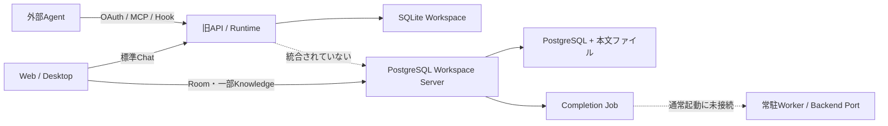

# Samurai Agent 全実装・再完了監査台帳

- 監査日: 2026-08-21
- 対象HEAD: `b5ddf2dacc04ae45cc87d0c82239dd303d6bef83`
- 対象: Native Appの新規製品実装を除く、現在までの全コード・設定・テスト・CI・Docker・文書・証拠
- 正本: `PRODUCT.md`、`ARCHITECTURE.md`
- 方針: 今回は監査のみ。コード修正は行わない

## 0. 非エンジニア向け結論

**全体判定は未完了、現時点ではリリース不可。**

安全性を意識した部品や型チェックは多く存在する。一方、製品として使う道が一本につながっていない。

1. 標準起動・Chat・外部連携は旧SQLite版を使う
2. Room・新Knowledge・PostgreSQLは別のWorkspace Serverにある
3. Knowledgeを育てるWorkerは通常起動しない
4. Backup形式、API、テスト、完了レポートも新旧で分かれている
5. OSSとして必要な法的文書、公開API、配布・実環境証拠がない

したがって、Native Appの画面を増やす前に、**SQLite旧系を完全に廃止し、PostgreSQL Workspace Coreへ全機能を統合する基盤修正**が必要である。

## 1. 調査方法と対象範囲

### 1.1 棚卸し

- 監査開始時のGit追跡ファイル: 1,208件
- `apps/`、`packages/`、`scripts/`、`workers/`の実装関連ファイル: 1,005件
- 主要ソース・文書: 約233,084行
- テストファイル: 130件
- Git追跡Markdown: 64件。今回の監査台帳を含む65件でローカルリンク切れ0件
- `apps/`: 91件
- `packages/`: 742件
- `scripts/`: 169件
- `docker/`: 9件
- `workers/`: 3件
- Git追跡`plans/`: 52件（今回の監査台帳を除く）
- `reports/`: 109件
- `.github/`: 4件

全ファイルのパス・種類・依存・旧用語・SQLite参照・危険操作・未実装印・巨大ファイル・公開設定を機械的に棚卸しした。その上で、製品の主要実行経路と高リスク箇所を3系統で深く読んだ。画像等のバイナリ内容、Hosted環境、実外部Clientは今回のローカル静的監査対象外である。

### 1.2 実行確認

| 確認 | 結果 |
| --- | --- |
| `pnpm typecheck` | 24 workspace projectすべて成功 |
| `pnpm test` | 130ファイル中121成功・9失敗。857件中746成功・111失敗。終了コード1 |
| 代表6テストファイル | 29件中10成功、19失敗 |
| Architecture boundary（証拠書込みなし） | 成功。ただし後述のGateway生ファイル同期等を検出できない |
| whitespace check | 監査Markdownを含め成功 |
| 明白な秘密鍵・主要Token pattern | 追跡対象から検出なし |

実PostgreSQL、Hosted、Self-host、3 OS、Codex／Claude Code／Hermesの実Clientは今回実行していない。依存脆弱性のオンライン再照会も行っていない。参照OSSは公式一次情報で比較した（8.1節）。未実施範囲は完了扱いしない。

### 1.3 確認の深さ

「全ファイル対象」は、全追跡ファイルを同じ深さで目視したという意味ではない。全件を機械走査し、製品経路と高リスク箇所を深く読んだ。確認方法を次のとおり区別する。

| 対象 | 確認方法 |
| --- | --- |
| root正本、README、manifest、主要設定 | 全文・依存・正本整合を深く確認 |
| `apps/server` | 入口、route、認証、旧／新Server、compositionを深く確認 |
| `apps/web`／`apps/desktop` | Chat、Room、IPC、接続切替、旧Resource経路を深く確認 |
| `packages/runtime`／`workspace-store`／`workspace-server`／`domain-operations`／`gateway` | 主要実行経路、権限、永続化、Worker、Bundle、Sandboxを深く確認 |
| その他の小規模Resource package | 全件を機械走査し、公開入口・主要実装・関係テストを重点確認 |
| `scripts`／`reports`／`plans` | 全件を機械走査し、現行Gate・Verifier・証拠・正本競合を深く確認 |
| `docker`／`.github`／`workers` | 全設定・実装を深く確認 |
| 画像・生成物等のバイナリ | path、用途、追跡状態の棚卸しのみ |
| 実PG、Hosted／Self-host、3 OS、実外部Client | 未実行。静的監査だけで完成とは判定しない |

## 2. 現在の実行構造

正本が求める完成形は、Native Appと外部Appが同じGateway、Query、Domain Operation、Activity Ingest、PostgreSQL Coreを使う構造である。現在はそれと一致しない。

## 3. 再完了判定

### 3.1 Core01〜09

| 領域 | 再判定 | 理由 |
| --- | --- | --- |
| Core01 Domain Operation | 部分完成 | Schema、生成index、契約検査は強いが、旧Memory／Wiki／SQLite前提Operationと公開用語違反が残る |
| Core02 Host／Runtime | 部分完成 | Host境界はあるが、RuntimeがSQLite Storeへ広く依存し、migration testも失敗 |
| Core03 Backend | 部分完成 | Backend cassetteはあるが、実Client・認証環境・製品経路の証拠がない |
| Core04 Persistence | 要再実装 | 完了根拠がSQLite前提。今後はPostgreSQL＋本文ファイルだけへ統合する必要がある |
| Core05 Learning | 未完成 | 旧Memory／Wiki実装、到達不能コード、11件のfocused test失敗、通常Worker未接続 |
| Core06 Room認可 | 部分完成 | PG側のRoom/RLSは強いが、Connection実体がなく、Runtime testと認可契約が不整合 |
| Core07 Activity／Job | 部分完成 | Activity、Job、Worker部品はあるが、本番compositionでWorkerが生成されない |
| Core08 Session境界 | 部分完成 | SessionRef分離の設計はあるが、旧session compatibilityが現役で操作を阻害する |
| Core09 External／Automation | 未完成 | focused test失敗、外部連携は旧SQLite側、新PG CoreにConnection／Gatewayがない |

以前の「完了」は、各Coreの限定スコープと集中テストに対する判定である。全製品の現在HEAD、実DB、実Client、運用完成を意味しない。

### 3.2 製品化1〜6

| 柱 | 再判定 |
| --- | --- |
| 1. Agent責務整理 | 部分完成。設計は良いがRuntime、Store、Gatewayの物理責務が混在 |
| 2. Workspace Server | 部分完成。PG基盤はあるが標準起動・Chat・外部連携が未統合 |
| 3. Room無限階層 | 部分完成。Sourceはあるが実DB／RLS／Realtime／復旧の現行証拠なし |
| 4. Knowledge・学習ループ | 未完成。Completion部品はあるがWorker、Backend、UI/APIが未統合 |
| 5. 外部連携 | 未完成。公式レポートも実Client・3 OS・Hosted／Self-hostを未確認 |
| 6. Native App | 未完成。既存Shellも旧APIと新Serverの二重経路。新規製品実装は基盤修正後 |

## 4. P0：最初に直さないと後工程が成立しない問題

| ID | 問題 | 利用者への影響 | 客観的根拠 | 修正章 |
| --- | --- | --- | --- | --- |
| P0-01 | 旧SQLite版と新PG版が別製品 | UIが開いてもChat、Room、Knowledge、外部連携が同じWorkspaceで動かない | `apps/server/src/api-server.ts:358-572`、`apps/server/src/workspace-server-entry.ts:8-15`、`scripts/dev.mjs:17-27` | R01、R02 |
| P0-02 | SQLite依存が全Coreへ広がる | SQLiteを単純削除するとChat、Runtime、外部連携、検証がまとめて壊れる | `packages/workspace-store/src/kernel/workspace-database.ts:1-28`、`packages/workspace-store/src/workspace-store.ts:324-742`、root `package.json:96-107` | R01 |
| P0-03 | PG側にConnection／OAuth／失効／Room上限の実体がない | 外部Appを新Coreへ安全に接続できない | `packages/workspace-server/src/types.ts:18-65`、`auth.ts:113-147`、`schema.ts:4730-4748`、`http-server.ts:1503-1521` | R02 |
| P0-04 | Chatが選択Roomを使わない | Room Knowledgeを使わず、結果も同じRoomのActivityへ残らない | `apps/web/src/AppWorkspace.vue:710-729`、`apps/web/src/lib/api.ts:561-647`、`apps/desktop/src/main.ts:702-710` | R03 |
| P0-05 | Knowledge／Completion Workerが通常起動しない | Activityを保存してもKnowledgeが自動で育たない | `packages/runtime/src/activity/workspace-job-worker.ts:70-208`、`apps/server/src/workspace-server-cli.ts:40-45`、`workspace-completion-maintenance.ts:104-121` | R04 |
| P0-06 | Bundle V3とV4が経路ごとに混在 | API移転ではCompletion Knowledge／Skill／Activityが欠落し得る | `apps/server/src/workspace-server/http-server.ts:157-200,1271-1319,1739-1774`、`packages/workspace-server/src/workspace-completion-bundle-v4.ts:78-161` | R05 |
| P0-07 | Gateway SandboxがCoreを通らずWorkspace全体を直接同期 | Version、Activity、復旧を迂回し、設定次第でファイルを上書き・削除できる | `packages/gateway/src/index.ts:1836-1952,2057-2101` | R06 |
| P0-08 | Sandboxの許可／拒否pathが強制されない | 「許可した場所だけ」の設定が実際の保護にならない | `packages/core-schemas/src/index.ts:2953-2970`、`packages/gateway/src/index.ts:1090-1091,1887-1900` | R06 |
| P0-09 | 全テストGateが失敗 | mainの正常性を客観的に保証できない | 現行HEADで130ファイル中9失敗、857件中111失敗、終了コード1 | R08 |
| P0-10 | SQLite完全削除の決定が正本へ未反映 | 修正担当者が旧互換を正しい仕様として再実装する可能性がある | `ARCHITECTURE.md:326-331` はSQLite移行を残す。今回の最新決定と不一致 | R00 |
| P0-11 | 正本Resourceの一部がPGへ未移植 | SQLite削除後にAgent、Artifact、Collection等の機能が欠落する | PG Completionの専用ResourceはKnowledge／Skill／Policy中心。Agent権限・Backend binding、Artifact／Revision、Collection専用契約が旧系に残る | R01、R02、R07 |

## 5. P1：製品化前に必ず解消する問題

| ID | 問題 | 根拠 | 修正章 |
| --- | --- | --- | --- |
| P1-01 | 旧Learning APIと新Completion APIが二重 | Desktopは`/learning`を呼ぶが、PG Serverは旧書込みを410にする。`apps/desktop/src/preload.cts:27-35`、`http-server.ts:363-370` | R04 |
| P1-02 | 到達不能な旧Learning処理が約千行残る | `agent-runtime.ts:8348`の即時return後にMemory／Wiki archive・mergeが残る（`:8696-8739`） | R01、R04 |
| P1-03 | Memory／Knowledge Wikiが公開Resourceとして残る | `PRODUCT.md:135`と、Web/API/Domain Operation/Contextの実装が不一致 | R01、R09 |
| P1-04 | 旧Session／Profile互換が現役 | `sessionCompatibleOperationIds`、deprecated operation、未使用`ProfileRegistry`が残る | R01、R03 |
| P1-05 | Artifact作成がファイルとDBで原子的でない | `packages/artifacts/src/index.ts:44-84`。DB失敗時の孤立ファイルrollbackがない | R07 |
| P1-06 | Collection検証が3実装で結果が異なる | `packages/collections/src/index.ts:11-79`、Store codec、Runtime safe collectionが別契約 | R07 |
| P1-07 | Server05 verifierがPG製品を監査しない | `scripts/verify-server-05.mjs:94-121,165-233` は新`workspace-server`をsource hash／主要検査へ含めない | R08 |
| P1-08 | Core／Server04／Server05証拠が古いまたは未完成 | Coreは別commit・2/100・hash不一致、Server04は実PG失敗、Server05は`INCOMPLETE` | R08 |
| P1-09 | PR CIが全テストと実probeを省略 | `.github/workflows/ci.yml:104-109,150-164` | R08 |
| P1-10 | PG Server、Worker、Self-hostのreadiness・監視が不足 | HealthはDB queryをせず、ComposeにServer healthcheck・Worker・metrics・alertがない | R06 |
| P1-11 | Docker imageが開発用構成 | 単段、全source・dev依存、`tsx`実行。`docker/self-host/Dockerfile:1-22` | R06、R09 |
| P1-12 | Skill最適化Workerが自分で「関連テスト成功」を申告 | `workers/skill-optimization/worker.py:267-268` は実テストをせずtrueを返し、Runtimeはその値をGateに使う | R04、R08 |
| P1-13 | Skill最適化の評価が単純な語句重複＋長さ加点 | `workers/skill-optimization/worker.py:83-90`。品質改善を客観的に証明しにくい | R04、R07 |
| P1-14 | 公開Domain契約へ内部設計台帳が露出 | `packages/domain-operations/src/definition/index.ts:84-90`。出典用途の固有名自体ではなく、旧正本名・SQLite理由・内部比較情報が公開metadataへ混在することが問題 | R07、R09 |
| P1-15 | 実外部Backend E2Eが偽CLI中心 | `packages/agent-backends/src/external-backend-e2e-script.test.ts:18-64` | R06、R08 |
| P1-16 | 外部CLI引数を空白分割する | 空白を含むpath／引用引数が壊れる。`packages/runtime/src/agent-runtime.ts:966`、`scripts/verify-external-backends.mjs:382-387` | R06 |
| P1-17 | Browser、Desktop、package済みAppのE2Eがない | VitestはNode環境のみ。`.github`にも該当jobなし | R08、R11 |
| P1-18 | OSSの必須文書がない | LICENSE、CONTRIBUTING、SECURITY、CODE_OF_CONDUCT、Support、Issue／PR templateなし | R09 |
| P1-19 | 公開API／SDK／互換性方針がない | 全packageが`private:true`、`src/index.ts`直接export、OpenAPI・version policyなし | R09、R10 |
| P1-20 | PG HTTP読取りに独立したFormal Query境界がない | 一部HTTP handlerがStore読取りを直接構成し、Query Port／Application Serviceとして統一されていない | R02、R07 |

## 6. P2：可読性・再利用性・将来事故を減らす問題

| ID | 問題 | 根拠 | 修正章 |
| --- | --- | --- | --- |
| P2-01 | Runtimeが万能クラス | `packages/runtime/src/agent-runtime.ts` 14,897行、Store呼出しが広範囲 | R10 |
| P2-02 | Server APIが巨大 | `apps/server/src/api-server.ts` 8,987行 | R10 |
| P2-03 | PG schema／Completionが巨大 | `schema.ts` 6,567行、`workspace-completion-service.ts` 4,560行 | R10 |
| P2-04 | Web親Componentへ責務集中 | `AppWorkspace.vue` 2,294行、Chat・Room・Connection・旧Resource・Automation等を同居 | R10 |
| P2-05 | Desktop mainへOS・IPC・接続・Chatが集中 | `apps/desktop/src/main.ts` 約1,836行 | R10 |
| P2-06 | CSSが単一巨大ファイル | `apps/web/src/styles/app.css` 約4,142行、selector重複あり | R10 |
| P2-07 | Web props／型の結合が強い | `WorkspacePanels.vue`の大量props、Collection UIの`any` | R10 |
| P2-08 | 物理境界検査の対象が不足 | `workspace-server`、Desktop、Gateway生FS、schema/migration巨大化を十分検査しない | R08、R10 |
| P2-09 | Python Workerの再現性・CIが不足 | `requirements.lock`は直接依存1行のみ。Python test／ruff／transitive hash固定CIなし | R08、R09 |
| P2-10 | 古い正本・計画が現役のように残る | 多数の`plans/`が旧5正本、SQLite、Memory／Wikiを優先すると記述 | R00、R09 |
| P2-11 | 未使用・到達不能な旧Subsystemが残る | `ProfileRegistry`、旧Learning、SQLite migration、旧diagnostics、試作UI等 | R01、R10 |
| P2-12 | Lintの共通Gateがない | root scriptに全TS／Vue／Pythonを対象にしたlintがない | R08、R10 |
| P2-13 | 参照OSS比較を継続する仕組みがない | 今回は8.1節で公式一次情報を比較したが、更新時期・採否理由・再確認Gateを管理する台帳はない | R09、R10 |

## 7. フォルダ別の状態

| 対象 | 状態 | 要点 |
| --- | --- | --- |
| root正本・README | 不整合 | 正本は2つだが旧正本文書と多数の旧計画が残り、SQLite削除決定も未反映 |
| `apps/server` | 未統合 | 旧SQLite APIと新PG Serverの二重entry。標準起動は旧側 |
| `apps/web` | 部分完成 | UI部品は多いがChat／Memory／Wikiが旧API。RoomとChatが未接続 |
| `apps/desktop` | Shell段階 | セキュアなIPCの土台はあるが旧Chat／Learningと新PG経路が混在 |
| `packages/runtime` | 部分完成・過密 | 多機能だがSQLite／旧学習／Session互換へ依存し、テストも多数失敗 |
| `packages/workspace-store` | 廃止対象中心 | SQLite旧Workspaceの実体。必要なPort契約をPG側へ移して削除する |
| `packages/workspace-server` | 強い部品・未配線 | PG、RLS、Room、Completion、V4 BundleはあるがConnection、Worker、HTTP統一が不足 |
| `packages/domain-operations`／`action-catalog` | 強い契約・要整理 | 生成契約は良いが旧Resource、SQLite文言、参照OSS名が公開面に残る |
| `packages/gateway` | 要再設計 | 接続部品はあるがSandbox生同期が正式Ingressを迂回する |
| `packages/external-integration` | 契約中心 | OAuth／MCP等は旧SQLite Runtimeへ接続。PG側実体なし |
| Resource系package | 部分完成 | Artifact原子性、Collection検証重複、Memory／Learning旧概念を整理する必要あり |
| `workers/skill-optimization` | 実験段階 | Credential分離は良いが評価・test証拠・依存固定が不足 |
| `scripts` | 豊富だが旧前提 | 多数のGateがある一方、SQLite前提、証拠書込み副作用、PGの見逃しがある |
| `docker` | 開発用に近い | PG起動・backupはあるがWorker、Server health、production image、SBOMなし |
| `.github` | 部分完成 | 型・focused・auditはあるが全test・PG・E2E・image／releaseを通常PRで守らない |
| `plans`／`reports` | 証拠として混在 | 旧方針、限定完了、古いhash、ignore済みreportが混在 |
| `design-lab` | 補助試作 | 製品実装との所有関係を明示し、不要なら削除する |

### 7.1 全production package／appの意味確認

root、3 app、21 TypeScript packageを、manifest、公開entrypoint、主要実装、production到達性、SQLite／PG依存、関係testの単位で個別確認した。Python Workerも別途確認した。

| 対象 | 役割 | 意味確認の判定 | 主な修正章 |
| --- | --- | --- | --- |
| root `samurai-agent` | 全体の起動・検証 | 標準起動が旧SQLite API。公開build／lint／release方針なし | R01、R02、R08、R09 |
| `apps/server` | 旧APIとPG HTTP／CLI | 2 Server・2データ系が同居。PG Query境界も不足 | R01、R02、R04 |
| `apps/web` | Vue UI | 旧Session／Memory APIを使用し、RoomとChatが未接続 | R02、R03、R08 |
| `apps/desktop` | Electron公式Client | 安全なShell土台はあるが旧／新API混在。包装・3 OS証拠なし | R02、R08、R11 |
| `packages/action-catalog` | Action／Plugin manifest | 旧Operation catalogを現行Resourceへ再生成し、公開互換性を決める必要 | R03、R09 |
| `packages/agent-backends` | Codex／Claude等のBackend Adapter | Portは再利用候補。PG Activityへの本番組成と実Client E2Eなし | R04、R06 |
| `packages/artifacts` | Artifact保存 | 旧Store依存。本文とmetadataが原子的でなくPG専用契約なし | R02、R05、R07 |
| `packages/audit` | Activity／Audit組立 | 独立部品だが旧Approval／Operation schemaをPG契約へ統合未了 | R03、R04 |
| `packages/capability-registry` | Capability manifest | 旧proposal／local workspace語彙、production保持理由、testが不足 | R01、R09 |
| `packages/collections` | Collection検証 | 検証がRuntime／Domain／Storeと重複。PG専用契約未統一 | R02、R07 |
| `packages/core-schemas` | 横断Zod契約 | Memory／Wiki／旧Session等の旧公開型が残る最優先整理対象 | R01、R03 |
| `packages/domain-operations` | Formal Operation定義 | 生成契約は強いが旧Resourceと旧実装に結合。PG専用契約未完 | R02、R03、R07 |
| `packages/external-integration` | MCP／OAuth／Connector契約 | 旧SQLite側だけに実体。PG Connection永続化・実Client E2Eなし | R02、R06 |
| `packages/gateway` | 外部入口／Sandbox | 生copy／rsyncがCoreを迂回し、path制限を強制しない | R02、R06 |
| `packages/learning` | 旧Review／Curator | Memory／Wiki中心の旧学習系。Completionへ置換して削除対象 | R01、R04 |
| `packages/localization` | 8言語辞書 | 独立性は良い。旧用語更新とUI E2Eが必要 | R08、R10 |
| `packages/memory` | 旧Memory検索／注入 | 旧Store／filesystem依存。公開Resourceとして不要で削除対象 | R01、R03 |
| `packages/policy-engine` | Policy／Grant評価 | 純粋判定は再利用候補。PG Policy・Connection失効と未組成 | R02、R04 |
| `packages/room-permissions` | Room／Agent権限判定 | 非継承は正本整合。旧share kindとPG Connection認可が未整理 | R01、R02、R03 |
| `packages/runtime` | Host／実行／Context／Activity等 | SQLite依存の巨大旧Core。Room伝播、Worker組成、旧Resourceに問題 | R01〜R06、R10 |
| `packages/skill-optimization` | Python Worker Client／Gate | 実testなしの自己申告と簡易採点。CI・依存固定が不足 | R04、R08、R10 |
| `packages/skills` | SKILL本文parse／index | 方向性は正本整合。PG metadata／Version／Room／Bundle接続が必要 | R02、R03、R05 |
| `packages/ui-protocol` | Socket／Surface契約 | 旧Session／Memory event中心。公式PG Client protocolへ再設計 | R02、R03、R08 |
| `packages/workspace-server` | PG RLS／Completion／Bundle | 強い土台だがSQLite移行・V3を公開し、Connection／Worker等が不足 | R01、R02、R04、R05 |
| `packages/workspace-store` | SQLite Workspace正本 | 最大の廃止対象。必要ResourceをPGへ移してから完全削除 | R01、R02、R05 |
| `workers/skill-optimization` | Python最適化処理 | 実testを走らせず成功を返す。評価、lock、Python CIが不足 | R04、R08、R09 |

## 8. 確認できた良い点

- TypeScriptは`strict`、`noUncheckedIndexedAccess`を使用
- Domain OperationはZod schema、生成index、drift検査を持つ
- HTTPからStoreへ直接変更させない境界検査がある
- PG runtime role、RLS、署名Account、楽観lock、冪等性の設計がある
- 本文ファイルの段階保存、hash、symlink対策、V4 Bundleの方向性は良い
- Desktopは`contextIsolation`、sandbox、`nodeIntegration: false`を採用
- private keyをRenderer／Bundleへ出さない設計がある
- Markdownローカルリンク切れは今回の走査で0件
- 追跡対象から明白な秘密鍵・主要Token patternは検出されなかった

これらは残すべき土台である。ただし、局所的に良いことと、製品全体が完成していることは別である。

### 8.1 公式OSSとの現在比較

2026-08-21時点の公式リポジトリ／公式文書だけを参照し、機能の模倣ではなくOSSの作り方を比較した。

| 公式比較先 | 確認した作り方 | Samuraiの判定 | 採否 |
| --- | --- | --- | --- |
| [MCP TypeScript SDK](https://github.com/modelcontextprotocol/typescript-sdk)／[package構成](https://github.com/modelcontextprotocol/typescript-sdk/blob/main/docs/get-started/packages.md)／[Security](https://github.com/modelcontextprotocol/typescript-sdk/blob/main/SECURITY.md) | Client、Server、Core、Adapterの公開入口とSecurity窓口を分離 | 公開package、安定`exports`、互換性、Security窓口が不足 | 境界と公開入口を採用。固有名・製品仕様は採用しない |
| [OpenHands](https://github.com/OpenHands/OpenHands)／[Architecture](https://github.com/OpenHands/OpenHands/blob/main/docs/architecture.md)／[Development](https://github.com/OpenHands/OpenHands/blob/main/Development.md) | App、Agent Server、Automation、実行環境を分離し、開発導線を文書化 | Core Knowledge領域とAgent作業領域がSandbox同期で混在。参加導線も不足 | 実行領域分離と開発導線を採用。製品思想・機能は採用しない |
| [VS Code](https://github.com/microsoft/vscode)／[CI](https://github.com/microsoft/vscode/tree/main/.github/workflows)／[Contribution](https://github.com/microsoft/vscode/blob/main/CONTRIBUTING.md)／[Security](https://github.com/microsoft/vscode/security/policy) | 3 OSの継続検証、貢献手順、脆弱性報告、配布導線を公開 | 3 OS、署名配布、Contribution、Security、Release証拠が不足 | 3 OS Gateと公開運用導線を採用。内部実装は模倣しない |

比較結果は、Samuraiの正本境界を変える理由ではない。採用するのは、責務分離、安定した公開入口、必須CI、3 OS証拠、Security／Contribution／Release導線である。

## 9. 修正担当者が使う章構成

### R00. 方針・正本の更新

対象: P0-10、P2-10

- `PRODUCT.md`／`ARCHITECTURE.md`をPostgreSQL専用へ更新
- SQLite互換読取り、移行、既存データ保持を削除
- 旧正本文書は削除または明確なarchiveへ移し、正本2件と競合させない
- `plans/`／`reports/`は「現在有効」「履歴」「削除」に分類

完了条件: 新規担当者が正本2件だけで、PG-only・Room境界・SessionのApp所有・同一Coreを一意に理解できる。

### R01. SQLite・旧Subsystemの完全廃止

対象: P0-01、P0-02、P0-11、P1-02〜P1-04、P2-11

- 旧機能を先にPG Portへ移し、その後`WorkspaceStore`／SQLite API／migration／backup／fixtureを削除
- `better-sqlite3`、`workspace.sqlite`、SQLite環境変数・文言・CIを削除
- Memory／Knowledge Wikiを現行Knowledge／Skillへ統合
- 旧Learning、Session compatibility、ProfileRegistry、到達不能コードを削除
- データ移行は実装しない。新規PG schemaだけを正とする

削除前に、正本Resourceの移し先を次のように固定する。ArtifactとCollectionのWorkspace／Room所有は正本で確定済みであり、決め直すのはPG専用契約と原子保存方式だけである。Automationの所有境界だけは正本で確定する。

| Resource／状態 | 目標の所有先 |
| --- | --- |
| Workspace、Room、Principal、権限 | PG Core |
| Connection、OAuth、失効、Room／入口上限 | PG Core。Credential本文はWorkspace外 |
| Agent、Agent権限、Backend binding | PG metadata。Credential本文はWorkspace外 |
| Knowledge、Skill、Policy、Profile、Soul | 人が読める本文ファイル＋PG metadata |
| Activity、Episode、Evidence、Audit、Job | PG Core |
| Artifact、Revision | Workspace所有の専用契約としてPG Coreへ実装。本文とmetadataを原子的に保存 |
| Collection、schema、record | Workspace／Room所有の専用契約としてPG Coreへ実装 |
| Session、Chat、UI状態、App側Agent cache | App所有。会話全文をPG Workspace Resourceにしない |
| 旧Memory、Wiki、ProfileRegistry | データ移行なしで削除 |
| Automation、user-runner | App／runner所有か削除かを正本で確定。Workspace JobはCore内部処理だけ |

完了条件: active source、dependency、test、script、Docker、READMEにSQLite実行依存が0件。標準起動から旧Serverへ到達できず、R05のResource完全性表が全行成功する。機能を削っただけでは完了にしない。

### R02. PostgreSQL Workspace Core・Connection・Gateway一本化

対象: P0-01、P0-03、P0-11、P1-20

- PostgreSQL Serverを唯一のWorkspace Core entryにする
- Connection、Principal、OAuth／Pairing、Room上限、入口上限、失効をPGで永続化
- Native App・外部Appを同じQuery／Domain Operation／Activity Ingestへ接続
- 読取りは独立したQuery Port／Application Serviceへ統一し、HTTP handlerからStoreを直接読まない
- Adapter／Backend／GatewayからStore直接操作を禁止

完了条件: `pnpm dev`、Self-host、Native App、外部Clientが同じPG Coreへ到達し、失効後の次操作を拒否する。

### R03. Chat・Session・Room・Activity再構築

対象: P0-04、P1-04

- Chat／Session状態はApp側に保持
- Chat開始時にWorkspace／Room／Principalを正式解決
- 使用したKnowledge ID／Versionを記録
- 結果、変更、検証、失敗を同じRoomのActivityへ保存
- SessionRefを削除してもWorkspace Resourceが壊れない

完了条件: Room AのChatがRoom Aだけを読み書きし、親・子・兄弟Roomへ漏れない。Sessionなしの外部Activityも成立する。

### R04. Knowledge Host・Job・Completion・Skill最適化

対象: P0-05、P1-01〜P1-03、P1-12、P1-13

- 常駐Scheduler／Workerを本番compositionへ登録
- Review／Semantic／Backend Portを明示注入
- restart、lease、retry、blocked、失敗監視を実装
- 旧Learning APIを削除し、Completion APIへ統一
- Skill最適化のtest／safety結果をWorker自己申告にせず、Host側の実検証で生成
- 実行結果とKnowledge／Skill VersionのUse／Evaluationを閉じる

完了条件: Activityから同じRoomの`provisional` Knowledgeが生成され、失敗・Evidence不足・`fixed`は安全側で拒否される。再起動後も処理が一度だけ継続する。

### R05. Bundle・Export・Restore・原子性

対象: P0-06

- V4相当を唯一のBundle／HTTP transfer／CLI／backup形式にする
- V3とSQLite migrationを削除
- Room、親Room、Principal、Permissionを移転
- Knowledge、Skill、Policy、PROFILE／SOUL、Activity、Episode、Evidence、Versionを移転
- Artifact、Collection、必要なJob／Attempt／Audit、file hashを移転
- private key、password、token、credential、raw model output、maintenance identity／権限、Session全文、UI状態を除外

SQLite削除による機能欠落を防ぐHard Gateは次のとおり。各行を独立して証明する。

| Resource群 | PG保存・Query | Room／Principal認可 | Bundle／Restore | 必須test |
| --- | --- | --- | --- | --- |
| Workspace、Room、親Room、Principal、Permission | 必須 | 必須 | 往復必須 | 作成・読取・更新・競合・越境拒否 |
| Connection、OAuth、失効、入口上限 | 必須 | 毎操作で必須 | Credentialを除外し、Connection metadataの扱いを正本どおり検証 | 発行・失効・差替え・上限拒否 |
| Agent、Agent permission、Backend binding | 必須 | 必須 | 含有／除外方針を正本化して検証 | 作成・割当・権限失効・Backend実行 |
| Knowledge、Skill、Policy、PROFILE／SOUL | 本文＋metadata必須 | 必須 | 往復必須 | Version・hash・`fixed`・自動更新拒否 |
| Activity、Episode、Evidence、Use、Evaluation | 必須 | 必須 | 往復必須 | 追記・関連付け・Room越境拒否 |
| Job、Attempt、Audit | 必須 | Maintenanceを含め必須 | 必要分の往復必須 | lease・retry・重複・blocked・復旧 |
| Artifact、Revision | 本文＋metadata必須 | 必須 | 往復必須 | 原子失敗・Version・hash・復旧 |
| Collection、Schema、Record | 必須 | 必須 | 往復必須 | Schema検証・Patch・競合・参照整合 |
| Session、Chat、UI状態、App cache | PG保存禁止 | App側認可 | 除外必須 | Bundle混入拒否・削除独立性 |
| Automation、user-runner | R00で所有先を確定した結果どおり | 結果どおり | 結果どおり | 所有境界・Workspace Jobとの混同拒否 |

完了条件: 上表の全Resourceで保存・読取り・認可・Bundle／Restore・test証拠が揃う。除外対象は混入を拒否する。途中失敗では移転先を有効化しない。

### R06. 外部連携・Sandbox・Hosted／Self-host運用

対象: P0-07、P0-08、P1-10、P1-11、P1-15、P1-16

- Codex／Claude Code／Hermesの正式AdapterをPG Coreへ接続
- Workspace CoreのKnowledge保存領域と、外部Agentが作業するproject worktreeを物理的に分離
- CoreのKnowledge保存領域を実行worktreeへ同期しない。作業worktreeでは`allowed_paths`／`denied_paths`を実際に強制
- 外部Agentの成果は、変更要約・結果・証拠としてActivity Ingestへ戻す。Workspace Resourceの変更だけをVersion付きDomain Operationへ通す
- DB、本文ファイル、Workerを確認するreadinessを実装
- Job滞留、失敗、RLS拒否、復旧失敗のmetrics／log／alertを追加
- production multi-stage image、非root、固定version、最小依存にする
- Hosted／Self-hostの復旧を自動化し、通知する

完了条件: 対象Client・OS・Deploymentすべてで、取得→実行→Activity→Knowledge→別Client再利用が通る。Sandboxは許可外pathを読書きできない。

### R07. Domain契約・Artifact・Collectionの共通化

対象: P0-11、P1-05、P1-06、P1-13、P1-14、P1-20

- Artifactの本文とDB metadataを一つの復旧可能Transactionにする
- Collection validationを一つの公開schema／実装へ統合
- 旧正本名、SQLite理由、内部比較台帳を公開型・Operation・APIから除去。出典Provenanceを公開する場合は目的と互換性を明文化
- 入出力limit、Version、冪等性、typed errorを共通化

完了条件: 公開schemaで成功した入力が実動系でも同じ結果になり、失敗時に孤立ファイルや片方だけの保存が残らない。

### R08. Test・CI・Verifier・完成証拠

対象: P0-09、P1-07〜P1-09、P1-12、P1-15、P1-17、P2-08、P2-09、P2-12

- 現在の全失敗を「実装バグ／旧テスト／環境不足」に分類して解消
- PR／mainで全test、PG migration、RLS、Realtime、Worker、Bundle、Self-hostを必須化
- Browser／既存Desktop Shellの未包装E2Eを基盤Gateへ追加
- installer生成、署名、notarization、auto-update、3 OS package E2EはR11通過後のNative App製品工程と最終Release Gateへ分離
- Boundary verifierへ`workspace-server`、Desktop、Gateway生FS、全production rootを追加
- Verifierは現HEAD全体のsource hashを持ち、副作用なし検査と証拠生成を分離
- Python workerのtest、lint、固定依存をCIへ追加

完了条件: 基盤範囲の全testが終了コード0で完走し、current HEADの必須証拠が全て有効。基盤Gate内のskipや未検証項目が0件。

### R09. 正本文書・README・OSS公開基盤

対象: P1-03、P1-11、P1-14、P1-18、P1-19、P2-09、P2-10、P2-13

- READMEをAI-native Knowledge Workspace／PG-only構成へ更新
- LICENSE、CONTRIBUTING、SECURITY、CODE_OF_CONDUCT、Support、Issue／PR templateを追加
- 公開packageと内部packageを決定し、API version、互換性、OpenAPI、Connector guideを公開
- SBOM、image scan、依存監査、release artifactをCI化
- 現行の公式一次情報を使い、代表OSSのmodule境界、公開API、test、release、security、contribution導線を比較する。固有名を公開契約へ持ち込まず、採否理由を内部資料へ残す
- 古い計画・用語・完了claimを整理

完了条件: 第三者が新規環境で導入、Self-host、開発参加、脆弱性報告、API利用を文書だけで再現できる。

### R10. 物理モジュール分割・可読性・再利用性

対象: P1-19、P2-01〜P2-08、P2-11〜P2-13

- RuntimeをAuthorization、Activity、Execution、Knowledge、Presentation等のPort単位へ分割
- Serverをroute、application service、composition、workerへ分割
- PG schema／migrationを責務別に分割し、生成規則を明示
- Web／DesktopをFeature単位のcontroller／componentへ分割
- `any`、巨大props、重複CSS、未使用codeを削除
- 公式OSS比較で確認した責務分割・拡張点・test配置を参考にする。ただしSamuraiの正本境界を優先する
- 既存の500行entrypoint／1,200行module警告を全production rootへ適用

完了条件: packageの公開入口、内部責務、依存方向、Owner、test場所が一意。例外的な巨大ファイルは理由と生成元を明記する。

### R11. Native App本格実装の開始Gate

対象: P1-17

基盤修正後、次を全て満たしてから新しいNative App画面・配布実装へ進む。

1. SQLite／旧Server／旧Resource実行依存が0
2. 標準起動がPG Coreのみ
3. Native／外部Clientが同じFormal Ingressを使用
4. Room Chat→Activity→Knowledge→別Client再利用が成功
5. Worker、V4 Bundle、RLS、Realtime、復旧が実環境で成功
6. 全test／CI／current HEAD証拠が成功
7. OSSの法的・参加・公開API方針が決定
8. 基盤修正範囲の未検証項目が0

R11通過後のNative App製品工程では、installer／配布物生成、OS署名・notarization、auto-update、3 OSのinstall→起動→接続→更新E2Eを実装し、最終Release Gateで確認する。

## 10. 最終完成判定の証拠表

| Gate | 必須証拠 |
| --- | --- |
| Source | 旧SQLite／旧Resourceがなく、正本と実装が一致 |
| Resource完全性 | 正本Resourceごとに保存・Query・認可・Bundle／Restore・testが成功し、App所有／削除対象も混入しない |
| Static | typecheck、lint、生成drift、全境界検査成功 |
| Unit／Integration | 全テスト成功、hang・skipなし |
| Database | 新規PG schema、RLS、Realtime、競合、失効を実DB確認 |
| Worker | restart、retry、blocked、重複防止、Evidence不足を確認 |
| Client | 全対象外部ClientとNative経路を確認 |
| OS | 宣言した全対象OSを確認。3 OSをやめる場合は先に製品範囲を正本化 |
| Deployment | Hosted／Self-host両方を確認 |
| Recovery | File Transaction、Bundle、backup、事故注入、復旧を確認 |
| Security | secret除外、Credential失効、SBOM、依存・image監査を確認 |
| OSS | License、導入、貢献、Security、API互換性文書と、公式一次情報による代表OSS比較を確認 |
| Completion | current HEAD、全source hash一致、未検証0件 |

## 11. 監査の最終判断

現状は、**良い設計部品が大量にあるが、旧製品と新製品が同居し、製品の一本道・運用・証拠が完成していない状態**である。

修正順は次で固定する。

> 正本更新 → SQLite／旧Subsystem廃止 → PG Core／Connection一本化 → Chat／Activity → Worker／Knowledge → V4 Bundle → 外部連携／運用 → 契約共通化 → Test／CI／証拠 → OSS文書 → 物理分割 → Native App

この順序を実装しただけでは完了にならない。各章の完了条件と、`ARCHITECTURE.md`が要求する実Database、実Client、対象OS、Hosted／Self-host、事故注入、未検証0件をすべて証拠で通した時だけ再完了と判定する。
