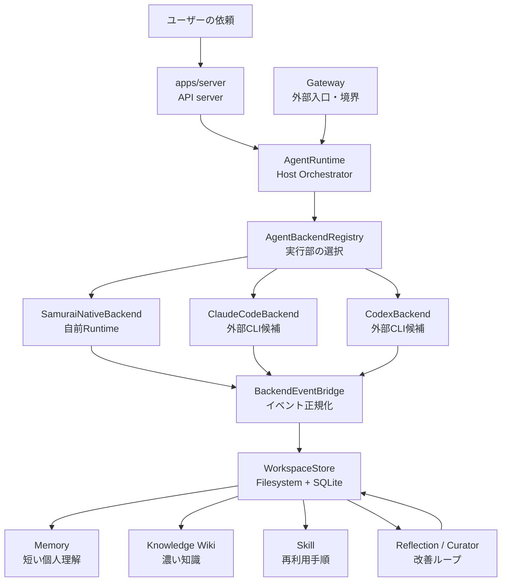
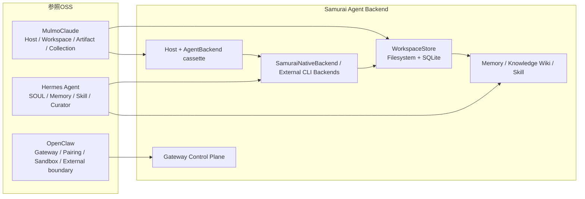
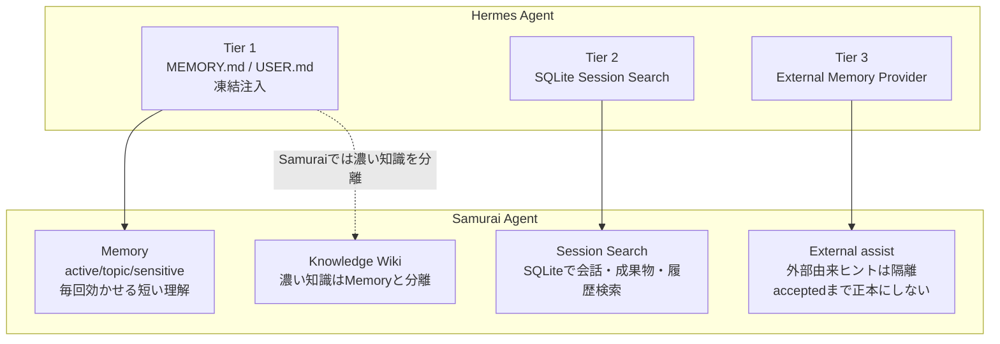
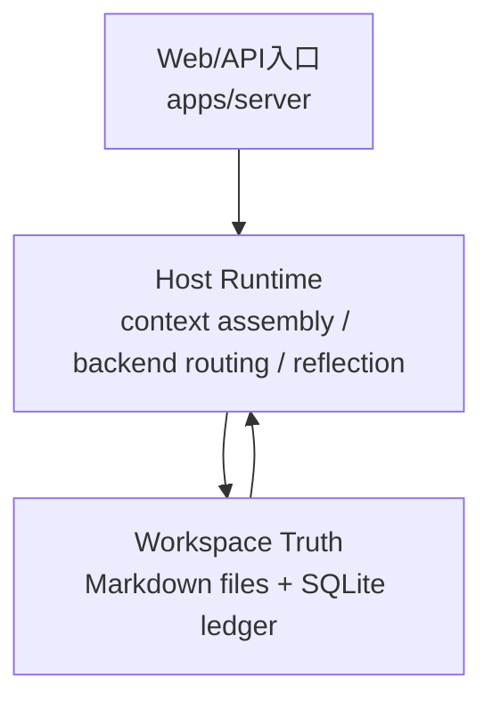
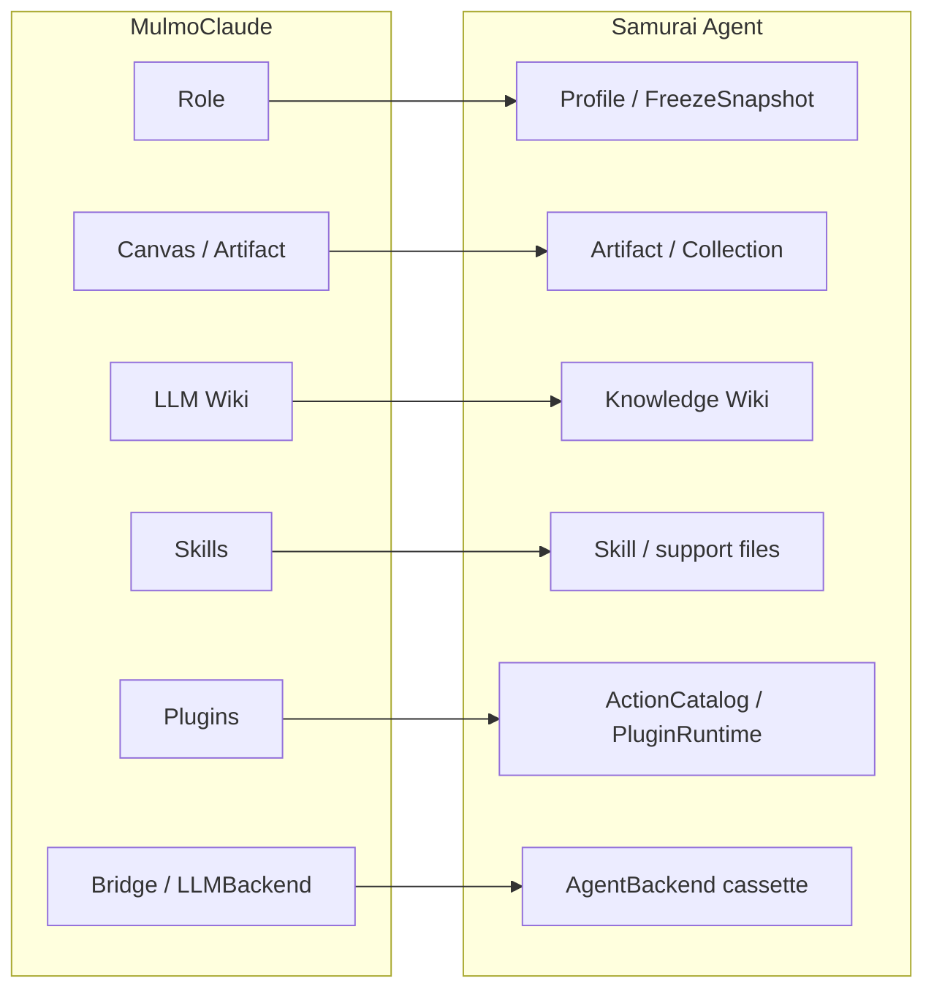
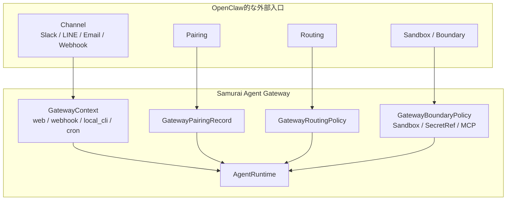
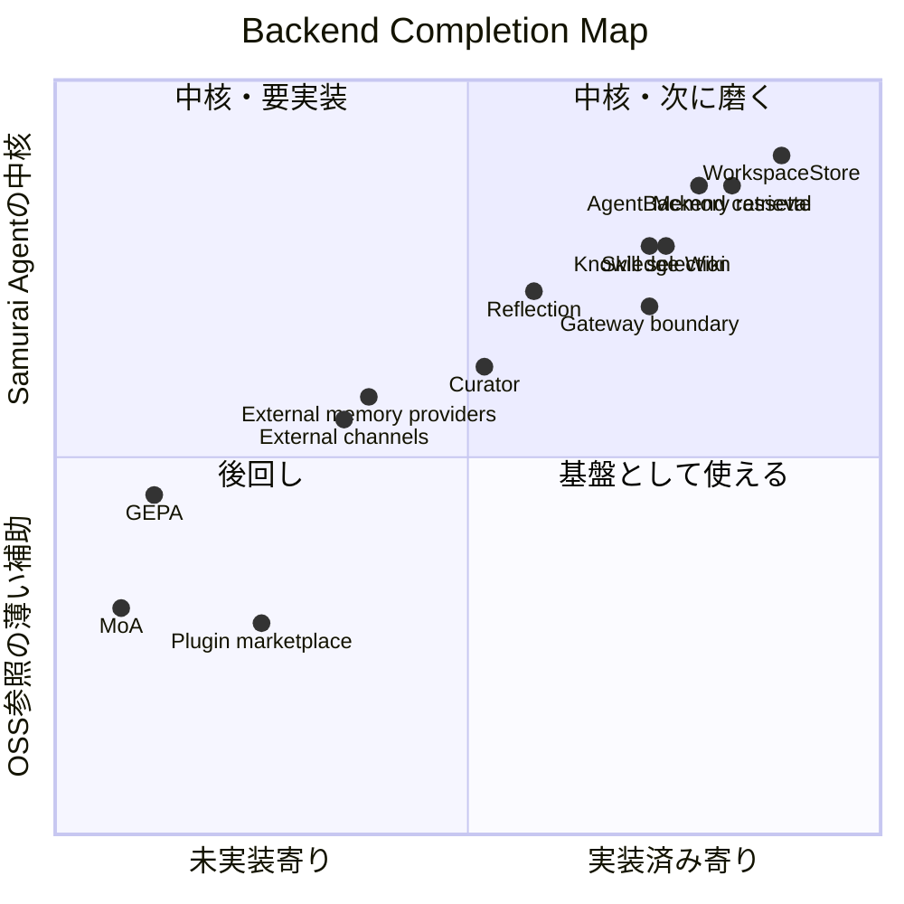
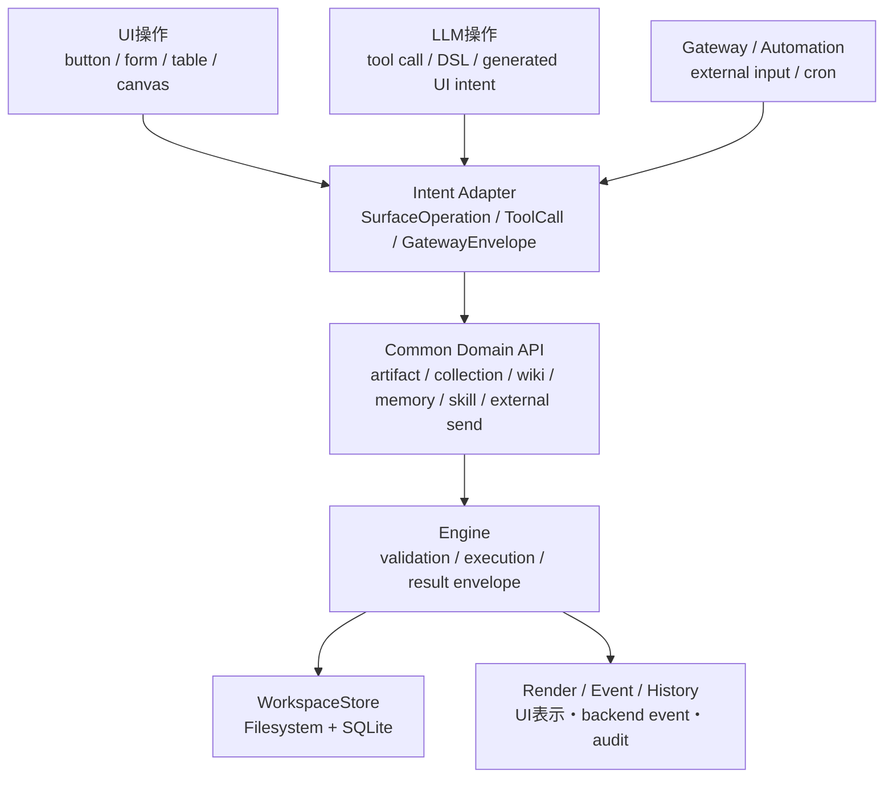

# Samurai Agent Backend Current State and OSS Comparison

作成日: 2026-06-27

この資料は、Samurai Agent の **バックエンド実装状況** を、非エンジニアでも追えるように整理したものです。

UIの見た目や操作感は対象外にし、以下だけに絞ります。

- 今のバックエンドで何ができるか
- 3つの参照OSSと、どの機能が対応しているか
- 何が実装済みで、何がまだ未実装または部分実装か
- どの領域を次に伸ばすべきか

## 0. 呼び名の補正

ユーザー会話では `MarumoClaude` / `OpenClaude` と表記されることがあるが、このリポジトリの正本では以下で扱う。

| 会話上の表記 | 正本での表記 | 役割 |
| --- | --- | --- |
| MarumoClaude | MulmoClaude | GUI / Host / Workspace / Artifact / Collection の参照元 |
| Hermes | Hermes Agent | Memory / Skill / Reflection / Curator / 自己改善の参照元 |
| OpenClaude | OpenClaw | Gateway / Session routing / Pairing / Sandbox / 外部入口の参照元 |

以降は正本表記で統一する。

## 1. 先に結論

Samurai Agent のバックエンドは、すでに **設計資料だけの段階ではない**。

現在は、次のような状態。

| 領域 | 状態 | 非エンジニア向けに言うと |
| --- | --- | --- |
| Chat -> Backend 実行 | 実装済み | チャット依頼をセッション化し、選んだ実行部に流せる |
| Backend 差し替え口 | 実装済み | Mock / Native / Claude Code / Codex などを同じ差込口で扱える |
| Backend event 正規化 | 実装済み | 各実行部のログや進行状況を共通形式に変換できる |
| Workspace Store | 実装済み | MarkdownなどのファイルとSQLiteを分けて保存できる |
| Artifact | 実装済み | 成果物のメタデータと本文を保存・取得できる |
| Memory | 実装済み | 会話由来の記憶を保存・検索・archiveできる |
| Knowledge Wiki | 実装済み寄り | 提案、承認、却下、archive、active検索、graphの骨格がある |
| Skill | 実装済み寄り | Skill候補、project skill、検索、support file、利用履歴がある |
| Reflection / Curator | 部分実装済み | 実行後に記憶・Skill候補を作り、整理レポートを作れる |
| Gateway | 部分実装済み | pairing、routing、inbound、sandbox、MCP、secret参照の骨格がある |
| Automation / Cron | 実装済み寄り | scheduled job、memory review、due job実行がある |
| External Provider | 部分実装 | 補助情報として隔離する設計、複数External Assist provider、env-only のHTTP / 単体local file / 複数local file adapterはあるが、Hermes級の8 provider統合ではない |
| GEPA / MoA | 未実装 | Hermes的な高度自己改善・複数AI合議はまだ入れていない |
| 実外部チャネル | 部分実装 | Webhook / Slack / Telegram / LINE / Email の inbound adapter はあり、Slack署名検証、Telegram webhook secret、LINE署名検証も設定時に動く。Email は JSON message endpoint、IMAP mailbox poll、Postmark/Mailgun/SendGrid style provider webhook payloadを同じGateway pathへ流せ、設定時はPostmark Basic Auth、Mailgun署名、SendGrid署名ヘッダーも検証する。External send は webhook URL、Slack webhook/API、Telegram Bot API、LINE Messaging API、Email SMTP の非dry-run dispatchまで対応。`backend:channels:verify` は実送受信なしでchannel readinessを返す。`release.profiles[]` は `local_oss` / `production_ops` を返し、実サービス長時間E2Eは manual gate として残る |

一言で言うと、

> **Samurai Agent は、MulmoClaudeの「作業机」、Hermesの「育つ記憶と手順」、OpenClawの「外部入口」を、ローカルWorkspace中心のバックエンドに再構成し始めている。**

## 2. 現在のバックエンド構造

### レイヤー別の役割

| Samurai Agent レイヤー | 今の実装 | 役割 |
| --- | --- | --- |
| API server | `apps/server/src/index.ts` | 外から呼べるHTTP APIをまとめる |
| Host Orchestrator | `packages/runtime/src/index.ts` | 文脈を集め、Backendを選び、結果をWorkspaceへ戻す |
| AgentBackend cassette | `packages/agent-backends/src/index.ts` | 実際に作業するAI実行部を差し替える口 |
| Native Backend | `packages/runtime/src/native-backend.ts` | 自前のProvider / Prompt / Tool loop |
| BackendEventBridge | `packages/runtime/src/backend-event-bridge.ts` | 実行ログを共通イベントに変換する |
| WorkspaceStore | `packages/workspace-store/src/index.ts` | ファイル正本 + SQLite索引・履歴・状態 |
| Core Schemas | `packages/core-schemas/src/index.ts` | 全体で使うデータ形を固定する |
| Gateway | `packages/gateway/src/index.ts` | 外部入口、pairing、sandbox、MCP、SecretRefの境界 |
| Policy / Audit / Rollback | `packages/policy-engine`, `packages/audit`, `runtime` | 危険操作の記録、確認、復元 |

## 3. 3つのOSSとの大きな対応関係

| 参照元 | 参照している考え方 | Samurai Agentでの対応 | 現状 |
| --- | --- | --- | --- |
| MulmoClaude | ChatからWorkspaceを操作するHost | `AgentRuntime`, `Surface Protocol`, `WorkspaceStore` | 実装済み |
| MulmoClaude | Artifact / Collection / Wiki / SkillをWorkspace資産にする | `artifacts`, `collections`, `wiki`, `skills` | 実装済み寄り |
| MulmoClaude | Backend差し替え | `AgentBackendRegistry`, `ClaudeCodeBackend`, `CodexBackend`, `SamuraiNativeBackend` | 実装済み、外部Backend完成版は未 |
| Hermes Agent | SOUL.md / profile / frozen context | `FreezeSnapshot`, profile読み込み, context preview / freeze API | 実装済み寄り |
| Hermes Agent | 3層Memory | `Memory`, `Session Search`, `External assist` | Samurai流に実装済み、外部providerは部分 |
| Hermes Agent | Skill progressive disclosure | Skill検索、body開示、support file選択 | 実装済み寄り |
| Hermes Agent | Reflection / Curator | `runReflection`, `runCuratorJob`, suggestion apply | 部分実装済み |
| Hermes Agent | GEPA / MoA | 評価jobの骨格のみ | 未実装寄り |
| OpenClaw | Pairing / routing / inbound | Gateway pairing, routing policy, inbound API | 実装済み寄り |
| OpenClaw | Sandbox / Secret / MCP境界 | sandbox policy, SecretRef, MCP config, locks | 実装済み寄り |
| OpenClaw | 実チャネル連携 | Telegram/Slack/LINE/Email/Webhook等 | Webhook / Slack / Telegram / LINE / Email の inbound adapter、Email IMAP poll、Email provider webhook payload adapter、Slack署名検証、Telegram webhook secret、LINE署名検証、Email provider-native verification、Gatewayのpairing/routing/inbound API、webhook URL / Slack / Telegram / LINE / Email SMTP のExternal send dispatchは対応。実サービス長時間E2Eは未 |

## 4. Hermes Agent と比較

Hermes Agent は「使うほど育つAgent」が主役。

主な中核機能は以下。

| Hermes側の機能 | 内容 | Samurai Agentの対応 | 現状 |
| --- | --- | --- | --- |
| SOUL.md | AIに「誰として働くか」を渡す人格・振る舞いファイル | `ProfileDocument`, `FreezeSnapshot`, workspace profile, `/api/context/freeze` | 実装済み寄り |
| 凍結注入 | セッション開始時に固定文脈をプロンプトへ入れる | `loadFreezeSnapshot`, context assembly | 実装済み寄り |
| Tier 1 Memory | `MEMORY.md` / `USER.md` を毎回確実に読む | `Memory active/topic/sensitive`, active retrieval | 実装済み |
| Tier 2 Session Search | SQLite FTSで過去会話を検索 | `/api/search`, session search, context preview | 実装済み |
| Tier 3 External Memory Provider | Honcho/Mem0等の外部memory provider | External assist record/context | 部分実装 |
| Skill自己生成 | 実行ログや修正からSkill候補を作る | reflection suggestion, skill candidate | 部分実装済み |
| Skill progressive disclosure | Skill名だけ常駐し、必要時に本文やsupport fileを読む | catalog/body/support の開示判断 | 実装済み寄り |
| PTC | Python等で複数tool callを圧縮 | plugin action / tool executorの骨格 | 未実装寄り |
| Curator | stale/archive/consolidateなどSkill整理 | curator lifecycle/review report | 部分実装済み |
| GEPA | 実行ログからプロンプト改善PRを作る | evaluation job骨格 | 未実装 |
| MoA | 複数モデル合議 | なし | 未実装 |
| Profiles | Designer/Programmer/Researcherなど独立profile | workspace profile / backend選択 | 部分実装 |
| Cron | 独立セッションで定期実行 | automation jobs / scheduler / cron gateway context | 実装済み寄り |
| 6層防御 | path/secret/sandbox/permission等 | policy, SecretRef, gateway boundary, sandbox | 部分実装済み |

### Hermesの「3層Memory」とSamurai Agentの対応

重要な違い。

| 観点 | Hermes Agent | Samurai Agent |
| --- | --- | --- |
| Memoryの主役 | `MEMORY.md` / `USER.md` + SQLite + 外部provider | Memory / Knowledge Wiki / Session Search / External assistを分離 |
| 濃い知識 | Memory stack側に寄りやすい | `Knowledge Wiki` として独立resource |
| 外部provider | 長期Memory providerとして使う | 補助ヒント扱い。正本にはしない |
| 凍結文脈 | セッション開始時に固定 | turnごとのContext Previewでfreeze snapshotとして扱う |

### Hermesの考え方をWeb/API向けに読み替えると

補足: 手元の正本では `Webの三層構造` という固定名称は確認できない。
ここでは、Hermes的な「人格・記憶・Skillを持つAgent実行」を Samurai Agent のWeb/API構成へ読み替え、説明用に3層化している。

Samurai Agentは以下の3層に分けられる。

| 層 | 何をするか | 具体例 |
| --- | --- | --- |
| Web/API入口 | 外部から命令や状態確認を受ける | `/api/chat/messages`, `/api/context/preview`, `/api/gateway/inbound` |
| Host Runtime | 文脈を組み、Backendを動かし、結果を解釈する | `runChatTurn`, `buildContextPreview`, `runReflection` |
| Workspace Truth | 人間が読める正本と履歴を持つ | `workspace-data/memory`, `workspace-data/wiki`, `workspace.sqlite` |

## 5. MulmoClaude と比較

MulmoClaude は「チャットだけでなく、WorkspaceやArtifactを呼び出すHost」が主役。

| MulmoClaude側の機能 | 内容 | Samurai Agentの対応 | 現状 |
| --- | --- | --- | --- |
| Role / persona | Agentの振る舞い定義 | profile / freeze snapshot / context freeze API | 実装済み寄り。複数role profileの運用UXは後続 |
| Chat as controller | チャットからGUIや作業を呼ぶ | Surface Protocol / message operation | 実装済み |
| Canvas / Workspace | 作業対象を画面・Workspaceに置く | Artifact / Collection / WorkspaceStore | 実装済み |
| LLM Wiki | 知識ページを作業文脈に使う | Knowledge Wiki | 実装済み寄り |
| Skills | 再利用手順 | Skill markdown / index / support files | 実装済み寄り |
| Plugins | toolや機能の追加口 | ActionCatalog / PluginRuntimeRegistry | 実装済み寄り |
| Bridge | 外部実行部やCLIへの接続 | AgentBackend cassette | 実装済み |
| Backend差し替え | LLMや実行部を切り替える | AgentBackendRegistry + ProviderAdapter | 実装済み |
| Artifact生成 | 成果物を保存・再表示 | artifact draft / metadata / content API | 実装済み |
| Collection | 業務データを構造化 | collection schema/record/patch/actions | 実装済み寄り |

### MulmoClaudeとの対応図

重要な違い。

| 観点 | MulmoClaude | Samurai Agent |
| --- | --- | --- |
| 中心 | GUI + Workspace + Claude Code的実行 | GUI-firstだがBackend固定しない |
| LLM Wiki | 参照元の名前 | `Knowledge Wiki` に改名 |
| 実行部 | Claude Code寄り | Claude Code / Codex / Native / future externalの差し替え |
| 正本 | Workspace中心 | Filesystem正本 + SQLite台帳を明確化 |

## 6. OpenClaw と比較

OpenClaw は「外部メッセージや外部チャネルからAgentに入る境界」が主役。

| OpenClaw側の機能 | 内容 | Samurai Agentの対応 | 現状 |
| --- | --- | --- | --- |
| Gateway | 外部入口を受ける | Gateway package / `/api/gateway/*` | 実装済み寄り |
| Session routing | 外部sourceをsessionへ割り当てる | routing policy / session key strategy | 実装済み |
| Pairing | 外部sourceを信頼する前の接続確認 | pending/approved/rejected/expired/revoked | 実装済み |
| Allowlist | 信頼sourceの制御 | `SAMURAI_GATEWAY_SOURCE_ALLOWLIST` | 実装済み |
| Boundary policy | 使えるtool、sandbox、secretを制限 | `GatewayBoundaryPolicy` | 実装済み |
| Sandbox | 外部入力の実行環境分離 | docker/ssh/remote/local adapter骨格 + `/api/health` / `doctor` / `sandbox:verify` の executor環境診断 | 実装済み寄り。実daemon E2Eは環境依存 |
| SecretRef | raw secretを出さずに参照 | env/file/keychain/external_vault schema | 実装済み |
| MCP config | 外部tool server設定 | stdio/http MCP config + summary | 実装済み寄り |
| Concurrency lock | 同時実行の衝突防止 | source/session/workspace/global lock | 実装済み |
| 実チャネル | Telegram/Slack/LINE/Email等 | Webhook / Slack / Telegram / LINE / Email の inbound adapter、Email IMAP poll、Email provider webhook payload adapter、Slack署名検証、Telegram webhook secret、LINE署名検証、Email provider-native verificationは実装済み。Gateway schema/default policy/routing/inboundは全channel対応。External send は webhook URL / Slack / Telegram / LINE / Email SMTP の実dispatch対応。実サービス長時間E2Eは未 | 部分実装 |
| Dashboard運用 | 状態確認・修復 | health / repair / gateway APIs | 部分実装 |

### OpenClawとの対応図

重要な違い。

| 観点 | OpenClaw | Samurai Agent |
| --- | --- | --- |
| 中心 | メッセージングGateway | Workspace / Memory / Skillが中心。Gatewayは入口 |
| 外部チャネル | 複数チャネル本体 | まず汎用境界とroutingを実装 |
| 安全境界 | Gateway中心 | Backend / Gateway edgeに置く |
| Workspace正本 | Gatewayとは別 | GatewayはWorkspaceを直接更新しない |

## 7. Samurai Agentの現状機能一覧

### 7.1 APIとして今できること

| APIグループ | できること | 現状 |
| --- | --- | --- |
| Health / Doctor | API、DB、provider、backend、gatewayの状態確認 | 実装済み |
| Workspace health | index drift確認、repair、backup、restore | 実装済み |
| Chat sessions | session作成、一覧、詳細、transcript、resume state | 実装済み |
| Chat messages | 新規chat、既存sessionへのmessage送信 | 実装済み |
| Agent backends | backend一覧、状態確認 | 実装済み |
| Backend runs | run一覧、cancel、resume、stream sync、event一覧 | 実装済み |
| Context preview | Memory/Wiki/Skill/Session Searchの投入予定確認 | 実装済み |
| Search | session/message/artifact/audit等の検索 | 実装済み |
| Artifact | artifact詳細、content取得 | 実装済み |
| Memory | list/detail/active retrieval/archive | 実装済み |
| Skill | list/detail/support/candidate/project作成 | 実装済み寄り |
| Knowledge Wiki | list/detail/propose/accept/reject/patch/archive/reindex/graph | 実装済み寄り |
| Collection | schema/record/patch/action/trigger/notes | 実装済み寄り |
| Reflection | manual run、suggestion apply、diagnostics | 部分実装済み |
| Curator | curator run、skill action apply、diagnostics | 部分実装済み |
| Evaluation | trace evaluation run、diagnostics | 部分実装済み |
| File / Browser tools | file action、browser fallback download、diagnostics | 部分実装済み |
| External send | draft、approval、dispatch dry-run、diagnostics | 部分実装済み |
| Gateway | pairing、routing、inbound、boundary、MCP、sandbox、locks | 実装済み寄り |
| Automation | queue、scheduler、job作成、run due、memory review | 実装済み寄り |
| Policy / Grants / Approval | policy evaluation、grant、approve/deny | 実装済み |
| Audit / Activity | 操作履歴、activity read model | 実装済み |
| Rollback | rollback point確認、restore | 実装済み |
| Settings | locale、Memory/Wiki/Skill capture mode、external assist role | 実装済み |

### 7.2 保存できるもの

| 保存対象 | 正本 | SQLite側の役割 | 現状 |
| --- | --- | --- | --- |
| Session | SQLite | 会話単位、resume、検索 | 実装済み |
| Message | SQLite | 会話履歴、検索、context | 実装済み |
| Backend run | SQLite | 実行履歴、status、resume/cancel | 実装済み |
| Backend event | SQLite | 実行イベント、tool logs | 実装済み |
| Artifact本文 | Filesystem | metadata、検索、参照 | 実装済み |
| Memory本文 | Filesystem Markdown | index、state、active retrieval | 実装済み |
| Knowledge Wiki本文 | Filesystem Markdown | index、state、graph、active search | 実装済み寄り |
| Skill本文 | Filesystem Markdown | index、state、usage | 実装済み寄り |
| Skill support file | Filesystem | Skillと紐付け | 実装済み |
| Collection schema/record | Filesystem + SQLite | validation、patch、refs | 実装済み寄り |
| Audit / Policy / Approval | SQLite | 操作履歴、確認状態 | 実装済み |
| Rollback point | SQLite + snapshot | 復元材料 | 実装済み |
| Gateway state | SQLite | pairing、routing、inbound、locks等 | 実装済み |
| Automation job | SQLite | scheduled job / retry / lock | 実装済み |

## 8. 実装済み / 部分実装 / 未実装マップ

### 実装済みとして見てよいもの

| 領域 | 理由 |
| --- | --- |
| Core schema | backend、memory、skill、wiki、gateway、automationまで型がある |
| API server | 主要routeが揃っている |
| WorkspaceStore | session/message/run/event/resource/index/repair/backupまである |
| AgentBackend cassette | registry、mock、external CLI、Claude/Codex wrapperがある |
| Native backend | provider/prompt/tool loop の自前実装がある |
| Backend event正規化 | bridgeとevent persistenceがある |
| Memory保存・検索 | state付きMarkdown + index検索がある |
| Knowledge Wiki lifecycle | propose/accept/reject/archive/reindex/active retrievalがある |
| Skill lifecycle | candidate/project/support/usage/selectionがある |
| Gateway境界 | pairing/routing/boundary/sandbox/MCP/secret/lockがある |

### 部分実装として見るべきもの

| 領域 | 何が足りないか |
| --- | --- |
| External Provider | 複数 External Assist provider の隔離hint接続は入ったが、Hermes級の8 provider統合や自動昇格運用はまだ |
| Reflection | suggestion生成/applyと `/api/reflection/diagnostics` はあるが、Hermes級の自己改善成熟はまだ |
| Curator | report/action骨格と `/api/reflection/diagnostics` はあるが、自動運用の成熟はこれから |
| Evaluation | trace評価骨格と `/api/evaluation/diagnostics` はあるがGEPAではない |
| File/Browser action | backend actionとしてはあるが、完成した汎用tool suiteではない。`/api/tools/file-browser/diagnostics` で failed / blocked action、ignored / failed tool run、browser workspace fallback を見える化済み |
| External send | approval/dry-run中心。`SAMURAI_EXTERNAL_SEND_DISPATCH=true` で webhook URL、Slack webhook/API、Telegram Bot API、LINE Messaging API、Email SMTP の非dry-run dispatch が走り、成功時はdispatched、HTTP non-2xx/fetch例外/SMTP失敗はfailedとして診断に乗る。`/api/external-sends/diagnostics` で pending / failed / stale / dry-run-only / missing target と channel別 transport readiness を見える化済み |
| OpenClaw級外部チャネル | Webhook / Slack / Telegram / LINE / Email の inbound adapter は追加済み。Email は `POST /api/gateway/email/messages`、`POST /api/gateway/email/imap/poll`、`POST /api/gateway/email/provider-webhooks/:provider` でGateway pathへ流せる。Slack署名検証は `SAMURAI_SLACK_SIGNING_SECRET`、Telegram webhook secret は `SAMURAI_TELEGRAM_WEBHOOK_SECRET`、LINE署名検証は `SAMURAI_LINE_CHANNEL_SECRET` 設定時に有効。Email provider webhook verification は Postmark Basic Auth、Mailgun署名、SendGrid署名ヘッダーを設定時に検証する。External send は Slack / Telegram / LINE のAPI dispatchとEmail SMTP dispatchも対応。実サービス長時間E2Eは後続 |
| Plugin ecosystem | catalog/runtimeと `/api/plugins/diagnostics` はあるがmarketplaceではない |

### 未実装として見てよいもの

| 領域 | 理由 |
| --- | --- |
| GEPA | execution traceから自動PRを作る最適化pipelineはない |
| MoA | 複数モデル合議はない |
| Hermes級PTC | AIがPythonを書いてRPCでtool call圧縮する仕組みは未 |
| ClaudeCodeBackend完成版 | wrapperはあるが完成統合ではない |
| CodexBackend完成版 | wrapperはあるが完成統合ではない |
| 外部チャネル本実装 | 主要inbound adapter、Email IMAP poll、Email provider webhook payload adapter、Email provider-native verification、Slack/Telegram/LINEのAPI dispatch、Email SMTP send、非破壊channel readiness verifier、`local_oss` / `production_ops` release profileはあるが、実サービス長時間E2Eは manual gate として残る |

## 9. 参照OSS別の「採用 / 非採用」判断

| 参照元 | 採用する | そのままは採用しない |
| --- | --- | --- |
| MulmoClaude | Host / Workspace / Artifact / Collection / plugin composition | Claude Code固定依存、参照元固有名の公開露出 |
| Hermes Agent | SOUL/Profile、Memory、Skill、Reflection、Curator、progressive disclosure | GEPA/MoAの即時実装、外部memory providerを正本にする設計 |
| OpenClaw | Gateway、pairing、routing、sandbox、SecretRef、external boundary | Gatewayをプロダクト中心にする設計、Workspace直接更新 |

## 10. 今の完成度を一枚で見る

| 大分類 | 完成度 | コメント |
| --- | --- | --- |
| Backend基盤 | 高 | API、Runtime、Store、Schemaが揃っている |
| Workspace保存 | 高 | Filesystem + SQLiteの境界が実装されている |
| Agent差し替え | 中〜高 | interfaceとwrapperはある。完成版外部Backendは後続 |
| Memory | 中〜高 | 保存・検索・active retrievalはある |
| Knowledge Wiki | 中〜高 | lifecycleとactive retrievalがある。体験の磨き込みは後続 |
| Skill | 中〜高 | candidate/project/support/usage/selectionがある |
| Reflection / Curator | 中 | 使える骨格はある。Hermes級の成熟はまだ |
| Gateway | 中〜高 | 境界モデルは強い。外部チャネル完成版はまだ |
| Automation | 中〜高 | scheduler/job/run dueはある |
| 実運用安定性 | 中〜高 | doctor/healthはあり、2026-06-28時点で `doctor` / root typecheck / `CI=true pnpm test` / build / i18n は通過。TTYなしの bare `pnpm test` は pnpm の modules purge確認で止まり得るため、CI実行では `CI=true` を付ける。実外部CLI / 実sandbox E2Eは `plans/backend-external-e2e-runbook.md` の明示承認gateに分ける |

## 11. 次にやるなら

バックエンド優先で見るなら、次の順が自然。

| 優先 | 作業 | 理由 |
| --- | --- | --- |
| 1 | `pnpm` / dependency stateの安定化 | 2026-06-28時点で `doctor` / root typecheck / `CI=true pnpm test` / build / i18n は通過。TTYなしの bare `pnpm test` は pnpm の modules purge確認で止まり得るため、CI実行は `CI=true` 付きに寄せる。`apps/server` を含むVitestは localhost listen が必要なので、sandbox内の `listen EPERM` はproduct bugではなく実行環境制限として扱う。`CI=true pnpm run backend:release:verify` により typecheck / full tests / i18n / web build / doctor / public naming scan / gateway recovery probe / external channel probe / external backend dry probe / sandbox capability + host probe を一括で非破壊確認できる |
| 2 | `context preview` を実データで確認するテストを増やす | Memory / active Knowledge Wiki / Skill support file を実Workspaceデータとして作り、`runChatTurn()` の provider input と `BackendRun.metadata.context_assembly_sources` へ渡る縦通しfixtureを追加済み。Memory/Wiki/Skill投入が中核だから継続して厚くする |
| 3 | Knowledge Wiki proposal -> active retrieval -> provenance の一連動作を固める | `wiki.proposal.create` / `wiki.accept` / `wiki.patch` / `wiki.reject` / `wiki.reindex` / `wiki.archive` を Common Domain API 経由で通し、active retrieval、source_ref graph、provenance保持、archive後の除外まで確認するfixtureを追加済み。Knowledge WikiはSamuraiの強みにするため継続して厚くする |
| 4 | Skill candidate -> support files -> selected skill usage の運用を固める | `skill.candidate.create` -> `skill.project.save` -> `skill.support_file.save` -> selected skill usage のfixtureに加え、Reflection由来の `suggestion_type=skill` を `reflection.suggestion.apply` で候補化し、project/support file/usageまで通す縦通しfixtureを追加済み。Hermes的な育つ体験の中核だから継続して厚くする |
| 5 | Gateway inbound -> routing -> boundary -> backend run のE2E確認 | Runtime fixtureに加え、`/api/gateway/inbound` のserver API fixtureでも pairing approval -> processed inbound -> boundary policy -> backend run -> denied tool `ToolRun` -> `WorkspaceChange` -> `BackendEvent` -> Reflection -> released lock を確認済み。さらに `POST /api/gateway/webhooks/:source_identity`、`POST /api/gateway/slack/events`、`POST /api/gateway/telegram/updates`、`POST /api/gateway/line/events`、`POST /api/gateway/email/messages` により、外部Webhook風JSON payload、Slack event payload、Telegram update payload、LINE event payload、Email message payloadをそれぞれ `channel=webhook` / `channel=slack` / `channel=telegram` / `channel=line` / `channel=email` のinboundへ正規化し、同じ pairing/routing/boundary/backend run path に流せる。OpenClaw的な外部入口を本当に使えるものにするため継続して厚くする |
| 6 | External Providerを「補助」扱いのまま接続先を増やす | `AgentRuntime` だけでなく `createApiServer()` からも `ExternalAssistProvider` を複数注入できるようにし、server API fixtureで複数providerの prefetch/sync hint が provider input、BackendRun metadata配列、`external_assist_records`、context assembly に残りつつ、Memory / Knowledge Wiki の正本へ入らないことを確認済み。`SAMURAI_EXTERNAL_ASSIST_URL` のHTTP adapter、`SAMURAI_EXTERNAL_ASSIST_FILE` の単体local file adapter、`SAMURAI_EXTERNAL_ASSIST_FILES` + `SAMURAI_EXTERNAL_ASSIST_PROVIDER_IDS` の複数local file adapterにより、env-only設定で補助providerを増やせる。壊れたHTTP URLやprovider失敗はAPI起動失敗ではなく `/api/health` / diagnostics のsafe payloadへ出し、token、query string、secret-like error valueは露出しない。正本を汚さず検索・抽出の能力を上げられる |
| 7 | GEPA/MoAは後回し | 現時点では基盤の成熟が先 |

## 12. 参照した主なソース

### ローカル正本

- `ARCHITECTURE.md`
- `PRINCIPLES.md`
- `PUBLIC_NAMING.md`
- `WEB_UI_DESIGN.md`
- `plans/v1-mvp-implementation.md`
- `Hermes_Agent_解説.md`
- `apps/server/src/index.ts`
- `packages/runtime/src/index.ts`
- `packages/workspace-store/src/index.ts`
- `packages/core-schemas/src/index.ts`
- `packages/agent-backends/src/index.ts`
- `packages/gateway/src/index.ts`

### 参照URL

- Hermes Agent repository: https://github.com/NousResearch/hermes-agent
- Hermes Agent docs: https://hermes-agent.nousresearch.com/
- MulmoClaude repository: https://github.com/receptron/mulmoclaude
- MulmoClaude article: https://singularitysociety.org/articles/blog/2026-04-10-mulmoclaude/
- OpenClaw repository: https://github.com/openclaw/openclaw
- OpenClaw article: https://unicornee.ai/articles/openclaw-ai-agent/
- OpenClaw architecture guide: https://eastondev.com/blog/ja/posts/ai/20260205-openclaw-architecture-guide/

## 13. 追記: Generative UI / DSL / Common Domain API

この追記は、MulmoClaudeの重要点である **Generative UI** と **LLMが使う操作API** を、Samurai Agentの次の実装順に落とすための整理である。

ここで重要なのは、安全思想を過剰に足すことではない。
重要なのは、**UIからの操作とLLMからの操作を、同じDomain API層へ入れること**である。

### 13.1 MulmoClaudeから見た重要点

MulmoClaudeの強みは、単に「チャット画面がある」ことではない。

重要なのは以下。

| MulmoClaude的な考え方 | 非エンジニア向けに言うと | Samurai Agentでの読み替え |
| --- | --- | --- |
| Generative UI | チャットの返答が文章だけでなく、フォーム、表、カード、作業画面を呼び出す | 固定surface + 必要に応じたcustom view |
| LLM as controller | LLMが「次にどの画面・操作が必要か」を判断する | LLMが `SurfaceOperation` / Domain Command を出す |
| Plugin / capability共有 | UIとAgentが同じ機能を使える | UI操作もLLM tool callもCommon Domain APIを使う |
| DSL / structured command | 自然文ではなく、実行可能な構造化命令にする | `form.submit`, `table.patch`, `collection.record.create` など |
| Engine実行 | 実際の保存・更新はEngineが行う | Runtime / WorkspaceStore が実行する |

### 13.2 目指す構造

理想は、UIとLLMが別々の裏口からWorkspaceを書き換えない構造である。

非エンジニア向けに言うと、以下のイメージ。

| 入口 | やりたいこと | 入る場所 |
| --- | --- | --- |
| 人間がボタンを押す | 顧客レコードを追加する | Common Domain API |
| LLMがtool callを出す | 顧客レコードを追加する | Common Domain API |
| 外部チャットから依頼が来る | 顧客レコードを追加する | Common Domain API |
| cronが定期処理を起動する | 顧客レコードを追加する | Common Domain API |

つまり、入口は違っても、最終的な実行口は同じにする。

### 13.3 現状の実装で近いもの

すでに近いものはある。

| 現状の実装 | ファイル | 役割 |
| --- | --- | --- |
| `SurfaceOperation` | `packages/ui-protocol/src/index.ts` | UIやGenerated UIから来る操作の構造 |
| `planSurfaceOperationDispatch` | `packages/runtime/src/index.ts` | 操作をどのEngineに流すか決める |
| `/api/surface/operations` | `apps/server/src/index.ts` | SurfaceOperationをHTTPから受ける入口 |
| `runSurfaceOperation` | `packages/runtime/src/index.ts` | SurfaceOperationをRuntimeで実行する |
| `createCollectionRecord` | `packages/runtime/src/index.ts` | Collection recordを作るDomain APIに近い処理 |
| `createWikiProposal` | `packages/runtime/src/index.ts` | Knowledge Wiki提案を作るDomain APIに近い処理 |
| `prepareExternalSend` | `packages/runtime/src/index.ts` | 外部送信draftを作るDomain APIに近い処理 |
| `handleBackendToolCall` | `packages/runtime/src/backend-feedback.ts` | LLM tool callをWorkspace更新へ変換する入口 |

2026-06-28時点で、この領域は一段進んだ。

| 進んだ点 | 現状 |
| --- | --- |
| Common Domain API層 | `domainCommandEntries` / `/api/domain/commands` / `AgentRuntime.runDomainCommand()` で、UI / runtime API / Gateway / Automation / provider tool call の共通command catalogを持つ |
| Domain Command一覧 | `chat.turn.run`, `artifact.create`, `memory.topic.create`, `wiki.*`, `skill.*`, `collection.*`, `external.send.prepare`, `gateway.inbound.route`, `sandbox.exec`, `mcp.call` などを正準化 |
| UI操作の入口 | `SurfaceOperation` は `getDomainCommandForSurfaceOperationKind()` で `chat.turn.run` / `artifact.create` / `collection.*` へ対応づく |
| provider tool callの入口 | `getDomainCommandForProviderToolName()` で `create_artifact`, `remember_topic`, `request_external_send`, `request_delete` などを正準commandへ寄せる |
| Domain Commandの返却 | `render_spec` / `render_specs` を返し、Chat / Artifact / Knowledge Wiki / Skill / Collection / Gateway の表示要求をfrontendへ渡せる |
| Generated UI contract | `DomainCommandEntry.output_render_kinds`、action catalog `output_schema["x-samurai-render-kinds"]`、`GET /api/surface/contract` で、各commandが返しうる固定surfaceとrenderer registryをfrontendへ渡す。`apps/web` は初期化時にこのcontractを読み、Chat Shellから `message.submit` SurfaceOperation + `renderer_capabilities` を送る。Workspace Canvas から `form.submit` / `table.patch` / `chart.request` / `custom_view.action` も実行できる |
| Domain Command diagnostics | `GET /api/domain/commands/diagnostics` で command / ActionCatalog mirror / provider tool alias / surface operation alias / render kind / input source の整合を自己診断できる |

ただし、まだ磨く余地はある。

| まだ弱い点 | 何が問題か |
| --- | --- |
| provider tool call側の旧互換処理 | 有効な `create_artifact` / `remember_topic` は `AgentRuntime.runDomainCommand()` 経由へ寄せた。`backend-feedback.ts` は直接保存をやめ、Domain Commandを通らなかった場合の診断用 `ignored` fallbackだけを残す。`GET /api/backend-runs/:runId/tool-runs/diagnostics` と `GET /api/tool-runs/diagnostics` で repeated ignored / failed provider tool を集計し、`adapter_recommendations[]` で `mapped_provider_tool` / `action_id_only` / `unmapped_provider_tool` と `suggested_next_step` を返せる。catalog / adapter mapping へ寄せる運用入口を持つ |
| Generated UI contractの運用 | Chat Shell / Artifact card / Workspace canvas が `GET /api/surface/contract` を読み、固定surface chipと `renderer_capabilities` 付き `message.submit` に接続された。Workspace Canvas は active Artifact から form/table/chart/custom_view の SurfaceOperation を投げ、返却された `render_spec` を汎用表示できる。次は各surfaceの実データUXを磨く |
| 実外部backend / 実sandbox / 実channelとの長時間E2E | ClaudeCodeBackend / CodexBackend / 実CLI stream / native resume はcontractとfixture中心。`pnpm run backend:external:verify -- --run --confirm-external-effects --resume --require-configured --backend codex` で実CLIの run -> native session id -> resume を検証できる入口は追加済み。2026-06-28時点の非破壊probeでは Claude Code は未設定、Codex は ready。verifierのfixtureでは Codex adapter 実体で run+resume が通る。sandbox側も `doctor` と `pnpm run sandbox:verify -- --json` が Docker CLI/daemon、SSH、remote executor境界、`long_e2e=manual_opt_in` を表示でき、`none` backendの固定host probeは実runで通る。Gateway側は `pnpm run backend:gateway:verify -- --json` が temp workspace上で期限切れpairing/lockの dry-run preview と apply repair を確認する。channel側は `pnpm run backend:channels:verify -- --json` が Slack / Telegram / LINE / Email / Webhook の readiness をsecretなしで返す。さらに `/api/health.release.manual_gates` と doctor のAPI表示で、実外部CLI run/resume、Docker/SSH/remote sandbox run、実channel service E2E が `manual_opt_in_required` で残っていることをUIからも確認できる。認証・ネットワーク・コスト・実daemon・実メッセージ送受信に触れる実runは `plans/backend-external-e2e-runbook.md` の明示承認gateとして残る。`--confirm-external-effects` なしの `--run` は verifier 側で blocked になる |

### 13.4 「すべてDSL化しない」との両立

Common Domain APIを作ることは、すべてをDSL化することではない。

Samurai Agentの切り分けは以下。

| 対象 | DSL化するか | 理由 |
| --- | --- | --- |
| 普通の会話 | しない | 自然な相談や返答は自然文のままがよい |
| 文章生成 | しない | 記事、説明、要約は自由な文章のままでよい |
| 思考・探索 | しない | まだ構造が決まっていないものを型に押し込めない |
| Workspaceを変える操作 | する | 保存、更新、履歴、再実行、表示に使うため |
| UIで実行される操作 | する | 人間操作とLLM操作を同じDomain APIへ流すため |
| 外部送信・削除・patch | する | 結果を追跡できるようにするため |

要するに、**会話は自然文、操作はDomain Command** にする。

### 13.5 次の実装順の更新版

前章の「次にやるなら」に、Generative UI / Common Domain APIの観点を足すと、優先順は以下になる。

| 優先 | 作業 | 理由 |
| --- | --- | --- |
| 1 | `pnpm` / dependency stateの安定化 | 2026-06-28時点で `doctor` / root typecheck / `CI=true pnpm test` / build / i18n は通過。TTYなしの bare `pnpm test` は pnpm の modules purge確認で止まり得るため、CI実行は `CI=true` 付きに寄せる。`apps/server` を含むVitestは localhost listen が必要なので、sandbox内の `listen EPERM` はproduct bugではなく実行環境制限として扱う。`CI=true pnpm run backend:release:verify` により typecheck / full tests / i18n / web build / doctor / public naming scan / gateway recovery probe / external channel probe / external backend dry probe / sandbox capability + host probe を一括で非破壊確認できる |
| 2 | Common Domain API層を磨く | command catalog / runtime execution / render spec はできたので、旧互換処理を薄くして実行経路をさらに揃える |
| 3 | provider tool callの旧互換処理を運用で監視する | 直接保存fallbackは消し、残る `ignored` / `failed` 診断は `ToolRunDiagnosticsReport` と tool-run diagnostics API で集計できる。`adapter_recommendations[]` が既知Domain Commandへのroute確認、provider alias追加、failed command調査のどれをすべきか返すため、実運用ログで繰り返されるtool callをcatalog/adapter側へ正準化しやすくなった |
| 4 | Domain Command一覧を運用で固める | `artifact.create`, `collection.record.patch`, `wiki.proposal.create` などの正準commandをfrontend/LLM/Gatewayで使い切る。`DomainCommandCatalogDiagnosticsReport` と `/api/domain/commands/diagnostics` により、catalog / ActionCatalog / provider alias / surface alias / render kind の不整合は運用前に検出できる |
| 5 | Generative UI contractをfrontend表示へ広げる | Chat Shell / Workspace / form/table/chart/custom_view の初期接続は入ったため、次は実データに合わせたsurface UXを磨くため |
| 6 | Knowledge Wiki lifecycleを完成寄りにする | proposal -> accept/reject -> active retrieval -> provenance は Common Domain API fixtureで通り、`/api/wiki/diagnostics` で active Wiki の本文有無、未検証provenance、source_refs欠落、active-only retrieval境界違反を確認できるようになった。`POST /api/context/freeze` で SOUL/Profile と同じ固定snapshot内に active Wiki refs が入ることも frontend から確認できる。次はKnowledge Wiki detail/Context Drawer側の警告表示と、人間がaccept前に根拠を補うUXを厚くするため |
| 7 | Skill lifecycleを実用化する | candidate -> project/active -> support files -> usage -> curator は通り始め、`/api/skills/diagnostics` で selectable Skill（project/active/pinned）の本文、provenance、source_refs、support file、usage、allowed scopeの状態を確認できるようになった。次は実運用のsupport file編集UX、curator提案適用、diagnostics warningの修正導線を厚くするため |
| 8 | Gateway E2Eを固める | `/api/gateway/inbound` のserver API fixtureが inbound -> pairing approval -> routing -> boundary -> backend run -> denied tool event -> Reflection -> released lock まで通り、`/api/gateway/diagnostics` で pending pairing、blocked/failed inbound、active/expired lock、sandbox failure、pairing/routing policy不整合を確認できるようになった。`POST /api/gateway/webhooks/:source_identity` は JSON payload の本文抽出、safe metadata、secret-like redaction、pairing承認後の processed inbound を確認済み。`POST /api/gateway/slack/events` は Slack URL verification、message event本文抽出、team/user/channel/thread scope、署名検証、safe metadata、pairing承認後の processed inbound を確認済み。`POST /api/gateway/telegram/updates` は Telegram update本文抽出、chat/user/thread scope、webhook secret検証、safe metadata、pairing承認後の processed inbound を確認済み。`POST /api/gateway/line/events` は LINE event本文抽出、group/user scope、署名検証、safe metadata、pairing承認後の processed inbound を確認済み。`POST /api/gateway/email/messages` は Email message payloadの本文/subject抽出、from/to/message_id/thread scope、safe metadata、pairing承認後の processed inbound を確認済み。`POST /api/gateway/email/imap/poll` は IMAP mailbox の `UNSEEN` messageをEmail Gateway pathへ流し、pairing承認後 processed inbound になることを確認済み。`POST /api/gateway/email/provider-webhooks/:provider` は Postmark/Mailgun/SendGrid style payloadをEmail Gateway pathへ流し、設定時のPostmark Basic Auth、Mailgun署名、SendGrid署名ヘッダー検証、pairing承認後 processed inbound になることを確認済み。External send は webhook URL、Slack webhook/API、Telegram Bot API、LINE Messaging API、Email SMTP の承認後dispatchを確認済み。`doctor` と `sandbox:verify` はsandbox executor環境も見える化した。`backend:gateway:verify` は temp workspaceで期限切れpending pairingと期限切れacquired lockの dry-run/apply repair を非破壊確認できる。次は実サービス長時間E2Eと、実運用ログに基づく復旧手順の拡張を厚くする |
| 9 | External Providerを補助として接続する | `createApiServer({ externalAssistProvider })` で複数接続先を差し込めるようになり、API経由でも unverified hints が isolated context と `external_assist_records` に留まり、Memory / Knowledge Wiki へ昇格しないことを固定した。さらに `ExternalAssistDiagnosticsReport` / `/api/external-assist/diagnostics` により、phase/status/provider別の集計、失敗履歴、`external_assist_not_isolated` / `external_assist_included_in_active_memory` の境界違反をbackend contractとして確認できる。`SAMURAI_EXTERNAL_ASSIST_URL` へPOSTする `HttpExternalAssistProvider`、`SAMURAI_EXTERNAL_ASSIST_FILE` の単体local file、`SAMURAI_EXTERNAL_ASSIST_FILES` + `SAMURAI_EXTERNAL_ASSIST_PROVIDER_IDS` の複数local fileにより、env-only設定で未検証hintを実際に複数注入できるようになった。さらに provider config diagnostics により、provider_ids/count、invalid URL、provider_kind、safe endpoint/file summary、token presenceをsecretなしでhealth/doctor/Settings APIに出せる。次は実providerごとの運用profileを厚くするため |
| 10 | ClaudeCodeBackend / CodexBackendの実運用検証を回す | `backend:external:verify -- --run --confirm-external-effects --resume --require-configured --backend <id>` で status/probe/実run/resume を環境ごとに確認する入口はあり、fixtureでは Codex-style run/resume 成功に加えて `run_failed` と確認不足時の `external_effects_confirmation_required` を構造化JSONと exit code 1 として返すことも固定済み。実CLIの認証・ネットワーク・コストを伴う長時間runは、`plans/backend-external-e2e-runbook.md` に従う人間の明示承認gateとして残る |
| 11 | UIをまとめて実装する | API contractが固まった後なら、こだわりを反映して一気に作れるため |
| 12 | release hardening | local OSSとして配れる品質へ寄せるため。`doctor` は `.env` 読み込み失敗を診断として出し、Docker/SSH/rsync/remote metadata依存のsandbox環境も表示できるようになった。`backend:gateway:verify` は temp workspaceで期限切れGateway pairing/lockの復旧を確認し、`backend:channels:verify` は実送受信なしで外部channel readinessを確認する。`backend:release:verify` は実外部効果を起こさずにrelease gateをまとめ、`gateway-recovery-probe` と `external-channel-probe` も含む。`/api/health.release.profiles[]` は `local_oss` と `production_ops` を返す。`/api/health.release.manual_gates` と doctor は実外部Backend run/resume、Docker/SSH/remote sandbox run、本物のSlack/Telegram/LINE/Email service credentialを使う外部チャネルE2Eを `manual_opt_in_required` として明示する |

### 13.6 UIをいつ触るべきか

UIは最後まで放置するのではなく、次の2段階に分ける。

| 段階 | やること | 目的 |
| --- | --- | --- |
| UI前の契約作り | Domain API、SurfaceOperation、render spec、result envelopeを固める | UIをまとめて作るための土台 |
| UIまとめ実装 | Chat Shell、Workspace Canvas、Artifact、Collection、Knowledge Wiki、Skill、Context Drawer、Run History、Settingsをまとめて作る | 体験を一気に整える |

UIを細かく何度も直すより、先に以下を固める。

- どのDomain Commandがあるか。
- どの操作がWorkspaceを書き換えるか。
- どの操作がどのrender surfaceを返すか。
- UI操作とLLM操作が同じ結果形式を受け取れるか。
- Knowledge Wiki / Skill / Artifact / Collectionが同じWorkspace文脈で表示できるか。

その後にUIをまとめて作る。

### 13.7 重要な方針

この方向で進める場合、判断基準は以下。

| 方針 | 意味 |
| --- | --- |
| MulmoClaudeのGenerative UI思想は強く採用する | チャットからWorkspace surfaceを呼び出す |
| 安全思想を過剰に足さない | 危険だから閉じるのではなく、共通Domain APIへ揃える |
| UIとLLMで別APIを作らない | 同じ操作は同じDomain APIへ流す |
| Store直書きしない | Domain API / Engineを通す |
| Generated UIは固定surfaceから始める | form/table/chart/artifact/collection/wiki/skill/custom_viewをまず固める |
| UIはまとめて作る | contractが固まる前に見た目を何度も直さない |

一言でまとめると、次の方針になる。

> **Samurai Agentは、MulmoClaudeのGenerative UI思想を、UI操作とLLM操作が同じCommon Domain APIを使う形で採用する。**
> **DSLは安全制限のためではなく、UI・LLM・Gateway・Automationを同じEngineへつなぐ共通語として使う。**

### 13.8 readiness healthと詳細healthの分離

2026-06-28時点の追加方針。

`/api/health` はlocal dev coordinatorやrelease readinessの入口なので、重いファイル全走査に巻き込まれないようにする。

| endpoint | 役割 | 見るもの |
| --- | --- | --- |
| `/api/health` | APIが起動していて、DB / provider / backend / Gateway / index read modelが最低限応答するかを見る | SQLite index / read model中心の軽量snapshot |
| `/api/workspace/health` | Workspace filesystemとSQLite indexのズレを詳しく見る | Artifact / Memory / Skill / Collection / Knowledge Wiki の実ファイル検査 |

理由:

- Desktop配下のrepoではCloudKit / FileProviderの状態でMarkdown/JSON読み取りが数十秒止まることがある。
- readinessが詳細検査を待つと、API自体は生きているのにlocal dev coordinatorが失敗扱いになる。
- ただし詳細検査は消さない。repair planやdrift検出は `/api/workspace/health` に残す。

この分離により、backendの起動確認とWorkspace整合性監査を別の責務として扱う。
