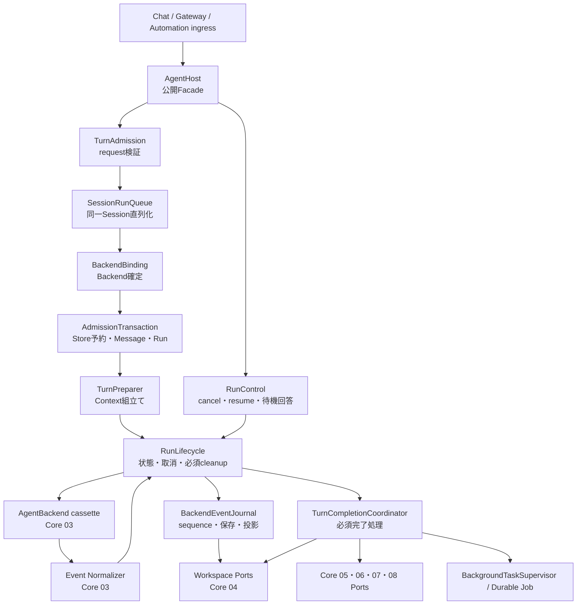

# Core 02 Host・Runtime 参照OSS品質完成計画

## 0. この文書の状態

- 対象: Core分類2「Host・Runtime」。
- 状態: 実装前の設計・実装・完了判定計画。**この文書を作成した時点では未完了**。
- 基準日: 2026-07-20。
- 現在の上位正本: [`PRODUCT.md`](../PRODUCT.md) → [`ARCHITECTURE.md`](../ARCHITECTURE.md) → 本計画。旧文書名は当時の履歴として読む。
- 完了判定: 必須Hard Gateがすべて合格し、実装範囲台帳に未確認がなく、独立設計監査で重大問題がない時だけ完了。Release hardeningは分けて扱う。
- 非対象: Core 03〜08の機能自体の作り直し。Core 03の終了根拠契約、Core 04の一括保存契約など、Core 02成立に必須の境界変更だけを対象にする。Core 05〜08の具体機能変更は別計画へ分ける。

この計画は、単に`agent-runtime.ts`を短くするための計画ではない。

> **MulmoClaude、Hermes Agent、OpenClawを設計・実装できる技術力を持つエンジニアが、Samurai Agentの正本を理解したうえで、Core 02を今から作るならどう組むか。**

この視点を、設計、コード構成、失敗処理、状態管理、同時実行、テスト、完了判定まで一貫して適用する。

### 0.1 非エンジニア向けの全体像

Core 02は、AIそのものではなく、AIへ仕事を渡して最後まで進行を管理する「現場監督」である。

現在は、受付、順番待ち、資料準備、AI実行、記録、後始末、学習や表示の一部まで、13,000行を超える1つのSourceへ集まりすぎている。機能は動いているが、1か所の変更が広い範囲へ影響しやすい。

目標は、単なるファイル分割ではなく、次の担当を実体として分けることである。

| 担当 | 平易な説明 |
| --- | --- |
| Host | 依頼を受け、誰に何をどの順番で頼むか決める |
| Session lane | 同じ会話の仕事が同時に走って履歴を壊さないよう順番を守る |
| Turn Preparation | AIへ渡す会話履歴、Memory、Skill、設定を一度だけ準備する |
| Backend | Codex、Claude Code、Nativeなど、実際のAI処理を行う |
| Event Journal | 途中経過と結果を一本の台帳へ順番どおり記録する |
| Run Lifecycle | 成功、失敗、取消、再開、再起動時の状態と後始末を保証する |
| Completion | 返答の保存を確定し、その後の学習や表示処理を適切なCoreへ依頼する |

つまり完成後は、「巨大Sourceを小分けした状態」ではなく、「各担当が自分の入力、出力、失敗時の責任を持ち、1本の実行経路としてつながった状態」になる。

### 0.2 2026-07-20の再調査で確定したこと

| 論点 | 決定 |
| --- | --- |
| 完了判定 | 必須動作・構造・実装範囲台帳をHard Gateにし、過剰な破壊試験や全OS検証はRelease hardeningへ分ける |
| 責務 | Backend選択、Samurai Run状態、Backend実行、Event保存、production配線の所有者を別々に固定する |
| 3 OSSの使い方 | MulmoClaudeの受付、Hermesの制御経路、OpenClawのlane/lifecycleを、一つのSamurai実行文法へ翻訳する |
| 予約＋保証 | Message/Run保存前にBackendを確定し、Store transactionでSession予約、Message、Runを一括確定する。取消時は有限時間だけ終了確認を待ち、確認不能なら警告付き`outcome_unknown`を保存して予約を解放し、自動再実行しない |
| 終了根拠 | 全Backendへ同じprobeを強制せず、CLIのprocess close、APIのterminal response、in-process loopの正常終了など、Backend固有の正準根拠をCore 03が返す |
| 取消 | `取消要求済み`と`停止確認済み`を分け、確認中だけSession占有を維持する。確認不能時だけ`outcome_unknown`とし、全Sessionを無期限停止しない |
| 完了保存 | Agent Message、Run終端状態、安全なSession予約解放をSQLite内の1 transactionで確定する。通知の永続再送を約束する経路だけoutboxも含め、外部Backendやfilesystemまで分散transactionにしない |
| 状態責任 | Run状態の判断は`RunLifecycle`だけが行い、Journalは決定済みの状態とEventを同時保存する記録係に限定する |
| 着手条件 | Core 01〜08全体の完成を待たず、Core 02が実際に使う契約部分だけをPhaseごとの入口Gateで確認する |
| Evidence | 対象Commit、production Source、Test ID、実行結果を記録する。Source fingerprintは任意診断に留め、Hard Gateにしない |
| 状態移行 | `outcome_unknown`、phase、attempt identity、request idempotencyを使うSchema、SQLite、Runtime、API、診断、通知、Webを消費箇所台帳で追跡する |
| Test | 小さい責務Testと一時SQLiteを使う縦線Testを中心にし、terminal根拠なしの成功を防ぐ |
| 客観性 | 動作は実行Test、依存境界はAST/import graph、読みやすさは根拠付き設計監査で判断する |
| Backend確定順 | MessageとRunを保存する前にBackendを一度だけ確定し、保存後のPreparationで選び直さない |
| 依頼の重複防止 | 各入口が再送でも変わらないidempotency keyを渡し、Storeが同一Session内のUNIQUE制約で二重Message/Runを防ぐ。同じKeyを異なる依頼へ再利用した場合はconflictにする |
| Session予約の正本 | process内queueは順番整理だけに使い、受理済みRunの予約はStoreを唯一の正本にする |
| 並列制御の範囲 | Session laneと全体上限はHost process内だけを保証する。Store予約は再起動recovery用であり、複数Host対応や分散queueは約束しない |
| PRとCI | 関連する2〜3 Phaseを原則1 PRにまとめ、各PRは変更範囲に必要なGateだけ、全体Gateは最終PRで実行する |

---

## 1. 「参照OSSレベル」の意味

### 1.1 基準にするもの

参照OSSレベルとは、参照OSSの画面、機能、ファイル名、クラス構造をコピーすることではない。次の技術的判断の品質を同等にすることである。

1. **責務の所有者が明確であること。**
2. **実行処理が理解可能な段階へ分かれていること。**
3. **Backend固有処理がHostへ漏れないこと。**
4. **正常終了だけでなく、失敗、取消、再開、再起動を設計していること。**
5. **同じSessionの競合と、別Sessionの並列性を意図的に扱うこと。**
6. **一時的なprocess stateと永続的な正本を区別すること。**
7. **巨大な統合テストだけに頼らず、責務単位で検証できること。**
8. **抽象化のための抽象化を作らず、実在する境界だけをinterface化すること。**
9. **既存挙動を守りながら段階的に移行できること。**
10. **実装者がコードから同じ設計意図を読み取れること。**

### 1.2 基準にしないもの

次は参照OSSレベルの判定方法にしない。

- 3 OSSの最も厳しい規則をすべてAND条件にすること。
- 3 OSSの共通部分だけへ品質を縮めること。
- 「Samurai Agentには不要」という理由で、失敗処理やテスト品質まで簡略化すること。
- 各OSSの作り方をModuleごとにバラバラに貼り合わせること。
- 1関数20行、1Module 1,200行以下など、1つのOSSだけにある数値規則を全体へ強制すること。
- file数、class数、interface数が増えたことを構造改善の証拠にすること。
- coverage 100%など、参照OSSが一律に要求していない数値を独自Hard Gateにすること。
- 参照OSSの弱点までそのまま再現すること。
- 参照OSSより複雑な汎用frameworkを先回りで作ること。

### 1.3 2つの評価軸を混ぜない

| 評価軸 | 問うこと | 判断方法 |
| --- | --- | --- |
| Product適合 | その機能・構造はSamurai Agentに必要か | 正本の責務と利用経路で判断 |
| Engineering品質 | 必要なものを優れた作り方で実装しているか | 参照OSSの具体的Source、失敗処理、テスト構造と比較 |

適用しないOSS固有機能があることは、品質を下げてよい理由にならない。Product適合で対象に入った処理は、参照OSSを作れるエンジニアと同等の判断品質で実装する。

### 1.4 参照OSSレベルの判定手順

設計判断ごとに、次を順番に記録する。

1. Samurai Agentで解く問題を1文で定義する。
2. 正本上の所有者を決める。
3. 3 OSSのうち、同じ問題を扱うSourceを確認する。
4. そのSourceが守っている不変条件を抽出する。
5. OSS固有の事情と、一般化できる作り方を分離する。
6. Samurai Agentの既存契約へ翻訳する。
7. 正常系、失敗系、同時実行、再起動のテストへ落とす。
8. Source、Samurai実装箇所、Test IDを対応表へ残す。

「どのOSSに似ているか」ではなく、「同じ問題に対して同等の技術的判断ができているか」で判定する。

### 1.5 3 OSSの判断が異なる時の優先順位

参照OSSごとに実装方法が異なっても、Moduleごとに好みで採用元を変えない。次の順で一つの判断へ収束させる。

1. `PRINCIPLES.md`と`ARCHITECTURE.md`が定めるSamurai Agentの責務境界。
2. 実際のlifetime、永続化、外部副作用に合う所有者。
3. 現行実装に既にあり、参照OSSと同等以上に問題を解けている契約。
4. 固定Sourceから抽出した不変条件を、正常・失敗・同時実行・再起動で守れる構造。
5. 上記を同じ強さで満たす案が複数ある場合だけ、概念と所有者の重複が少ない案。

採用理由は「OpenClaw方式だから」では終わらせない。例えば「同一Sessionの履歴競合を防ぐため、Session laneをHost admissionに置く」のように、Samurai Agentの問題、所有者、不変条件まで書く。

これにより、参照OSSは規則の寄せ集めではなく、Core 02全体の技術判断を校正する比較材料になる。

### 1.6 参照OSS以上に無駄に厳しくしない

`参照OSSレベル`は、3 OSSの最も厳しい仕組みをすべて実装する意味ではない。同じ問題に対して、Samurai Agentの永続化境界とBackend特性に合う方法で、同等の不変条件を守る意味である。

- 全Backendへ同じ`probeRun()`、resume、cancel能力を強制しない。能力がないBackendは`unsupported`として明示する。
- CLI Backendはprocess `close/exit`、remote APIは公式terminal response/status、in-process Backendは所有するloopの正常終了を、それぞれ正準の終了根拠にしてよい。
- `outcome_unknown`は、外部実行開始後に成功、失敗、停止、副作用の有無を確定できない時だけ使う。通常の入力不備、開始前失敗、確認済みcancelまで広げない。
- 取消確認は有限時間でsettleさせる。全Sessionを無期限にlockする汎用安全frameworkは作らない。
- SQLite transactionは、Samurai Agentが別recordとして持つMessage、Run、Session予約の整合性を守るために使う。outboxは永続再送を約束する経路だけに限定し、外部Backend、filesystem、他サービスまで1 transactionに含めない。
- 参照OSSにない仕組みを追加する場合は、Samurai Agent固有の正本境界、実害、Testで必要性を説明できるものだけに限定する。

したがって、MulmoClaudeのprocess終了確認、OpenClawのtyped attempt/terminal判定、HermesのSession競合TestをそのままAND条件にしない。各実装が守る不変条件を、Core 02の一つの実行文法へ必要な形で翻訳する。

これは「最小実装で早く終える」という意味ではない。対象にした責務は途中状態で打ち切らず、production経路、失敗処理、移行、旧経路削除まで完成させる。一方で、完成の証明に関係しないCI、抽象化、将来用frameworkを増やして厳しさを演出しない。

---

## 2. 参照OSS固定台帳

`main`の変化で基準が動かないよう、次のCommitへ固定する。

| 参照OSS | 固定Commit | Core 02で読む主要Source |
| --- | --- | --- |
| MulmoClaude | [`14ba3afe41f682794c4412c3e12fcab34e610778`](https://github.com/receptron/mulmoclaude/commit/14ba3afe41f682794c4412c3e12fcab34e610778) | `server/agent/backend/types.ts`, `server/api/routes/agent.ts`, `server/agent/backgroundSessions.ts`, `test/events/test_session_store.ts`, `test/agent/test_agent_lifecycle_resilience.ts`, `test/agent/test_spawnBackgroundChat.ts` |
| Hermes Agent | [`9df5f879b4a5925c0f8f947e7e16ed8e845932c3`](https://github.com/NousResearch/hermes-agent/commit/9df5f879b4a5925c0f8f947e7e16ed8e845932c3) | `AGENTS.md`, `agent/conversation_loop.py`, `agent/turn_context.py`, `gateway/platforms/base.py`, `tests/gateway/test_session_race_guard.py`, `tests/gateway/test_pending_drain_race.py` |
| OpenClaw | [`855659a1dd0542f6fc76dcc8343335e983f9189c`](https://github.com/openclaw/openclaw/commit/855659a1dd0542f6fc76dcc8343335e983f9189c) | `src/agents/embedded-agent-runner/run-orchestrator.ts`, `run-loop.ts`, `run/lane-controller.ts`, `run/incomplete-turn.ts`, `run/attempt-session-cleanup.test.ts`, `run/AGENTS.md` |

固定Commitは「設計の名前」ではなく「確認可能な実装証拠」である。計画中の主張は、可能な限りこのSourceへ戻って検証できる形にする。

---

## 3. 3 OSSから読み取る統一された作り方

### 3.1 MulmoClaudeから読み取ること

#### 実装の組み方

- `LLMBackend`は`runAgent(input): AsyncIterable<AgentEvent>`という小さい差し替え口を持つ。
- HostはRole、Memory、System Prompt、MCP設定、許可Toolを準備する。
- BackendはLLM/CLIの呼出しとprovider固有Eventの変換を所有する。
- `runAgent()`は、準備、Backend実行、一時MCP設定削除、host-side shim終了を二重の`try/finally`で保証する。
- Session routeは、実行中判定をMessage保存より先に行い、409時の孤立Messageを防ぐ。
- Attachment準備失敗時は、確保したRunを明示的にrollbackする。
- 通常実行、限定回数のrecovery、finalize、post-turn side effectを別の関数へ分ける。
- Background sessionのprocess内`Set`/`Map`は、best-effortであることをSource内に明記する。

#### 良い判断

- HostとBackendの所有権が、Input型とコメントで明示されている。
- resource cleanupが正常系の末尾ではなく`finally`に置かれている。
- Session admission前後の永続化順序を、実際の孤立データ問題から設計している。
- retryを無制限にせず、同じ副作用を二重実行できる条件ではretryしない。
- 一時状態の耐久性を誇張しない。

#### そのまま採用しない部分

- Active Backendがprocess globalで、実行中の差し替えに安全ではない。
- Background sessionのSetとcompletion hookは再起動で失われる。
- Attachment準備失敗はrollbackされるが、その後のMessage永続化・dispatch失敗まで同じ保証範囲には入っていない。
- MessageとRunを1つの永続化transactionで確定する構造ではない。
- `server/api/routes/agent.ts`は1,300行を超え、route側の責務集中も残る。

これらは「参照OSSだから正しい」と扱わない。Samurai Agentには既にper-run Backend Registryと永続Run/Eventがあるため、より適合する既存基盤を維持する。

### 3.2 Hermes Agentから読み取ること

#### 実装の組み方

- 同じAgent CoreをCLI、Gateway、TUI、Desktopから使用する。
- Coreを`narrow waist`とし、Capabilityをedgeへ置く。
- Promptはconversation中に安定させ、per-turn setupとの境界を守る。
- 約3,900行だったTurn本体から、`TurnContext`、Prompt Builder、Turn Finalizerなどを段階的に抽出している。
- `TurnContext`は、1回だけ準備する値を型付きobjectとしてTurn loopへ渡す。
- Prompt Builderはstatelessな関数群として分離する。
- 同一Sessionの占有中も、stop、承認回答、clarify回答などは通常の順番待ちを迂回し、待っている処理へ直接届ける。
- Testは固定snapshotより、データ間の不変条件と実経路を重視する。

#### 良い判断

- 巨大ファイルの分離を、正当な大規模refactorとして扱う。
- pure/statelessな処理と、Agent stateを変更する処理を区別する。
- ContextをTurn開始時に固定し、loop中の再計算や隠れた変更を減らす。
- 追加CapabilityをCoreへ無制限に入れず、既存経路の拡張を先に検討する。
- remote backend、file/network I/O、設定伝播はmockだけでなく実経路で確認する。

#### 反面教師として読む部分

- `conversation_loop.py`は抽出後も5,500行規模である。
- 抽出先が親`AIAgent`全体を受け取り、attribute lookupと互換patchへ依存する。
- `turn_context.py`も親Agentを変更し、多数のcallbackを受ける。
- つまり、ファイル移動は進んでいても、所有権と依存の分離は途中である。

Samurai Agentでは、抽出Moduleへ`AgentRuntime`全体を渡さない。必要なPortと型付きContextだけを渡すことで、Hermesの段階的移行の長所を取り込み、途中状態を完成扱いしない。

### 3.3 OpenClawから読み取ること

#### 実装の組み方

- 公開入口`runEmbeddedAgent()`はInput補正とlifecycle generationの設定に絞る。
- `run-orchestrator.ts`がSession target、Session lane、Global lane、Workspace、Plugin、Modelを解決する。
- 同一SessionはSession laneで直列化し、別SessionはGlobal laneの許容量まで並列実行する。
- 準備後は`executePreparedEmbeddedRun()`へ渡す。
- `run-loop.ts`はretry、fallback、context recovery、terminal resolutionを所有する。
- 1回の試行は`run/attempt.ts`へ分離し、setup、tool準備、session lock、実行、cleanupを明示する。
- cleanupは複数の`finally`で、早期失敗、Abort、Session lock、MCP/LSP、診断終了まで回収する。
- terminal出力が不完全な場合は、iterator終了だけで成功にせず、出力・副作用・停止理由から再試行または失敗へ分類する。
- 高価なfull runner testを乱用せず、production helperを直接testし、統合が必要な部分だけrunner testにする。

#### 良い判断

- 「1 request」「1 run」「1 attempt」「1 session」の寿命を混ぜない。
- 同一Sessionの順序保証と、全体の並列上限を別の概念として扱う。
- retry loopと1 attemptを分け、retry時の副作用境界を見えるようにする。
- Cleanupを1か所の大きな関数へ隠さず、resource ownerの近くに置く。
- stageごとの時間と進捗を観測できる。

#### そのまま採用しない部分

- OpenClaw固有のprovider fallback、auth profile rotation、channel、hook、context engineの全機能。
- OpenClawのModule数や細粒度を、そのままSamurai Agentへ複製すること。
- Samurai Agentに存在しない拡張点を先回りで作ること。

### 3.4 3つを一つの設計へまとめる

3 OSSをModule単位で貼り合わせるのではなく、次の一つの「実行文法」へ統一する。

```text
Public Host Facade
    ↓
Admission / Session Lane
    ↓
Backend Binding
    ↓
Admission Transaction
    ↓
Turn Preparation
    ↓
Prepared Turn
    ↓
Backend Session / Attempt
    ↓
Canonical Event Journal
    ↓
Settlement / Terminalization
    ↓
Required Completion / Optional Post-turn Work
```

対応関係。

| 統一設計上の要素 | MulmoClaudeの証拠 | Hermesの証拠 | OpenClawの証拠 |
| --- | --- | --- | --- |
| 狭いHost/Backend境界 | `LLMBackend`, `AgentInput` | narrow waist | prepared runとharness境界 |
| 1 Turnの準備結果 | `PreparedAgentRun` | `TurnContext` | prepared runtime / attempt setup |
| Session順序保証 | `beginRun` | conversation単位state | session lane |
| 待機中の制御入力 | cancel callback | stop / approval / clarifyの迂回経路 | queued/active Runの個別cancel |
| 実行とretryの分離 | `streamOnce` / failover loop | turn loop / retry state | run loop / attempt |
| 不完全な終了の判定 | error Eventとfinally | interrupt/return結果 | incomplete terminal resolver |
| 必ず行う後始末 | nested `finally` | turn finalizer | attempt cleanup / outer `finally` |
| 責務単位のTest | helper分割 | behavior contract | focused helper + integration runner |

この表は「別々の流派」を意味しない。同じ実行文法を、3つの実装から別角度で確認している。

---

## 4. Core 02の責務境界

### 4.1 Core 02が所有するもの

- Chat turnを受け付け、実行可能な状態へする。
- Sessionごとの実行順序を守る。
- 全体のBackend実行並列数を管理する。
- Workspace、Memory、Wiki、SkillなどからContextを組み立てるよう各Portへ依頼する。
- Backend Registryから実行Backendを選ぶ。
- Backend sessionを開始し、Turnを実行する。
- canonical Backend EventをRun lifecycleへ反映する。
- Run、Event、Message、Workspace changeの保存順序を調整する。
- cancel、wait、resume、stream syncを同じlifecycleとして扱う。
- 必須のfinalizeと、失敗しても主結果を壊さないpost-turn処理を分ける。
- process終了時に、新規受付停止、実行drain、Abort、cleanupを順序どおり行う。
- 起動時に非終端Runを再確認し、回復または正直な失敗状態へ移す。

### 4.2 Core 02が所有しないもの

- Core 01: Domain Operationの個別契約とHandler実装。
- Core 03: Codex、Claude Code、Native固有の実行、provider eventの正規化規則。
- Core 04: SQLite、filesystem、migration、transactionの具体実装。
- Core 05: Memory、Wiki、Skill、Evaluation、Curatorの業務判断。
- Core 06: Artifact、Collectionの作成・更新規則。
- Core 07: Presentation選択、Render Spec、Generated Surface生成規則。
- Core 08: Gateway入口、Pairing、外部Channel transport、Automation schedule計算。
- Node SMTP、Slack、Telegram、LINE、Playwrightなど個別adapterの実装。

### 4.3 他Coreとの接続方法

| 相手Core | Core 02から見えるもの | Core 02へ見せないもの |
| --- | --- | --- |
| Core 01 | 型付きCommand/Query dispatcher | Operation IDごとの個別分岐 |
| Core 03 | Backend Registry、Backend contract、Event normalizer | CLI引数、provider payload、個別tool loop |
| Core 04 | Session/Run/Event/Message用Port | 生のSQL、migration、file layout |
| Core 05 | Context取得Port、Review enqueue Port | Memory選別の内部規則、Curator処理 |
| Core 06 | Completion/Artifact/Collection Port | schema更新、revision生成の内部処理 |
| Core 07 | Presentation Port | renderer選択ロジック、HTML生成ロジック |
| Core 08 | 既に検証済みのGateway envelope、Automation work request | 認証、pairing、外部送信adapter |

Core 02は相手Coreを「呼び出す順序」を持てるが、相手Coreの個別業務判断を持たない。

### 4.4 `run lifecycle`の用語を分ける

上位正本の`AgentBackendRegistry`にある「run lifecycle」は、Backend実行ハンドルの生成・能力・接続状態を指す。Samurai側の永続`BackendRunRecord`の状態遷移はCore 02の`RunLifecycle`だけが所有する。

この区別は`ARCHITECTURE.md`の境界表、Host責務、AgentBackendRegistry責務へ反映済みである。実装はこの正本に従い、計画書だけで所有者を変更しない。

### 4.5 Coreをまたぐ変更の範囲

Core 02完成に必要な変更を、次の3種類へ分ける。

| 種類 | 本計画で行うこと | 本計画で行わないこと |
| --- | --- | --- |
| Core 02直接実装 | Host、Run lifecycle、Session lane、Journal、Port、compositionを実装する | 他Coreの業務規則を変更する |
| 必須境界変更 | Core 03へ終了根拠/取消結果、Core 04へadmission/settlement transactionを追加する | Backend機能やWorkspace保存方式全体を作り直す |
| 所有Coreへの移管 | Core 02から具体実装を呼ばず、Portへ置換する。必要な移動は挙動不変の機械的移管とparity testに限定する | Core 05〜08の機能追加、仕様変更、同時refactor |

機械的移管で挙動を維持できない場合は、その機能をCore 02へ抱えたまま見せかけの分離をせず、所有Coreの別計画を先に作る。Coreをまたぐ変更は実装範囲台帳の`owner_core`と`change_kind`で明示する。

### 4.6 Phase別の依存入口Gate

Core番号順に全Coreの完成を待つのではなく、そのPhaseが実際に使う契約部分だけを先に確認する。

| 依存先 | Core 02が必要とする部分 | 合格条件 | 適用前 |
| --- | --- | --- | --- |
| Core 01 | Core Schema、型付きDomain Dispatcher、Trusted Context | 対象typecheckと主要contract testがpassし、既知の重大な契約変更予定がない | Phase 1 |
| Core 03 | canonical Event、終了根拠、取消結果、Backend capability | 固定contract Backendと現行adapterのcharacterization testがpass | Phase 1〜2 |
| Core 04 | admission transaction、settlement transaction、Session reservation、migration | 一時SQLiteでatomicity、既存DB migration、recovery fixtureがpass | Phase 1・2・4 |
| Core 05〜08 | Context/Completion/Gateway等の狭いPort入出力 | 現行挙動のparity fixtureがあり、機能変更を含まない | Phase 3〜4 |

Core 01の未完了項目がCore 02の利用契約と無関係なら、Core 02全体を止めない。反対に、必要部分が`fail / unverified`なら、その部分を使うPhaseへ進まない。Gate結果は実行日時、対象Commit、Command、結果とともにEvidenceへ残す。

---

## 5. 現状分析

### 5.1 2026-07-20再計測

| Source | 行数・構造 | 判定 |
| --- | --- | --- |
| `packages/runtime/src/agent-runtime.ts` | 13,360行 | 17,700行という旧記録より減少したが、依然として複数Coreが同居 |
| `AgentRuntime` class | 6,127行、150 method | Host、composition、Domain接続、実行、学習、表示が混在 |
| `AgentRuntime` constructor | 613行 | 20前後のDomain ServiceとStore callbackを直接配線 |
| `runChatTurn()` | 499行 | 1 Turnの主要縦線はあるが、段階所有者が未分離 |
| class後のtop-level function | 394件 | Presentation、Collection、Context、Evaluation、Browser、External Sendが混在 |
| `packages/runtime/src/host/index.ts` | 8行 | `AgentRuntime`を再exportするだけで、専用Host実装ではない |
| `packages/runtime/src/runtime-domain-api.ts` | 142行 | Domain API facadeとして分離済み |
| `packages/runtime/src/domain-ingress-coordinator.ts` | 97行 | Gateway/Automation ingress統一の一部は分離済み |
| `packages/runtime/src/commands/domain-command-bus.ts` | 258行 | durable command executionの基盤あり |
| `packages/runtime/src/execution/durable-work-coordinator.ts` | 57行 | Objective状態変更、steer、follow-up、cancel中心。汎用workerではない |
| `packages/agent-backends/src/index.ts` | 2,309行 | Backend契約とRegistryは存在。Core 03との境界は概ね成立 |
| `apps/server/src/api-server.ts` | 8,215行 | Runtime compositionとrouteが同じ大規模Sourceに残る |

行数は問題発見の入口であり、完了判定そのものではない。

### 5.2 残すべき強い実装

- `AgentBackend`は`startSession / runTurn / resumeRun / cancelRun / streamEvents`を持ち、正本と一致する。
- Backend Registryはper-runでBackendを選べる。MulmoClaudeのprocess-global BackendよりSamuraiの要件に合う。
- Backend RunとBackend EventはWorkspaceへ永続化される。
- `BackendEventBridge`によるsequence、UI投影、ResourceRef検証がある。
- Context preview、Active Memory、Wiki、Skill、Session Search、Context Handoffがある。
- Domain Command Busの冪等性、heartbeat、stale処理がある。
- Objective、Work Item、lease、checkpoint用の永続Schema/Store primitiveがある。
- Server shutdownはScheduler、request、IO、Runtime、Storeの順序を意識している。
- Core 01作業により、Domain Operation serviceとport compositionの分離が進んでいる。

### 5.3 完了扱いできない理由

| 現状 | 実害 | Core 02での解決 |
| --- | --- | --- |
| `host/index.ts`が再exportだけ | Hostという責務名と実体が一致しない | concrete `AgentHost`を作り、公開Turn lifecycleを所有させる |
| `AgentRuntime` constructorが全Domainを直接配線 | 変更影響が広く、循環callbackが生まれる | production compositionを別Moduleへ移し、Hostへ狭いPortを渡す |
| `runChatTurn()`に外側の`try/finally`がない | setup、`startSession`、iteratorの直接throwでRunやtoken Mapが残り得る | `RunLifecycle`と必須finalizeを全経路へ適用 |
| Message保存後にBackend選択と一連の準備を続行 | admission失敗時の孤立TurnやBackend情報のないRunを防ぐ契約が弱い | Backendを先に確定し、StoreでSession予約 + Message + Runをtransaction確定 |
| 通常run、resume、stream sync、tool bridgeが別々にEventを記録 | sequence、status、error mappingが経路ごとにずれる | `BackendEventJournal`へ一本化 |
| 通常Chat用のSession laneが見当たらない | 同じSessionの並行Turnで履歴順序とBackend sessionが競合し得る | keyed Session queueを追加 |
| Gateway lockだけがSession競合を扱う | Web ChatとGatewayで安全性が異なる | 入口に依存しないHost admissionへ統一 |
| process内Mapがtoken、sequence、background taskを保持 | crash後に再構築できないものがある | Cacheと正本を分類し、sequence等はStoreから再構築 |
| detached Background Reviewがprocess Promise | crash時の扱いが暗黙 | durable handoffとbest-effort taskを明示分類 |
| WorkItem Store primitiveはあるが共通worker loopがない | 長時間処理の実行主体が未確定 | Core 02へ追加せず、Durable Workの別計画で所有者と完成条件を決める |
| Presentation、Collection、Evaluation、Browser、外部送信が同じSource | Core 02の変更で他Coreを壊しやすい | 他Coreの実装を各所有Moduleへ移し、HostはPort呼出しだけにする |
| Physical Boundary Gateは巨大Moduleをadvisory扱い | directoryだけ作れば構造改善に見える | ownership、import graph、call graph、failure testをHard Gateにする |

### 5.4 現行`runChatTurn()`の実際の流れ

```text
Session読込
  → Message保存
  → Backend選択
  → Run作成
  → Context Preview / Handoff
  → Backend Session開始
  → Memory/Wiki/Skill利用記録
  → Backend Event loop
  → Tool処理
  → Artifact fallback
  → Agent Message保存
  → External Assist sync
  → Background Review
  → Presentation保存
  → 結果返却
```

縦方向の機能は豊富である。問題は機能不足より、1つのMethodとClassが全段階の具体処理を所有していることである。

---

## 6. 目標アーキテクチャ

### 6.1 全体像



### 6.2 一つのTurnを表す型

各段階は、同じ巨大mutable objectを共有しない。段階の出力を次の型で明示する。

```ts
type TurnRequest = {
  sessionId: string;
  content: string;
  backendId?: string;
  envelope: MessageEnvelope;
  idempotencyKey: string;
};

type BackendBinding = {
  backendId: string;
  backendKind: AgentBackendKind;
  backend: AgentBackend;
};

type BackendBoundTurn = {
  request: TurnRequest;
  session: SessionRecord;
  backendBinding: BackendBinding;
};

type AdmittedTurn = BackendBoundTurn & {
  reservation: SessionRunReservation;
  userMessage: MessageRecord;
  run: BackendRunRecord;
};

type PreparedTurn = AdmittedTurn & {
  context: HostContextAssembly;
  handoff: ContextHandoff;
  backendInput: BackendRunInput;
};

type TurnExecutionOutcome =
  | { kind: "completed"; run: BackendRunRecord; output: TurnOutput }
  | { kind: "waiting"; run: BackendRunRecord; waiting: BackendWaitingState }
  | { kind: "cancelled"; run: BackendRunRecord; reason: string }
  | { kind: "failed"; run: BackendRunRecord; error: RuntimeFailure }
  | { kind: "outcome_unknown"; run: BackendRunRecord; error: RuntimeFailure };
```

型名は実装時に調整してよいが、`request → backend-bound → admitted → prepared → outcome`の所有権境界は維持する。`backend-bound`ではBackend ID/kindを一度だけ確定するが、まだMessageやRunを保存しない。`admitted`はStore内のSession予約、Message、必須Backend情報を持つRunが同じtransactionで確定した状態を表す。

新規`BackendRunRecord`には`request_idempotency_key`と、正規化した依頼内容から作る`request_hash`を保存する。hashにはcontent、指定Backend、attachment/resource identity、意味を持つenvelope metadataを含め、受信時刻など再送ごとに変わるtransport値は含めない。SQLiteは`UNIQUE(session_id, request_idempotency_key)`を持つ。同じKeyと同じhashの再送は既存Message/Runを返し、同じKeyでhashが異なる場合は`idempotency_conflict`を返す。Webは1回の送信ごとにKeyを生成して通信再試行でも再利用し、Gateway/Automationは検証済みsource message IDまたはjob execution IDから決定的に作る。Hostが再試行のたびにKeyを作り直してはならない。

### 6.3 Run状態モデル

既存`BackendRunStatus`を次のstate machineとして使用する。外部副作用の結果を確定できない場合を表現するため、`outcome_unknown`をCore Schemaへ追加する。これは独自に厳しい概念を増やすものではない。Core 01の`DomainCommandExecutionRecord`が既に持つ、外部実行の結果を推測で成功・失敗へ寄せない意味をBackend Runにも揃える変更である。

```text
queued
  ├─→ running
  ├─→ cancelled
  └─→ failed

running
  ├─→ waiting_for_backend_input
  ├─→ completed
  ├─→ failed
  ├─→ cancelled
  └─→ outcome_unknown

waiting_for_backend_input
  ├─→ running
  ├─→ cancelled
  ├─→ failed
  └─→ outcome_unknown

outcome_unknown
  ├─→ completed
  ├─→ failed
  └─→ cancelled
```

禁止する遷移は中央のpure state machineで拒否する。各APIが独自にstatusを書き換えない。

状態は次の3分類へ固定する。

| 分類 | 状態 | 意味 |
| --- | --- | --- |
| 実行中 | `queued / running / waiting_for_backend_input` | 実行、待機、または再開処理の管理中 |
| 確定終端 | `completed / failed / cancelled` | 結果が確定し、状態を変更しない |
| 結果確認待ち | `outcome_unknown` | 実行slotは解放するが、自動再実行せず、確認可能なら証拠だけを取りに行く |

`outcome_unknown`はstate machine上のterminalではない。通常の実行loopは終了しているが、後からterminal根拠が得られた場合だけ`completed / failed / cancelled`へ補正できるreconcilable stateである。Global実行slotとSession reservationは有限のcancel settle後に解放する。通常の完了通知、成功扱い、失敗扱い、自動retryへ丸めず、「外部処理が継続している可能性」を警告する。

`outcome_unknown`では`completed_at`を設定しない。`phase=settled`の開始時刻を「通常実行loopを止めた時刻」として記録し、terminal根拠を得て確定終端へ補正した時だけ`completed_at`を設定する。

Runには少なくとも次のtyped phaseを持たせる。

- `admitted`
- `preparing`
- `backend_starting`
- `external_running`
- `waiting`
- `cancelling`
- `finalizing`
- `post_turn`
- `settled`

`phase=settled`は「現在のBackend実行処理が動いていない」ことだけを表し、確定終端を意味しない。確定終端か結果確認待ちかは`status`で判断する。

`external_running`は、外部BackendへTurnを渡す直前に永続化する。phaseはdebug表示用metadataだけではなく、再起動時の判断に使えるSchema上の値にする。

Backendの例外とcanonical `run_failed` Eventは、次の証拠へ正規化する。

| 証拠 | Run判定 | 自動retry |
| --- | --- | --- |
| BackendがTurn未受理を保証 | `failed` | retry policyと回数上限を満たす時だけ可 |
| canonical EventまたはBackend固有の終了根拠が失敗を確定 | `failed` | 副作用未実行または冪等性を証明できる時だけ可 |
| 成功・失敗・外部副作用の有無を確定不能 | `outcome_unknown` | 不可 |

throwした場所だけで判定しない。Core 03のadapterが、canonical Event、process終了状態、provider terminal応答、利用可能な場合だけのresume/stream probeなど確認可能な証拠を返し、Core 02のstate machineが上表だけで状態を決める。

iteratorが終わっただけでは`completed`にしない。Backend停止を確認できるのにterminal Eventだけが欠けた場合は`backend_terminal_missing`で`failed`、外部実行の継続や副作用を否定できない場合だけ`outcome_unknown`にする。正常なprocess終了を確認できるBackendは、Core 03 adapterがcanonical `run_completed`を生成する。

#### 6.3.1 Backend終了根拠の契約

全Backendへ同じ`probeRun()`を強制しない。Core 03 adapterが、そのBackendで本来確認できる終了根拠を共通型へ変換する。

```ts
type BackendTerminalEvidence =
  | { kind: "completed"; source: "canonical_event" | "process_exit" | "provider_terminal_response" | "owned_loop_return" }
  | { kind: "failed"; source: "canonical_event" | "process_exit" | "provider_terminal_response" | "owned_loop_return"; error: RuntimeFailure }
  | { kind: "cancelled"; source: "canonical_event" | "process_exit" | "provider_terminal_response" | "owned_loop_return" }
  | { kind: "not_started"; source: "preflight_rejection" }
  | { kind: "indeterminate"; reason: "transport_lost" | "cancel_unconfirmed" | "runtime_state_unavailable"; providerStarted: boolean; mayHaveSideEffects: boolean };

type BackendSettledEvidence = Exclude<BackendTerminalEvidence, { kind: "indeterminate" }>;

type BackendCancelResult =
  | { kind: "settled"; evidence: BackendSettledEvidence }
  | { kind: "requested" }
  | { kind: "unsupported" };
```

- CLI型Backendはprocessの`close/exit`、remote API型はproviderのterminal応答、process内Backendは所有loopの正常終了を根拠にする。
- `cancelRun()`は、取消要求を送れたことと終了確認を分けて`BackendCancelResult`を返す契約へ改める。
- 状態照会を元々提供するBackendだけ、任意capabilityとしてprobeを実装してよい。
- Core 03が根拠を生成し、Core 02がRun状態へ変換する。provider未開始を証明できる失敗まで`outcome_unknown`にしない。
- `indeterminate`は、provider開始済みまたは外部副作用を否定できない場合だけ`outcome_unknown`にする。
- `settled`は実際の根拠を潰さない。`completed`は`completed`、`failed`は`failed`、`cancelled / not_started`は取消要求に対する`cancelled`へ写す。取消と自然終了が競合した時も、確認済みの結果を優先する。
- `indeterminate`を`settled`へ入れない。確認不能と確認済みを型の時点で混在させない。

### 6.4 Process内stateの扱い

| State | process内保持 | 正本 | 再起動時 |
| --- | --- | --- | --- |
| Session queue | 可 | 受理済みRunはStore | 未受理requestはclient retry、受理済みRunはreconcile |
| Event sequence cache | 可 | Store内の最大sequence | Storeから再構築 |
| Tool bridge token | 可 | secretなので原文永続化しない | 旧tokenを必ず失効。Runを安全にresumeする時だけ新tokenを発行 |
| Active AbortController | 可 | Run status/phase | Backend recovery可否を判定 |
| Session reservation | cache可 | Store内の`held / released` | 非解放reservationをRun状態から解放または再開 |
| Background Promise | best-effortだけ可 | 必須作業はdurable job | 必須作業は再claim、best-effortは破棄可 |
| Backend session token | cache可 | secret取扱いを定義したStore field | resume capabilityがあれば再利用 |

「Mapにあるから動く」を完了根拠にしない。一方、Session queueのようなprocess-local coordinationまで無理にDB化しない。永続化するのは、再起動後もProduct上の約束を守るために必要なstateである。

`SessionRunQueue`は同一process内の交通整理であり、Runを受理する権限や再起動後のSession占有の正本ではない。受理済みRunの予約はStore transactionで確定し、process再起動後の二重実行防止とrecoveryに使う。これは複数Host対応や分散queueを意味しない。

### 6.5 状態契約の消費箇所とmigration

`outcome_unknown`、typed phase、attempt identity、request idempotencyはSchemaだけ追加して完了にしない。次の消費箇所を実装範囲台帳の子要件へ展開する。

| 消費層 | 必須対応 |
| --- | --- |
| Core Schema | status/phase型、`current_attempt / attempt_no / source event identity / request_idempotency_key / request_hash`、parse、旧record互換、ResourceRef/diagnostics型 |
| Workspace Store | SQLite migration、UNIQUE制約、row変換、transaction、backup/restore、transcript/export/import、retention |
| Runtime | run/resume/cancel/stream sync、Journal、recovery、shutdown |
| Server API | Run一覧/詳細、cancel/resume、resume-state、診断、health、notification、stable error code |
| Web | status表示、履歴、Context drawer、socket更新、確認不能の警告表示 |
| Gateway/Automation | terminal通知、待機/取消結果、Session占有、再送可否 |

2026-07-20時点のproduction消費箇所baseline。

| 層 | 現行Source |
| --- | --- |
| Contract/Backend | `packages/core-schemas/src/index.ts`, `packages/ui-protocol/src/index.ts`, `packages/agent-backends/src/index.ts` |
| Workspace | `packages/workspace-store/src/workspace-store.ts` |
| Runtime本体 | `packages/runtime/src/agent-runtime.ts`, `backend/event-bridge.ts`, `backend/feedback.ts`, `provider-profiles.ts`, `execution/durable-work-coordinator.ts`, `legacy-operation-compat.ts` |
| Runtime Domain/Learning | `commands/services/conversation-domain-service.ts`, `domain-operation-telemetry-service.ts`, `learning-domain-service.ts`, `skill-domain-service.ts`, `system-domain-service.ts`, `learning/task-evaluation.ts`, `packages/learning/src/background-review.ts` |
| Domain Operation | `packages/domain-operations/src/operations/evaluation/run.operation.ts`, `operations/reflection/run.operation.ts`, `value-objects/chat.ts` |
| Server/API | `apps/server/src/api-server.ts`, `domain-ingress.ts`, `streams/backend-events.ts` |
| Web | `apps/web/src/AppWorkspace.vue`, `components/ContextDrawer.vue`, `components/WorkspacePanels.vue`, `lib/api.ts`, `lib/app-view-helpers.ts`, `lib/connect-app-socket.ts`, `lib/use-work-summary.ts` |

Phase 0でAST/symbol検索を再実行し、このbaselineとの差分を子要件として追加する。Verifierは実際の消費箇所集合と台帳の一致を検査し、新しい消費箇所が未登録なら状態契約migration Gateをfailにする。

Migration規則。

- `phase`は既存DBではnullableで追加し、新規Runと一度更新したRunでは必須にする。
- `current_attempt`とEventの`attempt_no`は既存recordでは`1`へbackfillし、新規retryはCASで単調増加させる。replay用source identityはBackendが実際に提供する場合だけ保存する。
- `request_idempotency_key`と`request_hash`は既存Runではnullable、新規Runでは必須にする。SQLiteへ`UNIQUE(session_id, request_idempotency_key)`を追加し、同じKey・同じhashは既存結果、同じKey・異なるhashは`idempotency_conflict`にする。
- 既存`queued / waiting_for_backend_input / completed / failed / cancelled`は、それぞれ証拠どおり`admitted / waiting / settled`へbackfillする。
- 既存`running`はphaseを推測で埋めない。EventとBackend capabilityを`RunRecovery`へ渡し、確認不能なら`outcome_unknown`へする。
- Session reservationはSession ID、Run ID、`held / released`、versionを持ち、admission、waiting、finite cancel settle、起動時recoveryの間だけ使用する。`outcome_unknown`確定後の永続隔離や手動解除機構には使わない。
- APIは既存fieldを壊さずadditiveに拡張し、未知statusを`failed`や`completed`へ丸めない。
- Webは`outcome_unknown`を「失敗」ではなく「結果を確認できない」と表示する。有限のcancel settle終了後はSessionを解放し、警告付きで次のTurnを受け付ける。
- 旧DB fixture、現行API fixture、socket/UI status mappingをmigration testで通す。全消費箇所が台帳で`pass`になるまで新statusをproduction defaultにしない。

---

## 7. 目標Module構成

```text
packages/runtime/src/
  host/
    agent-host.ts
    host-types.ts
    turn-admission.ts
    turn-preparer.ts
    turn-context-assembler.ts
    turn-executor.ts
    turn-completion-coordinator.ts
    turn-failure.ts
  execution/
    session-run-queue.ts
    run-control.ts
    run-lifecycle.ts
    run-state-machine.ts
    backend-event-journal.ts
    run-recovery.ts
    background-task-supervisor.ts
    durable-work-coordinator.ts
  ports/
    session-ports.ts
    run-ports.ts
    context-ports.ts
    completion-ports.ts
    runtime-clock.ts
  composition/
    create-agent-host.ts
  compatibility/
    agent-runtime-facade.ts
  runtime-domain-api.ts
  domain-ingress-coordinator.ts
  index.ts

apps/server/src/composition/
  runtime.ts
```

### 7.1 各Moduleの責務

| Module | 所有するもの | 所有しないもの |
| --- | --- | --- |
| `agent-host.ts` | 公開APIと段階の呼出し順序 | Store詳細、Backend詳細、各Domain処理 |
| `turn-admission.ts` | request検証、Session lane、Backendの一度だけの確定、Storeでの受理transaction | Context作成、Backend実行 |
| `turn-preparer.ts` | 確定済みBackendを変えず、Context/Handoffを組み立てる | Backend再選択、provider固有処理、Event loop |
| `turn-context-assembler.ts` | Core 04/05/06 Portの結果を予算内へ構成 | Memory/Wiki/Skill自体の選別アルゴリズム |
| `turn-executor.ts` | Backend開始、canonical EventのLifecycleへの受渡し、Lifecycle結果の返却 | Run状態判断、Event正規化規則、Workspace実装 |
| `turn-completion-coordinator.ts` | Message/Run確定と明示されたDomain Portの順序 | Artifact/Presentation/Learningの内部判断 |
| `session-run-queue.ts` | 同一Session直列化、別Session並列、process内の全体上限 | Run永続化、分散queue、Backend処理 |
| `run-control.ts` | cancel、resume、待機回答を対象Runへ届ける制御経路 | 通常の新Turn作成、provider固有制御 |
| `run-lifecycle.ts` | Run状態・phaseの唯一の判断、Eventからのtransition、cancel、resume、必須cleanup | provider固有cancel実装、Event永続化 |
| `backend-event-journal.ts` | sequence、duplicate判定、決定済みtransitionとEventのatomic保存、commit後emit | provider event parser、Run状態の判断 |
| `run-recovery.ts` | 起動時の非終端Runとreservation確認 | Backend固有resume方法、定期監視worker |
| `background-task-supervisor.ts` | best-effort taskの寿命、shutdown、失敗収集 | Learning/通知処理本体 |
| `create-agent-host.ts` | Runtime package内の抽象Port composition | production credential/adapter生成 |
| `apps/server/.../runtime.ts` | Store、Backend、Domain Serviceのproduction wiring | Turn業務処理 |
| `agent-runtime-facade.ts` | 旧call siteとの互換delegate | 新しい処理、再分岐、fallback |

ファイル名は責務が同じなら変更可能だが、複数の責務を再び1Moduleへ戻してはならない。

### 7.2 依存方向

```text
apps/server composition root
  ├─→ AgentHost / turn stages / execution services
  └─→ concrete Store / Backend / Domain adapters

AgentHost / turn stages / execution services
  └─→ Core Schema + narrow Port interface

concrete adapters
  └─→ narrow Port interface + 各Coreの具体実装
```

Composition rootだけがHostと具体adapterの両方をimportして注入する。Host、turn stage、execution serviceからcomposition rootまたは具体adapterへは依存しない。

禁止する逆流。

- `turn-*`から`AgentRuntime`をimport。
- `turn-*`から生の`WorkspaceStore`をimport。
- `turn-*`からNode `fs/net/tls`、Playwright、Slack、Telegram、LINE、SMTPをimport。
- Core 03 Backend adapterからHostまたはWorkspace Storeをimport。
- Host、turn stage、execution serviceから`composition/`またはproduction concrete adapterをimport。
- Completion Port実装からHostへcallbackして`runChatTurn()`を再実行。
- Compatibility facadeから旧helperへfallback。

### 7.3 Port設計

- 1つの巨大`HostPorts`を作らない。
- stageごとに必要なPortだけを受け取る。
- pure functionへinterfaceを付けるためだけのinterfaceは作らない。
- clock、ID、Store、Backend、外部Domainのように、差し替えと失敗注入が必要な境界をPortにする。
- Port methodはstageが必要とする意味で命名し、生の汎用`execute(name, payload)`へ逃げない。
- Portが返す値は`unknown`ではなく、Core Schemaまたはstage固有型にする。

---

## 8. Turn lifecycleの詳細

### 8.1 Admission

順序を固定する。

1. request shape、Session ID、Backend ID、idempotency keyを検証し、正規化した依頼の`request_hash`を決定する。
2. Session keyを決定する。
3. Messageを保存せずSession laneへ投入する。
4. lane取得後にSessionを再読込し、RegistryからBackend ID、kind、availabilityを`BackendBinding`として一度だけ確定する。
5. Attachmentなど、Messageを見せる前に必要なpreflightを終える。
6. Store transaction内でidempotency keyの重複とSessionが受理可能かを再確認し、Session reservation、User Message、必須Backend ID/kind、`request_idempotency_key`、`request_hash`、`current_attempt=1`を持つ`queued` Runを一括確定する。
7. transaction commit後にだけMessage/Run Eventをemitする。
8. Runを`running / preparing`へ遷移する。

Backend不明、Session不明、lane取消、同一Keyの異なる依頼では、孤立Messageまたは`running` Runを残さない。同一Key・同一hashの再送は、新規保存せず既存Message/Runを返す。

preflight失敗時は、まだStore上で受理していないためMessage、Run、reservationを残さない。transactionで別実行との競合に負けた場合も全変更を破棄する。transaction後に失敗した場合は監査記録を削除せず、同じRunを`failed`または`cancelled`へ確定する。process内queueは順番整理に使い、Storeの予約は受理済みRunを再起動後も識別する正本にする。複数Host間の実行順序や全体上限までは保証しない。

待ち行列をUIへ見せる場合は、暗黙Message保存ではなく`queued` Runを正本にする。

### 8.2 Sessionと全体の並列制御

- 同一Host process内では、同一Sessionを常に直列にする。
- 同一Host process内では、別Sessionを並列実行可能にする。
- 全体上限は、そのHost process内のBackend実行数を設定値で制御する。
- 複数Host processをまたぐ分散queue、cluster全体の順序保証・並列上限は本計画の対象外とし、対応済みとは扱わない。
- Storeのreservationは、受理済みRunの再起動recoveryと同一Sessionの二重実行防止に限定し、分散semaphoreとして使わない。
- Session lane待機中もAbort可能。
- lane callback内でさらに同じSession laneへenqueueしない。
- queue終了時にkeyを破棄し、無制限にMapを増やさない。
- process crash前の未受理queueは再現しない。受理済みRunはStoreからreconcileする。

### 8.3 Preparation

Preparationは副作用の種類を明示する。

1. Settingsを解決し、Admissionで確定済みのBackendBindingと矛盾しないことを確認する。Backendは選び直さない。
2. Temporary Contextを解決する。
3. Context intentと期待Outputを決める。
4. Memory、Wiki、Skill、Session Search、Collection noteを各Portから取得する。
5. Context budget内へ組み立てる。
6. Gateway boundaryとTool allowlistを適用する。
7. Backendへ渡す`PreparedTurn`をfreezeする。
8. 利用記録を保存する。

Context候補の検索と、ContextをBackend Inputへ組み立てる処理を分ける。Backend実行中に同じTurnのContextを隠れて再構築しない。

### 8.4 Backend startとattempt

- 1 Run内の試行は1始まりの`attempt_no`で区別し、`attempt_key = run_id + ":" + attempt_no`を決定的に導出する。別のUUID管理機構は作らない。
- `BackendRunRecord.current_attempt`と`BackendEventRecord.attempt_no`をtyped fieldとして永続化する。
- retryを始める前に、前attemptの終了根拠、retry理由、次の`attempt_no`を1 transaction/CASで確定する。process内counterだけを正本にしない。
- `startSession`の前にRunを`backend_starting`へする。
- Backend session IDを取得したらtyped fieldへ保存する。
- `runTurn()`を呼ぶ直前にRunを`external_running`へし、外部実行の可能性を先に永続化する。
- `runTurn()` iteratorの生成時throwとiteration中throwを区別せず、どちらもlifecycleで捕捉する。
- Backendが`run_failed` Eventを返す場合と、例外をthrowする場合を同じterminal resultへ正規化する。
- 例外時の`failed / outcome_unknown`は、§6.3の証拠表だけで決める。
- retryはBackendまたはrecovery policyが「副作用未実行」を証明できる場合だけ行う。
- retry回数、理由、前attemptの終了根拠をRun/Eventへ記録する。
- 1 attemptのresourceはattempt ownerの`finally`で閉じる。

### 8.5 Event journal

通常run、resume、stream sync、tool bridgeは同じ`BackendEventJournal`を使う。ただし、JournalはRun状態を判断しない。

1つのEventは次の順で処理する。

1. Core 03 normalizerがprovider Eventをcanonical Eventへ変換する。
2. `RunLifecycle`が現在のRunとcanonical Eventから、許可された次status/phaseをpure state machineで決め、外部から生成できない型付き`LifecycleTransitionDecision`を返す。
3. JournalがStoreの最大sequenceとEvent identityを確認する。replay可能なBackend EventはCore 03が安定した`source_event_id`または`source_sequence`を返す。
4. Journalがcanonical Eventと`LifecycleTransitionDecision`を1 transaction/CASで保存する。raw statusは受け取らない。
5. commit後にだけUI Eventをemitし、Tool開始EventをDomain Operation bridgeへ渡す。

Eventの重複判定Keyは、replay可能なEventでは`run_id + attempt_no + source_event_id/source_sequence`、replay不能なlive streamでは`run_id + attempt_no + Journal sequence`とする。replay可能なのに安定したsource identityを返せないBackendは`stream_events` capabilityを表明しない。本文hashだけの重複判定は、同じ内容の正当なtext deltaを消すため使わない。

Journalは`completed`などの意味を独自判定せず、expected version/status、attempt identity、sequence、duplicateだけを検証する。state machineを再実装せず、経路ごとにローカル`recordEvent()`または直接status更新を再定義しない。

### 8.6 Waitingとresume

- `backend_waiting_for_native_input`でRunを`waiting_for_backend_input`へする。
- waitingはcompleted扱いしない。
- waiting中もSessionのlogical reservationと`active_run_id`を保持し、通常の新Turnに追い越させない。
- UI/Gatewayは`runId`付きの待機回答を`RunControl`へ送り、通常Turnのadmissionを迂回して待っているRunへ届ける。
- `runId`のない通常Messageは暗黙にresumeへ変換せず、`session_waiting_for_backend_input`を返す。
- cancelとresumeは通常Session queueの後ろへ並べず、制御経路から対象Runへ届く。
- resume inputはtrusted boundaryで検証し、`waiting → running`をatomicに確定してからSession/Global laneを再取得する。
- waiting中にlive Backend processが残る場合はGlobal slotを保持し、安全に休止できるBackendだけslotを解放する。
- resume時も同じJournalとstate machineを使う。
- resume非対応はstable error codeで`failed`へする。
- backend session tokenが失われた場合、会話履歴replayが安全なBackendだけreplayを許可する。

### 8.7 Cancel

- queued、running、waiting、terminalの各状態を定義する。
- queued取消はBackendを呼ばない。
- running/waiting取消は先に`phase=cancelling`を保存し、AbortSignalと`backend.cancelRun()`へ伝播する。
- cancelは通常Turnの順番待ちを迂回し、対象Runへ直接届ける。
- `settled`なら根拠どおりに`completed / failed / cancelled`へ確定する。取消と自然終了が競合しても、確認済みの結果を`cancelled`で上書きしない。
- `requested`なら、設定した短いsettle期限までterminal EventまたはBackend固有probeを待つ。その間はreservationを保持する。
- `unsupported`、throw、settle期限切れでも、Backend未開始を証明できれば`cancelled`、終了根拠が得られればその根拠どおりの状態へ確定してreservationを解放する。
- 外部処理の継続や副作用を否定できなければ`outcome_unknown`へ確定し、自動retryしない。
- Host側のlistener、token、process内cacheは必ずcleanupする。ただし、Host cleanupをBackend停止証明やreservation解放の根拠にしない。
- finite cancel settle期限まで停止確認を待ち、確認不能なら`outcome_unknown`と警告を保存してSession reservationを解放する。永続隔離、定期probe、手動解除UIは作らない。
- `outcome_unknown`後の新Turnでは、直前Runの外部処理が継続している可能性をContext DrawerとRun Historyへ表示する。自動retryと「安全に停止した」という表示は禁止する。
- terminal Runへの再取消は状態を変更せず、同じ結果を返す。

### 8.8 SettlementとTerminalization

Turnの主結果を確定する処理と、追加処理を分ける。

**必須finalize**

- Event flush。
- canonical terminal Event、Backend停止証拠、または確認不能証拠に基づく確定終端/`outcome_unknown`の決定。
- `commitTurnSettlement()`による、未保存Event、Agent Messageまたは診断結果、Runの確定終端または`outcome_unknown`、output message ID、Session reservation解放の1 SQLite transaction確定。永続再送を約束する通知がある場合だけoutboxも含める。
- Tool bridge tokenとevent sequence cacheの破棄。
- Gateway等から引き継いだ実行lockの解放依頼。

`commitTurnSettlement()`はRun IDとoutput source IDで冪等にする。回答保存後やRun更新前にprocessが落ちても、recoveryは同じ処理を再実行し、同じMessageとRunを返す。UI/Gatewayへの通知はcommit後に行い、未commitの回答を先に見せない。永続再送を約束する経路だけoutboxから通知する。

`outcome_unknown`へ確定する場合も、finite cancel settle終了後にSession reservationを同じtransactionで解放する。Runには確認不能理由と外部処理継続の可能性を残し、自動retryしない。

transactionの対象は、同じWorkspace SQLite内のEvent、Message、Run、Session reservationと、必要な場合だけのoutboxに限る。外部Backend、filesystem成果物、外部サービスまで分散transactionに含めない。それらはEvent/ResourceRef/Run phaseで別に追跡する。

**主結果を壊さないpost-turn**

- External Assist sync。
- Learning Review enqueue。
- Presentation生成。
- Notification。
- best-effort telemetry。

必須finalizeがcommit前に失敗した場合は未確定Runとしてrecovery対象にし、同じ冪等処理を再実行する。失敗を理由に別Messageを作らない。post-turnの失敗は個別に記録し、既に確定した回答を失敗へ書き換えない。

### 8.9 起動時recovery

起動時に`queued / running / waiting_for_backend_input`と非解放のSession reservationを列挙し、1回だけrecovery判定する。確認手段がない状態を定期pollするworkerは作らない。

| 状態 | 判定 |
| --- | --- |
| `queued`かつBackend未開始 | 同じRun IDをSessionの受理順で1回だけ再enqueueする。新しいMessage/Runを作らない |
| `running`かつterminal Eventあり | Eventと一致するterminal stateへfinalizeする |
| `running`かつstream tokenと`stream_events` capabilityあり | 先にEventをsyncし、その結果をstate machineへ渡す |
| `running`かつresume可能なsession証拠あり | 同じBackend sessionへ再接続する。新規Turnとして再実行しない |
| `running`かつ上記証拠なし | `outcome_unknown`。警告を保存してreservationを解放し、自動再実行しない |
| `cancelling`相当かつ終了根拠あり | 根拠どおりに`completed / failed / cancelled`へ確定し、安全にreservationを解放する |
| `cancelling`相当かつ停止確認なし | `outcome_unknown`。自動再実行せず、警告を保存してSession reservationを解放する |
| `waiting_for_backend_input`かつresume tokenあり | waitingを維持 |
| `waiting_for_backend_input`かつresume不能、かつ停止済みを証明可能 | `backend_resume_unavailable`で`failed` |
| `waiting_for_backend_input`かつresume不能、かつ外部実行継続を否定不能 | `outcome_unknown`。警告を保存してreservationを解放し、自動再実行しない |

queued Runはidempotency keyで重複を拒否し、同一Sessionの古いRunから処理する。

recovery判断をBackend IDのif/switchで書かず、Backend capabilityとpersisted evidenceで一意に決める。

### 8.10 shutdown

1. 新規admission停止。
2. Scheduler/workerの新規claim停止。
3. in-flight requestのdrain待機。
4. 残りへAbort。
5. Backend cancel。
6. best-effort task settle。
7. MCP/IO/process pool終了。
8. Store終了。

cleanup失敗は収集して報告するが、後続cleanupを止めない。

---

## 9. Durable Workとの境界

`WorkItemRunner`、claim、lease、heartbeat、checkpoint、reclaimを実Runtimeへ接続する作業は、上位正本のHost責務として未確定であるためCore 02の実装・完了条件から外す。

Core 02では、既存の`durable-work-coordinator.ts`とStore primitiveを壊さず、production配線の互換性だけを確認する。新しいRuntime worker、Work Item executor registry、process kill recoveryは、所有CoreとProduct上の継続保証を決めた別計画で扱う。

---

## 10. 実装者が守るプログラムの作り方

### 10.1 Classとfunction

- lifetimeとmutable stateの所有者はclassにしてよい。
- Context変換、state transition、policy判定はpure functionを優先する。
- static utility classを作らない。
- 1つの長いorchestrator functionは、それ自体が1責務で段階が読めるなら直ちに違反とはしない。
- 数百行のorchestratorから、実処理とcleanupが適切なModuleへ委譲されているかを見る。

### 10.2 Error

- `RuntimeFailure`をstable code、phase、retryability、cause categoryで表す。
- raw provider error、absolute path、secretを外へ出さない。
- unknown例外を握り潰さない。
- cleanup errorで元の失敗理由を上書きしない。
- optional post-turn errorを主Turn errorへ混ぜない。

### 10.3 Cancellation

- AbortSignalを入口からBackend、Tool、Context I/Oまで伝播する。
- already-aborted signalを開始前に確認する。
- listenerを必ず解除する。
- cancelを単なるstatus更新で終わらせない。

### 10.4 Observability

各Runに次を残す。

- correlation ID。
- Session ID、Run ID、Backend ID。
- phaseとphase開始時刻。
- `attempt_no`と、前attemptの終了根拠、recovery理由。
- settlement outcomeとstable error code。
- cleanup failureの有無。
- queue待機時間、準備時間、Backend時間、finalize時間。

Message本文、Memory本文、secretは標準logへ出さない。

### 10.5 Test

- pure helperはfocused unit test。
- state machineはtable-driven test。
- queueとlifecycleはfake clockを使うdeterministic test。
- Store境界は一時Workspace + SQLiteのintegration test。
- Backend境界はcontract test backendを使う。
- iterator終了だけで成功にしないterminal contract testを持つ。
- cancel要求後もBackendが動くfixtureで、finite cancel settle期限中は停止確認なしに`cancelled`またはreservation解放へ進まず、期限後は警告付き`outcome_unknown`の保存と同じtransactionでreservationを解放することを確認する。
- cancelと自然終了を競合させ、確認済みの`completed / failed`を`cancelled`で上書きしないことを確認する。
- `outcome_unknown`で自動retryせず、警告保存とSession reservation解放が行われることを確認する。
- settlement transactionは、commit前失敗、commit後の同一request再実行、回答保存の冪等性という代表ケースを確認する。全更新点へのCrash注入は必須にしない。
- full `AgentRuntime` fixtureだけで全挙動を証明しない。
- productionから呼ばれないtest専用コピーで合格させない。

---

## 11. 見せかけの構造分離を禁止する

### 11.1 不合格例

#### 再exportだけ

```ts
export { AgentRuntime as AgentHost } from "../agent-runtime";
```

名前だけが変わり、所有権が変わらないため不合格。

#### 親object丸渡し

```ts
export function prepareTurn(runtime: AgentRuntime, input: Input) {
  return runtime.buildContextPreview(input);
}
```

新Moduleが親のprivate実装へ依存し、単体で成立しないため不合格。

#### callbackの束へ置換

```ts
createTurnRunner({
  a: () => runtime.a(),
  b: () => runtime.b(),
  c: () => runtime.c(),
  // 数十件
});
```

責務を移さず、call siteだけ別ファイルへ移したため不合格。

#### lifecycleの複製

```text
runChatTurn用 recordEvent
resumeRun用 recordEvent
syncStream用 recordEvent
```

同じ不変条件を複数実装するため不合格。

#### 旧経路fallback

```ts
try {
  return newHost.run(input);
} catch {
  return oldRuntime.runChatTurn(input);
}
```

失敗時だけ古い責務境界へ戻り、二重の正本を残すため不合格。

### 11.2 合格する抽出

抽出Moduleは次をすべて満たす。

1. 入力と出力が型で閉じている。
2. `AgentRuntime`をimportしない。
3. 必要なPortだけを受け取る。
4. 親Moduleへcallbackして処理を戻さない。
5. production call pathが新Moduleを直接使う。
6. 旧実装を削除する。
7. focused testがある。
8. fault injectionで失敗時の責任を確認できる。

---

## 12. 実装順

### Phase 0: Baselineと検証基盤の正常化

- §13.4の全要件を実装範囲台帳として固定し、担当Core、変更種別、Phase、予定Source、予定Testを確定する。
- §4.6の依存入口Gateを実行し、各Phaseを開始できる依存部分と未確認部分を分ける。
- §6.5のDB/API/UI/Gateway消費箇所を子要件として台帳へ固定する。
- 現行Chat、cancel、resume、stream sync、waiting、tool bridgeのcharacterization testを固定する。
- 現行のtypecheck/Vitest停滞原因を解消する。
- timeoutや中断を成功扱いしない。
- Run status、Message、Event sequence、Workspace changeの現行fixtureを保存する。
- `core:host-runtime:check`の入口を作る。

終了条件: 現行主要経路が再現可能で、検証Commandが確実に終了する。

### Phase 1: Run state machineとEvent Journal

- typed phaseと`outcome_unknown`をSchemaへ追加する。
- `current_attempt`、Eventの`attempt_no`、replay用source identityをSchemaとmigrationへ追加する。
- 既存DBへnullable phaseを追加し、安全に分類できる既存行だけbackfillするmigrationを実装する。
- Backend固有の終了根拠と`BackendCancelResult`の共通契約をCore 03との境界へ追加する。
- `run-state-machine.ts`を実装する。
- `RunLifecycle`のtransition判断部分を実装し、Journalへ渡せる`LifecycleTransitionDecision`の唯一の生成者にする。
- Event sequence、保存、emit、Run反映を`BackendEventJournal`へ統一する。
- run/resume/sync/tool bridgeをJournalへ接続する。

終了条件: `RunLifecycle`を通らない状態更新とlifecycle経路ごとのEvent保存重複がなく、attempt別のsequence/replay testが通る。

### Phase 2: Session laneと必須finalize

- `SessionRunQueue`を実装する。
- `request_idempotency_key`と`request_hash`、`UNIQUE(session_id, request_idempotency_key)`を追加し、Web/Gateway/Automationから再送可能なKeyを受け取る。
- Message保存前にBackendを確定し、Session reservation + Message + 必須Backend情報を持つRunのtransactionと、全失敗時の保証処理を実装する。
- `RunControl`を実装し、cancel、resume、待機回答を通常Turnの順番待ちから分ける。
- Phase 1の`RunLifecycle`へouter `try/catch/finally`、cancel、resume、cleanupの実行調整を接続する。
- finite cancel settle期限、停止確認、確認不能時の警告保存とSession reservation解放を実装する。
- Session reservationの永続record、CAS、起動時recovery queryをCore 04境界へ実装する。
- 予約、transaction、setup、startSession、iterator、tool、completionの代表的な失敗Testを追加する。

終了条件: 同一Session直列、別Session並列、同一依頼の再送による重複と孤立Messageがなく、代表的失敗地点のsettlementとcleanupが通る。

### Phase 3: Turn Preparation分離

- `BackendBoundTurn`、`AdmittedTurn`、`PreparedTurn`を導入する。
- Context candidate取得、assembly、handoffを分離する。
- Backend Input生成をpureまたはPort-driven helperにする。
- `AgentRuntime`全体を渡す依存を作らない。

終了条件: PreparationをBackendの再選択・実行なしで、固定したBackendBindingを使って単体testできる。

### Phase 4: Turn ExecutionとCompletion分離

- Backend start/attemptを`turn-executor.ts`へ移す。
- required finalizeとpost-turnを分ける。
- Event、Message、Run、Session reservationと、必要な場合だけoutboxを冪等に一括確定する`commitTurnSettlement()` Portを実装する。
- Artifact、Presentation、Learning、External Assistは明示Portへ置換する。
- Browser、External Send、Collection render、EvaluationはCore 02のcall siteを明示Portへ置換する。具体実装の移動が必要な場合は、挙動不変の機械的移管とparity testだけを本Phaseへ含め、機能変更は所有Coreの別計画へ分ける。

終了条件: Hostに他Coreの具体実装、Node transport、renderer helperが残らない。

### Phase 5: concrete AgentHostとproduction composition

- `AgentHost`を公開Facadeにする。
- production wiringを`apps/server/src/composition/runtime.ts`へ移す。
- `AgentRuntime`は互換delegateへ縮小する。
- Server routeとschedulerを新Host/Runtime APIへ切り替える。
- API、診断、通知、Web、Gatewayの全status/phase/attempt消費箇所と、Web/Gateway/Automationのrequest idempotency供給経路を新契約へ切り替える。

終了条件: production call graphが新Hostを通り、旧本体へ戻る経路がない。

### Phase 6: 旧実装削除

- `agent-runtime.ts`の旧Turn lifecycle、重複Event処理、Domain具体helperを削除する。
- `host/index.ts`の再export-only状態を解消する。
- 不要なcallback、cast、legacy fallbackを削除する。
- Source mapと責務台帳を更新する。

終了条件: 禁止import/call graphと旧symbol検索が0件。

### Phase 7: Hard GateとEvidence

- 必須Hard Gateを実行する。
- 実装範囲台帳をすべて`pass`または承認済み`not_applicable`へ確定する。
- 対象Commit、固定OSS対応表、production Source、Test ID、実行結果をEvidenceへ保存する。
- 独立完了判定を行う。

終了条件: 本文のDefinition of Doneをすべて満たす。

### 12.1 PRとCIのまとめ方

Phaseは責務と終了条件を明確にする設計単位であり、PhaseごとにPRを作る規則ではない。原則として、依存と変更目的が連続する2〜3 Phaseを1 PRにまとめる。

| PR単位 | 含めるPhase | そのPRで確認すること |
| --- | --- | --- |
| 基盤 | Phase 0〜2 | baseline、Backend/状態契約、Session受理、Lifecycleのfocused test |
| 内部分離 | Phase 3〜4 | Preparation、Execution、Completionの責務分離と一時SQLite縦線Test |
| production切替・完成 | Phase 5〜7 | 新Hostへの切替、互換delegate、旧経路削除、全体Hard Gate、Evidence、独立監査 |

PR境界はレビュー可能な大きさに合わせて前後1 Phaseまで調整してよい。ただし、契約だけ追加して利用者を移行しない、旧経路を残したまま構造分離を完了扱いにする分割は禁止する。

各PRのCIは、そのPRが変更したpackageのtypecheck、focused test、必要なintegration/parity test、`git diff --check`に限定する。全Repository向けの`core:host-runtime:check / verify`、root regression、Evidence確定、独立監査は最終PRで1回まとめて実行する。途中PRでもproductionを壊す既知の回帰は許可しないが、同じ高価な全体TestをPhaseごとに重複実行しない。

この分け方の目的は、CI項目やPR数を増やすことではなく、完成まで安全に進めることである。途中PRのmergeは工程通過であり、Core 02の完成判定ではない。最終的には§13と§18をすべて満たす一方、参照OSSが一律に要求していないCIや将来用Testを追加して終了を無期限に遅らせない。

---

## 13. 客観的な完了判定

### 13.1 完了式

Core 02は、次の3条件をすべて満たした時だけ完了とする。

```text
必須Hard Gateが全件pass
AND 実装範囲台帳にfail / unverifiedが0件
AND 独立設計監査にblockerが0件
```

Gate数を増やすことで厳しさを演出しない。計画へ入れた実装範囲を1件ずつproduction SourceとTestへ対応させ、途中までの実装を完了扱いできなくする。

### 13.2 必須Hard Gate

| ID | 検証対象 | 合格条件 |
| --- | --- | --- |
| C02-H00 | 依存入口 | 対象Phaseが使うCore 01/03/04/05〜08の契約部分だけがpassし、無関係なCore未完了を理由に停止せず、必要部分の`fail / unverified`を無視しない |
| C02-H01 | Production経路 | Chat、Gateway、Automationの対象入口が新`AgentHost`を通り、旧Turn loop/fallbackへの到達経路0件 |
| C02-H02 | 責務境界 | Host/turn/executionから具体Store・transport・compositionへの禁止import、`AgentRuntime`丸渡し、旧Runtime callbackが0件 |
| C02-H03 | Backend確定・予約・冪等性 | Message保存前にBackend ID/kindを一度だけ確定し、Session reservation + Message + Runを同じtransactionで確定する。新規Runは`request_idempotency_key`と`request_hash`を持ち、同一Session内のUNIQUE制約で同じ依頼の再送を1件へ収束させ、異なる依頼へのKey再利用は`idempotency_conflict`にする。代表的な各失敗で孤立Message/Run/予約0件 |
| C02-H04 | process内並行性 | 同一Host process内で同一SessionのBackend実行重複0件、別Sessionは設定上限内で並列、process内上限超過0件、queue後始末完了。複数Host全体の保証を合格条件へ含めない |
| C02-H05 | LifecycleとJournal | 状態判断は`RunLifecycle`だけが行い、Journalは決定済みtransitionとEventをatomic保存する。`run_id + attempt_no + source identity/sequence`で試行とEventを区別し、sequence欠落・重複・Journal独自判断・直接status更新0件 |
| C02-H06 | Waitingと制御 | waitingがSessionを占有し、`runId`付きresume/cancelだけが制御経路を通り、deadlock・追越し・偽terminal Messageが0件 |
| C02-H07 | Terminal根拠 | Backend種別に合うnative terminal根拠なしに`completed/cancelled`へならず、取消要求だけを停止確認にせず、不完全終了と確定不能を一意に分ける |
| C02-H08 | FailureとRecovery | setup、Backend開始、iteration、tool、cancel settle、finalizeの代表的失敗で元errorと保存済みEventを守り、確認不能時の自動再実行0件 |
| C02-H09 | 互換性 | 代表fixtureでBackend選択、Context、Event、API response、stable error codeの意味が現行契約と一致 |
| C02-H10 | 検証完走 | 対象typecheck、focused test、一時SQLite integration test、root regression、`git diff --check`が中断なく終了code 0 |
| C02-H11 | 追跡と独立監査 | 全実装範囲が固定OSS根拠・production Source・Test IDへ対応し、独立監査のblockerが0件 |
| C02-H12 | settlement一括保存 | Event、Message/診断結果、Runの確定終端または`outcome_unknown`、output ID、Session reservation解放と、永続通知を約束する場合だけのoutboxが1 SQLite transactionで冪等に確定し、代表的なcommit前後の失敗Testが通る |
| C02-H13 | 不明結果の扱い | `outcome_unknown`を成功・失敗へ丸めず、自動retryせず、警告を保存し、finite cancel settle後にSession reservationを解放する。永続隔離・定期probe・手動解除を必須にしない |
| C02-H14 | Evidence | 対象Commit、固定OSS根拠、production Source、Test ID、実行結果が記録されている。Source fingerprintは合格条件にしない |
| C02-H15 | 状態・依頼契約migration | `outcome_unknown`、phase、attempt identity、request idempotencyのSchema/SQLite/Runtime/API/診断/通知/Web/Gateway消費・供給箇所が台帳で全件passし、旧DB/API fixtureが後方互換で通る |

動作は実行Test、依存方向はAST/import graphで検査する。source文字列検索だけでruntime動作を証明しない。

### 13.3 必須Testの組み方

- pure policyとstate transitionはtable-driven unit test。
- Journalの公開APIがraw statusを受け取らず、Lifecycleの型付きdecisionだけをEventとatomic保存できることをtype/AST testとintegration testで確認する。
- Session lane、cancel、waiting、resumeはfake clock/barrierを使うdeterministic concurrency test。
- Admissionは予約、transaction前失敗、commit後失敗を一時SQLiteで確認する。
- Admissionは同一Key・同一依頼の同時/再起動後再送でMessage/Runが1件だけになり、同一Key・異なる依頼が`idempotency_conflict`になることを一時SQLiteで確認する。
- contract Backendは正常、terminal欠落、throw、mid-stream切断、waitingを生成する。
- contract Backendはcancelの`settled / requested / unsupported / throw`、取消と自然終了の競合、取消要求後も動き続ける状態を生成する。
- retry testはattempt番号の単調増加、前attemptの終了根拠保存、attemptをまたぐEvent replayで正当なEventを消さず同一source Eventだけを重複排除することを確認する。
- recovery testは`outcome_unknown`の警告保存、自動retry禁止、finite settle後のreservation解放を確認する。
- settlement testはcommit前失敗、commit後の同一request再実行、回答重複防止の代表ケースを確認する。
- 旧SQLite fixtureをmigrationし、既存Runを推測で成功扱いせず、API/Web/Gatewayの全status mappingが未知値を丸めないことを確認する。
- run/resume/syncは同じEvent Journalへ接続したproduction entryで確認する。
- restart testは、Core 02が再開を約束するBackend Runだけを対象にする。
- full Runtime testは縦線の接続確認に絞り、単純なpolicy確認へ乱用しない。

### 13.4 実装範囲台帳

実装前の親要件を次へ固定する。`production Source`と`Test ID`は予定値であり、各Phase完了時に実在するSourceと実行結果へ更新する。

| requirement_id | 要件 | owner_core / change_kind | Phase | 参照OSS・正本根拠 | 予定production Source | 予定Test ID | 状態 |
| --- | --- | --- | --- | --- | --- | --- | --- |
| C02-HOST-01 | 全入口を実体のある`AgentHost`へ統一 | Core 02 / direct | 5 | 正本Host責務、3 OSSの狭い入口 | `host/agent-host.ts` | C02-HOST-001 | unverified |
| C02-BOUND-01 | Hostから具体Store、transport、他Core実装を排除 | Core 02 / direct | 3〜6 | Hermes narrow waist、§7.2 | `host/*`, `ports/*` | C02-BOUND-001 | unverified |
| C02-DEP-01 | Core 01の必要契約部分だけを入口確認 | Core 01・02 / boundary | 0 | §4.6 | Core Schema、Domain Dispatcher | C02-DEP-001 | unverified |
| C02-DEP-02 | Core 03のEvent/終了/取消契約を入口確認 | Core 02・03 / boundary | 0〜1 | §4.6 | Agent Backend contract | C02-DEP-002 | unverified |
| C02-DEP-03 | Core 04のtransaction/reservation/migrationを入口確認 | Core 02・04 / boundary | 0〜4 | §4.6 | Workspace Store contract | C02-DEP-003 | unverified |
| C02-DEP-04 | Core 05〜08のPort parityを入口確認 | Core 02・05〜08 / boundary | 0〜4 | §4.6 | Context/Completion/Gateway Ports | C02-DEP-004 | unverified |
| C02-ADM-01 | Message/Run保存前にBackend ID/kindを確定し、Preparationで再選択しない | Core 02・03 / boundary | 2 | OpenClaw provider/model解決、§8.1 | `host/turn-admission.ts` | C02-ADM-001 | unverified |
| C02-ADM-02 | Storeを予約の唯一の正本とし、Session reservation、Message、queued Runを一括受理 | Core 02・04 / boundary | 2 | MulmoClaude `beginRun`、Samurai SQLite境界、§8.1 | `workspace-store/src/workspace-store.ts` | C02-ADM-002 | unverified |
| C02-IDEMP-01 | 入口の再送KeyをRunへ保存し、同一Session内のUNIQUE制約でMessage/Run重複を防ぐ | Core 02・04・08 / boundary | 2 | 3 OSSの二重実行防止、Samurai SQLite境界、§6.2・§8.1 | Core Schema、Workspace Store、Host ingress | C02-IDEMP-001 | unverified |
| C02-CONC-01 | process内で同一Session直列、別Session並列、全体上限 | Core 02 / direct | 2 | OpenClaw lane、Hermes race guard | `execution/session-run-queue.ts` | C02-CONC-001 | unverified |
| C02-STATE-01 | Run status/phaseを中央state machineだけが更新 | Core 02 / direct | 1 | OpenClaw attempt/lifecycle、§6.3 | `execution/run-state-machine.ts` | C02-STATE-001 | unverified |
| C02-ATTEMPT-01 | retryごとのattempt番号、終了根拠、replay Event identityを永続化 | Core 02〜04 / boundary | 1 | OpenClaw attempt trace/current-attempt evidence、§8.4〜8.5 | Core Schema、Journal、Workspace Store | C02-ATTEMPT-001 | unverified |
| C02-TERM-01 | Backend固有の終了根拠を共通型へ変換 | Core 03 / boundary | 1 | MulmoClaude process close、OpenClaw typed result | `agent-backends/src/index.ts` | C02-TERM-001 | unverified |
| C02-CANCEL-01 | 取消と自然終了の競合で実際の結果を維持 | Core 02・03 / boundary | 1〜2 | OpenClaw abort/result分離、§6.3.1 | `execution/run-control.ts` | C02-CANCEL-001 | unverified |
| C02-CANCEL-02 | 取消要求と終了確認を分離し、有限時間のsettle後に結果または警告を保存して予約を解放 | Core 02 / direct | 2 | MulmoClaude close待機、OpenClaw settle | `execution/run-control.ts` | C02-CANCEL-002 | unverified |
| C02-RECOVERY-01 | 起動時に非終端Runを一度reconcileし、確認不能を自動再実行しない | Core 02 / direct | 2 | 3 OSSのlifecycle/cleanup、§8.9 | `execution/run-recovery.ts` | C02-RECOVERY-001 | unverified |
| C02-MIGRATION-STATE-01 | status/phase/attempt/request idempotencyのDB/API/UI全消費・供給箇所を移行 | Core 01・02・04・07・08 / boundary | 0〜5 | §6.5 | Schema、Store、Runtime、Server、Web | C02-MIGRATION-STATE-001 | unverified |
| C02-JOURNAL-01 | 状態判断をせず、決定済みtransitionとEventをatomic保存 | Core 02 / direct | 1 | OpenClaw attempt/result分離、§8.5 | `execution/backend-event-journal.ts` | C02-JOURNAL-001 | unverified |
| C02-WAIT-01 | waiting中の占有と`runId`付き制御を保証 | Core 02 / direct | 2 | Hermes制御迂回、§8.6 | `execution/run-control.ts` | C02-WAIT-001 | unverified |
| C02-FINAL-01 | Event、Message、Run、Session reservationを冪等に一括確定 | Core 02・04 / boundary | 4 | Samurai SQLite境界、§8.8 | Completion Port、Workspace Store | C02-FINAL-001 | unverified |
| C02-POST-01 | 必須finalizeと任意post-turnを分離 | Core 02 / direct | 4 | MulmoClaude finalize分離 | `host/turn-completion-coordinator.ts` | C02-POST-001 | unverified |
| C02-CONTEXT-01 | Turn準備結果を型で固定し、Runtime丸渡しを禁止 | Core 02 / direct | 3 | Hermes `TurnContext`、OpenClaw prepared run | `host/turn-preparer.ts` | C02-CONTEXT-001 | unverified |
| C02-SHUTDOWN-01 | 受付停止、drain、Abort、Backend/Store終了を順序化 | Core 02 / direct | 5〜7 | 3 OSSのcleanup、§8.10 | `host/agent-host.ts` | C02-SHUTDOWN-001 | unverified |
| C02-MIGRATE-01 | Core 05〜08呼出しをPort化し、移管は挙動不変に限定 | Core 02・05〜08 / relocation | 4 | §4.5、正本責務境界 | Completion Ports、各composition | C02-MIGRATE-001 | unverified |
| C02-COMPAT-01 | 互換Facadeをdelegateだけにし、旧fallbackを削除 | Core 02 / direct | 5〜6 | §11、正本の単一経路 | `compatibility/agent-runtime-facade.ts` | C02-COMPAT-001 | unverified |
| C02-TEST-01 | focused、並行、SQLite、Backend contract testを実経路で実行 | Core 02〜04 / boundary | 0〜7 | 3 OSSのtest構成、§10.5 | 対象各`*.test.ts` | C02-TEST-001 | unverified |
| C02-VERIFY-01 | check/verify、台帳、Evidenceを中断なく完走 | Core 02 / direct | 0・7 | §13、§15 | `scripts/core-host-runtime-*` | C02-VERIFY-001 | unverified |
| C02-OSS-01 | 固定OSS根拠を一つのSamurai実行文法へ翻訳 | Core 02 / direct | 全Phase | §1〜3 | `reference-ledger.json` | C02-OSS-001 | unverified |
| C02-REVIEW-01 | 見せかけ分離と依存逆流を独立監査 | Core 02 / direct | 7 | §11、§13.5 | production call graph | C02-REVIEW-001 | unverified |

`change_kind`は`direct / boundary / relocation`だけを使う。子要件は各Phase着手前に追加し、親要件はすべての子要件が合格するまで`pass`にしない。状態は`pass / fail / unverified / not_applicable`だけを使い、完了時に`fail / unverified`は0件とする。`not_applicable`は正本上の理由とユーザー承認を必須にし、「後で対応」には使わない。

### 13.5 独立設計監査

次のいずれかをproduction call graphとSourceで示せる場合だけblockerとする。

1. 抽出先が`AgentRuntime`全体または巨大callback束へ依存する。
2. 新旧2本のTurn lifecycle、Event保存、status更新が動作可能な状態で残る。
3. 同じ責務に複数の正本がある、または所有者が正本と矛盾する。
4. Host/turn/executionから具体Store、transport、他Core実装、compositionへ依存が逆流する。
5. Testがproductionで使われないコピーだけを検証する。
6. JournalまたはAPIが`RunLifecycle`を通さずRun状態を判断する。
7. Phaseが必要とする他Core契約の`fail / unverified`を入口Gateなしで利用する。
8. 新status/phase/attempt identity/request idempotencyの既知消費・供給箇所が実装範囲台帳から漏れる。
9. Evidenceに対象Commit、production Source、Test ID、実行結果のいずれかが欠ける。

単なる好み、命名案、行数、将来の拡張可能性だけではblockerにしない。軽微な改善はadvisoryとして残し、Core 02完了を無期限に止めない。

### 13.6 Release hardeningへ分けるもの

- blanket coverage percentageと100% coverage。
- 全OSでのCI実績。
- 全Gateに対する破壊・mutation test。
- 通常Module 1,200行などの一律行数条件。
- Repository全体のclean worktreeと、Core 02対象外Sourceまで含めた全file hash一致。
- Product上約束していない全経路のprocess kill test。

行数とcoverageは記録し、問題発見の入口には使う。ただし、責務・動作・失敗処理が合格している実装を数値だけで不合格にしない。

---

## 14. Verifierの範囲

Verifierは、import graph、旧symbol、台帳状態、状態契約の消費箇所、Test結果をまとめる薄い検証入口にする。製品要件ごとに自己改変する14件の破壊試験は必須にしない。

Verifier自身には、parser/import checker/台帳validatorが「正常fixtureを通す」「代表的な違反fixtureを拒否する」ために必要なunit testだけを持たせる。runtimeの正しさは製品Testで証明する。

---

## 15. 実行CommandとEvidence

追加する固定Command。

```sh
pnpm core:host-runtime:check
pnpm core:host-runtime:verify
```

`check`が実行するもの。

1. Core Schemas、Agent Backends、Runtime、Serverのtypecheck。
2. AST/import/call graph検査。
3. state、queue、admission、Journal、lifecycle、recoveryのfocused test。
4. Runtime + temporary Workspace + contract Backendのintegration test。
5. Phase依存契約のentry gateと、旧DB/API/UI/Gateway migration test。
6. 対象API parity testとroot regression test。
7. `git diff --check`。

`verify`は`check`に加えて次を要求する。

- 固定OSS SHAと参照Source台帳が存在する。
- 実装範囲台帳の`fail / unverified`が0件である。
- production旧call pathが0件である。
- 実行日時、対象Commit、Command、結果、検証対象Source一覧が記録されている。
- 独立設計監査のblockerが0件である。
- 途中失敗時にpassed Evidenceを更新しない。

Evidence例。

```text
reports/core-02/
  reference-ledger.json
  scope-ledger.json
  structure.json
  lifecycle.json
  concurrency.json
  recovery.json
  parity.json
  independent-review.md
  latest.md
```

---

## 16. 完了時に残してよいもの

- `AgentHost`から呼ばれる明示的なturn stage。
- stateful ownerとしてのSession queue、Run lifecycle、Background supervisor。
- pureなContext変換、state transition、policy helper。
- Core 03〜08へ接続する狭いPort。
- production composition root。
- 旧API利用者のための薄いCompatibility facade。
- process-local cache。ただしStoreから再構築できるか、best-effortであることが明示されているもの。
- Backend種別ごとのnative terminal根拠と、元々状態照会できるBackendだけの任意probe。
- 有限時間のcancel settleと、確認不能時の警告保存、自動再実行の禁止。
- Workspace SQLite内だけを対象にした冪等なsettlement transaction。outboxは永続通知を約束する経路だけ。
- 数百行のorchestrator。ただし1責務で、具体処理を適切なownerへ委譲しているもの。

## 17. 完了時に残してはいけないもの

- `AgentRuntime`の別名にすぎないHost。
- 13,000行級Runtimeへ処理を戻すcallback。
- 抽出先へ渡される`AgentRuntime`または生の`WorkspaceStore`。
- run、resume、syncごとのEvent保存実装。
- 各APIによる直接status更新。
- JournalによるRun状態の独自判断。
- cleanupのないBackend iterator。
- 取消要求を送れただけで`cancelled`へ確定する処理。
- finite cancel settle前、または結果・警告を保存する前にSession reservationを解放する処理。
- 回答Message保存とRun settlement更新を、冪等transactionなしで別々に確定する処理。
- 同一Sessionを並行実行できる通常Chat経路。
- Run outcomeの正本になっているprocess Map。
- 必須作業を保持するだけのdetached Promise。
- Core 02内のSMTP、Slack、Telegram、LINE、Playwright、Collection renderer、Evaluation実装。
- 旧Runtime fallback。
- directoryとreexportだけで合格するPhysical Boundary Gate。
- timeoutまたは中断を成功と記録したEvidence。
- 検証対象Sourceが変わった後も有効扱いされる古いEvidence。
- `outcome_unknown`を既存の`failed / completed`へ丸めるDB/API/UI処理。

---

## 18. 最終Definition of Done

次の質問すべてへ、SourceとTest ID付きで「はい」と答えられること。

1. `AgentHost`は実体を持ち、Chat turnの段階を読みやすい順序で調整しているか。
2. HostとBackendの責務が型と依存方向で分離されているか。
3. 同一Host process内で、同じSessionは直列、別Sessionは設定上限内で並列に実行され、複数Host全体を保証したように見せていないか。
4. Message/Run保存前にBackend ID/kindを一度だけ確定し、Storeを予約の唯一の正本としてSession reservation + Message + Runを一括確定し、admission失敗で孤立Message、Run、予約が残らないか。
5. 各入口が通信再送で同じidempotency keyを使い、同一Key・同一依頼のMessage/Runが1件だけ、同一Key・異なる依頼が`idempotency_conflict`になるか。
6. setup、Backend start、Event loop、Tool、finalizeの各責任境界で、代表的な失敗Testと必須cleanupが通るか。
7. run、resume、sync、tool bridgeが同じEvent Journalを使い、Run状態の判断は`RunLifecycle`だけが行うか。
8. waiting中の通常Turnを止め、`runId`付きcancel/resumeを制御経路から届けられるか。
9. Backend種別に合うterminal根拠のないRunを成功・取消済み扱いせず、取消と自然終了の競合でも確認済み結果を維持できるか。
10. finite cancel settle期限中はSession reservationを保持し、期限後は`outcome_unknown`と警告の保存と同じtransactionで解放し、自動再実行しないか。
11. 必須finalizeとoptional post-turn workが分かれ、Event、Message、Run、Session reservationと、必要な場合だけoutboxが冪等な1 SQLite transactionで確定するか。
12. HostからCore 03〜08の具体実装が消え、狭いPortだけになっているか。
13. Coreをまたぐ変更が`direct / boundary / relocation`に分類され、他Coreの機能変更が混入していないか。
14. `AgentRuntime`丸渡し、callback束、reexport、旧fallbackによる見せかけ分離が0件か。
15. focused testとintegration testがproductionと同じSourceを検証しているか。
16. `core:host-runtime:check / verify`、root regressionが中断されず完走しているか。
17. 固定参照OSS、Samurai production Source、Test、Evidenceが実装範囲台帳で追跡でき、`fail / unverified`が0件か。
18. 行数ではなく、責務、失敗処理、状態、並行性、回復性で完成を証明できるか。
19. 全Backendへの同一probe、全失敗の`outcome_unknown`化、全Sessionの無期限停止など、参照OSSへない独自の過剰な制約やframeworkを追加していないか。
20. 3 OSSの寄せ集めではなく、Core 02全体が一つの実行文法と依存方向で統一されているか。
21. 独立設計監査のblockerが0件か。
22. 各Phaseの入口で、必要なCore契約部分だけがpassし、必要部分の未確認を無視していないか。
23. status、phase、attempt identity、request idempotencyのSchema、DB、Runtime、API、診断、通知、Web、Gateway消費箇所がすべて移行済みか。
24. Evidenceに対象Commit、production Source、Test ID、実行結果がそろっているか。

**1項目でも「いいえ」または未確認なら、Core 02は未完了と判定する。**
