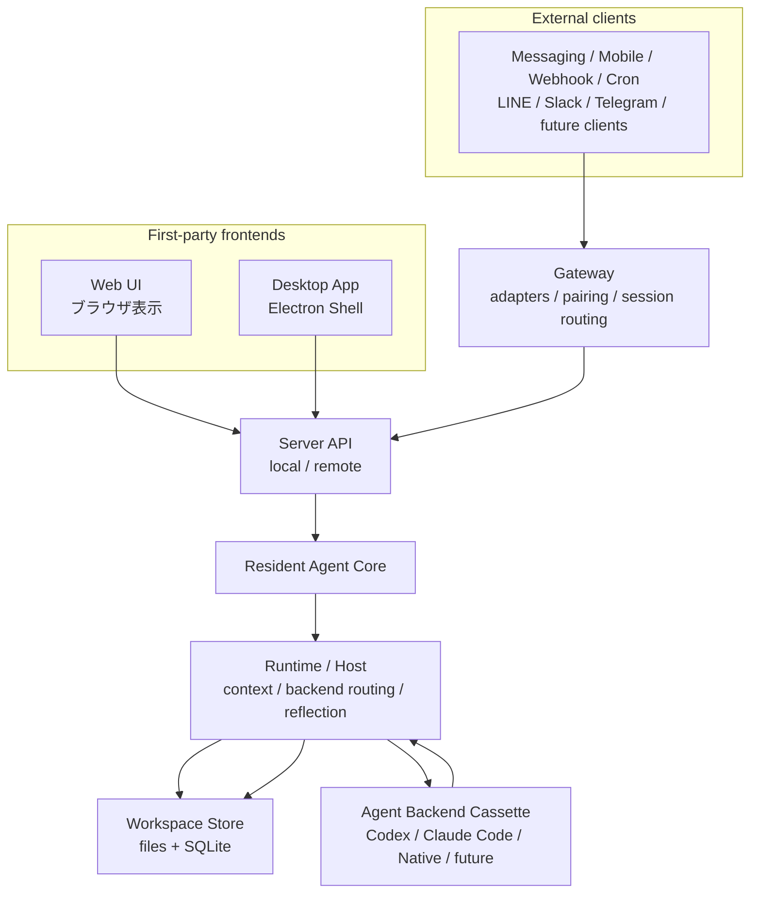
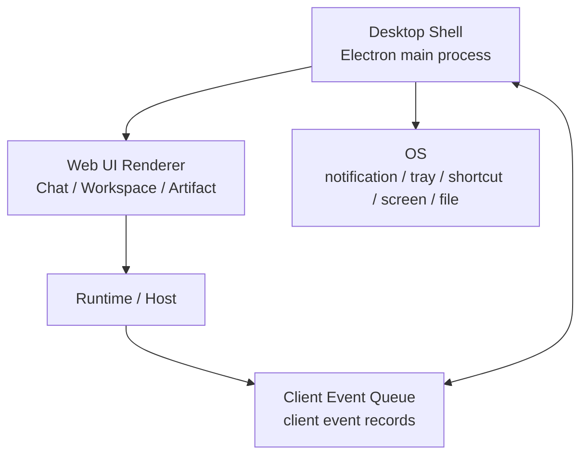
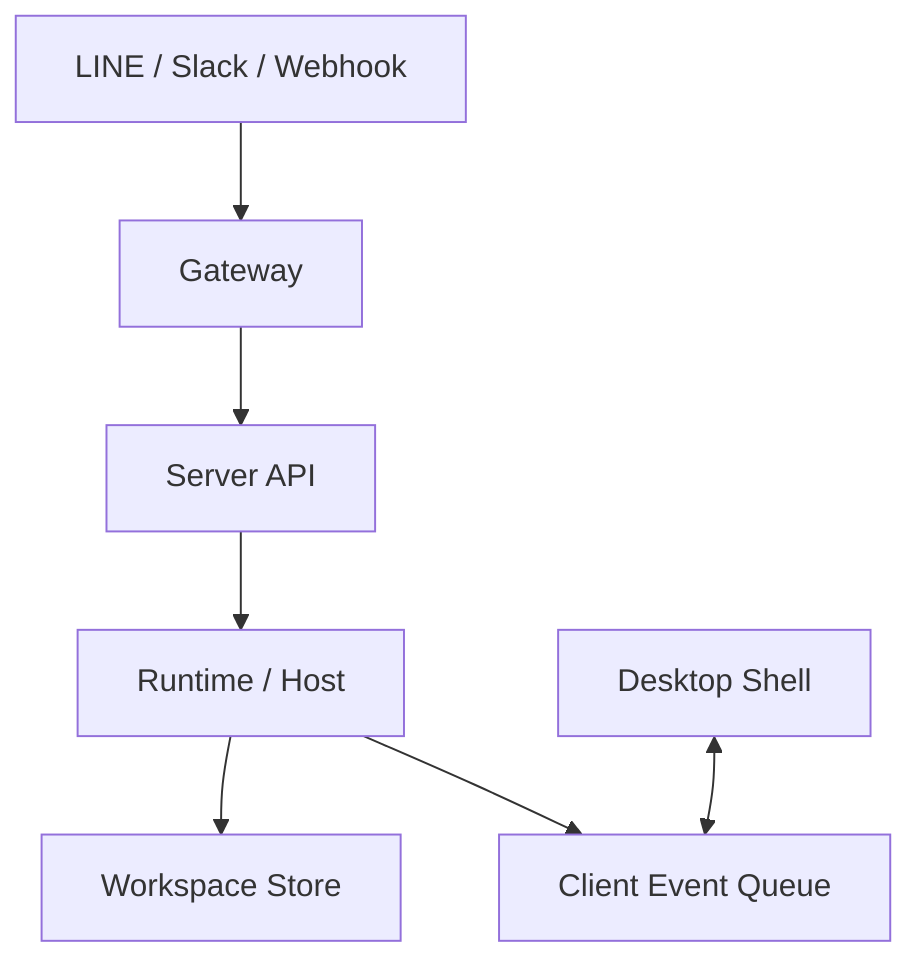
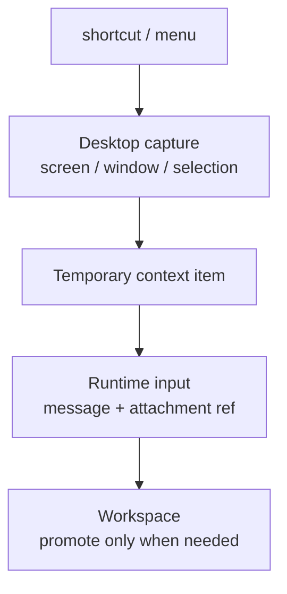

# Electron Desktop Agent Architecture

作成日: 2026-07-08

この資料は、Samurai Agent を Electron で Desktop アプリ化する前提、設計思想、構造、初期実装方針をまとめた内部計画書です。

目的は、単に Web UI をアプリの箱に入れることではありません。

> Samurai Agent を、常駐する Agent Core と GUI-first Workspace を持つ、日常的に呼び出せる Personal Agent Workspace にする。

この文書は `plans/` 内の内部設計資料なので、OpenClaw / Hermes Agent / MulmoClaude などの参照元固有名を比較目的で使います。README、UI文言、API名、package名などの公開面では `PUBLIC_NAMING.md` を優先します。

## 1. 先に結論

- Desktop 化はやる価値がある。
- ただし、Electron Shell を本体にしない。
- 本体は `Resident Agent Core`、`Runtime / Host`、`Workspace Store`。
- Desktop App は、常駐Coreを見るための強いフロント、OS連携窓口、操作席。
- Web UI は消さず、同じ Runtime / Host に接続できる表示面として残す。
- Gateway は LINE / Slack / Webhook / Cron など外部入口を扱う。
- Mobile は当面フルアプリにせず、簡易リモコン、通知、Workspaceへの誘導に割り切る。
- Generative UI は Desktop / Web Workspace 側を主戦場にする。
- LINEなどのMessaging側では、テキスト要約、簡易ボタン、リンク、通知に絞る。

Samurai Agent の最終像は、以下の言い方が一番近いです。

```text
Samurai = 常駐するAI秘書Core + GUI-first Workspace + Gateway入口
```

## 2. なぜWebだけでは足りないか

Web UI は開発しやすく、共有しやすい一方で、日常のAIアシスタント体験には弱いです。

| 観点 | Webだけ | Desktop App |
| --- | --- | --- |
| 存在感 | ブラウザタブに埋もれる | アプリとしてPCに常駐できる |
| 呼び出し | URLを開く必要がある | グローバルショートカットで呼べる |
| OS連携 | 制限が大きい | 通知、トレイ、ファイル、スクショを扱える |
| 今見ている画面 | 渡しにくい | AppShot / 画面キャプチャとして渡せる |
| 長時間タスク | タブやブラウザ状態に引っ張られる | Coreを別常駐にすれば安定しやすい |
| アシスタント感 | サービスを開く感覚 | PCにいる相棒という感覚 |

重要なのは、Desktop化そのものではなく、次の体験です。

- 今の作業中にすぐ呼べる。
- 今見ている画面や選択テキストを渡せる。
- 完了や確認待ちを通知で受け取れる。
- 必要なときだけWorkspaceを開ける。
- 長時間タスクや定期実行はCore側で回る。

## 3. 参照OSSから見た位置づけ

### 3.1 OpenClaw

OpenClaw は、Gateway / channel / session routing がかなり主役です。

```text
Messaging / Web / Apps
  ↓
Gateway daemon
  ↓
Session routing / workspace / tools
  ↓
Agent runtime
```

強い点。

- どこからでも呼べる。
- 常駐daemonとGatewayの発想が強い。
- 外部チャネル、pairing、session routing、sandbox境界が整理されている。
- Human-in-the-loop より Human-on-the-loop に寄せやすい。

弱い点。

- rich GUI / Generative UI は主役になりにくい。
- Desktop Workspace が補助的になりやすい。
- 体験がチャットボット + 裏側Agentに寄りやすい。

### 3.2 Hermes Agent

Hermes Agent は、入口が複数ある一方で、主役は Memory / Skill / Reflection を含む自己改善Runtimeです。

```text
CLI / TUI / Messaging Gateway
  ↓
Hermes Runtime
  ↓
Memory / Skill / Reflection / Automation
  ↓
Tools / terminal backends
```

強い点。

- 学習ループが主役。
- 常駐実行、cron、長時間タスクに向いている。
- Agent が使うほど育つ思想が強い。
- コーディング専用Agentより日常タスク自動化に寄せやすい。

弱い点。

- TUI / CLI / Messaging は便利だが、メッセージングの枠から出にくい。
- 成果物、表、グラフ、顧客情報、作業状態を画面で扱う体験は薄くなりやすい。

### 3.3 MulmoClaude

MulmoClaude は、GUI / Host / Workspace / Artifact / Collection の発想が強いです。

```text
Local server
  ↓
Web UI / Canvas
  ↓
Claude Code / Plugins
  ↓
Workspace files
```

強い点。

- Chat + Workspace + Canvas の体験が強い。
- Generative UIを自然に扱いやすい。
- ローカルWorkspaceと成果物の扱いに向いている。

弱い点。

- 世の中的な流行は OpenClaw / Hermes ほどではない。
- 常駐性、どこからでも呼べる感、Gateway-firstの強さは相対的に弱い。
- 外部チャネル対応が後付けになりやすい。

### 3.4 Samuraiの採用方針

Samurai は、どれか一つに寄せ切らない。

```text
MulmoClaude から借りるもの:
  GUI / Workspace / Artifact / Collection / Generative UI

Hermes Agent から借りるもの:
  Memory / Skill / Reflection / self-improvement loop / automation

OpenClaw から借りるもの:
  Gateway / pairing / session routing / external boundary / always-on daemon感
```

Samurai の主語は、Gateway Agent ではなく `GUI-first Personal Agent Workspace` です。

ただし、OpenClaw / Hermes が受けた理由である `常駐性`、`どこからでも呼べること`、`閉じたループで回り続けること` は捨てない。

## 4. 全体構造

### 4.1 入口は複数、本体は同じ

どの入口から入っても、最終的には同じ `Runtime / Host` に入ります。



この図でのポイント。

- Web / Desktop は、WorkspaceとGenerative UIを表示できる一級フロント。
- Messaging / Mobile / Webhook / Cron は、Gatewayの上流にある外部クライアント。
- Gateway はユーザー向け画面ではなく、外部入口をRuntimeへ渡す境界。
- `Runtime / Host` が判断と実行の中心。
- `Workspace Store` が成果物、記憶、履歴の正本。
- `Agent Backend Cassette` は実作業をする差し替え可能な実行部。
- Desktop は強い入口だが、本体ではない。
- 将来、Native Mobile Appを作る場合だけ、MobileはWeb / Desktopと並ぶ一級フロントへ昇格できる。

### 4.2 Desktop固有イベントは別ルート

Desktopだけが持つ操作があります。

- 通知を出す。
- ウィンドウを開く。
- tray / menu bar を更新する。
- グローバルショートカットを受ける。
- 一時スクショを撮る。
- OS deep link を開く。

これらは `Runtime / Host` の中に直接混ぜません。



判断基準。

- Runtime は「何を表示すべきか」「何が完了したか」をイベント化する。
- Desktop Shell は「どうOSに出すか」を担当する。
- Desktop Shell が Memory / Skill / Workspace 正本を直接更新しない。
- Desktop Shell が Agent Backend を直接実行しない。

### 4.3 GatewayからDesktopを直接操作しない

Gateway経由で来た操作が、Desktop Shellを直接叩く構造にはしない。



例。

1. LINEから「資料を整理して」と依頼する。
2. Gatewayがsource identityとsession routingを解決する。
3. RuntimeがBackendに作業を流す。
4. WorkspaceにArtifactやMemory候補が保存される。
5. Runtimeが「Desktopで開くべきイベント」をClient Event Queueへ置く。
6. 起動中のDesktop Shellが拾って通知やWorkspace表示を行う。

Desktopが起動していない場合。

- タスク受付とWorkspace更新は続ける。
- Messaging側には完了要約とWorkspaceリンクを返す。
- Desktop固有操作はpending、expired、またはskipにする。

## 5. レイヤー別責務

| レイヤー | 役割 | 持たない責務 |
| --- | --- | --- |
| Resident Agent Core | 常駐プロセス。Server API、Runtime、queue、schedulerを支える | OS UI操作そのもの |
| Server API | Web / Desktop / Gateway からのHTTP/WebSocket入口 | Workspace正本の判断 |
| Runtime / Host | 文脈構築、Backend選択、Reflection、Workspace更新指示 | Electron window管理 |
| Workspace Store | filesystem正本 + SQLite index/history/queue | Agentの判断ロジック |
| Agent Backend Cassette | Codex / Claude Code / Nativeなどの実行部 | Workspace正本管理 |
| Gateway | 外部入口、pairing、source identity、session routing | Desktopの直接操作 |
| Desktop Shell | OS連携、tray、通知、shortcut、screen capture、deep link | Runtime / Memory / Skillの正本 |
| Web UI Renderer | Chat / Workspace / Artifact / Context Drawerの表示 | Node権限、OS API直接操作 |
| Mobile / Messaging | 簡易リモコン、通知、要約、リンク | Generative UIの完全再現 |

## 6. Electronでやる意味

Electron の価値は、Web UIを包むことではありません。

Desktop App だからできる、日常導線を作ることです。

| 機能 | 価値 | 初期方針 |
| --- | --- | --- |
| Global Quick Ask | どのアプリを使っていても即呼べる | v1で必須 |
| Tray / menu bar | 常駐している感、状態確認 | v1で必須 |
| OS notification | 完了、確認待ち、失敗を返す | v1で必須 |
| Deep Link | LINEや通知から該当Workspaceを開く | v1で必須 |
| AppShot | 今見ている画面をAIに渡す | v1.1候補 |
| 選択テキスト送信 | 他アプリの文章をそのまま要約/翻訳/返信 | v1.1候補 |
| Drag & Drop | ファイルやフォルダをWorkspaceへ投げる | v1.1候補 |
| Watch Folder | 領収書、資料、スクショを自動整理候補化 | Core側中心で後段 |
| Push-to-talk | 作業中に音声メモを送る | 後段 |
| Overlay answer | 今のアプリ上に小さい回答を出す | 後段 |

初期に入れるべき順番。

1. Global Quick Ask
2. Tray / menu bar
3. OS notification
4. Deep Link
5. AppShot
6. 選択テキスト送信
7. Drag & Drop

## 7. Desktop機能の詳細

### 7.1 Global Quick Ask

目的。

- Samuraiを「開く」ではなく「呼ぶ」体験にする。
- PC作業中に小さい入力欄を出し、短い依頼を投げられるようにする。

動作。

```text
global shortcut
  ↓
Desktop Shell opens Quick Ask window
  ↓
user submits text
  ↓
Server API / Runtime receives message.submit
  ↓
Workspace / Chat session updates
```

実装方針。

- Electron main process が globalShortcut を管理する。
- Quick Ask は小さいBrowserWindowまたは既存Renderer内の専用modeとして開く。
- 入力送信は既存 `message.submit` / SurfaceOperation 系に寄せる。
- Quick Askから直接Backendを呼ばない。

### 7.2 Tray / menu bar

目的。

- Samuraiが常駐している感を出す。
- 実行中、確認待ち、Gateway接続状態を軽く見せる。

表示候補。

- Open Samurai
- Quick Ask
- Running tasks
- Waiting for confirmation
- Last completed
- Gateway status
- Quit

実装方針。

- Desktop Shell はCoreからstatus summaryを購読する。
- 状態の正本はCore / Workspace / SQLite側。
- Trayは表示と操作入口だけを持つ。

### 7.3 OS notification

目的。

- 長時間タスク、Gateway経由タスク、定期実行の結果を人間へ返す。

通知種別。

- `run.completed`
- `run.failed`
- `backend.waiting_for_native_input`
- `memory.suggestion_created`
- `skill.candidate_created`
- `gateway.message_received`

通知アクション候補。

- Open
- Stop
- Later
- View Run

実装方針。

- RuntimeはClient Event Queueに通知イベントを作る。
- Desktop ShellがOS通知として表示する。
- 通知クリックは `samurai://session/...` や `samurai://artifact/...` と同じルーティングへ寄せる。

### 7.4 Deep Link

目的。

- 通知、LINE、メール、Run HistoryからDesktopの該当画面へ直接移動する。

候補。

```text
samurai://session/<session_id>
samurai://artifact/<artifact_id>
samurai://run/<run_id>
samurai://workspace
samurai://quick-ask
```

実装方針。

- Electron main processでprotocol handlerを登録する。
- URLはrendererへ渡し、Web UI側のroute/stateに変換する。
- deep linkはDesktop専用ではなく、Web URLへ変換できる形も残す。

### 7.5 AppShot / 一時スクショ

目的。

- 「今見ている画面」をそのままAIへ渡す。
- エラー画面、Webページ、資料、デザイン、設定画面を説明なしで相談できるようにする。

動作。



重要な方針。

- デフォルトは一時扱い。
- 勝手に長期保存しない。
- Artifact化は、ユーザー操作またはRuntime判断により明示的に行う。
- 画面録画や常時監視は初期スコープ外。
- 画面キャプチャ権限がない場合は、自然文で案内する。

実装方針。

- Electron `desktopCapturer` を候補にする。
- 最初は full screen / window capture から始める。
- 範囲選択UIは後段でよい。
- 画像は一時ファイルまたは一時blobとしてRuntimeへ渡す。
- 保存先や保持期限を明示する。

### 7.6 選択テキストをSamuraiへ送る

目的。

- ブラウザ、メール、エディタ、PDFなどで選択した文章をそのままSamuraiへ渡す。

ユースケース。

- 翻訳して。
- 要約して。
- 返信文を作って。
- タスク化して。
- このエラーを説明して。

実装方針。

- 初期は clipboard 経由が現実的。
- ショートカット押下時に現在のclipboardを読む方式から始める。
- OS横断の「現在選択範囲を直接読む」は権限や実装差が大きいため後段。
- 読み取ったテキストはQuick Askの入力欄に挿入し、送信前にユーザーが確認できるようにする。

### 7.7 ファイル / フォルダ投入

目的。

- FinderからPDF、CSV、画像、フォルダを自然に投げる。

実装方針。

- Rendererのdrag & dropで受ける。
- Desktop Shellは必要に応じてfile pathを安全に渡す。
- Runtime / Workspace側でArtifactまたはCollection候補に変換する。
- フォルダ全体の自動走査は許可範囲と除外ルールを持つ。

### 7.8 Watch Folder

目的。

- ダウンロード、スクショ、領収書、議事録などを自動で整理候補にする。

実装方針。

- 本体はResident Agent Core側。
- Desktop Shellは設定UIと通知だけ担当する。
- 初期では実装しない。
- 後段で `watched_paths` と `automation jobs` に接続する。

## 8. Client Event Queue

Desktop固有操作は、Runtimeから直接Electron APIを呼ばず、Queueを挟む。

### 8.1 目的

- RuntimeとDesktop Shellを疎結合にする。
- Desktop未起動時にもイベントを扱える。
- 通知、画面オープン、確認待ちを履歴化できる。
- Web / Desktop / Mobileで見える状態を揃える。

### 8.2 最小データ形

```text
ClientEventRecord
  id
  target_client_kind: desktop | web | any
  target_client_id?: string
  event_type: string
  status: pending | delivered | acked | expired | failed
  payload: json
  resource_refs: ResourceRef[]
  created_at
  delivered_at?
  acked_at?
  expires_at?
  error_code?
```

### 8.3 初期event type

```text
client.notification.requested
client.workspace.open_requested
client.session.open_requested
client.artifact.open_requested
client.run.open_requested
client.status.refresh_requested
```

Desktop発のイベントは、別の入力として扱う。

```text
desktop.quick_ask.submitted
desktop.capture.created
desktop.deep_link.opened
desktop.file_dropped
desktop.text_selection.submitted
```

### 8.4 配送方式

初期方針。

- SQLiteにpending eventを保存する。
- Desktop ShellはWebSocketまたはpollingで購読する。
- 受け取ったら `delivered`、処理完了で `acked` にする。
- 期限切れは `expired` にする。

理由。

- in-memoryだけだとDesktop再起動で消える。
- RuntimeがDesktopの起動状態を強く意識しなくてよい。
- Gateway経由タスクの完了通知にも使いやすい。

## 9. プロセス構成

### 9.1 開発時

```text
pnpm dev
  ↓
apps/server  : API / Runtime
apps/web     : Vite Web UI
apps/desktop : Electron Shell
```

開発時のDesktop Shellは、既存Vite dev serverを読み込んでよい。

```text
Electron main
  ↓
BrowserWindow loads http://127.0.0.1:5173
  ↓
Renderer calls http://127.0.0.1:4317
```

### 9.2 パッケージ時

```text
Electron main
  ↓
start or connect Resident Agent Core
  ↓
load packaged Web UI build
  ↓
Renderer calls local API
```

重要な方針。

- Electron main がRuntimeそのものにならない。
- Electron main はCoreの起動、監視、接続、OS連携を担当する。
- Resident Agent Coreは将来、Electronなしでもdaemonとして動ける余地を残す。

### 9.3 初期の現実解

最初から完全なdaemon分離にしすぎない。

初期実装では、以下でよい。

- `apps/desktop` を追加する。
- Electron main が既存serverに接続する。
- serverが起動していなければ、開発時は案内を出す。
- パッケージ時のCore起動は後続で固める。
- ただし設計上は、RuntimeをElectron mainへ埋め込まない。

## 10. 実装ロードマップ

このPhase分けは、途中で止めるための区切りではありません。

目的は、順番を間違えずに実装し、最終的にこの文書の `19. 実装完了テスト 100点満点` をすべて満たすことです。

途中のPhase完了は、次のPhaseへ進むための確認点にすぎません。
Desktop化としての完了判断は、100点基準を満たし、Web / Runtime / Workspace / Gateway の責務を壊していないことをもって行います。

### 10.1 Phase 0: 文書化

この文書。

完了条件。

- Electron化の目的が「Webの包装」ではないことが明文化されている。
- Resident Core / Desktop Shell / Gateway / Web UI の責務が分かれている。
- 初期Desktop機能の優先順位が決まっている。

### 10.2 Phase 1: Desktop Shell基盤

追加候補。

```text
apps/desktop/
  package.json
  src/main.ts
  src/preload.ts
  src/config.ts
```

実装内容。

- Electronで既存Web UIを表示する。
- main processでTrayを作る。
- global shortcutでwindowをshow/hideする。
- deep link protocolを登録する。
- rendererへのIPCはpreload経由に限定する。
- `contextIsolation: true`、`nodeIntegration: false` を前提にする。
- server health checkを行い、未接続なら短いエラー画面を出す。

完了条件。

- Desktop Appから既存Chat UIを開ける。
- ショートカットで表示/非表示できる。
- TrayからOpen / Quick Ask / Quitを選べる。
- `samurai://workspace` 相当のdeep linkを受けられる。
- Web UIの既存操作はブラウザ版と同じRuntimeへ流れる。

### 10.3 Phase 2: Client Event Queue

実装内容。

- Core側にClient Event Queueを追加する。
- Desktop Shellがイベントを購読する。
- Runtimeから通知要求、Workspace open要求を発行できる。
- Desktop Shellが処理結果をackする。

完了条件。

- Backend run完了時にDesktop通知を出せる。
- 通知クリックで該当session/run/artifactを開ける。
- Desktop未起動時のeventがpendingまたはexpiredとして扱える。

### 10.4 Phase 3: Quick Ask

実装内容。

- global shortcutで小さいQuick Askを開く。
- 入力を既存SurfaceOperation / message submitへ流す。
- 送信後、必要なら通常Workspace画面を開ける。

完了条件。

- どのアプリを使っていてもQuick Askを呼べる。
- Quick Askの依頼が通常Chat sessionとして残る。
- Runtime / Memory / Skill / Artifactの流れは通常Chatと同じ。

### 10.5 Phase 4: AppShot / 選択テキスト

実装内容。

- 一時スクショを取得する。
- 取得結果を一時context itemとして扱う。
- 明示操作でChat inputへ添付する。
- clipboard経由で選択テキストをQuick Askへ入れる。

完了条件。

- 現在画面を一時画像としてSamuraiへ渡せる。
- 勝手に長期保存しない。
- 必要な場合だけArtifactへ昇格できる。
- 選択テキストは送信前にユーザーが確認できる。

### 10.6 Phase 5: 完了基準の全消化

実装内容。

- `19. 実装完了テスト 100点満点` の全項目を確認する。
- 未達項目を残さず、必要なRuntime / Workspace / Gateway側の接続も完了させる。
- Desktopだけで見かけ上動く状態ではなく、ブラウザ版Web UIとの共通経路、Run History、Backend event、Workspace保存まで揃える。
- セキュリティ、Privacy、OS権限、deep link、通知失敗時の扱いを含めて確認する。

完了条件。

- 100点基準の全項目を満たしている。
- Electron Shellが本体化していない。
- Runtime / Host / Workspace / Gateway の責務境界が保たれている。
- ブラウザ版Web UIの主要操作が壊れていない。
- 検証できない項目を黙って完了扱いにしていない。

## 11. UI方針

Desktop化しても、Web UIの基本方針は変えない。

- Dark-only
- Chat-first
- Workspace on demand
- Low text
- Calm operational UI

Desktopで増やすUIは、主画面を重くしない。

増やしてよいもの。

- Tray menu
- Quick Ask window
- 通知
- AppShot capture UI
- Deep link routing
- Desktop connection status

増やさないもの。

- 大きなDashboard
- OS設定だらけのSettings
- Gateway管理画面
- Memory / Skill / Run Historyを左サイドバーへ常時羅列

## 12. Security / Privacy

Desktop AppはOS権限を扱うので、Web UIより慎重にする。

原則。

- 画面キャプチャは明示操作だけ。
- 常時スクリーン監視はしない。
- 選択テキストやclipboardは、送信前に見える形にする。
- 一時スクショはデフォルトで長期保存しない。
- ファイル/フォルダ投入は、ユーザーが選んだものだけ扱う。
- SecretやAPI key入力欄をDesktop Settingsに増やさない。
- Runtime / Gateway / Backendの境界を迂回しない。

Electron設定の初期方針。

```text
contextIsolation: true
nodeIntegration: false
sandbox: true where possible
preload exposes minimal APIs
external links open via OS browser
IPC channels are allowlisted
```

IPCで避けること。

- arbitrary file read
- arbitrary shell execution
- rendererから直接OS API呼び出し
- rendererから直接Workspace正本を書き換える処理

## 13. Gateway / Mobileとの関係

Mobileアプリは初期では作らない。

当面のMobile / Messagingの役割。

- タスクを投げる。
- 実行状況を受け取る。
- 完了要約を見る。
- 必要ならDesktop / Web Workspaceへのリンクを開く。
- 簡易ボタンで `open`、`stop`、`later` などを返す。

やらないこと。

- PCのGenerative UIをMessaging上で完全再現する。
- LINE内に複雑なWorkspace Canvasを作る。
- GatewayからDesktop Shellを直接操作する。

正しい関係。

```text
Messaging / Mobile
  ↓
Gateway
  ↓
Runtime / Host
  ↓
Workspace
  ↓
Client Event Queue
  ↓
Desktop Shell
```

## 14. 実装時に迷った時の判断基準

1. 本体は `Runtime / Host / Workspace` に置く。
2. Electron ShellはOS連携と表示に絞る。
3. Gatewayは外部入口に絞る。
4. Desktop固有操作はClient Event Queueを通す。
5. GUIで見えるべきものをログやプロンプトだけに閉じ込めない。
6. AppShotやclipboardは一時扱いを基本にする。
7. Generative UIはDesktop / Web Workspaceを本命にする。
8. Mobile / Messagingは簡易リモコンにする。
9. Backend cassetteを固定しない。
10. 参照OSS固有名を公開面に出さない。

## 15. その他禁止事項

Electron化では、便利に見える近道ほど責務境界を壊しやすい。

以下は禁止する。

- バグ修正時に、一時的な回避策や見かけだけ成功する修正を入れない。
- 原因がRuntime / Gateway / Workspaceにあるのに、Electron側だけで握りつぶして直ったように見せない。
- Electron main processにRuntime、Memory、Skill、Workspace正本の責務を持たせない。
- Desktop ShellからWorkspace Storeを直接書き換えない。
- GatewayからDesktop Shellを直接操作しない。
- Rendererに `nodeIntegration: true` を許可しない。
- Rendererへ広すぎるIPCや任意file read / shell execute APIを公開しない。
- 画面キャプチャ、clipboard、選択テキストを明示操作なしに取得しない。
- 一時スクショやclipboard内容を、明示操作なしにMemory / Knowledge Wiki / Artifactへ長期保存しない。
- 長時間タスクやGateway経由タスクを、Desktop windowの生存に依存させない。
- packaged環境の接続先を、開発用localhost固定のままにしない。
- Secret、API key、個人tokenをDesktop Settingsに保存する導線を追加しない。
- OpenClaw / Hermes Agent / MulmoClaude などの参照元固有名を、UI文言、API名、package名、env/config keyへ出さない。
- typecheck、lint、testを黙って無効化して完了扱いにしない。
- Electron化と無関係なUI整理、命名整理、Gateway大改修を同じPRに混ぜない。

## 16. テスト観点

### 16.1 Desktop Shell

- Electron appが起動する。
- Web UIが表示される。
- Server API health checkが成功する。
- Server未起動時に分かるエラーが出る。
- Tray menuが出る。
- global shortcutでwindow show/hideできる。
- deep linkで該当画面を開ける。

### 16.2 Runtime連携

- Desktopから送ったmessageが通常Chatと同じsessionに残る。
- Backend runが通常通り作られる。
- Workspace updateが通常通り保存される。
- Artifact / Memory / Skill候補が通常経路に乗る。

### 16.3 Client Event Queue

- Runtimeからpending eventを作れる。
- Desktop Shellがeventを受け取れる。
- 処理後にackできる。
- Desktop未起動時にeventが失われない。
- 期限切れeventがexpiredになる。

### 16.4 AppShot / 一時コンテキスト

- スクショ取得権限がない場合に自然文で案内する。
- スクショが一時扱いになる。
- 明示操作なしに長期Artifact化されない。
- 添付した画像がRuntime入力として扱われる。

### 16.5 回帰確認

- ブラウザ版Web UIが壊れていない。
- `pnpm typecheck` が通る。
- 対象パッケージのbuildが通る。
- 既存Gateway / Runtime / Workspaceの責務がElectron側へ漏れていない。

## 17. 完成まで回す実装方針

この計画は、途中で動いたところまでを完了扱いするためのものではありません。

実装のゴールは、Electron Desktop化として「できた」と言える状態まで完走することです。
つまり、`19. 実装完了テスト 100点満点` の全項目を満たすまでを一つの完成単位として扱います。

実装順。

1. `apps/desktop` を追加し、Electron Shell基盤を作る。
2. 既存Web UIをDesktop内で表示し、Server API health checkを通す。
3. Tray / menu bar、global shortcut、deep linkを完成させる。
4. Quick Askを通常のmessage submit経路へ接続する。
5. Client Event Queueを追加し、通知、open要求、ack、expireを扱えるようにする。
6. OS notificationをrun完了、失敗、確認待ちに接続する。
7. AppShot / clipboard / 選択テキストを一時contextとして扱う。
8. Gateway経由タスクがRuntime / Workspace / Client Event Queueを通ってDesktopへ返ることを確認する。
9. 100点基準に沿って、検証、回帰確認、責務境界確認を完了する。

途中で守ること。

- 実装中に必要ならRuntime / Workspace / Gateway側も触ってよい。
- ただしElectron側へRuntime、Memory、Skill、Workspace正本の責務を移さない。
- Desktopだけで見かけ上成功する処理にしない。
- AppShot、clipboard、選択テキストは、明示操作とユーザー確認を必ず挟む。
- 100点基準に未達項目がある状態を、Desktop化完了とは呼ばない。

## 18. 最終イメージ

Samurai Agent のDesktop化は、以下を目指す。

```text
PC上で常駐するAI秘書Coreがいる。
ユーザーはショートカット、tray、通知、Workspaceから触れる。
外部からはGateway経由で依頼できる。
成果物、記憶、手順、履歴はWorkspaceに戻る。
DesktopはそのCoreを操作する最も強いフロントである。
```

この設計なら、OpenClaw / Hermes 的な `常駐性` と `どこからでも呼べること` を捨てずに、MulmoClaude 的な `GUI / Workspace / Generative UI` の強みも残せます。

結論。

> Electron化は、Samurai Agentを「Webサービス」から「PCに常駐するPersonal Agent Workspace」へ近づけるために意味がある。
> ただし、Electron Shellは本体ではない。
> 本体はResident Agent Core、Runtime / Host、Workspaceであり、Desktop Appはその顔と操作席である。

## 19. 実装完了テスト 100点満点

この採点表は、Electron Desktop化を「できた」と言えるかを判定するための完了基準です。

採点の考え方。

- 100点: Desktop化として完成。次の体験改善へ進める。
- 90点以上: 実用候補。ただし不足項目をrelease blockerとして残す。
- 80点未満: まだDesktop化の価値が弱い。
- 70点未満: WebをElectronで包んだだけに近い。

各項目は2点。完了していれば2点、未完了なら0点。曖昧な部分点は付けない。

### 19.1 Desktop Shell基盤: 10点

| No | 点数 | 完了条件 |
| ---: | ---: | --- |
| 1 | 2 | `apps/desktop` が追加され、root workspaceからdesktop appを起動できるscriptがある。 |
| 2 | 2 | Electron appが起動し、BrowserWindowで既存Web UIを表示できる。 |
| 3 | 2 | dev環境とpackaged環境のURL / path設定が分かれている。 |
| 4 | 2 | Server APIのhealth checkに成功した時だけ通常UIへ進める。 |
| 5 | 2 | Server API未接続時に、原因と次の行動が分かる短いエラー表示になる。 |

### 19.2 Runtime分離: 10点

| No | 点数 | 完了条件 |
| ---: | ---: | --- |
| 6 | 2 | Electron main processがRuntime / Workspace Store / Memory / Skillの内部APIを直接importしない。 |
| 7 | 2 | Desktopからの操作はServer API、SurfaceOperation、または許可済みIPCを通る。 |
| 8 | 2 | 長時間runやGateway経由runがDesktop windowのopen/closeに依存しない。 |
| 9 | 2 | Desktop windowを閉じても、Core側の実行状態やWorkspace保存状態が壊れない。 |
| 10 | 2 | Desktop Shellの責務がOS連携、表示、通知、deep link、shortcutに限定されている。 |

### 19.3 Web / Desktop共通体験: 8点

| No | 点数 | 完了条件 |
| ---: | ---: | --- |
| 11 | 2 | Desktopから送ったmessageが、ブラウザ版と同じChat session保存経路に入る。 |
| 12 | 2 | Desktopから生成されたBackendRunが、通常のRun History / Backend eventに残る。 |
| 13 | 2 | DesktopでArtifact / Workspaceを開いても、ブラウザ版と同じresource id / APIを使う。 |
| 14 | 2 | Electron追加後も、ブラウザ版Web UIの主要操作が壊れていない。 |

### 19.4 Tray / Shortcut / Quick Ask: 10点

| No | 点数 | 完了条件 |
| ---: | ---: | --- |
| 15 | 2 | Trayまたはmenu barにOpen / Quitがある。 |
| 16 | 2 | Trayまたはmenu barに現在の接続状態または実行状態が表示される。 |
| 17 | 2 | global shortcutでmain windowのshow/hideができる。 |
| 18 | 2 | global shortcutでQuick Ask UIを開ける。 |
| 19 | 2 | Quick Askの送信が通常のmessage submit経路に入り、sessionに残る。 |

### 19.5 Deep Link: 8点

| No | 点数 | 完了条件 |
| ---: | ---: | --- |
| 20 | 2 | `samurai://` protocol handlerが登録される。 |
| 21 | 2 | `samurai://session/<id>` で該当sessionを開ける。 |
| 22 | 2 | `samurai://artifact/<id>` または `samurai://run/<id>` で該当resourceを開ける。 |
| 23 | 2 | 不正または存在しないdeep linkでクラッシュせず、分かるエラー表示になる。 |

### 19.6 Client Event Queue: 12点

| No | 点数 | 完了条件 |
| ---: | ---: | --- |
| 24 | 2 | `ClientEventRecord` 相当の保存先があり、`pending / delivered / acked / expired / failed` を表現できる。 |
| 25 | 2 | RuntimeまたはServer APIからclient eventを作成できる。 |
| 26 | 2 | Desktop ShellがWebSocketまたはpollingでpending eventを受け取れる。 |
| 27 | 2 | Desktop Shellがevent処理後に `delivered` または `acked` を返せる。 |
| 28 | 2 | Desktop未起動時のeventが失われず、期限切れ時は `expired` になる。 |
| 29 | 2 | queueの作成、配送、ack、expireを確認するテストまたは検証手順がある。 |

### 19.7 OS通知: 8点

| No | 点数 | 完了条件 |
| ---: | ---: | --- |
| 30 | 2 | run完了時にOS通知を出せる。 |
| 31 | 2 | run失敗または確認待ち時にOS通知を出せる。 |
| 32 | 2 | 通知クリックで該当session / run / artifactへ移動できる。 |
| 33 | 2 | OS通知権限がない、または通知に失敗した時にクラッシュせず状態が残る。 |

### 19.8 Gateway / External Client境界: 8点

| No | 点数 | 完了条件 |
| ---: | ---: | --- |
| 34 | 2 | Messaging / Mobile / Webhook / Cron がGateway上流のExternal clientsとして整理されている。 |
| 35 | 2 | GatewayからDesktop Shellを直接操作する経路が存在しない。 |
| 36 | 2 | Gateway経由の依頼がRuntime / Hostを通り、Workspace更新またはBackendRunとして残る。 |
| 37 | 2 | Gateway経由タスク完了時、Desktopが起動中ならClient Event Queue経由で通知できる。 |

### 19.9 Security / Privacy: 12点

| No | 点数 | 完了条件 |
| ---: | ---: | --- |
| 38 | 2 | Electron BrowserWindowが `contextIsolation: true`、`nodeIntegration: false` を前提にしている。 |
| 39 | 2 | preloadで公開するIPC APIがallowlist化され、入力validationがある。 |
| 40 | 2 | Rendererから任意file read、任意shell execution、Workspace正本の直接書き換えができない。 |
| 41 | 2 | 外部リンクはElectron内で勝手に開かず、OS browserまたは明示的な導線へ逃がす。 |
| 42 | 2 | clipboard / 選択テキスト / スクショは、送信前にユーザーが確認できる。 |
| 43 | 2 | 一時スクショや一時context itemに保持期限またはcleanup方針がある。 |

### 19.10 AppShot / 一時コンテキスト: 8点

| No | 点数 | 完了条件 |
| ---: | ---: | --- |
| 44 | 2 | AppShotは明示操作でのみ起動する。 |
| 45 | 2 | 取得したスクショはデフォルトで一時context itemとして扱われる。 |
| 46 | 2 | AppShotをMemory / Knowledge Wiki / Artifactへ長期保存するには明示操作が必要。 |
| 47 | 2 | スクショ取得権限がない場合に、自然文で次の行動を案内できる。 |

### 19.11 検証 / 文書 / 回帰: 6点

| No | 点数 | 完了条件 |
| ---: | ---: | --- |
| 48 | 2 | `pnpm typecheck` または対象workspaceのtypecheckが通る。 |
| 49 | 2 | 対象desktop packageのbuildまたは起動検証が通る。 |
| 50 | 2 | 実装差分がこの文書、`ARCHITECTURE.md`、`PRINCIPLES.md`、`PUBLIC_NAMING.md` の責務と矛盾していない。 |

満点時の状態。

```text
Desktopは、ただのWebViewではない。
ショートカットで呼べる。
Trayに常駐する。
通知で戻ってくる。
Deep LinkでWorkspaceを開ける。
Gateway経由タスクもDesktopへ自然に返る。
それでも本体はElectronではなく、Resident Agent Core / Runtime / Workspaceに残っている。
```

この100点基準で一番重要なのは、便利機能の数ではありません。

> Desktop Appが強い操作席になりつつ、Runtime / Workspace / Gateway の責務を壊していないこと。
