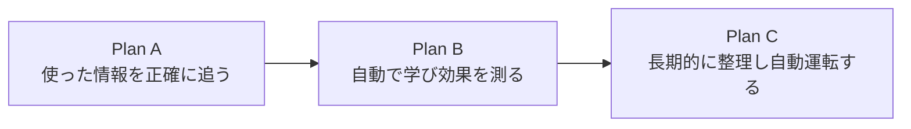

# Learning Core Completion Roadmap

作成日: 2026-07-10

## 0. この文書の位置づけ

この文書は、Samurai Agentの学習Coreを完成させる3つの実装計画を束ねるマスターロードマップである。

正本の優先順位は以下とする。

1. `PRINCIPLES.md`
2. `ARCHITECTURE.md`
3. `PUBLIC_NAMING.md`
4. この文書と配下の実装計画

参照する個別計画。

1. `plans/learning-core-plan-a-context-retrieval.md`
2. `plans/learning-core-plan-b-autonomous-review-evaluation.md`
3. `plans/learning-core-plan-c-curator-automation.md`

---

## 1. 先に結論

7個の実装項目を、依存関係に沿って3計画へまとめる。

| 計画 | まとめる領域 | ユーザーから見た変化 |
| --- | --- | --- |
| Plan A | 学習利用記録、Skillのオンデマンド読込、過去会話検索 | AIが必要な手順と過去会話だけを正確に使える |
| Plan B | Hermes型Background Review、自動保存、効果量Evaluation | 作業後に自動で学び、その学習が効いたか測れる |
| Plan C | Evaluation連動Curator、定期実行 | 学習内容が増え続けず、有効な状態へ自動整理される |

3計画は同時に文書化するが、実装は `Plan A → Plan B → Plan C` の順に行う。



---

## 2. 3計画へ分ける理由

### Plan Aが先である理由

効果測定には「どのMemory・Skillを実際に使ったか」が必要である。

現在は、Skillを候補として選んだ時点で利用回数を記録するため、「候補に出ただけ」と「本文を読んで使った」を区別できない。先にこの区別を作らないと、後続のEvaluationが誤った因果関係を学ぶ。

### Plan Bが次である理由

自動学習は、保存するだけでは完成しない。

固定キーワードではなくAgentが会話と実行結果を振り返り、Memory・Skillを自動更新し、その変更が次の実行に効いたか測れるところまでを一つの計画にする。

### Plan Cを最後にする理由

Curatorが品質を判断するにはEvaluation結果が必要である。

先に整理を自動化すると、役立っているが利用頻度の低い学習や、新しいが悪影響のある学習を正しく区別できない。Plan Bの効果量を使える状態にしてから長期運用を閉じる。

---

## 3. 全計画に共通する不変条件

- Chat-first / Workspace-backed / UI on demandを維持する。
- 学習の確認画面は今回作らない。
- Human-in-the-Loopを標準にしない。
- Memory・Skillの自動保存と更新を標準にする。
- 承認機能は将来の任意機能とし、今回の依存条件にしない。
- `success / failure / accepted`のような正式Outcomeモデルを作らない。
- 会話、Backend run、Tool run、Workspace changeなど、既存の事実からEvaluationを導出する。
- 固定キーワードによるReflection判定を廃止する。
- Codex / Claude Code / SamuraiNativeBackendの差し替え構造を壊さない。
- Skill本文を最初から全量Promptへ入れない。
- UI、Server、Runtime、Storeへ同じ学習判断を重複実装しない。
- 学習処理は最初から独立モジュールとして実装し、Hostは調整役に留める。
- 自動変更は削除よりarchiveを優先し、復元可能にする。

---

## 4. 最終的なLearning Core構造

```text
packages/learning/
  usage-trace
  skill-retrieval
  background-review
  evaluation
  curator
  scheduler-policy

packages/workspace-store/
  学習状態、利用記録、評価、実行履歴の永続化

packages/runtime/
  Hostとして各Learning Serviceを呼び出す

packages/agent-backends/
  Background Reviewを実行するBackend adapter

packages/action-catalog/
  skill.viewなどBackendから利用する正準操作
```

`packages/learning`は、Web、Electron、Expressへ依存しない。

Runtimeは以下だけを担当する。

- 通常runの前にContextを組む。
- 学習利用イベントをLearning Serviceへ渡す。
- Background Reviewを起動する。
- EvaluationとCuratorを呼ぶ。
- 結果をStoreへ保存する。

---

## 5. 実装単位

### Plan A: Context / Retrieval Foundation

含むもの。

- 候補選択と実読込を区別する最小利用記録
- `samurai.skill.view`相当の正準操作
- Skill本文、support fileのオンデマンド読込
- Codex / Claude Code / Nativeで共通するSkill読込経路
- Session Searchの日本語対応全文検索

推奨ブランチ。

```text
feat/learning-trace
```

### Plan B: Autonomous Review / Evaluation

含むもの。

- 固定キーワードReflectionの廃止
- Hermes型Background Review fork
- Memory・Skillだけを更新できる制限付き実行環境
- 人間の承認なしでの自動保存
- 正式Outcomeを持たない効果量Evaluation
- 学習変更と実行品質の関連付け

推奨ブランチ。

```text
feat/autonomous-learning-review
```

### Plan C: Curator / Automation

含むもの。

- 利用頻度、古さ、重複、矛盾、効果量を使うCurator
- archive、restore、snapshot、report
- Background Review、Evaluation、Curatorの別周期実行
- 多重実行防止、再試行、診断

推奨ブランチ。

```text
feat/learning-curator-automation
```

---

## 6. 実装しないもの

- 学習候補の確認画面
- 保存、修正、却下を求めるUI
- Desktop / Web固有のLearning画面
- 承認待ちqueueを前提とした学習フロー
- 正式Outcomeテーブル
- Generative UIの追加
- Collectionアプリの追加
- Agent Backendの追加
- 学習Marketplace
- 学習品質を判定する製品全体E2E

各計画内のunit / integration testは行う。ここで対象外にするのは、以前の10番にあった製品全体の完成判定E2Eである。

---

## 7. 計画間の受け渡し契約

### Plan AからPlan Bへ

Plan Aは以下を渡す。

- runごとの実利用resource ID
- Skill本文またはsupport fileを開いた記録
- 利用したresourceのversionまたはcontent hash
- Backend、Session、runとの参照
- 過去会話検索結果の参照

### Plan BからPlan Cへ

Plan Bは以下を渡す。

- Background Reviewの実行記録
- 自動作成・更新したMemory / Skillのprovenance
- 変更前後のversion
- Evaluationのevidence refs
- 効果量、confidence、判定不能状態

### Plan Cの最終出力

- 維持、修正、統合、stale、archiveの判断
- 判断根拠
- 変更前snapshot
- 実行report
- 次回実行予定

---

## 8. 全体完了条件

- Skill候補と実際に読んだSkillを区別できる。
- Skill本文と補助ファイルは必要時だけ読まれる。
- Codex、Claude Code、Nativeのすべてが同じSkill読込契約を使う。
- 日本語の過去会話を単純な部分一致より正確に探せる。
- 固定キーワードなしでBackground ReviewがMemory・Skillを自動更新する。
- 自動学習に人間の承認を要求しない。
- どの学習変更が実行品質へ効いたか、根拠付きで評価できる。
- Curatorが利用頻度だけでなく効果量も判断材料にできる。
- Background Review、Evaluation、Curatorが別モジュール・別周期で動く。
- 自動整理前にsnapshotを取り、archiveから復元できる。
- Runtimeが学習ロジック本体を抱え込まない。

---

## 9. 推奨する進め方

1. 現在の`feat/learning-trace`でPlan Aを完了する。
2. Plan Aをレビュー・統合した後、Plan B用ブランチを作る。
3. Background ReviewとEvaluationを同じPlan B内で接続する。
4. Plan Bを統合後、Plan Cで長期運用を閉じる。
5. 3計画完了後に、Core全体の完成度を再採点する。
