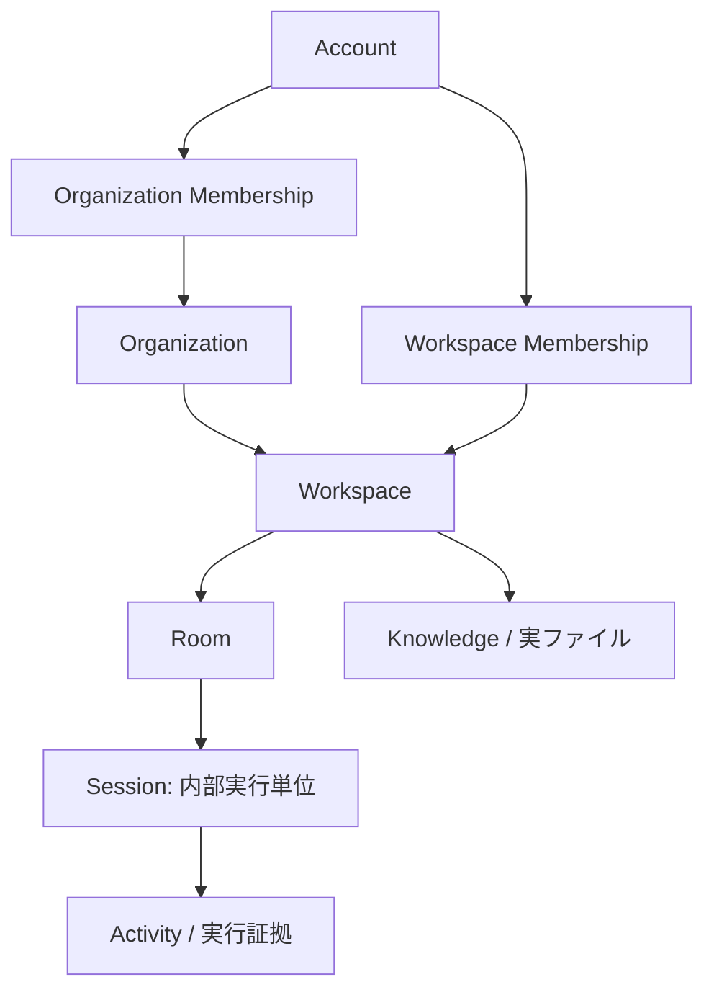
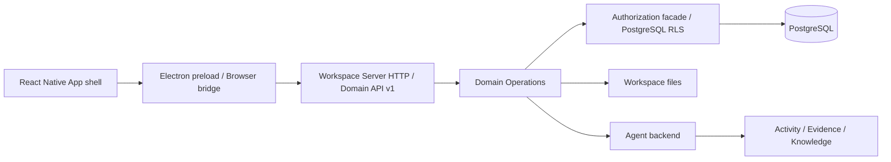

# Native App・Organization 製品化マスタープラン

- 状態: 合意済みの実装計画
- 作成日: 2026-08-31
- 対象: Phase 0〜10。現在の実装対象は Phase 2
- 前提: Phase 0（安全な基盤）と Phase 1（共通 Domain API / Public Event）は実装済み。各完了 Gate の再確認は、この計画の実装・検証時に行う。

## 1. この計画で達成すること

Samurai の価値は画面の多さではなく、利用者の依頼が Agent に実行され、その証拠が残り、学習内容が次の実行で再利用され、人間が確認・修正できることにある。まず次の一本を、Native App と実環境で最後まで通す。

```text
依頼
  → Agent が実行
  → Activity / 実ファイル / 実行証拠を保存
  → 学習内容を確認・修正
  → 次の Agent 実行で再利用を確認
  → 再起動後も同じ状態を開ける
```

Phase 2 の UI は、この体験に必要な画面だけを持つ。これは「認可・移行・永続化を簡略化する MVP」ではない。データモデル、PostgreSQL 認可、既存データ移行、Native App、実 Agent、再起動、失敗復旧を完成させ、後から必要になる画面だけを Phase 5 で磨く。

## 2. 確認済みの現状と、今回更新する正本

### 2.1 現在の実装で確認した事実

| 領域 | 現在の状態 | 主な確認箇所 |
| --- | --- | --- |
| 製品階層 | `Organization → Workspace → Room → Session / Activity / Knowledge` が製品正本にある。Session は利用者に管理させない内部実行単位である。 | `PRODUCT.md`, `ARCHITECTURE.md` |
| Organization | 専用の Organization / Organization Membership / Organization Invitation テーブルと操作は未実装である。 | `packages/workspace-server/src/schema.ts`, `packages/domain-operations/src/operations/` |
| Workspace | `workspaces`、`workspace_members`、Room と招待の基盤はある。 | `packages/workspace-server/src/schema.ts` |
| Event | `workspace_events.organization_id` は存在するが任意で、Organization の実体はない。 | `packages/domain-api/src/index.ts`, `packages/workspace-server/src/schema.ts` |
| Server | Hosted は複数 Workspace を扱える一方、Self-host は設定された一つの Workspace に固定されている。 | `packages/workspace-server/src/config.ts`, `packages/workspace-server/src/workspace-server-store.ts`, `apps/server/src/workspace-server/http-server.ts` |
| Web UI | Vue 3 の Workspace UI があり、Sidebar に Session を出している。 | `apps/web/src/main.ts`, `apps/web/src/AppWorkspace.vue`, `apps/web/src/components/AppSidebar.vue` |
| Desktop | Electron の接続情報、Room、Chat、添付、実行要求の橋渡しがある。 | `apps/desktop/src/main.ts`, `apps/desktop/src/preload.cts`, `apps/desktop/src/workspace-connections.ts` |

### 2.2 今回確定した設計変更

Self-host も、**一つの Samurai Server と PostgreSQL の中で複数 Organization・複数 Workspace を扱う**。Hosted と Self-host で Organization の資源モデルや API を分けない。

したがって、Server は「一つの Workspace の入れ物」ではなく、認可・PostgreSQL・実行・ファイルを提供する配置境界になる。Organization と Workspace は同じ Server の中で管理する。別 Server 間の同期や Organization 横断は Phase 2 の対象外である。

既存の `SAMURAI_SELF_HOST_WORKSPACE_ID` と `selfHostWorkspaceId` は、一 Workspace への実行時固定条件としては廃止する。必要なら既存環境を壊さないための初回移行・bootstrap 用の互換入力として一リリースだけ受け付けるが、リクエストの Workspace を拒否する根拠にはしない。

## 3. Phase 2 の対象範囲

### 含める

- Organization の作成、参加、切替、更新、削除
- Account が複数 Organization に参加できる Membership
- Workspace の Organization 所属、作成、切替、アーカイブ、復元、削除、Organization 間移動
- Organization / Workspace / Room の権限を分離した実 PostgreSQL 認可
- 既存 Account、Workspace、Member、Invitation、Event、Export の安全な移行
- React による Native App の骨格
  - Organization switcher
  - Workspace switcher / list
  - Room list
  - 実際に送受信・停止・再試行できる Chat
  - Organization 管理画面
  - 実行証拠と再利用済み Knowledge を確認する最小表示
- 実 Agent、実 PostgreSQL、実ファイル、再起動後の保持を含む Hosted / Self-host の E2E
- 利用者による繰り返し利用、問題修正、再利用後の最小限の UI 仕上げ

### 含めない

- 決済、請求、詳細な利用量管理
- SSO、SCIM、メール配送設定、複雑な企業監査
- 専用 Compute、別 Server 間の Organization 共有、Federation
- Agent Marketplace、複数 Agent の編成 UI、ACP 実 Agent 連携
- Artifact 専用の完成 UI、Generated Surface の完成 UI、全旧画面の React 再現
- デスクトップの署名、Notarization、Installer、自動更新

メールは Phase 2 で使わない。既存 Account への直接招待と、ワンタイム招待リンク / QR を使うため、Self-host 運用者に SMTP 設定を要求しない。将来の SMTP Adapter はこの設計を壊さず追加できるが、実装しない。

### 要件対応表

| 合意した要件 | 実装計画 | 完了の確認 |
| --- | --- | --- |
| Organization の作成・参加・切替・Membership・役割 | 4.1〜4.3、7.1〜7.3、7.8 | 7.10 の招待・Membership・RLS Gate |
| Workspace 所属・移動・archive・delete・既存データ移行 | 4.4〜4.5、7.1、7.5 | migration、move、bundle の実 DB / 実ファイル E2E |
| Self-host と Hosted を同じ Organization 体験にする | 2.2、5、7.4 | 両環境で複数 Organization / Workspace を操作する E2E |
| React Native App の骨格と Session 非表示 | 7.6〜7.8 | Native App からの Chat と管理操作、Session 非露出 |
| 実 Agent・証拠・学習再利用・人間修正 | 1、7.6、7.9 | evidence / Knowledge ID と DB を照合する E2E |
| 再起動・権限変更・失敗時の正しさ | 7.3、7.4、7.9 | failure E2E と再起動 E2E |
| UI を先に磨かず、使って直してから仕上げる | 6、7.9 | dogfooding と再実行後のみ UI 調整する Gate |
| 決済・SSO・SCIM・専用 Compute 等を後回しにする | 3 | Phase 2 scope 外として実装しない |

## 4. 固定する製品ルール

### 4.1 Organization と Workspace の関係



- Account 作成時には、必ず通常の Organization を一つ自動生成する。「Personal Organization」という別種は作らない。初期名は Account の表示名を基にした変更可能な名前とし、空文字にしない。
- Account は複数 Organization に参加できる。
- 最後の Organization も削除できる。削除後は自動再作成せず、Native App は Organization 作成画面を表示する。
- Workspace は必ず一つの Organization に所属し、Organization を持たない Workspace は残さない。
- Organization Membership だけでは Workspace の内容を読めない。Workspace Membership と Room Membership が内容への権限を決める。
- 見えない Workspace も、Organization 内では存在と名前だけを表示する。Room 名、Message、Activity、添付、Knowledge、Artifact は返さない。
- Session は Sidebar、URL、管理画面に表示しない。既存の実行・復旧用 Session は内部に残す。

### 4.2 Organization の役割

| 役割 | Organization の操作 | Workspace / Room 内容への自動権限 |
| --- | --- | --- |
| Owner | 全操作。Owner 管理、Organization 削除、Organization 間 Workspace 移動を実行できる。 | なし。別途 Workspace / Room Membership が必要。 |
| Admin | Member / Guest の招待・削除・役割変更、Organization 情報編集、Workspace 作成・名前変更・アーカイブ、Workspace Member 割当を行える。Owner の変更、Organization 削除、Organization 間移動、自分の昇格はできない。 | なし。 |
| Member | Organization と許可済み Workspace の存在を確認できる。Organization 管理はできない。 | なし。 |
| Guest | 最小権限の参加者。Organization 管理はできない。 | なし。 |

- Owner は複数人にできるが、最後の Owner は退出・削除・降格できない。
- Member / Guest を削除しても、過去の Message、Activity、Event の actor 表示は消さない。現在のアクセスだけを止める。
- Workspace / Room の既存 role は Organization role に読み替えない。Organization role を新設しても、既存の Workspace / Room コンテンツ権限を広げない。

### 4.3 招待

- 直接招待は既存 Account を選び、Organization role と任意の初期 Workspace grant を指定する。
- ワンタイム招待は raw token を一度だけ見せ、DB には hash だけを保存する。URL / QR はその token を運ぶ。
- 未登録者は token を受諾して Account を作成した後、Membership を得る。
- 有効期限は 30 日。Owner / Admin は revoke、再発行、期限延長を行える。
- 同じ token の同時受諾、同じ Account の再受諾、期限切れ / revoke 後の受諾は idempotent かつ安全に処理する。
- Organization 加入と Workspace grant は別の記録にする。招待に Workspace grant が無ければ、Organization には参加するが内容は見えない。

### 4.4 Workspace のライフサイクルと移動

- Workspace は `active → archived → permanently deleted` とする。archived は閲覧・export・復元のみ可能で、Chat、書込み、Agent 実行を拒否する。
- Organization を削除する前に、全 Workspace を移動または明示削除しなければならない。
- Workspace の Organization 間移動は、移動元・移動先の両方で Owner である Account だけが実行できる。
- 実行前に preview を返し、対象 Workspace、既存 Member、移動先に不足する Membership、書込み停止時間、失敗条件を確認させる。
- 内容を継続して利用できるよう、移動先にいない Workspace Member は、明示確認の上で移動先 Organization の Guest として同じトランザクションで追加する。既存の Workspace / Room role は保持する。
- operation ledger を先に確保し、source Organization ID、target Organization ID、Workspace ID の順で一貫して lock して一つの DB transaction で更新する。失敗時は所属・Membership・Event を全て rollback する。
- 移動後も Room、Agent、Activity、Knowledge、Artifact、実ファイル、履歴は同じ Workspace ID のまま残す。移動 Event には source / target Organization を記録する。

### 4.5 Export / Restore

- Phase 2 では Workspace export / restore を完成させる。Organization 全体 export は完成形の設計に記載するが実装は後続 Phase とする。
- 新しい bundle revision は source Organization reference を manifest に残す。restore では利用者が target Organization を選択し、復元後の Workspace と Event scope は target Organization に結び直す。
- raw invitation token、他 Organization の Membership、認可外のコンテンツは export に含めない。
- 旧 bundle の import 互換性を維持し、旧 bundle には restore 時に target Organization を必須にする。

## 5. 目標アーキテクチャ



次を境界として守る。

- React / Electron / HTTP route は DB を直接変更しない。必ず Query または Domain Operation を通す。
- すべての mutation は caller、Organization、Workspace、Room、idempotency key、Public Event を追跡できる。
- PostgreSQL RLS は最後の防壁とし、HTTP の権限チェックだけで完了扱いにしない。
- `workspace_events.organization_id` は移行後の全 Workspace Event で埋める。caller が省略しても Store が現在の Workspace 所属を解決して補完し、矛盾する値を拒否する。
- Self-host と Hosted は同じ schema、Domain Operation、RLS、HTTP contract を使う。差は配備方法と DB の所有形態だけにする。
- Knowledge / Skill の実ファイルは引き続き Workspace に属する。Organization に移したり、LLM に DB 全体を渡したりしない。

## 6. 全 Phase の順番と Gate

| Phase | 目的 | 状態 | 次へ進む条件 |
| --- | --- | --- | --- |
| 0 | operation ledger、安全な変更境界、基盤の是正 | 実装済み | 基盤の不変条件を再確認できること |
| 1 | 共通 Domain API、Public Event、Client / Server の境界 | 実装済み | 新機能が共通操作経路へ追加できること |
| 2 | Organization 完成、React Native App 骨格、実機 E2E | 今回 | 本計画の Phase 2 Gate を全て満たすこと |
| 3 | Room timeline と内部 Session lifecycle の残り | 後続 | Chat の継続性・復旧を広げても Phase 2 認可を壊さないこと |
| 4 | ACP を含む実 Agent backend | 後続 | 実 Agent を切り替えても証拠と権限が維持されること |
| 5 | 実使用後の UI 拡張・デザイン仕上げ | 後続 | 利用頻度と問題ログを根拠に画面を増やすこと |
| 6 | Team Agent / 複数 Agent の協働 | 後続 | 実行責任と evidence が一意であること |
| 7 | Artifact / Generated Surface の完成体験 | 後続 | 生成物の出所・復元・権限を証明できること |
| 8 | 学習、再利用、評価の拡張 | 後続 | Phase 2 の基礎ループを壊さず、再利用根拠を可視化できること |
| 9 | MCP / 外部 Client | 後続 | 外部経路にも同じ Organization / Workspace 認可を適用できること |
| 10 | Compute、配布、運用完成 | 後続 | 実行環境の差が所有権・データ移植性を壊さないこと |

Phase 2 以降も、各 Phase は「必要最小の操作 UI → 実環境 E2E → 利用者による反復利用 → 発見した問題の修正 → もう一度使う → 最後に UI を整える」の順で進める。横方向の機能追加や見た目だけの実装を先行させない。

## 7. Phase 2 技術実装計画

### 7.0 設計書を先に確定する

最初に、次の二冊を `docs/designs/` に作る。作成時は `docs/designs/README.md` の一覧も更新する。実装済みの説明と実装前の合意済み設計は、各文書の状態欄で明確に区別する。

1. `docs/designs/organization.md`
   - Organization、Membership、招待、役割、Workspace 所属、移動、削除、migration、RLS、Event、export / restore を記述する。
   - 本文の各項目に「Phase 2 で実装」「将来の完成形」を明記する。実装済み事実と設計予定を混同しない。
2. `docs/designs/native-app.md`
   - React shell、Organization / Workspace / Room のナビゲーション、Session 非表示、Chat、Electron bridge、接続復旧、状態表示を記述する。

この二冊の承認後に schema を変更する。設計書と実装の間に差が出た場合は、先に設計書と本計画を更新してから実装する。

### 7.1 Organization schema と安全なデータ移行

主な変更対象は `packages/workspace-server/src/schema.ts`、`packages/workspace-server/src/workspace-server-store.ts`、関連する schema / store test である。

1. `organizations` を追加する。
   - opaque ID、name、optional icon / description、created / updated / deleted timestamp、作成者を持つ。
   - slug、Personal 種別、課金状態を持たない。
2. `organization_members` を追加する。
   - `organization_id`、`account_id`、role、active / removed 状態、加入・削除時刻、監査に必要な actor を持つ。
   - active Membership の一意性と、最後の Owner を消せない制約を transaction と DB 制約の両方で守る。
3. `organization_invitations` と初期 Workspace grant を追加する。
   - token hash、role、expiry、revoke、accept、issuer、対象 Account（任意）、初期 Workspace / role を独立記録する。
   - raw token、メール送信状態、SMTP 設定は保存しない。
4. `workspaces.organization_id` を追加し、最終的に `NOT NULL` にする。
   - Organization が削除された後の orphan を DB 制約で防ぐ。
5. `workspace_events.organization_id` を backfill して、以後の全 Workspace Event に必ず current Organization が付くようにする。
   - 過去 Event は所属 Workspace の移行時点の Organization を記録する。履歴上の所属移動は専用 Event の source / target で表す。
6. migration は PostgreSQL transaction 内で実施し、失敗時は schema / data の中途状態を残さない。
   - 既存 Account に Organization が無ければ一つ生成する。
   - 既存 Workspace は `owner_id` を解決し、その Owner の Organization に移す。owner / account / member が解決できないデータは推測せず migration を失敗させ、対象 ID を診断へ出す。
   - 既存 Workspace Member は Organization Member にも追加するが、既存の Workspace / Room 権限はそのまま保持する。Workspace の既存 owner は対象 Organization の Owner、それ以外は最小の Organization Member として移行する。
   - 既存 Workspace Invitation は対象 Workspace の Organization に結び直し、受諾時に Organization Membership と Workspace grant の両方を安全に作る。
7. migration を複数回実行しても結果が変わらないことを確認する。upgrade 前の DB fixture、途中失敗、rollback、再実行をテストする。

### 7.2 Domain API、Operation、Public Event を追加する

主な変更対象は `packages/domain-api/src/index.ts`、`packages/domain-operations/src/operations/organization/`、`packages/domain-operations/src/catalog.ts`、生成済み operation binding、`apps/server/src/workspace-server/domain-api-v1.ts`、`apps/server/src/workspace-server/http-server.ts` である。

追加する操作は、少なくとも次を含む。

- Organization: list、view、create、patch、delete
- Membership: list、invite、accept、role change、remove、leave
- Invitation: list、revoke、reissue、extend expiry
- Workspace: Organization scoped list、create、membership grant / revoke、archive、restore、delete
- Workspace move: preflight、commit、operation status
- Workspace bundle: export、restore target Organization 指定

実装ルールは次のとおり。

- URL や UI 操作ではなく、Operation 名と request / response schema を先に固定する。HTTP route は既存の Domain API v1 convention に従って薄く接続する。
- mutation は operation ID と idempotency key を受け、再送時には同じ結果または明確な conflict を返す。
- Event は `organization.created`、`organization.member.invited`、`organization.member.accepted`、`organization.member.role_changed`、`organization.member.removed`、`workspace.organization.moved`、`workspace.archived`、`workspace.restored`、`workspace.deleted` を含める。
- Event payload に raw invitation token、認可外の Member 情報、Room 内容を入れない。
- route や React から Store を直接呼ばず、Domain Operation を越境の唯一の mutation 入口にする。

### 7.3 PostgreSQL 認可を実装・検証する

Organization role と Workspace / Room content role を別レイヤーにする。

| 操作 | 判定主体 | 期待する拒否 |
| --- | --- | --- |
| Organization の名前・存在を見る | Organization Membership | 非 Member は not found / forbidden |
| Organization の設定・Member を変える | Owner / Admin の役割表 | Member / Guest は拒否 |
| Owner を変える、Organization を削除、Workspace を移動 | Owner | Admin を拒否、最後の Owner を拒否 |
| Workspace の名前だけを見る | Organization Membership | 非 Member は拒否 |
| Workspace の内容・Room を読む | Workspace / Room Membership | Organization Owner / Admin 単独では拒否 |
| Chat、Agent、書込み | Workspace / Room の書込み権限と active state | archived / revoked を拒否 |

実装では Service の policy check と PostgreSQL RLS の両方を更新する。RLS では、Organization Membership が content table の read / write 条件に混ざらないこと、移動中に source / target の片方だけを見せないことを確認する。

テストは mock だけにせず、実 PostgreSQL に二つ以上の Account context を作り、API 経由と直接 SQL 経由の両方で以下を確認する。

- Owner / Admin / Member / Guest の許可・拒否
- Organization Admin が Workspace Message / Activity を読めないこと
- 権限 revoke 後に古い client cursor でも内容を再取得できないこと
- invite token の期限切れ、revoke、同時受諾
- archive 中の Agent 実行、Message 書込み、file write が拒否されること
- Workspace move の失敗時に所属、Member、Event、ファイル参照が変化しないこと

### 7.4 Self-host の複数 Organization / Workspace 化

主な変更対象は `packages/workspace-server/src/config.ts`、`packages/workspace-server/src/workspace-server-store.ts`、`apps/server/src/workspace-server/core.ts`、`apps/server/src/workspace-server/http-server.ts`、Self-host test と運用ドキュメントである。

1. Self-host 固有の「一つだけの Workspace ID と一致しなければ拒否する」分岐を取り除く。
2. request workspace ID は Hosted と同じ認可経路で解決する。Self-host だからといって client が任意 Workspace を読めるようにはしない。
3. 初回 bootstrap は初期 Account を作成 / 確認した後、その Account の通常 Organization を確保する。Workspace は UI または正式 Operation で作る。
4. `SAMURAI_SELF_HOST_WORKSPACE_ID` を使っている既存環境は、移行中だけその ID を初期 Workspace の対応付けに使う。起動後の request routing、recovery、export restore の制約には使わない。
5. 起動時 recovery と file batch recovery は、固定 Workspace ではなく active Workspace を安全に列挙して tenant ごとに処理する。system recovery は利用者の内容を client に返さない。
6. Workspace bundle、completion、file service、maintenance endpoint の `selfHostWorkspaceId` 前提をすべて洗い出し、複数 Workspace の範囲で正しいかを test で確認する。
7. Hosted / Self-host 用に別 schema や別 API を作らない。モード差を持つ箇所は bootstrap、接続設定、運用手順だけに限定する。

### 7.5 Workspace 移動、export / restore、履歴保持を完成させる

主な変更対象は `packages/workspace-server/src/workspace-bundle-v3.ts` とその test、必要に応じて新しい bundle revision、transfer / file / completion service である。

- Workspace move は preflight と commit を分ける。preflight の revision / operation ID を commit に必須にし、対象が変わったら再 preview を求める。
- move は DB transaction で所属、Organization Membership 補完、Event を確定してから、ファイル参照を Workspace ID のまま継続する。ファイル移動を前提にしない。
- export manifest に source Organization reference と schema revision を追加する。restore は target Organization の Owner / Admin 権限を確認してから開始する。
- import 中の Event scope は target Organization に変換し、source Organization reference は import provenance として保存する。
- restore 失敗時は DB とファイル batch の既存 rollback / recovery を使い、半端な Workspace を見せない。
- existing bundle revision の import、Phase 2 revision の export / import、Self-host / Hosted の相互検証を行う。

### 7.6 React の Native App 骨格を作る

主な変更対象は `apps/web/package.json`、Vite 設定、`apps/web/src/main.ts`、既存 Vue surface、API client、styles、必要な component / hook test である。

1. `apps/web` を React を実行面とする構成へ移す。Vue と React を恒久的に二重運用しない。
   - 移行中だけ旧 Vue source を参照用に残せるが、React の E2E 通過後に production entry から外す。
   - 旧画面の全機能を再現しない。backend、データ、API contract を保ち、次の完成体験に必要な UI のみを React に出す。
2. 画面を次の責務に分ける。
   - `OrganizationSwitcher`: Organization 一覧、切替、最後に選んだ Organization の復元
   - `WorkspaceNavigator`: Workspace 一覧、アクセス可能 / 不可、作成、archive state
   - `RoomNavigator`: 許可済み Room の一覧と選択
   - `ChatSurface`: Message、stream、stop、retry、error、reconnect / replay
   - `OrganizationManagement`: Organization 情報、Member、招待、Workspace 所属・移動・archive / restore / delete
   - `EvidenceInspector`: Message から Activity / 実行証拠 / 再利用された Knowledge を最小限に確認する
3. Sidebar は `Organization → Workspace → Room` を常に保ち、Session、実行 ID、内部 queue を出さない。
4. 画面起動時は local secure preference から最後の Organization / Workspace / Room を候補にする。ただし、毎回 Server で再認可し、権限を失っていれば情報を破棄して安全な選択画面へ戻す。
5. zero Organization、no accessible Workspace、no Room、archived Workspace、権限不足、ネットワーク切断、Agent failure、復旧中の状態を先に実装する。
6. キーボード操作、focus、form label、エラー文、読み上げ対象を最低限確認する。Phase 2 で完成したデザインシステムは作らない。

### 7.7 Electron bridge と実 Chat を接続する

主な変更対象は `apps/desktop/src/main.ts`、`apps/desktop/src/preload.cts`、`apps/desktop/src/workspace-connections.ts`、Room / Chat request module、bridge contract test である。

- Browser と Electron は同じ React surface を使い、認証情報だけを環境別 bridge で渡す。
- Desktop の connection registry は server URL、account、認証情報を安全に保持し、Organization と Workspace は接続先 Server の API から取得する。Organization selection を server credential と混同しない。
- Native App から Organization create / switch、invite accept、Workspace / Room select、Chat turn run、stop、retry、evidence read、reconnect を実行できるようにする。
- Agent 選択 UI は作らない。Room の既定 Agent だけを表示・実行する。ACP backend は Phase 4 で追加する。
- 添付と既存 Artifact は必要時に表示 / ダウンロードできればよい。専用管理画面は作らない。
- macOS を最初の検証対象にする。署名・installer・自動更新は Gate に含めない。

### 7.8 招待・管理 UI を完成体験に接続する

- Organization 管理画面で、name / icon / description、Member role、直接招待、token 招待、Workspace grant、revoke、再発行、期限延長を操作できるようにする。
- raw token は生成直後の dialog にだけ出し、閉じた後は再表示しない。QR は同じ token を符号化するだけで、別の認可経路を作らない。
- invite recipient が Workspace grant を持たない場合は、Workspace 名と「アクセス権限がありません」だけを表示する。
- Owner 操作（last Owner 制約、Organization deletion、Workspace move）は確認 dialog と preview を必須にする。delete は Workspace が残る限り実行不可と具体的に表示する。
- 権限が変わった client は、次の API response / event replay で navigator を更新し、見えなくなった Room や Message を残さない。

### 7.9 実環境 E2E と dogfooding を行う

#### 必須環境

- ローカル Self-host Samurai Server + 実 PostgreSQL
- Hosted 相当 Samurai Server + 実 PostgreSQL
- macOS Electron Native App
- 二つ以上の実 Account、実 Agent backend、実 Workspace file storage

#### 自動テスト

- Domain schema / operation / RLS / migration / bundle の focused test を追加する。
- React component、API client、bridge contract、Desktop の起動確認を追加する。
- Native App automation は Organization switch、権限変更、Chat、再起動までを一連で操作する。HTTP mock だけの画面 test を E2E 成功扱いにしない。
- UI、Server、migration、bundle の既存 test を壊さない。生成物は手編集せず、既存の生成手順で更新する。

#### 手動の一本 E2E

次のシナリオを **Hosted と Self-host の両方** で実施し、画面、DB、実ファイル、Event の証拠を保存する。

1. Account A を作成し、自動生成された通常 Organization を確認する。
2. A が Workspace `Project` と Room を作成し、Native App の Sidebar から選択する。
3. A が Account B に token 招待を発行する。B は受諾して Organization に参加するが、最初は `Project` の名前だけが見え、内容を読めないことを確認する。
4. A が B に Workspace / Room grant を与える。B が Room を開き、実 Agent に小さな実ファイルを作る依頼を送る。
5. Message、Activity、Agent 出力、作成された実ファイル、Public Event が PostgreSQL と Workspace file storage に残ることを確認する。
6. A が evidence を確認し、学習対象を人間が修正または承認する。B または A が次の類似依頼を実行し、再利用された Knowledge の ID と根拠が `EvidenceInspector` と DB で一致することを確認する。
7. A が二つ目の Organization を作り、`Project` の移動 preview を確認して移動する。B の destination Organization Membership が Guest として明示追加され、Room、履歴、ファイル、Agent 設定が保たれることを確認する。
8. Workspace を archive し、Chat / Agent / file write が拒否されること、閲覧・export は可能なこと、restore 後に再利用できることを確認する。
9. Workspace export を作り、別の target Organization へ restore する。source Organization reference、target scope、ファイル、Event が正しいことを確認する。
10. Server、PostgreSQL、Native App を再起動する。最後に選んだ Organization / Workspace / Room は候補復元されるが、権限が再確認され、Message、evidence、Knowledge、ファイルが残ることを確認する。

#### 失敗系 E2E

| 事象 | 合格条件 |
| --- | --- |
| Chat 中のネットワーク切断 | UI が送信状態を誤って成功にせず、reconnect / replay 後に重複 Message を作らない。 |
| Agent 実行失敗 | 失敗理由と再試行可能性を表示し、Activity / operation が追跡できる。 |
| B の権限 revoke | 次の取得・送信を拒否し、既に描画した protected content を再表示しない。 |
| 招待 revoke / 期限切れ | 受諾できず、Organization / Workspace Membership を作らない。 |
| Workspace move の競合 / 失敗 | source / target 所属、Member、Event、ファイルに半端な変化を残さない。 |
| migration 途中失敗 | transaction rollback 後に旧状態で起動でき、再実行時だけ一回分の移行になる。 |

#### dogfooding と修正順

1. 上の E2E を利用者自身が通常操作として複数回行う。
2. 発見した問題を、認可・データ保持・復旧・操作理解の順に分類する。
3. 今回の範囲で修正し、同じ E2E を最初から再実行する。
4. 再実行後に頻繁に使う操作だけ、余白、文言、focus、loading、error state を整える。
5. 一回目の利用直後に大型 UI 仕上げや横方向の機能追加へ進まない。

### 7.10 Phase 2 の完了 Gate

以下を全て満たすまで、Phase 2 は完了扱いにしない。

- [ ] `docs/designs/organization.md` と `docs/designs/native-app.md` が、合意した完成形と Phase 2 実装範囲を分けて記述している。
- [ ] Self-host / Hosted とも、同一 Server 内で複数 Organization・Workspace を安全に扱える。
- [ ] 既存データを owner 推測なし・transaction・再実行安全で移行できる。
- [ ] Organization role が Workspace / Room content 権限を勝手に広げないことを実 PostgreSQL RLS で確認できる。
- [ ] Organization、招待、Membership、Workspace 移動、archive、delete、export / restore を Native App から操作できる。
- [ ] React が production UI の唯一の実行面であり、Session は利用者 UI に露出しない。
- [ ] 実 Agent、Activity、実ファイル、Knowledge 再利用、人間修正、再起動保持を Hosted と Self-host の両方で確認できる。
- [ ] disconnect、Agent failure、権限 revoke、招待 revoke、migration failure の挙動が確認できる。
- [ ] 利用者による繰り返し利用で見つかった Phase 2 範囲の問題を直し、同じ E2E を再実行している。
- [ ] 実施した環境、DB、コマンド、結果、失敗、未検証範囲を `reports/phase2-organization-native-e2e.md` に記録している。

## 8. 検証の順番

変更ごとに重い CI を繰り返さない。次の順で検証し、最後に一度だけ統合確認する。

1. 文書: 用語、相対リンク、Mermaid、`git diff --check` を確認する。
2. schema / Domain Operation: typecheck、focused unit / integration test、migration fixture を確認する。
3. PostgreSQL: 実 DB で migration、RLS allow / deny、rollback、bundle を確認する。
4. UI / Desktop: React build、typecheck、component / bridge test、macOS Native App 起動を確認する。
5. E2E: Hosted と Self-host で上記の一本と失敗系を確認する。
6. 最後に一度だけ、変更後の `pnpm verify:local-light`、`pnpm verify:ci-full`、必要な `pnpm phase01:verify`、`pnpm desktop:verify`、対象 package の typecheck / build を実行する。

既存 script にない live E2E、migration rollback、RLS deny、Native App automation は、Phase 2 の実装として追加する。script が無いことを成功の根拠にはしない。

## 9. Phase 2 のリスクと抑え方

| リスク | 抑え方 |
| --- | --- |
| Self-host の一 Workspace 前提が file / recovery に残る | `selfHostWorkspaceId` の全参照を inventory 化し、複数 Workspace Self-host integration test を必須にする。 |
| Organization role 追加で content が漏れる | Organization と Workspace / Room の RLS を分け、二 Account 実 DB deny test を Gate にする。 |
| migration が既存所有権を壊す | owner 未解決なら停止する。推測・自動修復をしない。fixture、rollback、再実行を実 DB で確認する。 |
| React 移行で既存の実 Chat が壊れる | UI を先に薄く組み替えず、既存 API / bridge contract を固定し、Chat E2E を先に通す。 |
| 招待 token が漏れる | hash 保存、表示一回、ログ / Event payload から除外、revoke / expiry / idempotency をテストする。 |
| UI を早く磨き過ぎる | dogfooding → 修正 → 再利用を Gate にし、Phase 5 まで広いデザイン作業を保留する。 |

## 10. 参照 OSS の使い方

Slack は Organization / Workspace switch、招待の失効・revoke、移動前 preview、Owner 制約などの利用者期待を確認する参考にする。Buzz は tenant 境界、token を用いた membership、idempotent Event、transaction 内の role enforcement を実装品質の参考にする。

どちらの UI や権限体系もコピーしない。Samurai では Organization role が Room content を自動で読めないこと、実行証拠と学習再利用を Workspace に残すことを優先する。

## 11. 非エンジニア向けの実行計画

### 目的

次の状態を、実際のデスクトップアプリで使えるようにする。

1. 人が Organization を作る・参加する・切り替える。
2. 必要な人だけが Workspace と Room の中身を見られる。
3. Chat で Agent を動かし、結果・証拠・ファイル・学習内容が残る。
4. 次に似た依頼をすると、前回の学習が使われたと確認できる。
5. アプリや Server を再起動しても、同じ状態を安全に開ける。

### Phase 2 で作る画面

- 左側: Organization、Workspace、Room を選ぶ場所
- 中央: 実際に Agent と会話する場所
- 管理画面: Organization の名前、Member、招待、Workspace の移動・保管・削除を扱う場所
- 確認画面: Agent が何をしたか、どの Knowledge を使ったかを見る最小限の場所

Session や内部処理の番号は表示しない。最初から全機能を画面に置かず、この流れに必要な操作だけを置く。

### Organization の利用ルール

- 新しい Account には普通の Organization が一つ自動で作られる。
- 一人は複数の Organization に参加できる。
- Organization に入っただけでは、他人の Workspace や会話の中身は見えない。
- Owner と Admin は組織を管理できるが、それだけで会話を読めるわけではない。
- 招待はメール設定なしで行える。リンクまたは QR を渡し、受け取った人が参加する。
- 最後の Organization も削除できる。その場合は、次に Organization を作る画面になる。

### 実装の進め方

1. 先に Organization 用と Native App 用の設計書を二冊作り、完成形と今回作る範囲を分ける。
2. PostgreSQL に Organization と権限を追加し、今ある Account と Workspace を安全に移す。
3. Self-host でも、一つの Server の中に複数 Organization・Workspace を置けるようにする。
4. React で、左ナビと Chat を持つ Native App の骨格を作る。
5. 本物の Agent、本物の PostgreSQL、本物のファイルで一連の操作を確認する。
6. 実際に何度か使い、見つかった問題を直し、最初からもう一度確認する。
7. 最後に、よく使う画面だけを読みやすく整える。

### 完了と判断する基準

見た目のスクリーンショットがあるだけでは完了にしない。Hosted と Self-host の両方で、二人の Account を使って以下ができた時だけ完了とする。

- 招待された人は、許可されていない Workspace の名前だけを見て、中身は見られない。
- 許可された後は実際に Chat と Agent 実行ができる。
- 実行の証拠とファイルが残り、次の実行で学習内容が使われたと確認できる。
- Organization 間で Workspace を移しても、会話・ファイル・証拠が消えない。
- 権限を外す、ネットワークを切る、Agent が失敗する、再起動する、といった場合も安全に振る舞う。

### 今は作らないもの

決済、会社向けログイン連携、メール送信設定、複雑な監査、専用計算環境、利用量の細かな集計、デスクトップ配布の仕上げは後の段階に回す。これらを急いで増やすより、まず今回の一本の体験が何度使っても正しいことを確かめる。
